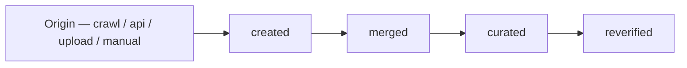
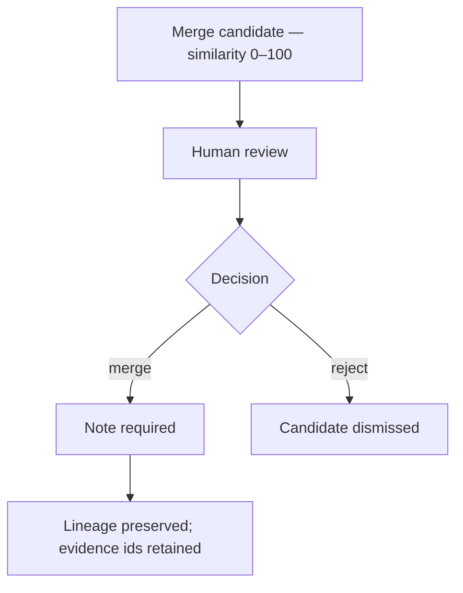

# Knowledge

> **Status:** v1.0 — complete. Phase 15 batch 3.
> **Evidence is authoritative and read-only. Entity curation is the only write path, and it never merges automatically.** No embedding, distance, or index parameter appears on any screen.

## Overview

**Purpose.** Define the knowledge screens: evidence explorer, citation viewer, entity browser, relationship view, freshness, provenance, search, and history.

**Scope.** Screen composition and states. Evidence semantics, provenance integrity, and retrieval are owned by `11-knowledge-platform/` and `06-api/knowledge-api.md`.

## Page hierarchy

```
/w/{slug}/knowledge                          → Explorer (evidence + entities)
/w/{slug}/knowledge/evidence/{evidenceId}    → Evidence detail
   ├── /provenance                           → Lineage
   └── /citing                               → Citing articles
/w/{slug}/knowledge/entities/{entityId}      → Entity detail
   ├── /evidence                             → Mentioning evidence
   └── /candidates                           → Merge candidates
/w/{slug}/knowledge/freshness                → Freshness overview
```

## What is never rendered

| Never shown | Why |
|---|---|
| Embedding vectors | Implementation detail; reconstructible into content |
| **Raw vector distances** | Meaningless across index or metric changes |
| Index type, dimension, parameters | Changing them would become a breaking change |
| Chunking strategy or boundaries | Internal to the embedding pipeline |
| **Anything from AI Memory** | Never a source of truth (ADR-026) |
| Another tenant's evidence, or its existence | Query-time tenant filtering |

**Relevance renders as an integer 0–100**, matching the platform's scoring convention. A raw distance would silently change meaning on every re-embedding (`06-api/knowledge-api.md`).

## Evidence explorer

| Property | Value |
|---|---|
| **API** | `GET /v1/workspaces/{workspaceId}/knowledge/evidence` |
| **Permission** | `knowledge:read` |
| **Modes** | `keyword` · `semantic` · `hybrid` (default) |
| **Filters** | `freshness` · `kind` · `publishedAfter/Before` · `minReliability` · `entityId` |

**Three search modes are offered by name and described by behaviour, not mechanism.** `semantic` may be vector search today and something else later; the label describes what it finds, not how.

**Semantic mode is marked as the slower, costlier option.** It is rate-limited as `expensive` and runs an approximate-nearest-neighbour scan, so the UI sets the expectation rather than leaving the user to notice.

**`matchedOn` renders as a chip on every result** — title, excerpt, claim, or semantic. A semantic match with no visible reason reads as arbitrary, and this is the minimum explanation that makes ranking legible.

**Results are always tenant-scoped by construction.** No cross-tenant parameter exists in the contract, for anyone.

## Evidence detail

| Field | Rendering |
|---|---|
| `title`, `publisher`, `sourceUrl` | Header, with the source link |
| **`excerpt`** | **Bounded — never the full source** |
| `publishedAt` / `collectedAt` | Both shown; collection is not publication |
| **`freshness`** | Status plus age, with `isEstimate` marked |
| **`reliability`** | 0–100, or **"Not assessed"** when null |
| `claims[]` | The extracted claims this evidence supports |
| `isAuthoritative` | Rendered as an "Authoritative" marker |

**`excerpt` is bounded and the UI links to the source rather than reproducing it.** Returning a competitor's page in full would be a copyright exposure; enough to verify a claim is the requirement.

**`reliability: null` renders as "Not assessed," never as 0.** A zero would read as "assessed and found unreliable."

**`freshness.isEstimate` is marked visibly.** An inferred publication date presented as fact would let a user treat a guess as a guarantee (`11-knowledge-platform/freshness-engine.md`).

**Evidence is read-only.** There is no edit affordance. Supersession happens through curation and is recorded in provenance.

## Provenance

| Property | Value |
|---|---|
| **API** | `GET /v1/evidence/{evidenceId}/provenance` |
| **Shows** | Origin (method, source, collected by) and the full lineage |



**Lineage renders as an append-only timeline**, with actor and note at each step. Nothing is presented as overwritten, because nothing is.

**`previousEvidenceIds` are shown and resolvable after a merge.** A citation written against a pre-merge identifier still resolves, and the UI makes that visible rather than leaving a reader to wonder where an id went (`11-knowledge-platform/deduplication.md`).

**Provenance integrity is an invariant, not a quality metric.** The UI never renders a "provenance score" — it renders the chain (`11-knowledge-platform/observability.md`).

## Citation viewer

| Property | Value |
|---|---|
| **API** | `GET /v1/citations/{citationId}`; evidence with `expand=citingRevisions` |
| **Permission** | **`article:read` AND `knowledge:read`** |

**Two directions, both rendered:**

| From | Shows |
|---|---|
| Article claim → evidence | What grounds this sentence |
| Evidence → citing revisions | **What breaks if this source is wrong** |

**Both permissions are required.** A user holding one and not the other sees their side without the traversal — never a `403` for the whole screen (`06-api/knowledge-api.md`).

**`supported: false` with no evidence is a visible, legitimate state.** An unsupported claim is surfaced; hiding it would let ungrounded content look grounded.

**The citing-revisions view is the highest-value screen here.** When evidence goes stale or is found unreliable, "which published content depends on this" is the operative question.

## Entity browser

| Field | Rendering |
|---|---|
| `canonicalName`, `type` | Header |
| **`aliases[]`** | **Split: verified (curated) versus unverified (extracted)** |
| `mentionCount` | Marked **derived** — may lag a re-index |
| `curatedMetadata` | Marked **authoritative** |
| `mergeCandidates[]` | Similarity 0–100, with a review action |

**The authoritative/derived split is rendered inside the alias list**, not just documented. A verified alias was confirmed by a human; an unverified one was extracted. Presenting them identically would let derived data be mistaken for curated fact — the blur the Knowledge Platform forbids (`11-knowledge-platform/provenance.md`).

**`mentionCount` carries a "derived" marker** so a user does not reconcile it against anything.

## Entity curation — the only write path

| Property | Value |
|---|---|
| **API** | `PATCH /v1/entities/{entityId}`; `POST .../actions/merge` |
| **Permission** | **`knowledge:update`** |
| **Merge requires** | An explicit **note** — enforced by the API |



**Merge candidates are candidates, never merges.** Similarity creates a review item; **authoritative entities are never merged automatically**. The UI presents them as suggestions with a similarity score and a review action (`11-knowledge-platform/deduplication.md`).

**The note field is required and cannot be skipped.** Reconstructing why a merge happened six months later requires the reason captured at the time.

**A merge that would discard curated metadata is refused with `409 KNOWLEDGE_MERGE_CONFLICT`**, rendered as a conflict showing both values — the platform does not choose which human curation to keep.

**The confirmation states that the merge is irreversible and preserves lineage.**

## Relationship view

| Property | Value |
|---|---|
| **Shows** | Entities and their relationships, bounded to a focal entity |
| **Source** | `06-api/knowledge-api.md` entity and evidence relations |
| **Never shows** | Embeddings, similarity space, cluster geometry |

**The graph renders entity relationships, not vector proximity.** A visualization derived from embedding distance would expose the implementation the contract hides.

**Depth is bounded to one hop by default**, expandable one level at a time. An unbounded graph is unreadable and generates unbounded queries.

**Every node links to its entity detail.** The graph is a navigation aid, not a terminal view.

**A keyboard-navigable list view is always available** alongside the visual graph. A canvas-only relationship view is inaccessible (`accessibility.md`).

## Freshness

| Property | Value |
|---|---|
| **API** | `GET .../knowledge/freshness` |
| **Shows** | Counts by status; stale items ordered by **citing-revision count** |

**Four statuses, each distinct** — `current`, `aging`, `stale`, **`unknown`**.

**`unknown` is its own category and is never folded into `stale`.** A source with no discoverable publication date is not old; collapsing the two would misrepresent an absence of information as a finding (`06-api/knowledge-api.md`).

**Stale items sort by citing-revision count**, because stale evidence cited by forty published articles matters more than stale evidence cited by none. A flat list cannot express that.

**The UI computes no freshness.** It renders the summary the API returns.

## History

**Evidence history is its provenance lineage; entity history is its curation record.** Neither is a separate store, and the UI presents them as the same append-only timeline pattern.

**Every history entry names its actor** where the viewer holds `member:read`, and the action alone otherwise.

## Common UI states

| State | Rendering |
|---|---|
| **Loading** | Skeleton matching the result list; nothing under 300 ms |
| **Empty** | Four distinct: no evidence yet · filtered to nothing · no permission · load failed |
| **Success** | Result rendered; curation updates the entity in place |
| **Failure** | Inline for validation; banner with `requestId` for `5xx` |
| **Retry** | `5xx`, `503`, network — never `4xx` |
| **Offline** | Read-only; curation disabled with a reason; nothing queued |
| **Conflict** | `409 KNOWLEDGE_MERGE_CONFLICT` — both curated values shown, never auto-resolved |
| **Permission denied** | `403`: names the missing permission; per-direction on citations |
| **Not found** | `404`: "Evidence not found" — never a permission message |
| **Maintenance** | Reads remain; curation disabled with expected return |

**Search is disabled offline rather than served from a stale cache.** A knowledge result set that silently predates the current corpus is worse than an unavailable search.

## API interactions

| Screen | Endpoints |
|---|---|
| Explorer | `GET .../knowledge/evidence`; `GET .../knowledge/entities` |
| Evidence detail | `GET /v1/evidence/{evidenceId}` |
| Provenance | `GET /v1/evidence/{evidenceId}/provenance` |
| Citations | `GET /v1/citations/{citationId}` |
| Entity detail | `GET /v1/entities/{entityId}`; `GET .../evidence` |
| Curation | `PATCH /v1/entities/{entityId}`; `POST .../actions/merge` |
| Freshness | `GET .../knowledge/freshness` |

**Merge sends `Idempotency-Key`**; `PATCH` is idempotent by contract.

## Business rules

1. **No embedding, distance, or index detail is ever rendered.**
2. **Relevance is an integer 0–100**, never a raw distance.
3. **`matchedOn` is shown on every search result.**
4. **Semantic mode is labelled as slower and costlier.**
5. **Evidence is read-only**; there is no edit affordance.
6. **`excerpt` is bounded**; the source is linked, not reproduced.
7. **`reliability: null` renders as "Not assessed," never 0.**
8. **`freshness.isEstimate` is marked visibly.**
9. **Verified and unverified aliases are visually separated.**
10. **`mentionCount` carries a derived marker.**
11. **Merge candidates are suggestions**; merges are never automatic.
12. **A merge note is required and cannot be skipped.**
13. **Merge conflicts show both curated values**, never auto-resolved.
14. **The relationship view renders entity relations, not vector proximity**, and always has a list equivalent.
15. **`unknown` freshness is its own category.**
16. **Stale evidence sorts by citing-revision count.**
17. **Citations require both permissions**, degrading per direction.
18. **Search is disabled offline**, never served stale.

## Cross references

- `06-api/knowledge-api.md` — **every contract and hiding rule these screens surface**
- `11-knowledge-platform/provenance.md` — authoritative versus derived
- `11-knowledge-platform/deduplication.md` — candidates, never automatic merges
- `11-knowledge-platform/freshness-engine.md` — freshness assessment
- `11-knowledge-platform/governance.md` — lineage preservation
- `16-security/tenant-isolation.md` — query-time vector filtering
- `content.md` — citations from the article side
- `research.md` — runs that produce evidence
- `design-principles.md` · `navigation.md` · `error-and-loading-patterns.md`
- `01-system-architecture/13-adr-log.md` — ADR-021 scoring, ADR-026 AI Memory
