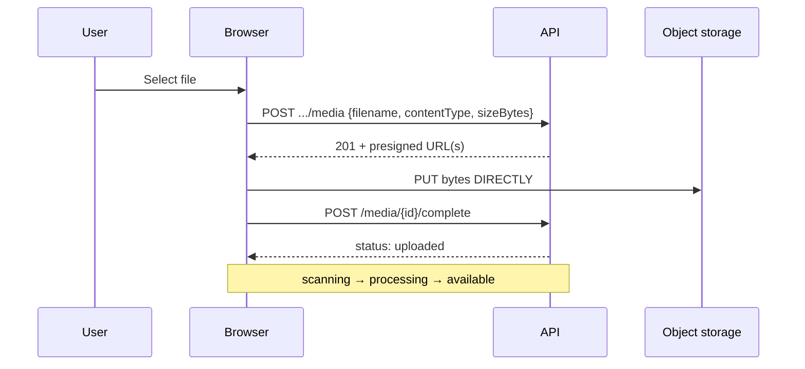
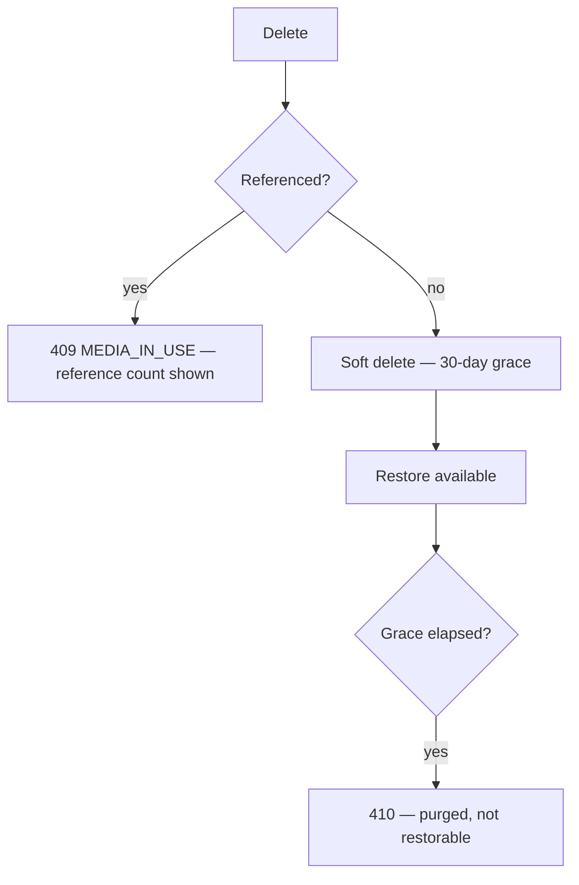

# Media

> **Status:** v1.0 — complete. Phase 15 batch 3.
> **`mediaId` is the only identifier a client ever sees.** Storage keys, buckets, and provider endpoints never appear. Bytes move directly between the browser and object storage; the API is the control path.

## Overview

**Purpose.** Define the media screens: library, upload, processing states, derived assets, preview, metadata, restore, delete, search, and filters.

**Scope.** Screen composition and states. Object lifecycle, derivation, and storage are owned by `12-storage-platform/` and `06-api/media-api.md`.

## Page hierarchy

```
/w/{slug}/media                      → Library
/w/{slug}/media/{mediaId}            → Detail
   ├── /derivatives                  → Variants
   └── /usage                        → Where it is used
/w/{slug}/settings/storage           → Storage summary (workspaces.md)
```

## Identifiers and what is never shown

| Never shown | Why |
|---|---|
| Storage keys, bucket names | Leak the tenant prefix and internal layout |
| Provider identity or endpoint | Migration would become a breaking change |
| Encryption key ids | Key management is delegated entirely |
| **Malware signatures** | Would let an uploader iterate against the scanner |
| Internal transform parameters | `transformId` is opaque |

**Clients request variants by name** — `thumb`, `small`, `medium`, `large`, `placeholder` — never by `transformId`. That is what lets the platform bump a transform's algorithm version and produce new derivations without any client change (`12-storage-platform/media-processing.md`).

## Upload



**Bytes never transit the API.** The browser uploads directly to the presigned URL, which is why a 4 GB video does not saturate an API instance (`12-storage-platform/object-storage.md`).

**Pre-flight rejection happens before a byte moves.** A file over the limit or of a disallowed declared type is rejected at initiation — `413` or `415` — rather than after transferring it.

**The filename is used for an extension hint and then discarded.** The UI shows the original name as a *label* on the media record, and states that the stored object is keyed independently.

**`contentType` is re-detected server-side.** A file declared `image/png` that is actually HTML is stored and reported as what it is, and the UI shows the detected type — not the declared one (`16-security/api-security.md`).

### Multipart

| Property | Rendering |
|---|---|
| Threshold | Above 100 MB, automatically |
| Part size | 8 MiB, fixed — not a user choice |
| **Resumable** | **Yes** — re-initiating with the same `Idempotency-Key` returns outstanding parts |
| Expiry | **24 hours**, stated in the UI |
| Progress | Per-part, aggregated to one percentage |

**Resumption is surfaced explicitly.** A user returning to an interrupted 4 GB upload sees "Resume" with the remaining percentage, not "Start over."

**An expired upload states why** — 24 hours elapsed — and offers a fresh start rather than a confusing failure.

## Processing states

**Nine states render, and the readable/unreadable boundary is the one that matters.**

| State | Rendered | Readable |
|---|---|---|
| `pending` | Awaiting upload | No |
| `uploaded` | Received | No |
| **`scanning`** | **Checking for malware** | **No** |
| **`processing`** | **Generating variants** | **No** |
| `available` | Ready | **Yes** |
| **`degraded`** | **Ready — some variants unavailable** | **Yes** |
| `rejected` | Rejected, with the validation reason | No |
| **`quarantined`** | **Threat detected — cannot be used** | **No** |
| `deleted` | Deleted, restorable within 30 days | No |

**Processing state is informational, not actionable.** The user cannot skip, retry, or reorder it; the UI reports progress and does not offer controls it does not have.

**`scanning` and `processing` are shown as real states, not as an extended upload spinner.** An upload completes and the object is not yet usable — presenting that as "still uploading" misrepresents where the time goes (`12-storage-platform/blob-lifecycle.md`).

**`degraded` renders as available with a note.** The original is serviceable; an optional variant failed. Withholding a working image because a WebP variant failed would punish the user for a background failure.

**`quarantined` is visible to its owner with its status and is never downloadable.** The threat signature is never disclosed — that would let an uploader iterate against the scanner. The UI says a threat was detected and offers deletion.

**`rejected` states the validation reason** — size, type, structure — because that one the user can act on.

## Library

| Property | Value |
|---|---|
| **API** | `GET /v1/workspaces/{workspaceId}/media` |
| **Permission** | `article:read` |
| **Filters** | `kind` · `status` · `resourceRef` · `createdAfter/Before` |
| **Sort** | `createdAt` (default) · `sizeBytes` |
| **Pagination** | Cursor |

**Grid and list views are both available**; grid is the default for image-heavy workspaces.

**Thumbnails use the `thumb` variant, with the `placeholder` LQIP shown while it loads.** The placeholder is a data URI generated at upload precisely so it arrives before the image it stands in for.

**Non-readable items appear with their state rather than being hidden.** A user who just uploaded must see their file progressing, not an empty library.

**Bulk actions:** delete (per-item results) and move to resource. **Not** bulk restore — restore is per item because eligibility differs.

## Detail and metadata

| Field | Editable |
|---|---|
| `label` | **Yes** |
| `resourceRef` | **Yes** — re-keys internally; `mediaId` is stable |
| `contentType`, `sizeBytes`, `sha256` | **No** — system metadata |
| `metadata` (dimensions, duration, pages) | **No** — extracted |
| `status`, `derivatives` | **No** |

**Only mutable metadata is editable, and the immutable fields render as read-only values rather than disabled inputs.** A disabled input implies it could be enabled.

**Changing `resourceRef` states that the link is preserved.** The object is re-keyed internally and `mediaId` does not change, so every existing reference survives — which is exactly why references use the opaque id (`12-storage-platform/storage-apis.md`).

**Objects are immutable: there is no "replace file" affordance.** Replacing means uploading a new object and repointing the reference, and the UI presents it that way.

**`sha256` is shown in the detail panel** as an integrity reference, useful when a user asks whether two files are the same.

## Derived assets

| Property | Value |
|---|---|
| **API** | `GET /v1/media/{mediaId}/derivatives` |
| **Shows** | Name, content type, size, dimensions, status |

**Variants are listed by name, never by `transformId`.**

**`status: 'failed'` is visible** so a client can fall back to another size rather than rendering a broken image.

**Derived assets are marked as rebuildable** and are shown separately from the original in storage totals — which answers "why does my storage exceed my upload total" (`workspaces.md`).

## Preview and download

| Property | Value |
|---|---|
| **API** | `GET /v1/media/{mediaId}/url?transform=…&ttlSeconds=…` |
| **Permission** | `article:read`; **`article:export`** for originals of exportable kinds |

**No URL is requested before the object is `available`.** The UI does not attempt a preview on a `scanning` object; it shows the state.

**Signed URLs are never logged, never shown in the UI, and never copied to the clipboard as raw links** without an explicit "copy link" action that states the expiry.

**`ttlSeconds` is not a user-facing control.** The UI requests an appropriate default; exposing it would invite users to request long-lived bearer credentials.

**Documents, archives, and SVG render as downloads, not inline.** SVG is XML with script support and is served as an attachment (`12-storage-platform/cdn.md`).

**Requesting a download URL for a document or export is audited.** The UI does not surface that, but it does not obscure it either.

## Delete and restore



**Deletion refused while referenced states the count and links to the usages.** A derived image used by six article revisions is not deletable because one revision was removed, and the UI names what is holding it (`12-storage-platform/retention.md`).

**Soft delete shows `purgeEligibleAt`**, so a user knows how long restore remains available.

**Restore after purge returns `410`** and renders as "permanently deleted" — the object is gone, not hidden. The distinction is honest: `204` for a delete that already happened, `410` for a restore that cannot.

**Deletion invalidates CDN entries immediately**, and the UI states that shared links stop working.

## Search and filters

**Workspace-scoped and server-filtered** (`navigation.md`).

**Search covers label, original filename, and detected type** — not content. There is no OCR or transcript search, because semantic extraction is deliberately absent from media processing (`12-storage-platform/media-processing.md`).

**Filters are query parameters and survive reload and sharing.**

## Common UI states

| State | Rendering |
|---|---|
| **Loading** | Grid skeleton with placeholder tiles |
| **Empty** | Four distinct: no media · filtered to nothing · no permission · load failed |
| **Success** | Item appears in the library at `available` |
| **Failure** | Upload failures inline at the file; `requestId` on `5xx` |
| **Retry** | **Resume** for interrupted uploads; refetch for `5xx`; **never for `413`/`415`** |
| **Offline** | Uploads pause and resume on reconnect; library read-only |
| **Conflict** | `409 MEDIA_IN_USE` — reference count and usages shown |
| **Permission denied** | `403`: export separated from read |
| **Not found** | `404`: "Media not found" — never a permission message |
| **Maintenance** | Library readable; uploads disabled with expected return |

**Interrupted uploads resume rather than restart**, which is the single most valuable state behaviour on these screens.

**`413` and `415` are never retried** — the file will be rejected identically.

## API interactions

| Screen | Endpoints |
|---|---|
| Upload | `POST .../media` · `POST .../media/multipart` · `POST /v1/media/{mediaId}/complete` |
| Library | `GET /v1/workspaces/{workspaceId}/media` |
| Detail | `GET`/`PATCH /v1/media/{mediaId}` |
| Derivatives | `GET /v1/media/{mediaId}/derivatives` |
| URL | `GET /v1/media/{mediaId}/url` |
| Delete / restore | `DELETE /v1/media/{mediaId}` · `POST .../actions/restore` |

**Upload initiation sends `Idempotency-Key`**, which is also what makes resumption work.

## Business rules

1. **`mediaId` is the only identifier shown**; keys, buckets, and endpoints never are.
2. **Variants are requested by name**, never by `transformId`.
3. **Bytes never transit the API.**
4. **Pre-flight rejection happens before transfer.**
5. **Filenames are labels; the detected content type is authoritative.**
6. **Part size is fixed and not a user choice**; uploads resume.
7. **Processing state is informational, not actionable.**
8. **`scanning` and `processing` are real states**, not an extended spinner.
9. **`degraded` renders as available with a note.**
10. **`quarantined` is visible, never downloadable**; the signature is never disclosed.
11. **Immutable fields render as read-only values, not disabled inputs.**
12. **There is no "replace file"** — objects are immutable.
13. **Re-linking preserves `mediaId`**, and the UI says so.
14. **No URL is requested before `available`.**
15. **`ttlSeconds` is not user-facing.**
16. **Documents, archives, and SVG download rather than render inline.**
17. **Deletion refused while referenced names the count and usages.**
18. **Restore after purge is `410`** — permanently deleted, not hidden.

## Cross references

- `06-api/media-api.md` — **every contract and state these screens surface**
- `12-storage-platform/blob-lifecycle.md` — the nine states and the readability gate
- `12-storage-platform/media-processing.md` — derivations, `transformId`, scanning, no semantic extraction
- `12-storage-platform/object-storage.md` — immutability, multipart, keys
- `12-storage-platform/cdn.md` — signed URLs, disposition, invalidation
- `12-storage-platform/retention.md` — reference counting and the grace period
- `16-security/api-security.md` — magic-byte detection, upload validation
- `16-security/rbac.md` — `article:export` separated from read
- `content.md` — articles referencing media
- `workspaces.md` — storage summary
- `error-and-loading-patterns.md` · `design-principles.md` · `navigation.md`
