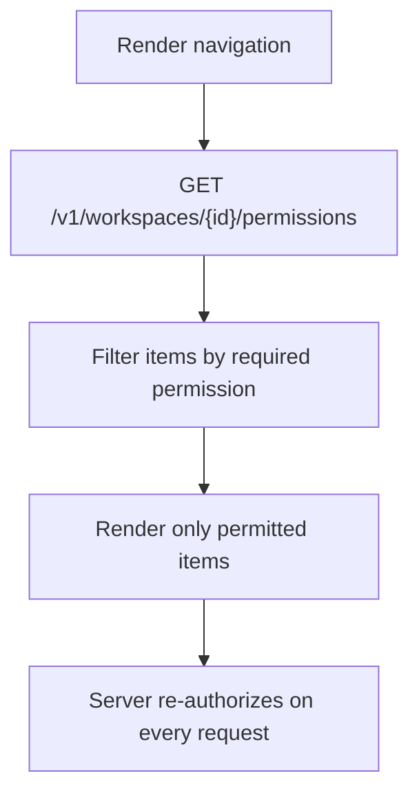

# Navigation

> **Status:** v1.0 — complete. New in Phase 15.
> **Navigation never exposes a resource the user cannot reach.** Not in a menu, not in search, not in recents, not in a favourite. Visibility is derived from permissions and revalidated on render — a stale favourite is a disclosure.

## Overview

**Purpose.** Define the navigation chrome: global and workspace navigation, tabs, context menus, search, recent items, favourites, notifications, and keyboard shortcuts.

**Scope.** Chrome and traversal affordances. The hierarchy, routes, breadcrumb semantics, and deep-link resolution are owned by `information-architecture.md`.

## Permission-driven visibility

**One rule, applied everywhere:** an affordance the user can never use is **absent**, not disabled.



**The permissions endpoint exists for exactly this and for nothing else.** `16-security/authorization.md` states it is never an enforcement path; this document restates it because navigation is where the temptation to trust it lives. Hiding a link is a usability decision. The server refuses the call regardless.

| Item | Required permission |
|---|---|
| Content | `article:read` |
| Research | `research:read` |
| Knowledge | `knowledge:read` |
| AI usage | `analytics:read` |
| Media | `article:read` |
| Workspace settings | `workspace:read` |
| Members | `member:read` |
| Publish action | `publish:execute` |
| Export action | **`article:export`** — separate from read |
| Organization billing | `billing:read` |
| Audit | `audit:read` |

**`export` is a separate navigation item from anything read-only**, because it is a separate permission. A Viewer sees content and no export affordance; a Contributor sees neither export nor publish (`16-security/rbac.md`).

**An empty navigation section is not rendered.** A user with no permitted items under a heading sees no heading.

**Navigation is never the reason something is safe.** A user who types a URL for a hidden screen receives `404` or `403` from the API, not a rendered page (`information-architecture.md`).

## Global navigation

**Account-level chrome, present on every screen.**

| Element | Contents |
|---|---|
| **Workspace switcher** | Only workspaces the user has a role in — always visible below `/w/` |
| Search | Workspace-scoped when in a workspace |
| Notifications | Unread count; opens the inbox |
| Account menu | Profile, security settings, organization switcher, sign out |
| Help | Docs, keyboard shortcuts, support with `requestId` |

**The workspace switcher is the most important control in the chrome**, because acting in the wrong workspace is the most consequential ordinary mistake available. The current workspace name is always visible, never only inside an opened menu.

**The organization switcher sits in the account menu, not beside the workspace switcher.** Organization is a commercial context that changes rarely; workspace changes constantly. Placing them together implies they are the same kind of choice.

**Sign-out revokes the session server-side**, not only client state (`06-api/authentication-api.md`).

## Workspace navigation

**Primary navigation for everything inside a tenant.**

```
Dashboard
Content        → Articles · Projects
Research       → Runs · Competitors
Knowledge      → Evidence · Entities
AI             → Usage
Media
Runs
Settings       → General · Members · Integrations · API keys
```

**Order reflects the workflow**, not alphabetisation. Content is the product's centre; settings is last.

**Runs appear at workspace level because they span features.** A run started from an article is still a run, and a user looking for "what is happening right now" should not need to know where it started (`information-architecture.md`).

**Settings sub-items are permission-filtered individually.** An Editor sees General and Integrations; API keys require `apikey:read`.

## Tabs

**Tabs group views of one resource. They never navigate between resources.**

| Screen | Tabs |
|---|---|
| Article | Overview · Outline · Draft · Review · Citations · Media · History |
| Run | Progress · Results · Attempts |
| Evidence | Detail · Provenance · Citing articles |
| Entity | Detail · Evidence · Merge candidates |
| Workspace settings | General · Members · Integrations · API keys |

**Each tab is a route, not client state** (`information-architecture.md`). A tab is deep-linkable, shareable, and survives reload — and a user who sends a colleague "the citations tab" sends a working link.

**Tabs are permission-filtered.** A user without `knowledge:read` does not see the Citations tab, because its content resolves to evidence they cannot read.

**A tab is never the only path to its content.** Citations are reachable from the article and from evidence; removing a tab must not orphan a screen.

## Context menus

**Available on every list row and resource header. Contain only permitted actions.**

| Resource | Typical actions |
|---|---|
| Article | Open · Duplicate · Archive · Delete · Publish · Export |
| Run | Open · Cancel |
| Evidence | Open · View provenance · Find citing articles |
| Media | Open · Copy link · Download · Delete · Restore |
| Member | Change role · Remove |

**Destructive actions are separated and last**, never adjacent to a common action (`design-principles.md`).

**Every context-menu action has a non-menu equivalent.** Right-click is not reachable by keyboard on all platforms, and a menu-only action is inaccessible.

**Actions blocked by state are disabled with a reason; actions blocked by permission are absent.** "Publish" on a `block` verdict is disabled and explains why; "Publish" for a Contributor is not there.

## Search

**Workspace-scoped, permission-filtered, and never cross-tenant.**

| Property | Rule |
|---|---|
| Scope | The current workspace |
| Results | Articles, evidence, entities, media, runs |
| **Filtering** | **Server-side by permission**, never client-side |
| Cross-tenant | **Not expressible** — no parameter exists |
| Empty | "No results" — never a hidden count |

**Result filtering happens server-side because client-side filtering means the data already left the server.** A search that returned all matches and hid some in the browser is a disclosure with a cosmetic control over it.

**Search never reveals existence across tenants.** The knowledge search API has no cross-tenant parameter for anyone, including operators (`06-api/knowledge-api.md`).

**Results show their type and location** — an article's project, an evidence item's source — because a bare title is ambiguous across five result types.

**Semantic search over evidence is a distinct, explicitly-invoked mode**, not the default. It is rate-limited as `expensive` and runs an ANN scan (`06-api/knowledge-api.md`).

## Recent items and favourites

**Both are conveniences, and both are revalidated on every render.**

| | Recent items | Favourites |
|---|---|---|
| Source | Automatic, per user per workspace | Explicit |
| Storage | Server-side, tenant-scoped | Server-side, tenant-scoped |
| **Revalidation** | **Every render** | **Every render** |
| On access loss | **Silently removed** | **Silently removed** |
| On deletion | Removed | Shown as deleted within grace |

**Revalidation is a security requirement, not an optimisation.** A favourited article in a workspace the user was removed from must disappear. Rendering a stale title would disclose content from a tenant they can no longer reach — the same disclosure a permission message on a `404` would make (`16-security/authorization.md`).

**Removal is silent.** "3 favourites hidden" leaks a count.

**Neither list crosses a workspace boundary.** Recents in workspace A do not appear in workspace B, matching the rule that switching carries no state (`information-architecture.md`).

## Notifications

**The in-app inbox surface for `04-platform/notifications.md`.**

| Property | Rule |
|---|---|
| Scope | Per user, per workspace |
| Delivery | Event-driven, through the outbox |
| Ordering | **Not guaranteed** — sorted by `occurredAt`, not arrival |
| Read state | Optimistic; trivially reconcilable |
| Deep link | Every notification links to its authoritative screen |
| Permission | Revalidated on render, like favourites |

**Notifications are signals, not payloads.** A notification says an article was published and links to it; it does not carry content. Fetching current state on open is correct because the underlying event carries identifiers only (`13-event-platform/event-registry.md`).

**Ordering by `occurredAt` rather than arrival matters.** Delivery is at-least-once with no ordering guarantee, so arrival order can invert. Sorting by occurrence produces a timeline that matches what happened (`06-api/webhooks.md`).

**Duplicates are suppressed by event id.** At-least-once delivery makes redelivery normal, and a duplicate notification reads as a bug.

**A notification whose target the user can no longer access is removed, not rendered as inaccessible.**

## Keyboard shortcuts

| Shortcut | Action |
|---|---|
| `/` | Focus search |
| `g` then `d` | Dashboard |
| `g` then `c` | Content |
| `g` then `r` | Runs |
| `g` then `k` | Knowledge |
| `g` then `m` | Media |
| `⌘K` / `Ctrl+K` | Command palette |
| `?` | Shortcut reference |
| `Escape` | Close topmost layer |
| `⌘Enter` / `Ctrl+Enter` | Submit focused form |

**No shortcut overrides a browser or assistive-technology binding**, and none is the only path to an action (`design-principles.md`).

**The command palette is permission-filtered like every other surface.** It lists only actions the user may perform, and invoking one is authorized server-side regardless.

**`?` is discoverable from the help menu**, because an undiscoverable shortcut helps nobody.

**Shortcuts are disabled while a text input has focus**, except `Escape` and submit.

## No orphan screens

**Every screen is reachable from navigation or a documented cross-link**, and every screen links onward.

| Reachability | Screens |
|---|---|
| Primary navigation | Dashboard, Content, Research, Knowledge, AI, Media, Runs, Settings |
| Cross-link only | Evidence detail, provenance, entity merge candidates, revision detail, gate detail |
| Contextual only | Deleted-state screens, restore flows |

**Cross-link-only screens are legitimate and are listed here to prove they are reachable.** Evidence detail has no navigation entry — it is reached from a citation, from search, or from a run's results — and all three are documented paths (`information-architecture.md`).

**The operator surface has no screen in this application.** `06-api/admin-api.md` is network-isolated, requires platform-tier permissions no customer role holds, and demands step-up. It is not rendered here, and no navigation item points at it.

## Business rules

1. **Navigation never exposes an inaccessible resource.**
2. **Permission-gated items are absent; state-blocked items are disabled with a reason.**
3. **The permissions endpoint drives rendering and is never enforcement.**
4. **Empty sections are not rendered.**
5. **The workspace switcher lists only workspaces the user has a role in**, and the current workspace is always visible.
6. **Organization switching lives in the account menu**, separate from workspace switching.
7. **Each tab is a route**, deep-linkable and permission-filtered.
8. **Every context-menu action has a non-menu equivalent.**
9. **Search is workspace-scoped and filtered server-side**; cross-tenant search is not expressible.
10. **Recents and favourites are revalidated on every render** and removed silently on access loss.
11. **Neither crosses a workspace boundary.**
12. **Notifications sort by `occurredAt`**, deduplicate by event id, and link to their authoritative screen.
13. **No shortcut overrides a browser or assistive-technology binding**, and none is a sole path.
14. **The command palette is permission-filtered.**
15. **No orphan screens**; cross-link-only screens are enumerated.
16. **The operator surface is not rendered in this application.**

## Cross references

- `information-architecture.md` — **hierarchy, routes, breadcrumb semantics, deep-link resolution**
- `design-principles.md` — hidden-versus-disabled, keyboard requirements, empty states
- `dashboard.md` — the workspace root and its widget destinations
- `16-security/authorization.md` — **permissions are not an enforcement path**; 404-versus-403
- `16-security/rbac.md` — the permissions driving every visibility rule
- `06-api/workspace-api.md` — the permissions endpoint
- `06-api/knowledge-api.md` — search scope and semantic mode
- `06-api/admin-api.md` — the operator surface, deliberately unrendered
- `04-platform/notifications.md` — the inbox this surfaces
- `13-event-platform/event-registry.md` — notifications carry identifiers, not content
- `06-api/webhooks.md` — why ordering is by occurrence, not arrival
