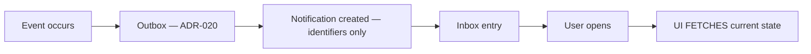

# Notifications

> **Status:** v1.0 — complete. Phase 15 batch 3.
> **A notification is a signal, never a source of truth.** It says something changed and links to the resource that owns it. A UI that applied a notification's payload as a delta would be wrong the first time delivery duplicated or reordered.

## Overview

**Purpose.** Define the notification surfaces: the in-app inbox, email, toasts, and system announcements — plus the categories they carry and the preferences that govern them.

**Scope.** Presentation and interaction. Delivery is owned by `04-platform/notifications.md`; the event contract by `13-event-platform/`.

## The three surfaces

| Surface | Durability | Use |
|---|---|---|
| **In-app inbox** | **Durable** — the record | Everything |
| **Toast** | **Transient** — vanishes | Confirmation of an action the user just took |
| **Email** | **Best-effort** — leaves the platform | Things worth interrupting someone outside the app |

**The inbox is the durable surface; a toast is not a notification.** A toast confirms an action in progress in front of the user. A notification records something that happened, possibly while they were away, and it must survive a page reload (`design-system.md`).

**Email is best-effort and the UI says so.** Delivery depends on infrastructure the platform does not control, and a user who missed an email finds the same item in the inbox.

## The signal rule

**Notifications carry identifiers, never content.** "Article published" with an article id, not the article. The underlying event payload carries identifiers by registry rule, and duplicating content into a notification would let it go stale (`13-event-platform/event-registry.md`).

**Opening a notification fetches current state.** By the time a user reads "gate blocked," the article may have been revised — showing the notification's snapshot would be wrong.

**Delivery is at-least-once with no ordering guarantee.** Two consequences the UI implements rather than assumes:

| Property | Implementation |
|---|---|
| Duplicates occur | **Deduplicated by event id** |
| Order can invert | **Sorted by `occurredAt`, never arrival** |

**Sorting by occurrence produces a timeline matching what happened.** Arrival order can invert when one delivery retries while a later one succeeds (`06-api/webhooks.md`).

## In-app inbox

| Property | Value |
|---|---|
| **Scope** | Per user, **per workspace** |
| **Placement** | Global chrome, with unread count |
| **Ordering** | `occurredAt` descending |
| **Grouping** | By category, with an "All" view |
| **Read state** | **Optimistic** — trivially reconcilable |
| **Retention** | Matches the platform's notification retention |

**Every entry links to its authoritative screen.** An entry with no destination is a dead end (`dashboard.md`).

**Permission is revalidated on render.** An entry whose target the user can no longer access is **removed silently** — never rendered as inaccessible, and never counted. A stale entry naming content from a workspace they were removed from is a disclosure (`navigation.md`).

**The inbox is workspace-scoped**, matching recents and favourites. Switching workspace switches the inbox.

**Marking read is optimistic**, one of the few operations where it is safe: reconciliation is trivial and the consequence of a lost update is negligible (`design-principles.md`).

**Bulk mark-all-read is available and scoped to the current filter**, so it never silently clears a category the user is not looking at.

## Categories

| Category | Examples | Disableable |
|---|---|---|
| **Runs** | Completed, failed, **awaiting input** | Yes |
| **Content** | Published, gate blocked, outline ready | Yes |
| **Assignments** | Work assigned or reassigned (`04-platform/workflow.md`) | Yes |
| **Billing** | Credits low, payment failed, plan changed | Yes |
| **Warnings** | Stale evidence on published content, webhook endpoint disabled | Yes |
| **System** | Maintenance windows, deprecations | Yes |
| **Security** | Session revoked, MFA changed, new sign-in, key created | **No** |

**Security notifications cannot be disabled, and the toggle is absent rather than disabled.** A disabled toggle implies it could be enabled. These are the notifications a user needs when their account is compromised, and the one category where the platform overrides preference (`settings.md`).

**`awaiting_input` run notifications are the highest-value category.** A pipeline waiting on outline approval blocks until a person acts, and without a notification the work stalls silently (`research.md`).

**@-mentions have no producer today.** The category exists in the model, but free-text mentions require a commenting or annotation feature that the approved architecture does not specify. **Assignment** notifications derive from `04-platform/workflow.md` and are the closest existing concept. This is recorded rather than invented.

## Toasts

| Rule | Detail |
|---|---|
| Use | Transient confirmation of a completed action |
| **Never** | **Errors requiring action · field validation · long-running status** |
| Duration | 4–6 s; **persistent when it contains an action** |
| Stacking | Maximum three; older collapse |
| Announcement | Polite live region (`accessibility.md`) |

**A toast is never the only place an error appears.** Toasts vanish, and a user who looked away has lost the message and the `requestId` with it (`error-and-loading-patterns.md`).

**Long-running status never lives in a toast.** A run is a durable resource with a durable surface; a toast implying it is finished when it is queued misrepresents it.

**An "Undo" toast maps to a real restore endpoint or is not offered** (`design-principles.md`).

## Email

| Property | Value |
|---|---|
| **Sent for** | Security events, billing failures, invitations, long-run completion where opted in |
| **Content** | Subject, one-line summary, **a link** — never content |
| **Preference** | Per user, per workspace, per category |
| **Security emails** | **Always sent** |

**Emails carry links, never article content, evidence text, or credentials.** An email is the least-controlled surface the platform reaches — forwarded, archived, and indexed by systems outside its boundary.

**Emails are never sent from a handler inline.** They are produced by a delivery consumer reading events from the outbox, so an email cannot be sent for a transaction that rolled back (`16-security/audit.md` applies the same reasoning to inline notifications).

**Unsubscribe applies per category, never globally for security.**

## Warnings worth surfacing

**Two are easy to miss and both matter.**

**A disabled webhook endpoint.** After 100 consecutive delivery failures the platform disables an endpoint, and the customer's integration stops silently. This produces both an inbox entry and an email, and it appears in the dashboard alerts (`06-api/webhooks.md`). Management lives in `settings.md`.

**Stale evidence supporting published content.** Stale evidence generally is a freshness metric; stale evidence a published article depends on is a warning, and it links to the citing revisions (`knowledge.md`).

## System announcements

| Property | Value |
|---|---|
| **Shows** | Maintenance windows, API deprecations, incident status |
| **Placement** | A dismissible banner plus an inbox entry |
| **Dismissal** | Per user; **critical announcements are not dismissible** |

**API deprecation announcements name the sunset date and link to the migration guide**, matching the in-band `Deprecation` and `Sunset` headers. A customer integrated two years ago is not reading a changelog (`06-api/api-versioning.md`).

**Maintenance banners state the expected return**, and the affected surfaces render their maintenance state (`error-and-loading-patterns.md`).

## Preferences

**Owned by `settings.md`; the model is here.**

| Dimension | Values |
|---|---|
| Scope | Per user, **per workspace** |
| Channel | In-app, email |
| Category | The seven above |
| Security | **Locked on, both channels** |

**Per-workspace preferences exist because volume differs.** A user active in one workspace and dormant in another wants different settings, and a global preference forces one to be wrong.

## Common UI states

| State | Rendering |
|---|---|
| **Loading** | Inbox skeleton; the unread badge does not render optimistically |
| **Empty** | "No notifications" · filtered to nothing · none in this category |
| **Success** | Read state updates in place |
| **Failure** | Inbox load failure with retry; **never a toast about a toast** |
| **Retry** | Refetch on `5xx`; **notification delivery itself is never retried by the client** |
| **Offline** | Inbox shows cached entries marked stale; **no new arrivals; read state queues and syncs on reconnect** |
| **Conflict** | None — read state is last-write-wins by design |
| **Permission denied** | Entry removed silently; never rendered as inaccessible |
| **Not found** | Target deleted: entry shows "no longer available," links to the deleted state where restorable |
| **Maintenance** | Inbox readable; delivery may lag, and the banner says so |

**Read state is the one thing that queues offline**, because it is idempotent and its loss is negligible. Everything else is refetched.

**A notification whose target was deleted renders honestly.** Within the grace period it links to the deleted state with restore; after purge it says the item is gone (`media.md`, `content.md`).

## API interactions

| Screen | Source |
|---|---|
| Inbox | Notification endpoints (`04-platform/notifications.md`) |
| Preferences | User preference endpoints |
| Webhook warnings | `GET /v1/workspaces/{workspaceId}/webhooks` |
| System announcements | Platform announcement source |

**The inbox polls or subscribes; it never derives notifications client-side from other API responses.** Deriving them would produce a second, divergent notification model.

## Business rules

1. **A notification is a signal, never a source of truth.**
2. **Notifications carry identifiers, never content.**
3. **Opening a notification fetches current state.**
4. **Deduplicated by event id; sorted by `occurredAt`.**
5. **Every entry links to an authoritative screen.**
6. **Permission is revalidated on render**; inaccessible entries are removed silently and uncounted.
7. **The inbox is workspace-scoped.**
8. **Security notifications cannot be disabled**; the toggle is absent.
9. **@-mentions have no producer today**, and this is recorded rather than invented.
10. **Toasts are never used for errors requiring action or long-running status.**
11. **A toast is never the only place an error appears.**
12. **Emails carry links, never content**, and are produced by a consumer, never inline.
13. **Critical system announcements are not dismissible.**
14. **Preferences are per workspace**, with security locked on.
15. **Read state is the only thing that queues offline.**
16. **Deleted targets render honestly**, distinguishing restorable from purged.
17. **The client never derives notifications from other API responses.**

## Cross references

- `04-platform/notifications.md` — **delivery, retention, the inbox this surfaces**
- `04-platform/workflow.md` — assignment notifications
- `13-event-platform/event-registry.md` — payloads carry identifiers, not content
- `13-event-platform/idempotency.md` — why duplicates are normal
- `06-api/webhooks.md` — ordering by occurrence; endpoint auto-disable
- `06-api/api-versioning.md` — deprecation announcements
- `settings.md` — preference screens; webhook endpoint management
- `dashboard.md` — alerts that also appear here
- `navigation.md` — inbox placement and revalidation
- `design-system.md` — toast component rules
- `accessibility.md` — live-region announcement
- `error-and-loading-patterns.md` — the shared state catalogue
