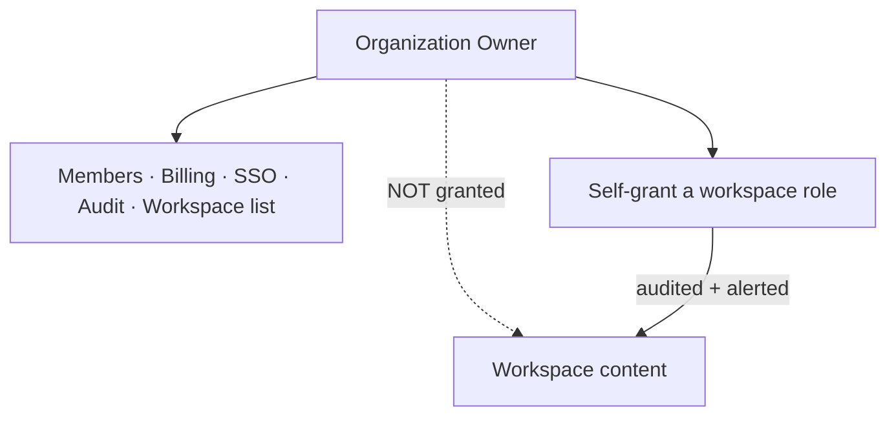
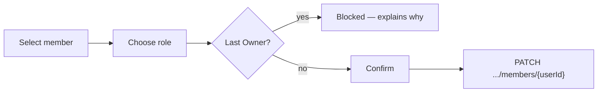
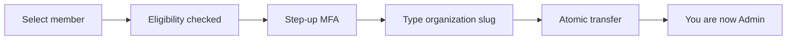

# Organizations

> **Status:** v1.0 — complete. Phase 15 batch 2.
> **An organization Owner sees the workspace list and cannot open its content.** These screens render administrative capability, never content access. Every screen here makes that boundary visible rather than surprising.

## Overview

**Purpose.** Define the organization-tier screens: overview, members, invitations, ownership transfer, billing summary, workspace list, activity, and settings.

**Scope.** Screen composition, flows, states, and permission-driven visibility. Every rule referenced is owned by `16-security/rbac.md` or `06-api/organization-api.md`.

## Page hierarchy

```
/organizations/{orgSlug}                → Overview
/organizations/{orgSlug}/members        → Members + Invitations
/organizations/{orgSlug}/workspaces     → Workspace list
/organizations/{orgSlug}/billing        → Billing summary
/organizations/{orgSlug}/activity       → Activity
/organizations/{orgSlug}/settings       → Settings + danger zone
```

**Organization screens are reached from the account menu**, not from workspace navigation. Organization is a commercial context that changes rarely; workspace changes constantly (`navigation.md`).

## The boundary this folder renders



**Creating a workspace may return `membership: null`.** An Owner or Admin who created a workspace has no workspace role and cannot open its content. The UI renders this as a **grant-yourself-access** action, not as an error — self-grant is permitted, attributed, audited, and alerted (`16-security/rbac.md`).

**The self-grant affordance states its consequence before the action:** *"You will be recorded as granting yourself access to this workspace."* The control is the receipt, and hiding that the receipt exists would defeat it.

**Permissions are never inferred.** The UI does not assume an Owner can do anything; it reads `GET /v1/workspaces/{id}/permissions` for workspace scope and the organization membership role for organization scope, and renders accordingly (`navigation.md`).

## Organization overview

| Property | Value |
|---|---|
| **Shows** | Name, plan, member count, workspace count, MFA and SSO posture |
| **API** | `GET /v1/organizations/{organizationId}` |
| **Permission** | `organization:read` |
| **Links to** | Members, workspaces, billing, settings |

**`slug` is displayed and not editable.** It is immutable after creation because it appears in bookmarked URLs (`06-api/organization-api.md`). The UI shows it as a read-only identifier rather than a disabled field, which would imply it could be enabled.

**Plan is shown; billing detail is not.** Invoices and payment methods require `billing:read` and live on the billing screen.

## Members

| Property | Value |
|---|---|
| **Shows** | Member list with role, MFA enrolment, joined, last active |
| **API** | `GET /v1/organizations/{organizationId}/members` |
| **Permission** | `member:read`; mutations require `member:manage` |
| **Actions** | Change role · Remove · Invite |

**Four roles render with their scope stated**, because the difference is not obvious from the names:

| Role | Rendered as |
|---|---|
| Owner | Full administrative control |
| Admin | Administration except deletion and billing changes |
| **Billing Admin** | **Billing only — no content, no member management** |
| Member | Read organization profile and membership |

**Billing Admin's narrowness is stated explicitly** because it is the role most often over-granted. A finance contact needs invoices, not drafts.

**`lastActive` supports access review** and is the column that identifies dormant accounts (`16-security/compliance.md`).

**MFA enrolment is shown per member** where the organization enforces MFA, so an admin can see who has not enrolled.

### Role change



**Removing or demoting the last Owner is blocked before the request**, and the reason is stated: an organization with no Owner requires support intervention to recover. The API enforces it transactionally with `409 ORGANIZATION_LAST_OWNER`; the UI prevents the round trip (`06-api/organization-api.md`).

**Removing a member states its cascade:** *"This also revokes their access to N workspaces in this organization."* The revocation happens in the same transaction; showing the count prevents a surprise.

**Removal does not delete the user account.** Identity is global and spans organizations, and the confirmation says so.

## Invitations

| Property | Value |
|---|---|
| **Shows** | Pending invitations with email, role, expiry, status |
| **API** | `POST`/`GET`/`DELETE .../invitations`, `POST /v1/invitations/{token}/accept` |
| **Permission** | `member:manage` |
| **Empty** | "No pending invitations" |

**The role selector excludes `owner`.** Ownership is transferred explicitly to an existing member, never granted by an emailed link (`06-api/organization-api.md`).

**The selector also excludes roles above the inviter's authority.** An Admin cannot invite an Admin-superior role, and the option is absent rather than erroring on submit.

**Tokens are never displayed.** The list shows email, role, and expiry; anyone able to read a token could accept the invitation.

**Revocation invalidates the token immediately**, and the UI states that the existing link stops working.

**Acceptance is a separate flow** reached from the emailed link. It requires authentication, and a mismatch between the authenticated identity and the invited email is `403` — rendered as "this invitation was sent to a different address," not as a generic permission error.

## Ownership transfer

| Property | Value |
|---|---|
| **API** | `POST .../actions/transfer-ownership` |
| **Permission** | `organization:delete` (Owner only) + **step-up** |
| **Idempotency** | `Idempotency-Key` required |



**The outcome is stated before confirmation:** the target becomes Owner and **the caller becomes Admin**, atomically. A user who expected to retain ownership would otherwise discover the demotion afterwards.

**The caller is demoted, not removed**, and the UI says so — removing the outgoing Owner would let a compromised account transfer ownership and erase the only person who could contest it.

**Ineligible targets are excluded from the selector with a reason**: not a member, or no verified email.

**Transfer is audited and alerted.** The confirmation notes that the action is recorded, because an unexpected transfer is the shape of an account takeover (`16-security/security-observability.md`).

## Billing summary

| Property | Value |
|---|---|
| **Shows** | Plan, credit balance, usage this period, payment method (last four), invoices |
| **Permission** | `billing:read`; changes require `billing:manage` |
| **Links to** | AI usage per workspace |

**No card data is handled by this application.** Stripe Elements tokenizes in the browser; the platform stores a customer id and the last four digits, which is what keeps the environment out of PCI scope (`16-security/compliance.md`).

**Credits and plan entitlement are distinguished**, because `402` has two causes with two resolutions: insufficient credits means top up; a capability the plan does not include means upgrade (`design-principles.md`).

**Usage links to per-workspace detail** rather than aggregating spend the workspace screens already own.

## Workspace list

| Property | Value |
|---|---|
| **Shows** | Every workspace in the organization, with the viewer's access state |
| **Permission** | `organization:read` |
| **Empty** | Create-first-workspace, if `workspace:create` |

**This is the screen where the access boundary is most visible.** Each row shows one of three states:

| State | Rendered |
|---|---|
| Viewer has a workspace role | **Open** |
| Viewer has none, holds `member:manage` | **Grant yourself access** — with the audit notice |
| Viewer has none and cannot self-grant | Name and metadata only; no open action |

**The third state shows the workspace exists without implying content access.** This is not a disclosure — organization membership already legitimately reveals the organization's workspace list.

**Deleting a workspace requires `workspace:delete`, step-up, and the typed slug**, matching the API. The confirmation states the cascade and the 30-day grace period (`06-api/workspace-api.md`).

## Activity

| Property | Value |
|---|---|
| **Shows** | Organization-tier events: membership changes, invitations, plan changes, ownership transfer |
| **Permission** | `member:read` for membership events; `billing:read` for billing events |
| **Empty** | "No recent activity" |

**Every entry is permission-filtered per item**, not per page. A Member sees membership events and not billing events.

**This is not the audit trail.** The audit log is evidence, retained seven years, reachable with `audit:read` from settings. Activity is a convenience feed (`16-security/audit.md`).

**Entries sort by occurrence, not arrival**, and deduplicate by event id (`navigation.md`).

## Settings

| Section | Permission |
|---|---|
| Profile — name, MFA policy | `organization:update` |
| SSO and domain verification | `sso:manage` |
| Audit log access | `audit:read` |
| **Danger zone** — delete organization | `organization:delete` + step-up |

**Enabling MFA enforcement states that it applies at next authentication**, not retroactively. Immediate enforcement would lock out an entire organization the moment a setting changed (`06-api/organization-api.md`).

**SSO configuration requires a verified domain**, and the UI walks the DNS TXT verification before offering enforcement.

**Deletion requires the typed slug and states the cascade**: every workspace, all content, all media. Soft delete with a 30-day grace; a legal hold blocks it outright with `409 COMPLIANCE_LEGAL_HOLD`, rendered as "this organization is under legal hold and cannot be deleted."

## Common UI states

| State | Rendering on these screens |
|---|---|
| **Loading** | Skeleton matching the member or workspace table; `< 300 ms` shows nothing |
| **Empty** | Distinguished: no members yet · filtered to nothing · no permission to see |
| **Success** | Inline confirmation at the acted-on row; list updates in place |
| **Failure** | Inline at the field for `400`; banner with `requestId` for `5xx` |
| **Retry** | Offered for `5xx`, `503`, and network failure; **never for `4xx`** |
| **Offline** | Read-only banner; mutations queue nothing and are disabled with a reason |
| **Conflict** | `412` on settings — "someone else changed this," reload offered, never auto-merged |
| **Permission denied** | `403` within the organization: names the missing permission and who can grant it |
| **Not found** | `404`: "Organization not found" — **never a permission message** |
| **Maintenance** | Full-screen notice with expected return; read paths remain where possible |

**Retry is never offered on `4xx`** because the request will fail identically — a `409 ORGANIZATION_LAST_OWNER` does not become valid on retry.

**Offline queues nothing.** Every mutation here requires server authorization, and a queued role change applied later against changed state is worse than a clear failure.

**`404` never renders as a permission message**, because an organization the viewer has no membership in returns `404` precisely so its existence stays unobservable (`16-security/authorization.md`).

## API interactions

| Screen | Endpoints |
|---|---|
| Overview | `GET /v1/organizations/{organizationId}` |
| Members | `GET`/`PATCH`/`DELETE .../members[/{userId}]` |
| Invitations | `POST`/`GET`/`DELETE .../invitations[/{invitationId}]`; `POST /v1/invitations/{token}/accept` |
| Ownership | `POST .../actions/transfer-ownership` |
| Workspaces | `GET .../workspaces`; `POST /v1/organizations/{organizationId}/workspaces` |
| Settings | `PATCH /v1/organizations/{organizationId}`; `DELETE` |

**Mutations carry `If-Match` where the API requires it** — settings updates — and surface `412` as a conflict rather than retrying (`06-api/api-principles.md`).

**Create and transfer send `Idempotency-Key`**, because a retried create would produce a duplicate organization the client could not distinguish.

## Business rules

1. **Organization roles grant no content access**; the workspace list renders three distinct access states.
2. **Self-grant is offered where permitted and states that it is recorded.**
3. **Permissions are never inferred** — always read from the server.
4. **`slug` is read-only, not disabled.**
5. **The last Owner cannot be removed or demoted**; blocked before the request with a reason.
6. **Member removal states its workspace-binding cascade.**
7. **Removal does not delete the user account**, and the confirmation says so.
8. **`owner` is absent from the invitation role selector**, as are roles above the inviter's authority.
9. **Invitation tokens are never displayed.**
10. **Ownership transfer states the caller's demotion before confirmation** and requires step-up and the typed slug.
11. **No card data is handled**; Stripe tokenizes in the browser.
12. **Credits and plan entitlement are distinguished** on `402`.
13. **Activity is permission-filtered per item and is not the audit trail.**
14. **MFA enforcement applies at next authentication**, stated in the UI.
15. **Deletion requires the typed slug, states the cascade, and reports legal hold explicitly.**
16. **Retry is never offered on `4xx`; offline queues nothing.**

## Cross references

- `06-api/organization-api.md` — **every endpoint, error, and constraint these screens surface**
- `06-api/workspace-api.md` — workspace creation, `membership: null`, deletion
- `16-security/rbac.md` — **the four roles; why organization roles grant no content access; self-grant**
- `16-security/authorization.md` — 404-versus-403; permissions are not enforcement
- `16-security/authentication.md` — step-up for transfer and deletion
- `16-security/audit.md` — the audit trail, distinct from activity
- `16-security/compliance.md` — legal hold, access review, PCI scope
- `navigation.md` — placement, permission-driven visibility
- `design-principles.md` — confirmation patterns, empty states, error presentation
- `information-architecture.md` — route structure and deep-link resolution
- `04-platform/billing.md` — plans, credits, invoices
