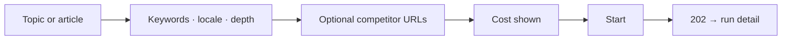
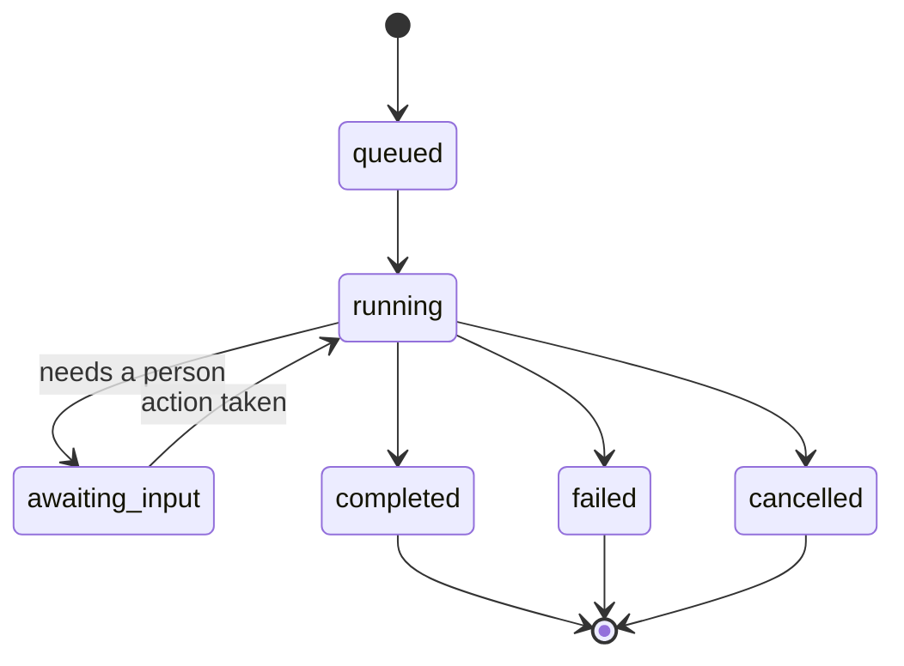

# Research

> **Status:** v1.0 — complete. Phase 15 batch 2.
> **Five coarse phases, and nothing below them.** The orchestrator runs a detailed internal state machine; none of it is rendered. A UI showing `SerpIntelligence` would break on every pipeline improvement that changed nothing a customer can observe.

## Overview

**Purpose.** Define the research and run screens: creation, progress, evidence, citations, SERP summary, competitor insights, coverage, history, cancellation, and re-running.

**Scope.** Screen composition and states. Run semantics are owned by `06-api/research-api.md`; the engine is owned by `05-content-platform/research-engine.md`.

## Page hierarchy

```
/w/{slug}/research                     → Research start + recent runs
/w/{slug}/runs                         → All runs, all kinds
/w/{slug}/runs/{runId}                 → Run detail
/w/{slug}/runs/{runId}/results         → Evidence produced
/w/{slug}/runs/{runId}/serp            → SERP summary
/w/{slug}/runs/{runId}/competitors     → Competitor insights
```

**Runs are workspace-level, not nested under content**, because a run started from an article is still a run and a user looking for "what is happening now" should not need to know where it started (`information-architecture.md`).

## What is never rendered

| Never shown | Why |
|---|---|
| Internal orchestration stages | Renamed, merged, and reordered as the pipeline improves |
| Provider identity | Substitution would become a breaking change |
| Which provider supplied a SERP or fetched a page | Same |
| Competitor page bodies | Redistributing a competitor's content is a copyright exposure |
| Raw prompts or model calls | Owned by `ai.md`, and never exposed there either |
| Evidence bodies in run results | Results return **identifiers**; evidence is fetched from Knowledge |

**The five phases are the entire public vocabulary** — `preparing`, `gathering`, `analyzing`, `synthesizing`, `finalizing` — alongside six statuses (`06-api/research-api.md`).

## Research creation

| Property | Value |
|---|---|
| **API** | `POST /v1/workspaces/{workspaceId}/research` |
| **Permission** | **`research:execute`** |
| **Idempotency** | `Idempotency-Key` required |
| **Response** | `202` with a run handle |



**Cost is shown before starting**, because research charges credits and a user who did not see the cost cannot consent to it (`design-principles.md`).

**Either an article or a topic is required**, and the form makes that mutually-satisfying rather than validating on submit.

**`depth` is offered as `standard` or `deep` and described by outcome**, not by mechanism. It maps to internal budget and breadth decisions the API does not expose.

**Competitor URLs are validated at submission and rejected at `400`.** An SSRF-blocked URL — private range, non-HTTPS, unresolvable — surfaces inline at the field with the reason. Rejection at submission rather than mid-run lets the user fix it immediately (`16-security/api-security.md`).

**`402` distinguishes insufficient credits from a plan limit**, with different resolutions (`design-principles.md`).

## Run progress

| Property | Value |
|---|---|
| **API** | `GET /v1/runs/{runId}` — **source of truth** |
| **Stream** | `GET /v1/runs/{runId}/events` — SSE, convenience |
| **Permission** | Per the run's subject |



**The run resource is the source of truth; the stream is a convenience.** A client that loses its connection refetches rather than trusting the last event it saw. Reconnection sends `Last-Event-ID` and replays missed events (`06-api/research-api.md`).

**`awaiting_input` renders as a required action, not as progress.** A run waiting on outline approval is not advancing, and showing it as busy leaves the user waiting for something that requires them. The event carries an `actionUrl`, and the UI surfaces it as a button (`content.md`).

**Leaving the page never cancels a run.** Work is durable and detached; the run continues and is picked up from the runs list (ADR-004).

**The stream stops when the view is not visible.** A page holding a stream per run indefinitely is a connection leak (`dashboard.md`).

**Progress is a percentage plus a phase label.** No stage name, no step count, no substage.

## Results

| Property | Value |
|---|---|
| **API** | `GET /v1/runs/{runId}/results` |
| **Shows** | Evidence count, evidence identifiers, coverage report, competitor and SERP summaries |
| **Permission** | `research:read` |

**Results return evidence identifiers, not evidence bodies.** Each resolves through the Knowledge API, which owns provenance and freshness — duplicating evidence into a research payload would let it go stale (`06-api/knowledge-api.md`).

**Requesting results before completion returns `409`, not `404`.** The resource exists and is not ready, and the UI renders "still running" with a link back to progress rather than "not found."

**Each evidence item links to its detail, its provenance, and its citing articles.**

## Citation panel

| Property | Value |
|---|---|
| **Shows** | For each evidence item, which article revisions cite it |
| **API** | `GET /v1/evidence/{evidenceId}` with `expand=citingRevisions` |
| **Permission** | `knowledge:read` **and** `article:read` |

**This answers "what depends on this source."** When evidence is stale or found unreliable, the question is which published content rests on it — and the panel is where that is visible.

**Both permissions are required**, because a citation joins an article claim to knowledge evidence. A user holding one and not the other sees the evidence without the citing list, never a `403` for the whole screen (`06-api/knowledge-api.md`).

**Unsupported claims are visible.** A citation with `supported: false` and no evidence is a real, rendered state — hiding it would let ungrounded content look grounded (`content.md`).

## SERP summary

| Property | Value |
|---|---|
| **API** | `GET /v1/runs/{runId}/serp` |
| **Shows** | Keyword, locale, **`collectedAt`**, ranked results, SERP features |

**`collectedAt` is displayed prominently, not in a tooltip.** SERP data ages within days, and rendering rankings without a timestamp presents stale positions as current (`11-knowledge-platform/freshness-engine.md`).

**Results show position, title, domain, and URL.** Provider identity is never shown — which data provider supplied the SERP is an implementation detail behind the Provider Layer.

**SERP features are listed as labels** — featured snippet, people-also-ask — without interpretation. What they imply is content strategy, owned by the engines.

## Competitor insights

| Property | Value |
|---|---|
| **API** | `GET /v1/runs/{runId}/competitors` |
| **Shows** | URL, domain, title, word count, heading structure, topics, **`fetchStatus`** |

**Four fetch statuses render distinctly**, because partial coverage changes how the analysis should be read:

| Status | Rendered |
|---|---|
| `ok` | Analyzed |
| `blocked` | **Could not fetch — the site refused** |
| `unavailable` | Could not fetch — unreachable |
| `excluded` | **Excluded — failed URL validation** |

**A set where three of ten were blocked is a weaker basis for gap analysis**, and the UI states the ratio rather than presenting incomplete analysis as complete (`06-api/research-api.md`).

**Competitor page content is never displayed in full.** Structure, topics, and metrics are shown; the body is not.

**Heading structure renders as an outline**, which is the form in which it is useful for comparison.

## Coverage

| Property | Value |
|---|---|
| **Shows** | Topics covered by competitors versus topics in the outline; gaps |
| **Source** | The coverage report on run results and on outline versions |
| **Links to** | The article's outline |

**Coverage is rendered where it is actionable — on the outline** — and summarized here. An outline flagged `coverage_thin` shows the same report, and approval requires acknowledgement (`content.md`).

**The UI computes no coverage.** It renders the report the API returns.

**This is not a "planning" screen.** Planning is an internal pipeline concern; its observable output is an outline, owned by `content.md`.

## Run history

| Property | Value |
|---|---|
| **API** | `GET /v1/workspaces/{workspaceId}/runs` |
| **Filters** | `kind` · `status` · `articleId` · date range |
| **Sort** | `startedAt` descending by default |
| **Pagination** | Cursor |

**`awaiting_input` sorts above `running`**, because it needs a person and `running` does not.

**Kind is shown** — research, content, refresh, optimize, publish, ai — so one list serves every long-running operation (`workspaces.md`).

**Completed runs remain linkable.** A run whose retention elapsed renders not-found with the retention window stated (`information-architecture.md`).

## Cancellation

| Property | Value |
|---|---|
| **API** | `POST /v1/runs/{runId}/actions/cancel` |
| **Permission** | **`run:cancel`** |
| **Idempotent** | Yes |

**Cancellation is cooperative and the UI says so.** "Cancelling…" is an honest intermediate state; the run transitions when the current activity reaches a safe point, and work already committed is not rolled back (`06-api/research-api.md`).

**The confirmation states the credit outcome**: credits for work already performed are retained, and only unperformed work is released. A user expecting a full refund would otherwise be surprised.

**`cancellable` on the run resource drives whether the action is offered at all.** A run in a non-cancellable phase shows no cancel affordance rather than a button that returns `409`.

**Cancelling a completed run returns `409`, not silent success**, and renders as "this run already finished" — unlike `DELETE`, the intent cannot be satisfied.

## Re-running after failure

**There is no retry endpoint, and the UI does not pretend otherwise.**

| Situation | Affordance |
|---|---|
| Run `failed` | **"Run again"** — starts a **new** run with the same parameters |
| Run `cancelled` | "Run again" |
| Run `completed` | "Run again" — a new run, clearly labelled |

**"Run again" is not a resume.** It creates a new run, charges credits again, and produces a new run id. Labelling it "Retry" would imply the failed run resumes, which it does not.

**The cost is shown again**, because a new run is a new charge.

**The failure reason is displayed with its `requestId`** where the failure was server-side, so support can recover detail without the platform disclosing any (`design-principles.md`).

**Internal retries are invisible.** The Retry Engine retries transient failures internally; a run reaching `failed` has already exhausted them, and surfacing intermediate attempts would expose orchestration (`13-event-platform/retry-engine.md`).

## Common UI states

| State | Rendering on these screens |
|---|---|
| **Loading** | Skeleton matching the run list or detail; nothing under 300 ms |
| **Empty** | Four distinct: no runs yet · filtered to nothing · no permission · load failed |
| **Success** | Terminal run state with a link to results |
| **Failure** | Failure reason plus `requestId`; "Run again" offered |
| **Retry** | **Refetch** for `5xx` on reads; **"Run again"** for failed runs — never a silent re-submit |
| **Offline** | Progress freezes with a reconnecting indicator; **the run continues server-side** |
| **Conflict** | `409` on cancel — "already finished"; `409` on start — "a run is already active" |
| **Permission denied** | `403`: names the missing permission |
| **Not found** | `404`: "Run not found" — never a permission message |
| **Maintenance** | Read paths remain; starting new runs disabled with expected return |

**Offline is the state most likely to be rendered wrongly.** A dropped SSE connection does not mean the run stopped. The UI shows "reconnecting," keeps the last known state, and reconciles by refetching the run — it never shows the run as failed or stalled.

**`409` on start names the active run and links to it**, rather than reporting a generic conflict.

## API interactions

| Screen | Endpoints |
|---|---|
| Creation | `POST /v1/workspaces/{workspaceId}/research` |
| Progress | `GET /v1/runs/{runId}`; `GET /v1/runs/{runId}/events` |
| Results | `GET /v1/runs/{runId}/results` |
| SERP | `GET /v1/runs/{runId}/serp` |
| Competitors | `GET /v1/runs/{runId}/competitors` |
| History | `GET /v1/workspaces/{workspaceId}/runs` |
| Cancel | `POST /v1/runs/{runId}/actions/cancel` |
| Citations | `GET /v1/evidence/{evidenceId}?expand=citingRevisions` |

## Business rules

1. **Five coarse phases and six statuses only**; orchestration internals are never rendered.
2. **Provider identity is never shown.**
3. **The run resource is the source of truth**; the stream is a convenience with `Last-Event-ID` replay.
4. **`awaiting_input` renders as a required action**, not as progress.
5. **Leaving the page never cancels a run**; streams stop when not visible.
6. **Cost is shown before starting and before running again.**
7. **Competitor URLs are validated at submission**, with SSRF rejections inline.
8. **Results return evidence identifiers**, resolved through Knowledge.
9. **`409` on results renders as "still running," not "not found."**
10. **`collectedAt` is prominent on SERP data.**
11. **Four fetch statuses render distinctly**; partial coverage is stated.
12. **Competitor page bodies are never displayed.**
13. **Coverage is rendered, never computed.**
14. **Cancellation is cooperative and states the credit outcome**; `cancellable` drives the affordance.
15. **"Run again" creates a new run and says so** — there is no resume.
16. **Internal retries are invisible.**
17. **Offline shows reconnecting, never failed.**

## Cross references

- `06-api/research-api.md` — **the canonical `Run`, phases, SSE, cancellation**
- `05-content-platform/research-engine.md` — the engine behind these screens
- `05-content-platform/orchestration.md` — the internal state machine deliberately hidden
- `06-api/knowledge-api.md` — evidence, provenance, citing revisions
- `11-knowledge-platform/freshness-engine.md` — why `collectedAt` is prominent
- `16-security/api-security.md` — SSRF validation on competitor URLs
- `16-security/rbac.md` — `research:execute`, `run:cancel`
- `13-event-platform/retry-engine.md` — internal retries, invisible here
- `content.md` — outlines, coverage acknowledgement, articles these runs serve
- `ai.md` — AI runs sharing this run surface
- `workspaces.md` — the runs list
- `design-principles.md` — long-running operations, cost before action, offline
- `04-platform/credits.md` — charging and partial retention on cancel
