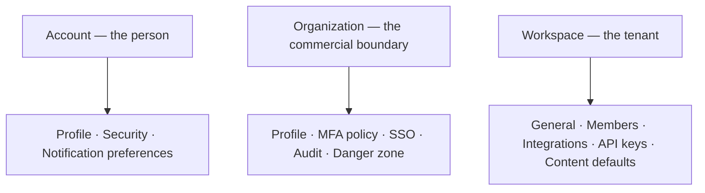

# Settings

> **Status:** v1.0 — complete. Phase 15 batch 3.
> **Settings never bypass a permission check.** Every screen here is gated by the same evaluation that gates the action it configures, and a setting the user cannot apply is not shown.

## Overview

**Purpose.** Define the settings surface: where each setting lives, at which tier, and which permission governs it.

**Scope.** The account-tier screens in full, plus the tier map. Organization settings are owned by `organizations.md`; workspace settings by `workspaces.md`. Neither is restated.

## Tier map

| Setting | Tier | Permission | Owned by |
|---|---|---|---|
| Profile | Account | Self | **This document** |
| Security — password, MFA, sessions | Account | Self | **This document** |
| Notification preferences | Account | Self | **This document** |
| API keys | Workspace | `apikey:read` / `apikey:manage` | **This document** |
| Integrations | Workspace | `integration:read` / `integration:manage` | **This document** |
| Content defaults | Workspace | `workspace:update` | **This document** |
| Organization profile, MFA policy, SSO, danger zone | Organization | Various | `organizations.md` |
| Workspace general, members, archive | Workspace | Various | `workspaces.md` |
| Billing | Organization | `billing:read` / `billing:manage` | `organizations.md` |
| **Feature flags** | **Operator** | `platform:support` | **`administration.md`** |

**Feature flags are not a customer setting.** They require `platform:support` with step-up and live on the operator surface, which this application does not render for customers (`06-api/admin-api.md`). No customer-facing flag management exists, and this document states that rather than leaving a reader to look for it.

**A setting is shown only where the viewer can apply it.** Read-only exposure of a setting they cannot change is offered only where seeing it is itself useful — the organization's MFA policy, for example, which explains why a member is being asked to enrol.

## Profile

| Property | Value |
|---|---|
| **Shows** | Name, email, avatar, locale, timezone |
| **Permission** | Self only |
| **Concurrency** | `If-Match` |

**Email changes require verification of the new address before taking effect.** Identity is `users.id`, not email — email is verified but is never the identity, because it changes and is reassignable (`16-security/authentication.md`).

**The account is global and spans organizations.** The UI states this where a user might expect a per-organization profile.

**Deleting an account is a request, not an immediate action**, because erasure interacts with legal hold and is queued when one applies (`16-security/compliance.md`). The UI acknowledges the request and states that it may be deferred.

## Security — account

| Section | Behaviour |
|---|---|
| **Password** | Requires the current password **and step-up**; revokes all other sessions |
| **MFA factors** | WebAuthn preferred, TOTP supported, recovery codes; **SMS is absent** |
| **Sessions** | Every active session with IP, user agent, last active; individually revocable |
| **Connected accounts** | OAuth links; SSO status |

**SMS is not offered and its absence is explained** where a user might look for it: SIM-swap attacks require no technical sophistication, and offering it would let an organization believe it has MFA while holding a factor obtainable from a carrier (`16-security/authentication.md`).

**MFA secrets and recovery codes are shown exactly once**, with an explicit acknowledgement before the dialog closes. There is no "show again" affordance, because storage is hashed.

**Removing the last factor is refused where the organization enforces MFA** — `409 AUTH_MFA_REQUIRED_BY_POLICY` — rendered as a policy explanation naming the organization, not as a generic error.

**Password change requires the current password and step-up.** A session alone is insufficient: an attacker holding a stolen session should not be able to lock the owner out.

**All other sessions are revoked on password change; the current one survives.** The UI states the count revoked.

**Session revocation is immediate**, because session ids are opaque and server-looked-up. The UI does not imply a delay.

## Notification preferences

| Property | Value |
|---|---|
| **Scope** | Per user, per workspace |
| **Channels** | In-app, email |
| **Categories** | Runs, content, billing, security, system |

**Security notifications cannot be disabled.** Session revocation, MFA changes, and credential events are delivered regardless of preference, and the toggle is absent rather than disabled — a disabled toggle implies it could be enabled (`notifications.md`).

**Preferences are per workspace**, because a user active in one workspace and dormant in another wants different volumes.

**Email delivery is best-effort and the UI says so.** In-app is the durable surface; email is a convenience (`notifications.md`).

## API keys

| Property | Value |
|---|---|
| **Scope** | **One workspace per key** |
| **Permission** | `apikey:read` to list; `apikey:manage` + **step-up** to create or revoke |
| **Shown at creation** | The full key, **once** |
| **Shown thereafter** | Prefix only — `cos_live_a1b2c3…` |

**The full key is displayed once with an explicit acknowledgement.** Storage is a hash; a UI that could redisplay a key would imply the platform could leak every key in a database compromise (`16-security/authentication.md`).

**The prefix is shown deliberately**, because it lets an operator identify which key appeared in a log or a public repository without holding the secret.

**Key permissions are the intersection of declared scopes and the creator's current permissions**, and the UI states it: *"This key cannot exceed your own permissions, and it shrinks if your permissions do."* Without that statement, a user would expect a static grant.

**Keys are workspace-scoped, and the scope is not selectable across workspaces.** A key spanning workspaces would be a cross-tenant credential.

**Revocation is immediate and irreversible.** The confirmation names the key by label and prefix.

**`lastUsedAt` is shown**, because an unused key is a key to revoke.

## Integrations

| Property | Value |
|---|---|
| **Permission** | `integration:read`; changes require `integration:manage` |
| **Covers** | CMS publishing targets, analytics connections, webhook endpoints |

**Credentials are entered, never displayed.** A connected integration shows its status, target, and last activity — never the stored token (`16-security/secrets-management.md`).

**Webhook endpoint management lives here**, and the screens are specified in `notifications.md`: registration, verification challenge, signing secret shown once, retry status, and auto-disable after 100 consecutive failures.

**A disabled endpoint is surfaced prominently**, because the customer's integration has stopped silently and re-enabling requires re-verification (`06-api/webhooks.md`).

**Disconnecting an integration states its consequence**: scheduled publishing to that target fails, and existing published content is unaffected.

## Content defaults

| Property | Value |
|---|---|
| **Permission** | `workspace:update` |
| **Covers** | Default article type, word count, locale, template |

**These are project and workspace defaults, snapshotted into an article's brief at creation.** Changing a default does not retroactively alter in-flight articles, and the UI states that explicitly — otherwise a user would expect a global change (`content.md`).

**No model, provider, tone-model, or routing preference is offered.** Model selection is never exposed, and a "preferred model" setting would contradict the contract (`ai.md`).

**AI preferences are content-shaped, not model-shaped**: article type, length, locale, and template. That is the full set.

## Common UI states

| State | Rendering |
|---|---|
| **Loading** | Form skeleton; nothing under 300 ms |
| **Empty** | No API keys · no integrations · no sessions besides current |
| **Success** | Inline confirmation at the section; no page reload |
| **Failure** | Field-level for validation; banner with `requestId` for `5xx` |
| **Retry** | `5xx`, `503`, network — never `4xx` |
| **Offline** | Read-only; every mutation disabled with a reason; nothing queued |
| **Conflict** | `412` — "someone else changed these settings"; reload, never auto-merge |
| **Permission denied** | Section absent, not disabled; read-only where seeing it is useful |
| **Not found** | `404` on a workspace or organization — never a permission message |
| **Maintenance** | Settings readable; changes disabled with expected return |

**Offline queues nothing.** A queued MFA change or key revocation applied later against changed state is worse than a clear failure.

**Step-up challenges render as challenges, not errors.** A `401 SECURITY_STEP_UP_REQUIRED` means "prove it's you," and the UI presents the factor prompt inline rather than navigating away and losing the form.

## API interactions

| Screen | Endpoints |
|---|---|
| Profile | `GET /v1/auth/session`; account update endpoints |
| Password | `POST /v1/auth/password/change` |
| MFA | `POST /v1/auth/mfa/totp` · `.../webauthn/register` · `.../recovery-codes` · `DELETE /v1/auth/mfa/{factorId}` |
| Sessions | `GET /v1/auth/sessions` · `DELETE /v1/auth/sessions/{sessionId}` |
| Step-up | `POST /v1/auth/step-up` |
| API keys | Workspace API key endpoints |
| Integrations | `GET`/`POST`/`PATCH`/`DELETE /v1/workspaces/{workspaceId}/webhooks` and integration endpoints |
| Workspace settings | `GET`/`PATCH /v1/workspaces/{workspaceId}` |

**Mutations that change authentication posture require step-up**; the UI requests it before submitting rather than after failing.

## Business rules

1. **Settings never bypass a permission check**; unavailable sections are absent.
2. **Feature flags are an operator concern**, not a customer setting.
3. **Email is verified but is never the identity.**
4. **Account deletion is a request** and may be deferred by legal hold.
5. **SMS is absent and its absence is explained.**
6. **MFA secrets and recovery codes are shown once**, with acknowledgement.
7. **Removing the last factor is refused under an enforcing policy**, with the policy named.
8. **Password change requires the current password and step-up**, revoking other sessions.
9. **Security notifications cannot be disabled**; the toggle is absent.
10. **The full API key is shown once**; the prefix thereafter.
11. **Key permissions are the intersection with the creator's**, and the UI says so.
12. **Keys are workspace-scoped**, not selectable across workspaces.
13. **Integration credentials are entered, never displayed.**
14. **A disabled webhook endpoint is surfaced prominently.**
15. **Content defaults do not retroactively alter in-flight articles.**
16. **No model, provider, or routing preference is offered.**
17. **Offline queues nothing**; step-up renders inline.

## Cross references

- `organizations.md` — organization settings, billing, danger zone
- `workspaces.md` — workspace general, members, archive
- `administration.md` — feature flags and every operator control
- `notifications.md` — preference categories, webhook endpoint screens
- `06-api/authentication-api.md` — password, MFA, sessions, step-up
- `06-api/workspace-api.md` — workspace settings and members
- `06-api/webhooks.md` — endpoint registration, verification, auto-disable
- `16-security/authentication.md` — **identity, MFA policy, key hashing, session revocation**
- `16-security/rbac.md` — the permissions gating every section
- `16-security/secrets-management.md` — credentials entered, never displayed
- `16-security/compliance.md` — erasure and legal hold
- `content.md` — how defaults are snapshotted into a brief
- `ai.md` — why no model preference exists
- `error-and-loading-patterns.md` — the shared state catalogue
