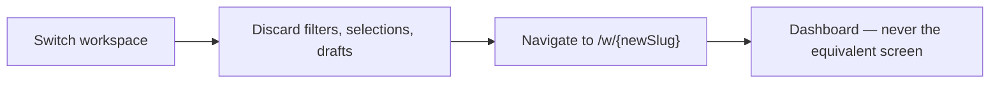
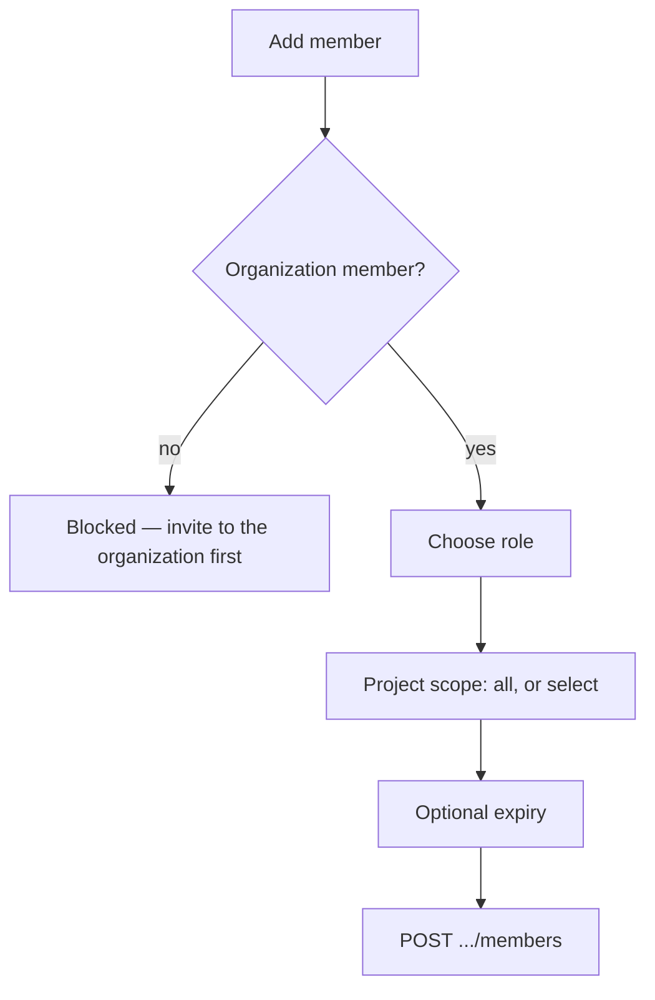

# Workspaces

> **Status:** v1.0 — complete. Phase 15 batch 2.
> **The workspace is the tenant.** Every screen below `/w/` is scoped to one, and crossing that boundary always requires an explicit switch. Nothing carries across.

## Overview

**Purpose.** Define the workspace shell — switcher, settings, members and roles, activity — and the dedicated screens the dashboard's summary widgets link to.

**Boundary with `dashboard.md`.** Workspace Home **is** the dashboard, and that screen is owned there. This document owns the shell around it and the destination screens its widgets point at: storage detail, credits detail, and the runs list. Widget composition is not restated.

## Page hierarchy

```
/w/{workspaceSlug}                      → Dashboard (dashboard.md)
/w/{workspaceSlug}/runs                 → Runs list
/w/{workspaceSlug}/settings             → General
/w/{workspaceSlug}/settings/members     → Members and roles
/w/{workspaceSlug}/settings/integrations
/w/{workspaceSlug}/settings/api-keys
/w/{workspaceSlug}/settings/storage     → Storage detail
/w/{workspaceSlug}/settings/credits     → AI credits detail
/w/{workspaceSlug}/activity             → Activity
```

**Settings sub-items are permission-filtered individually.** An Editor sees General and Integrations; API keys require `apikey:read` (`navigation.md`).

## Workspace context

**`workspaceId` is `tenantId`** (ADR-017). Every request made from these screens is scoped to it, and the UI never sends a tenant parameter — the tenant is derived server-side from the authenticated subject and the addressed resource (`16-security/tenant-isolation.md`).

**The current workspace name is visible on every screen below `/w/`**, never only inside an opened menu. Acting in the wrong workspace is the most consequential ordinary mistake available, and the tenant boundary is exactly where it happens.

## Workspace switcher

| Property | Value |
|---|---|
| **Shows** | Only workspaces the user has a role in |
| **API** | Membership from `GET /v1/auth/session` |
| **Placement** | Primary chrome, always visible |
| **Empty** | "No workspace access" with a link to the organization workspace list |



**Switching resets to the new workspace's dashboard**, never to the equivalent screen. Article ids are not portable across tenants, and preserving position would produce a `404` that reads as data loss (`information-architecture.md`).

**Nothing carries across a switch** — no filters, no selections, no unsaved drafts. The switcher warns before discarding unsaved work.

**An empty switcher is accurate, not broken.** An organization Owner with no workspace roles genuinely has no workspace access, and the empty state links to the organization's workspace list where self-grant is offered (`organizations.md`).

**The switcher is search-filterable above a threshold** of roughly ten workspaces.

## Breadcrumbs

**Semantics are owned by `information-architecture.md`** — structural rather than historical, every segment navigable except the current, permission-filtered segments rendered as plain text without explanation.

**On workspace screens the trail begins at the organization:**

```
Acme Corp  ›  Marketing  ›  Settings  ›  Members
```

**The dashboard is the workspace root and shows no breadcrumb.**

## Workspace settings — general

| Property | Value |
|---|---|
| **Shows** | Name, slug, default locale, status |
| **API** | `GET`/`PATCH /v1/workspaces/{workspaceId}` |
| **Permission** | `workspace:read`; edit requires `workspace:update` |
| **Concurrency** | **`If-Match` required** — `412` surfaces as a conflict |

**`slug` is unique within the organization and is read-only after creation**, displayed as an identifier rather than a disabled field.

**Archive and restore live here, not in the danger zone.** Archiving is reversible and non-destructive: content stays readable, media stays served, writing stops. The confirmation states exactly that, and distinguishes it from deletion.

**Scheduled work is cancelled on archive, not paused**, and the confirmation says so — resuming a pipeline weeks later would execute against stale research (`06-api/workspace-api.md`).

**Deletion is not on this screen.** It requires `workspace:delete`, which is an **organization-tier** permission, and it lives on the organization's workspace list (`organizations.md`). A Workspace Admin runs a workspace; destroying it is a commercial decision.

## Members and roles

| Property | Value |
|---|---|
| **Shows** | Members with role, project scope, granted by, expiry |
| **API** | `GET`/`POST`/`PATCH`/`DELETE .../members[/{userId}]` |
| **Permission** | `workspace:read`; mutations require `member:manage` |

**Four roles render with the distinctions that matter:**

| Role | Rendered as |
|---|---|
| Workspace Admin | Full workspace control |
| Editor | Create, edit, **publish**, export |
| **Contributor** | Create and edit — **cannot publish or export** |
| Viewer | Read only — **no export** |

**Contributor's two exclusions are stated explicitly**, because they are what makes the role safe for freelancers and agency staff: they produce work; releasing it externally and extracting it in bulk are separate decisions (`16-security/rbac.md`).

**Viewer's lack of export is stated too.** Read access in the product is not bulk extraction.

### Granting access



**The member selector lists only organization members.** Workspace access without organization membership would create a subject outside the commercial boundary, and the API returns `409 WORKSPACE_NOT_ORG_MEMBER` (`06-api/workspace-api.md`).

**Project scope offers "All projects" or an explicit selection.** Selecting none is not submittable — an empty array is rejected by both the API and a database CHECK constraint, because it is ambiguous between "none" and "unset" (`16-security/rbac.md`).

**Expiry is offered and defaults to none.** It supports contractor access without a cleanup step nobody performs; expired bindings are evaluated at decision time, so there is no window in which a lapsed grant still works.

**`grantedBy` is displayed on every binding.** It is the access-review evidence auditors ask for, and it is what makes a self-grant visible in the list (`16-security/audit.md`).

**A self-grant renders with a marker** — `grantedBy` equals the subject — because the control is the receipt.

**The last Workspace Admin cannot be removed**, blocked before the request with the reason stated.

## Activity

| Property | Value |
|---|---|
| **Shows** | Workspace events: content, research, knowledge, media, membership |
| **Permission** | Per item, revalidated on render |
| **Empty** | "No recent activity" |

**Entries sort by occurrence, deduplicate by event id, and are permission-revalidated on render** — the same rules as recents and favourites (`navigation.md`).

**Actor names appear only where the viewer holds `member:read`.** Otherwise the action is shown without the actor.

**This is not the audit trail.** Audit is evidence with seven-year retention, reachable at the organization tier with `audit:read` (`16-security/audit.md`).

## Storage detail

| Property | Value |
|---|---|
| **Shows** | Bytes by media kind, object count by state, largest objects |
| **API** | `GET /v1/workspaces/{workspaceId}/media` aggregates |
| **Permission** | `article:read` |
| **Links to** | Media library |

**Objects in non-readable states are counted and distinguished.** Media in `scanning` or `processing` is stored and not yet usable; showing only `available` would understate storage and confuse a user who just uploaded (`12-storage-platform/blob-lifecycle.md`).

**Quarantined objects appear with their status to their owner**, and the threat signature is never disclosed.

**Derived assets are shown separately from originals**, because they are rebuildable and excluded from backup — a distinction that matters when a user asks why storage exceeds their upload total (`11-knowledge-platform/provenance.md`).

## AI credits detail

| Property | Value |
|---|---|
| **Shows** | Balance, consumption by operation, series over the period |
| **API** | `GET /v1/workspaces/{workspaceId}/ai/usage` |
| **Permission** | `analytics:read` |
| **Links to** | Organization billing |

**Cost is shown in credits only.** Provider currency is never displayed, and no model or provider is named — operation type is the finest breakdown available (`06-api/ai-api.md`).

**Balance and consumption appear together**, because consumption without balance cannot be acted on.

**`tokensProcessed` is shown as a single aggregate** where shown at all, never broken down — per-operation token counts fingerprint model families.

## Recent runs

| Property | Value |
|---|---|
| **Shows** | Runs with kind, status, coarse phase, started, duration |
| **API** | `GET /v1/workspaces/{workspaceId}/runs` |
| **Permission** | `run:read` |
| **Filters** | Kind, status, article, date range |

**Five coarse phases only** — `preparing`, `gathering`, `analyzing`, `synthesizing`, `finalizing`. Orchestration internals are never rendered (`research.md`).

**`awaiting_input` sorts above `running`**, because it needs a person and `running` does not.

**Cursor pagination with no total count**, matching every list in the product (`06-api/api-principles.md`).

## Search and filtering

**Search is workspace-scoped, filtered server-side, and cannot express a cross-tenant query** (`navigation.md`).

| Surface | Filters |
|---|---|
| Members | Role, project scope, expiring |
| Runs | Kind, status, article, date range |
| Activity | Event type, actor, date range |
| Storage | Media kind, state |

**Filters are query parameters and survive reload and sharing.** A filtered list is a shareable URL, which is why filter state is never client-only (`information-architecture.md`).

**Unknown filter values are rejected by the API with `400`**, so a stale bookmarked filter fails visibly rather than silently returning everything.

## Common UI states

| State | Rendering on these screens |
|---|---|
| **Loading** | Skeleton matching the member or run table; nothing under 300 ms |
| **Empty** | Distinguished: no members · filtered to nothing · no permission · load failed |
| **Success** | Inline at the acted-on row; list updates in place |
| **Failure** | Inline for field errors; banner with `requestId` for `5xx` |
| **Retry** | `5xx`, `503`, network only — **never `4xx`** |
| **Offline** | Read-only banner; mutations disabled with a reason; nothing queued |
| **Conflict** | `412` on settings — reload offered, never auto-merged |
| **Permission denied** | `403`: names the missing permission and who can grant it |
| **Not found** | `404`: "Workspace not found" — **never a permission message** |
| **Maintenance** | Full-screen notice; read paths remain where possible |

**A workspace the viewer has no role in returns `404`, and this is the platform's highest-stakes instance of that rule.** Because `workspaceId` is `tenantId`, a `403` would confirm a specific tenant exists, letting an attacker enumerate the customer base (`16-security/authorization.md`).

**Archived workspaces render read-only rather than erroring.** `GET` succeeds; `PATCH` returns `409 WORKSPACE_ARCHIVED`, and the UI disables editing with the reason rather than letting the user discover it on submit.

## API interactions

| Screen | Endpoints |
|---|---|
| Settings general | `GET`/`PATCH /v1/workspaces/{workspaceId}` |
| Archive / restore | `POST .../actions/archive` · `.../actions/restore` |
| Members | `GET`/`POST`/`PATCH`/`DELETE .../members[/{userId}]` |
| Permissions | `GET .../permissions` — **rendering only** |
| Runs | `GET /v1/workspaces/{workspaceId}/runs` |
| Storage | `GET /v1/workspaces/{workspaceId}/media` |
| Credits | `GET /v1/workspaces/{workspaceId}/ai/usage` |

**`GET .../permissions` drives affordance visibility and is never treated as authoritative.** The server re-authorizes every request regardless (`16-security/authorization.md`).

**Member creation sends `Idempotency-Key`**; `PATCH` and `DELETE` are idempotent by contract.

## Business rules

1. **`workspaceId` is `tenantId`**; the UI never sends a tenant parameter.
2. **The current workspace is visible on every screen below `/w/`.**
3. **The switcher lists only workspaces the user has a role in**; an empty switcher is accurate.
4. **Switching resets to the dashboard and carries nothing across.**
5. **Unsaved work is warned about before a switch.**
6. **`slug` is read-only after creation.**
7. **Archive is reversible and stated as such**; scheduled work is cancelled, not paused.
8. **Deletion is not on this screen** — it is organization-tier.
9. **The member selector lists only organization members.**
10. **Empty project scope is not submittable.**
11. **`grantedBy` is displayed; self-grants are marked.**
12. **The last Workspace Admin cannot be removed**, blocked before the request.
13. **Contributor's and Viewer's exclusions are stated explicitly.**
14. **Credits are shown without provider currency, model, or provider.**
15. **Filters are query parameters and survive reload and sharing.**
16. **A workspace with no role returns `404`, never a permission message.**
17. **Archived workspaces render read-only rather than erroring on submit.**

## Cross references

- `dashboard.md` — **Workspace Home; widget composition**
- `06-api/workspace-api.md` — **every endpoint and constraint these screens surface**
- `16-security/rbac.md` — the four workspace roles, project scope, expiry, self-grant
- `16-security/tenant-isolation.md` — why the UI never sends a tenant parameter
- `16-security/authorization.md` — 404-versus-403; permissions are rendering only
- `16-security/audit.md` — `grantedBy` as access-review evidence
- `navigation.md` — switcher placement, search scope, permission-driven visibility
- `information-architecture.md` — routes, breadcrumb semantics, context switching
- `design-principles.md` — confirmation, empty states, conflicts
- `organizations.md` — workspace creation, deletion, self-grant entry point
- `research.md` — the runs these screens list
- `12-storage-platform/blob-lifecycle.md` — media states in storage detail
- `06-api/ai-api.md` — credits without provider exposure
