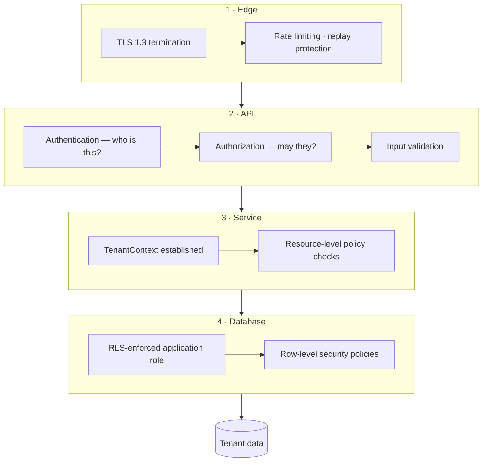
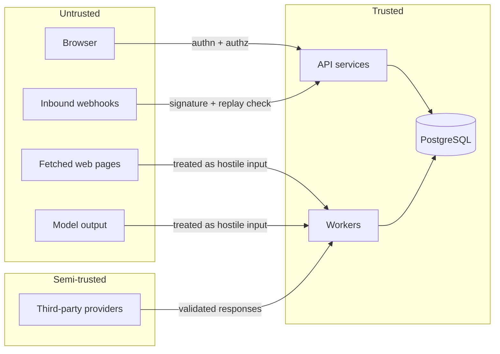

# Security Platform

> **Status:** v1.0 — complete. New in Phase 9.
> **This platform owns security and owns nothing else.** Eighty-five documents across Phases 1–8 defer their controls here. This folder is where those deferrals resolve into implementable specifications.

## Overview

**Business purpose.** ContentOS is a multi-tenant platform where one workspace's competitive research, unpublished drafts, and performance data sit in the same database as its competitors'. A single cross-tenant leak is not a bug with a severity rating — it is the end of the product's credibility. Security here is not a feature layer bolted on at the edge; it is the property that makes multi-tenancy sellable at all.

**Technical purpose.** Define the cross-cutting controls every other platform references: who the caller is, what they may do, how tenant isolation is enforced in the database rather than in application code, how secrets and keys are managed, what is audited, and what happens when something goes wrong.

**Scope discipline.** Every other folder in this tree ends its security section with "reference `16-security/`; this component defines no controls of its own." That sentence is a contract in both directions: components do not invent their own controls, and this platform does not encode business rules. The Security Platform knows nothing about articles, keywords, SEO, or scoring — it knows subjects, resources, actions, and tenants.

## The seven principles

Every control in this folder derives from one of these. Where a decision is contested, the principle that produced it is named.

| Principle | Operational meaning |
|---|---|
| **Default deny** | Absence of a permission is a denial. No implicit grants, no fallthrough to allow. |
| **Least privilege** | Every subject — human, service, worker — holds the minimum capability set that lets it function, and no more. |
| **Defense in depth** | No single control is load-bearing. Application authorization and database RLS both enforce tenancy; either alone would be sufficient, and neither is trusted alone. |
| **Zero trust** | Network position grants nothing. A request from inside the cluster is authenticated and authorized identically to one from the internet. |
| **Explicit permissions** | Permissions are enumerated and named. There is no wildcard role, no "admin bypasses checks", no permission inferred from another. |
| **Immutable audit** | Security-relevant decisions are recorded append-only. There is no update path and no delete path. |
| **No shared tenant state** | Caches, indexes, vector stores, event streams, and temporary files are tenant-scoped. Nothing that holds one tenant's data is reachable by another's request. |

**Default deny is the principle that gets violated by accident.** Not through a decision to allow something, but through a missing check that lets a request fall through to success. The controls in this folder are therefore structured so that the absence of an explicit grant produces a denial by construction — an unhandled resource type has no policy, and no policy means no access.

## Responsibilities

- Identity, session, and token lifecycle (`authentication.md`).
- Permission model, policy evaluation, resource checks (`authorization.md`, `rbac.md`).
- Database-enforced tenant isolation (`row-level-security.md`, `tenant-isolation.md`).
- Transport and API-layer controls (`api-security.md`).
- Secret storage, rotation, revocation (`secrets-management.md`).
- Encryption at rest and in transit, key lifecycle (`encryption.md`).
- Immutable audit trail (`audit.md`).
- Retention, erasure, export, consent (`compliance.md`).
- Threat enumeration and mitigations (`threat-model.md`).
- Security signals and detection (`security-observability.md`).
- Detection, containment, recovery (`incident-response.md`).

## Non-responsibilities

| Not owned | Owner |
|---|---|
| **Any business rule** | The owning domain component |
| What a workspace, article, or run *is* | `02-domain-design/` |
| Table definitions and constraints | `03-database/` |
| Rate limit values per plan | `04-platform/rate-limiting.md` |
| Model guardrails and prompt safety | `08-ai-platform/guardrails.md` |
| Provider credential *usage* | `09-integrations/` |
| Operational incident process | `14-operations/incident-response.md` |
| Event delivery guarantees | `13-event-platform/` |

**Two boundaries deserve explicit statement.**

**Guardrails are not security controls, and conflating them is a category error.** `08-ai-platform/guardrails.md` prevents a model from producing unsafe or ungrounded output — a content-quality and safety property. This platform prevents a subject from accessing a resource. A guardrail block is never an authorization decision, and an authorization denial is never a guardrail. They are audited separately and alerted separately.

**`14-operations/incident-response.md` and `16-security/incident-response.md` are different documents with different triggers.** The operations runbook handles availability incidents — a stalled relay, a saturated database. The security runbook handles confidentiality and integrity incidents — a suspected cross-tenant leak, a stolen credential. The containment actions differ sharply: an availability incident is resolved by restoring service, while a security incident may *require* taking service away.

## Enforcement layers

| Layer | Enforces | If it fails alone |
|---|---|---|
| **Edge** | Transport security, abuse limits | Application layer still authenticates |
| **API** | Identity and coarse permission | Service layer still checks the resource |
| **Service** | Resource-level policy | Database still enforces tenancy |
| **Database** | **Tenant isolation** | **Nothing else stands behind it** |

**The database layer is deliberately last and deliberately independent.** Every layer above it can be bypassed by a bug: a missing decorator, a forgotten check, a new endpoint that skipped the middleware. RLS cannot be bypassed by application code, because the application connects with a role that has no permission to see other tenants' rows. A SQL injection that defeats every application control still returns only the current tenant's data.

**This is why RLS is non-negotiable and why the exception set is closed.** Five tables sit above the workspace boundary — `users`, `organizations`, `organization_memberships`, `verified_domains`, `sso_configurations` — and that set is complete. A sixth requires an ADR (`03-database/tables.md`, `row-level-security.md`).

## Trust boundaries

**Fetched web pages and model output are untrusted inputs, not data.** This is the boundary most often drawn wrongly. A competitor's page retrieved by Firecrawl may contain instructions aimed at the model that will read it; a model's output may contain markup, links, or injected directives. Both are treated as hostile input and sanitised before use (`threat-model.md`).

**Workers sit inside the trusted boundary but hold no elevated database privileges.** A background process granted broader access "because it processes all tenants" is the single most common way isolation fails in systems that otherwise enforce it correctly. Workers use the same RLS-enforced role as the request path, with `TenantContext` set per event (`tenant-isolation.md`, `13-event-platform/workers.md`).

## Control catalogue

| Concern | Document | Primary mechanism |
|---|---|---|
| Who is the caller | `authentication.md` | Better Auth sessions, JWTs, API keys, SSO |
| May they act | `authorization.md` | Policy evaluation, default deny |
| What roles exist | `rbac.md` | Enumerated permissions, role bindings |
| Database isolation | `row-level-security.md` | PostgreSQL RLS, closed exception set |
| Isolation everywhere else | `tenant-isolation.md` | `TenantContext`, cache/vector/event/storage scoping |
| Transport and endpoints | `api-security.md` | TLS, CSRF, rate limits, validation, output filtering |
| Credentials | `secrets-management.md` | Vault-backed store, rotation, revocation |
| Data protection | `encryption.md` | TLS 1.3, AES-256, envelope encryption |
| Evidence | `audit.md` | Append-only `audit_log` |
| Legal obligations | `compliance.md` | Retention, legal hold, erasure, export |
| What can go wrong | `threat-model.md` | Eleven enumerated threats and mitigations |
| Detection | `security-observability.md` | Metrics, alerts, correlation |
| Response | `incident-response.md` | Detect, contain, recover, postmortem |

## Non-negotiable invariants

These hold everywhere, without exception, and a violation of any one is a security incident rather than a defect:

1. **No request reaches data without an established `TenantContext`.**
2. **Every database connection from application code uses the RLS-enforced role.** No application path uses a superuser or RLS-bypassing role.
3. **The RLS exception set is exactly five tables.**
4. **Absence of a permission is a denial.**
5. **Audit records are append-only.** No `UPDATE`, no `DELETE`, no application path that could produce either.
6. **Secrets never appear in logs, traces, metrics, events, or error messages.**
7. **Background work is never more privileged than the request path.**
8. **Event payloads carry identifiers, never credentials or content** (`13-event-platform/event-registry.md`).
9. **Vector search is tenant-filtered at query time**, never post-filtered on results (`11-knowledge-platform/`).
10. **AI Memory is never a source of truth and is tenant-scoped** (ADR-026).

**Invariant 9 is stated because post-filtering is the tempting implementation.** Retrieving the top-k nearest vectors and then discarding those belonging to other tenants is simpler, performs better, and leaks — the result count reveals the existence of other tenants' documents, and any bug in the filter returns their content directly. Tenancy is a query predicate, not a result filter.

## ADR alignment

| ADR | Status | Relationship |
|---|---|---|
| **ADR-017** | Accepted | Tenancy model — `tenant_id` **is** the workspace and is the RLS key; `organization_id` is the commercial boundary |
| **ADR-020** | Proposed | Event platform — payload rules, consumer isolation, outbox security |
| **ADR-021** | Accepted | Scoring contract — score payloads carry values and identifiers, never evidence |
| **ADR-026** | Accepted | AI Memory is never a source of truth; tenant-scoped and non-authoritative |
| **ADR-027** | Referenced | Durable DLQ — quarantined payloads are tenant-scoped and RLS-protected |
| **ADR-028** | Referenced | Replay coordination — replay is a privileged, audited operation |
| ADR-025 | Proposed | Would introduce reference-data tables as a second bounded RLS exception class |

**This platform introduces no new ADRs and revisits none.** Where a security requirement would need an architectural decision not already made, it is recorded as a Proposed ADR rather than decided here (`99-open-questions.md`).

**ADR-020, ADR-027, and ADR-028 carry a caveat worth stating plainly.** ADR-020 remains `Proposed`, and ADR-027 and ADR-028 are referenced throughout Phase 8 but do not yet exist as records in the ADR log. The security controls specified for the Event Platform in this folder are written against them as described; if any is amended before acceptance, the corresponding controls in `tenant-isolation.md` and `audit.md` must be revisited.

## Reading order

**Implementing from scratch:** `authentication.md` → `authorization.md` → `rbac.md` → `row-level-security.md` → `tenant-isolation.md`. These five are the foundation; everything else assumes them.

**Reviewing a specific control:** go directly to its document via the catalogue above.

**Responding to an incident:** `incident-response.md` first, then `security-observability.md` for the signals, then `audit.md` for the evidence trail.

**Assessing risk:** `threat-model.md` enumerates what the platform defends against and — equally important — what it does not.

## Cross references

- `01-system-architecture/13-adr-log.md` — ADR-017, ADR-020, ADR-021, ADR-026
- `02-domain-design/organizations.md` — the tenancy model this platform enforces
- `03-database/tables.md` — the closed RLS exception set
- `04-platform/audit-logs.md` — the `audit_log` this platform's records use
- `04-platform/rate-limiting.md` — limit values; this platform owns the abuse-prevention rationale
- `08-ai-platform/guardrails.md` — content safety, explicitly distinct from access control
- `11-knowledge-platform/governance.md` — provenance integrity as an invariant breach
- `13-event-platform/event-registry.md` — event payload content rules
- `14-operations/incident-response.md` — availability incidents, distinct from security incidents
