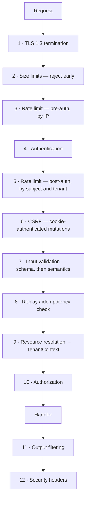
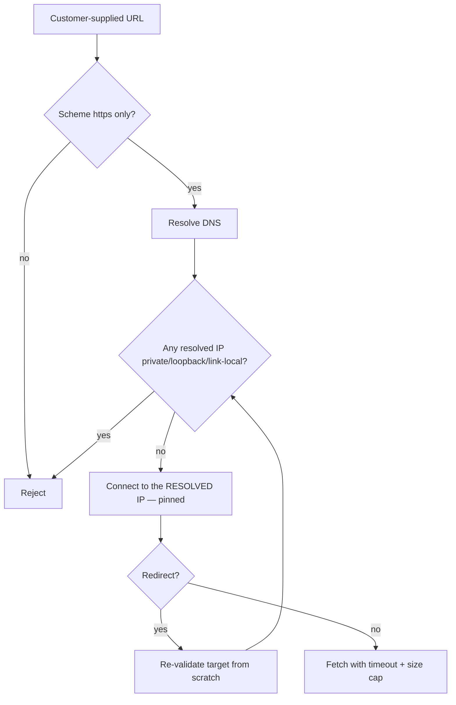

# API Security

> **Status:** v1.0 — complete. New in Phase 9.
> **The API is the only surface untrusted clients reach directly.** Every control here assumes the caller is hostile, the input is malformed, and the response will be read by someone who should not see it.

## Overview

**Business purpose.** ContentOS exposes a browser application, a public REST API, inbound webhooks from CMS platforms, and outbound fetches of arbitrary web pages. Each is an entry point an attacker can reach without credentials, and the last one is a request the platform makes *on the attacker's behalf* — a materially different risk.

**Technical purpose.** Specify the request pipeline controls: what is checked, in what order, what is returned on failure, and what is never returned under any circumstance.

**Values live elsewhere; rationale lives here.** Rate limit numbers per plan are owned by `04-platform/rate-limiting.md`. This document specifies why limits exist, which dimensions they must cover, and what happens when they are exceeded.

## Responsibilities

- Request pipeline ordering and enforcement points.
- Input validation and request size limits.
- Output filtering and error response policy.
- Replay protection and request idempotency.
- CSRF, CORS, and security headers.
- SSRF prevention for outbound fetches.
- File upload validation.
- API versioning security.

## Non-responsibilities

| Not owned | Owner |
|---|---|
| Credential verification | `authentication.md` |
| Permission evaluation | `authorization.md` |
| Rate limit values per plan | `04-platform/rate-limiting.md` |
| Event handler idempotency | `13-event-platform/idempotency.md` |
| Tenant context establishment | `tenant-isolation.md` |
| Model output safety | `08-ai-platform/guardrails.md` |

## The request pipeline



**Ordering is a security property, not a style choice.** Three placements carry weight:

**Size limits precede everything** because a 500 MB body must be rejected before it is buffered, parsed, or authenticated. A pipeline that authenticates first has already read the payload into memory, and unauthenticated attackers can exhaust it.

**Rate limiting appears twice.** Pre-auth by IP protects the authentication endpoints themselves — credential stuffing and enumeration happen without valid credentials. Post-auth by subject and tenant enforces fair use and catches a compromised account. Either alone leaves a gap.

**Authorization is last, immediately before the handler**, because it needs the resolved resource to determine the tenant (`tenant-isolation.md`). Placing it earlier would force it to trust a client-supplied tenant.

## Input validation

**Schema validation, then semantic validation. Both mandatory.**

| Layer | Checks | On failure |
|---|---|---|
| Schema | Types, required fields, formats, enums, bounds | 400 with field paths |
| Semantic | Referential existence, state validity, cross-field rules | 400 or 409, no internals |

```ts
const CreateArticleRequest = z.object({
  projectId: z.string().uuid(),
  title: z.string().min(1).max(300),
  articleType: z.enum(['guide', 'listicle', 'comparison', 'how-to']),
  wordCount: z.number().int().min(300).max(10_000),
}).strict();          // unknown keys REJECTED
```

**`.strict()` is mandatory on every request schema.** Silently ignoring unknown keys means a client sending `tenantId`, `role`, or `credits` gets no error — and any code that later reads the raw body instead of the parsed object receives attacker-controlled fields. Rejecting unknown keys makes mass-assignment structurally impossible.

**Every string has a maximum length.** An unbounded string is a memory-exhaustion vector and, once it reaches a model, a prompt-injection surface with no size ceiling (`threat-model.md`).

**Validation happens before authorization**, so malformed input never reaches resource resolution. It happens *after* authentication, so validation errors are not an unauthenticated probe of the API's internal shape.

**Identifiers are validated as UUIDs before use.** A non-UUID path parameter is rejected at the schema layer and never becomes a query parameter — removing injection through identifier fields as a category.

## Request size limits

| Limit | Value | Enforced at |
|---|---|---|
| JSON body | 1 MB | Edge, pre-parse |
| Multipart upload | 25 MB | Edge, streaming |
| URL length | 2 KB | Edge |
| Header total | 16 KB | Edge |
| Array elements | 1,000 per field | Schema |
| Object nesting depth | 10 | Parser |

**Nesting depth is limited because JSON parsers are recursive.** A deeply nested document exhausts the stack and crashes the process before any application code runs — a denial of service requiring one small request.

**Array element caps prevent amplification.** An endpoint accepting `keywords[]` without a cap turns one request into 100,000 provider lookups, which is both a cost attack and a rate-limit bypass against the provider.

## Replay protection and idempotency

**Two distinct mechanisms for two distinct problems.**

| | Webhook replay protection | Request idempotency |
|---|---|---|
| Threat | An attacker resends a captured signed webhook | A client retries after a timeout |
| Mechanism | Timestamp window + nonce | Client-supplied `Idempotency-Key` |
| Window | 5 minutes | 24 hours |
| Duplicate | **Rejected** | **Returns the original response** |

**Webhook signature verification requires all three parts.** A signature alone proves authenticity, not freshness — a captured webhook stays valid forever. The signed payload must include a timestamp, the timestamp must be within 5 minutes, and the nonce must be unused:

```ts
verifyHmacSha256(rawBody, signature, secret);   // timing-safe
assert(Math.abs(now - timestamp) < 5 * 60_000);
assert(await nonceStore.claim(nonce, ttl));     // atomic, single-use
```

**The signature is computed over the raw body**, before JSON parsing. Re-serializing changes byte order and whitespace, so a signature computed over parsed-then-restringified content fails for legitimate senders and — worse — can be made to pass for a modified payload under some serializers.

**Request idempotency returns the original response, including its status.** A client retrying a `POST /runs` after a network timeout receives the first run's result, not a second run. The key, request fingerprint, and response are stored for 24 hours; **the same key with a different request body is a 422**, because the client has a bug that would otherwise silently return an unrelated response.

**This is API-layer idempotency, distinct from event-handler idempotency** (`13-event-platform/idempotency.md`). Both prevent duplicate effects; they operate on different boundaries with different keys.

## CSRF

| Auth method | CSRF risk | Control |
|---|---|---|
| **Session cookie** | **Yes** | `SameSite=Lax` + double-submit token on unsafe methods |
| Bearer token | No | Not automatically attached by browsers |
| API key | No | Same |

**`SameSite=Lax` alone is not sufficient.** It blocks cross-site `POST` but permits top-level `GET` navigation, and it depends on browser behaviour the platform does not control. The double-submit token — a value present in both a cookie and a header, compared server-side — does not rely on browser policy.

**Only cookie-authenticated requests are CSRF-checked.** Applying the check to bearer-token requests would break every API client for no benefit; the browser never attaches those automatically.

**State-changing operations never use `GET`.** A `GET` that mutates is reachable by an image tag and is exempt from preflight.

## CORS

```ts
const corsPolicy = {
  origin: allowlist,                 // explicit; NEVER reflected, NEVER '*'
  credentials: true,
  methods: ['GET', 'POST', 'PATCH', 'DELETE'],
  allowedHeaders: ['Content-Type', 'Authorization', 'Idempotency-Key', 'X-CSRF-Token'],
  maxAge: 600,
};
```

**Origin reflection is prohibited.** Echoing the request's `Origin` header with `credentials: true` grants every site on the internet authenticated cross-origin access — a total bypass that looks like a working configuration in every test.

**`*` is incompatible with `credentials: true`** and browsers reject the combination, but the intent behind reaching for it — "allow any origin" — is what must be refused.

## SSRF

**This is the platform's most under-appreciated risk.** ContentOS fetches competitor pages, calls customer-configured CMS endpoints, and delivers outbound webhooks — all to URLs a customer supplies.



| Control | Rule |
|---|---|
| Scheme | `https` only — no `http`, `file`, `gopher`, `ftp` |
| Address blocklist | RFC1918, loopback, link-local (**169.254.169.254**), multicast, IPv6 ULA |
| DNS rebinding | Connect to the **resolved and validated IP**, not by re-resolving the hostname |
| Redirects | Maximum 3, **each re-validated fully** |
| Timeout | 10 s connect, 30 s total |
| Response cap | 10 MB, streamed and truncated |
| Egress | Dedicated egress path with no access to internal services |

**Validate-then-connect-to-the-resolved-IP is the control that defeats DNS rebinding.** Validating a hostname and then handing the hostname to an HTTP client re-resolves it — and an attacker-controlled DNS server returns a public IP on the first lookup and `169.254.169.254` on the second. The gap between check and use is the entire vulnerability.

**`169.254.169.254` is named explicitly** because it is the cloud metadata endpoint, and reaching it typically returns instance credentials. It is the single highest-value SSRF target in any cloud deployment.

**Every redirect is re-validated from scratch.** A permitted URL redirecting to `http://127.0.0.1:6379` reaches Redis if only the initial URL was checked.

**Outbound fetches run from an egress path with no route to internal services**, so a validation bypass still cannot reach the database, Redis, or another service. Defense in depth applied to the control most likely to have a gap.

## File upload validation

| Control | Rule |
|---|---|
| Size | 25 MB, enforced while streaming |
| Type | **Magic-byte detection**, never the supplied `Content-Type` or extension |
| Allowed | Images (JPEG, PNG, WebP, GIF), documents (PDF, DOCX, CSV, MD) |
| Filename | Discarded; a server-generated key is used |
| Storage | Tenant-prefixed R2 key (`tenant-isolation.md`) |
| Serving | `Content-Disposition: attachment`, separate origin, no execution |
| Scanning | Malware scan before the object becomes readable |

**The declared `Content-Type` is attacker-controlled and is never trusted.** A file claiming `image/png` may be an HTML document with a script payload; magic-byte inspection reads what the file actually is.

**Filenames are discarded entirely**, removing path traversal, null-byte tricks, and double-extension attacks in one step rather than through escaping.

**Uploads are served from a separate origin** so that a stored-XSS payload executes outside the application's origin and cannot reach session cookies.

## Output filtering

**Responses are constructed from explicit projections, never by serializing an entity.**

```ts
function toArticleResponse(a: Article): ArticleResponse {
  return { id: a.id, title: a.title, status: a.status, updatedAt: a.updatedAt };
  // internalScore, providerMetadata, tenantId, deletedAt are NOT present
}
```

**Serializing a database entity leaks by default.** Every column added later appears in the response automatically — internal scores, provider metadata, soft-delete flags, and eventually something that should never have been public. An explicit projection means new fields are private until someone adds them deliberately.

**Errors from downstream systems are never forwarded.** A provider's error body may contain the request it received, including the API key.

## Error response policy

```ts
interface ErrorResponse {
  error: { code: string; message: string; requestId: string; details?: FieldError[] };
}
```

| Never in a response | Why |
|---|---|
| Stack traces | Reveal file paths, framework versions, code structure |
| SQL errors or fragments | Reveal schema and confirm injection reachability |
| Provider errors verbatim | May contain credentials or internal endpoints |
| Internal service names, hostnames, IPs | Map the internal topology |
| Secrets, tokens, keys | Direct compromise |
| Whether a resource exists in another tenant | Enumeration (`authorization.md`) |

**`requestId` is how support recovers detail without disclosure.** The full error — stack, query, provider response — is logged against that id; the client receives a stable code, a safe message, and the id to quote.

**Unhandled exceptions return a generic 500 with a `requestId` and nothing else.** The error boundary is the last control, and it must assume the exception contains anything at all.

**`details` carries field paths and validation codes only** — `"body.wordCount: must be ≤ 10000"` — never the value received, which may be sensitive and would be echoed into logs.

## Security headers

| Header | Value | Prevents |
|---|---|---|
| `Strict-Transport-Security` | `max-age=63072000; includeSubDomains; preload` | Downgrade |
| `Content-Security-Policy` | `default-src 'self'`; no `unsafe-inline`; nonce-based scripts | XSS |
| `X-Content-Type-Options` | `nosniff` | MIME confusion |
| `X-Frame-Options` | `DENY` | Clickjacking |
| `Referrer-Policy` | `strict-origin-when-cross-origin` | URL leakage |
| `Permissions-Policy` | Deny camera, microphone, geolocation | Capability abuse |
| `Cache-Control` | `no-store` on authenticated responses | Shared-cache leakage |

**`no-store` on authenticated responses is the one most often missed.** Without it, an intermediary or browser cache may retain tenant data and serve it to a different session on a shared machine.

**CSP uses nonces, not `unsafe-inline`.** An allowlist containing `unsafe-inline` provides no XSS protection at all.

## API versioning security

**Versions are additive; a deprecated version is removed, never quietly repaired.** Security fixes are backported to every supported version — an unpatched old version is an open door, and clients pinned to it have no signal.

**A version is retired on a published schedule**, and retirement returns `410 Gone` with an upgrade reference rather than falling back to the current version. Silently routing a v1 call to v2 applies v2's semantics to a client expecting v1 — including authorization semantics.

**Unknown versions are rejected**, never defaulted. Defaulting to the newest lets an attacker probe for a version with weaker checks.

## Business rules

1. **Size limits precede authentication.**
2. **Rate limiting runs pre-auth by IP and post-auth by subject and tenant.**
3. **Authorization is last**, after resource resolution.
4. **Every request schema is `.strict()`**; unknown keys are rejected.
5. **Every string has a maximum length.**
6. **Webhooks require signature, timestamp window, and single-use nonce**; signatures are verified over the raw body.
7. **Idempotency keys return the original response**; a reused key with a different body is a 422.
8. **CSRF is enforced on cookie-authenticated mutations only.**
9. **CORS origins are an explicit allowlist**; reflection is prohibited.
10. **SSRF validation resolves DNS, blocks private ranges, connects to the validated IP, and re-validates every redirect.**
11. **File types are detected by magic bytes**; filenames are discarded.
12. **Responses are explicit projections**, never serialized entities.
13. **Stack traces, SQL errors, provider internals, and secrets never appear in responses.**
14. **Unhandled exceptions return a generic 500 with a `requestId`.**
15. **Unknown API versions are rejected, never defaulted.**

## Interfaces

```ts
interface RequestPipeline {
  enforceSize(req: RawRequest): void;
  authenticate(req: RawRequest): Promise<Subject>;
  validate<T>(schema: Schema<T>, body: unknown): T;
  checkIdempotency(key: string | null, fingerprint: string): Promise<CachedResponse | null>;
  authorize(subject: Subject, action: Action, resource: ResourceRef): Promise<void>;
  filterOutput<T, R>(projection: (t: T) => R, entity: T): R;
}

interface SafeUrlFetcher {
  fetch(url: string, ctx: TenantContext, options: FetchOptions): Promise<FetchResult>;
}
```

**`SafeUrlFetcher` is the only egress path for customer-supplied URLs**, and direct HTTP-client use with such a URL is rejected at CI by a lint rule. A single audited chokepoint is what makes SSRF controls verifiable — scattered fetches cannot be reviewed.

## Database impact

**No new tables and no schema change.** Idempotency records and webhook nonces live in Redis with TTLs matching their windows. Rate limit counters are Redis-backed (`04-platform/rate-limiting.md`).

## Security

- TLS 1.3 minimum; TLS 1.2 permitted only for legacy CMS webhook senders, with weak ciphers disabled (`encryption.md`).
- Raw request bodies are **never logged**; only the schema-validated projection is, minus sensitive fields.
- `Authorization` headers, cookies, API keys, and presigned URLs are **redacted in logs, traces, and error reports**.
- Webhook secrets are per-integration, rotatable, and stored via `secrets-management.md`.
- Rate limit rejections and repeated validation failures are security signals (`security-observability.md`).

## Performance

| Control | Cost |
|---|---|
| Size limits | Edge, pre-buffer; negligible |
| Schema validation | **p95 < 2 ms** for typical bodies |
| Rate limit check | One atomic Redis op; **p95 < 2 ms** |
| Idempotency lookup | One Redis read; **p95 < 3 ms** |
| SSRF validation | One DNS resolution, cached 60 s |
| Output projection | In-memory; negligible |

## Observability

- **Metrics:** `http_requests_total{route,status}`, `validation_failures_total{route,field}`, `rate_limit_rejections_total{scope}`, `csrf_failures_total`, `webhook_signature_failures_total{source}`, `webhook_replay_rejections_total`, `ssrf_blocks_total{reason}`, `upload_rejections_total{reason}`, `idempotency_replays_total`, `error_responses_total{code}`.
- **Logging:** request id, route, status, subject id, tenant id, duration — never bodies, headers, or credentials.
- **Alerts:** `ssrf_blocks_total` non-zero (**page** — someone is probing internal ranges); `webhook_signature_failures_total` spike (forgery attempt or a rotated secret not propagated); `csrf_failures_total` spike (attack or a broken client); validation failure spike on one route (fuzzing); 500 rate above baseline.

## Cross references

- `authentication.md` — credential verification and session handling
- `authorization.md` — permission evaluation and 404-versus-403
- `tenant-isolation.md` — context resolution and object key construction
- `secrets-management.md` — webhook secrets and API credentials
- `encryption.md` — TLS configuration
- `threat-model.md` — SSRF, CSRF, replay, injection, upload abuse
- `security-observability.md` — signals and correlation
- `04-platform/rate-limiting.md` — limit values per plan
- `13-event-platform/idempotency.md` — the distinct event-handler mechanism
- `06-api/` — endpoint definitions these controls apply to
