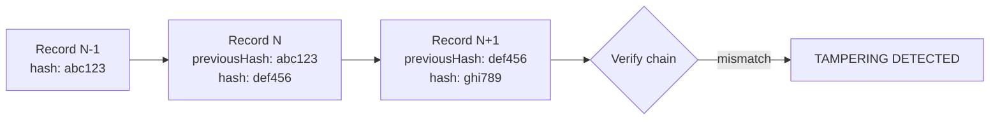

# Audit

> **Status:** v1.0 — complete. New in Phase 9.
> **Audit is legal evidence, not debugging output.** It is append-only, tamper-evident, written in the same transaction as the action it records, and it survives everything — including the erasure of the subject it names.

## Overview

**Business purpose.** When a customer asks who published that article, when an auditor asks who could access production data last March, or when an incident asks whether an attacker escalated privileges, the answer must be authoritative rather than reconstructed. Logs expire and are sampled; metrics are aggregates. Only the audit trail is evidence.

**Technical purpose.** Specify which security-relevant actions must be recorded, the mandatory record shape, how immutability is enforced at the database level, how tampering is detected, and how retention coexists with erasure obligations.

**The boundary with Phase 4.** `04-platform/audit-logs.md` owns the `audit_log` table and the synchronous write mechanism. **This document owns the security semantics**: what must be audited, the immutability guarantees, tamper evidence, and evidentiary quality. Neither restates the other.

## Three distinct streams

The most common failure is treating these as one system with different verbosity.

| | **Operational logs** | **Metrics** | **Audit records** |
|---|---|---|---|
| Answers | What happened in the code | How much, how fast | **Who did what, to what, with what result** |
| Written | Asynchronously, fire-and-forget | In-process counters | **Synchronously, in the action's transaction** |
| Mutable | Rotated, sampled, dropped | Aggregated, downsampled | **Never** |
| Retention | 30 days | 13 months | **7 years** |
| Sampling | Yes | Yes | **Never** |
| Loss tolerance | Acceptable | Acceptable | **Zero** |
| Audience | Engineers | Engineers, operators | **Auditors, courts, customers** |

**Audit records are written synchronously, inside the transaction that performs the action.** This is the property that separates them from everything else. An asynchronous audit write can be lost, delayed past the incident that needs it, or fail while the action succeeds — producing an action with no record, which is indistinguishable from a cover-up.

**Audit is deliberately not an event.** Events are at-least-once, eventually delivered, and can be dead-lettered (`13-event-platform/`). Every one of those properties is disqualifying here: a dead-lettered audit record is a missing record. The action and its audit commit together or neither happens.

**A failed audit write fails the action.** If the record cannot be written, the transaction rolls back and the operation returns an error. An unauditable action does not proceed — the one place where the platform prefers unavailability to incompleteness.

## The record

```ts
interface AuditRecord {
  readonly auditId: string;          // UUIDv7 — time-ordered
  readonly tenantId: string | null;  // null ONLY for pre-tenant actions
  readonly organizationId: string;
  readonly actorId: string;          // user, service, or operator identity
  readonly actorKind: 'user' | 'api-key' | 'service' | 'operator';
  readonly correlationId: string;    // links to the originating request
  readonly timestamp: Date;          // server clock, never client-supplied
  readonly action: AuditAction;      // enumerated, never free text
  readonly target: AuditTarget;      // what was acted upon
  readonly result: 'success' | 'failure' | 'denied';
  readonly reason: string;           // why, especially for denials
  readonly context: AuditContext;    // IP, user agent, session, step-up
  readonly previousHash: string;     // tamper-evidence chain
  readonly hash: string;             // SHA-256 over this record
}

interface AuditTarget {
  readonly kind: string;             // 'article' | 'role-binding' | 'secret' | ...
  readonly id: string;
  readonly tenantId: string | null;
}
```

**All ten mandated fields are present and non-optional.** `tenantId` is nullable for exactly one reason: authentication happens before a tenant is known. A failed login has an actor and no tenant, and forcing a placeholder would be a fabrication in an evidentiary record.

**`action` is an enumerated constant, never free text.** Free-text actions cannot be queried reliably — `"user.role.changed"`, `"role_change"`, and `"Changed role"` all appear within a year, and no audit query finds all three. The enumeration is compiled in and additions are code review.

**`timestamp` is the server clock.** A client-supplied timestamp is attacker-controlled, and an evidentiary record ordered by attacker-controlled time is worthless.

**`reason` is mandatory including on success**, because a successful privileged action needs a recorded justification as much as a denial does. For denials it carries the precise `auditDetail` from `authorization.md` — the detail deliberately withheld from the caller.

**Records carry identifiers, never content.** The audit trail records that an article was exported, not the article. This keeps it bounded, keeps it out of the way of erasure obligations, and prevents the audit log from becoming the platform's highest-value data target.

## What must be audited

| Category | Actions |
|---|---|
| **Authentication** | Login success/failure, logout, MFA challenge and result, step-up, session revocation, password change, token refresh reuse detection |
| **Authorization** | Every denial; sensitive-action allows; cross-tenant attempts |
| **Permission changes** | Role binding created, modified, revoked, expired |
| **Role assignments** | Grant, revoke, **self-grant**, scope change |
| **Workspace lifecycle** | Create, rename, transfer, suspend, delete, restore |
| **Secret access** | Every read of a platform secret; break-glass retrieval; rotation; revocation |
| **Replay execution** | Start, pause, resume, abort — with scope and target groups (ADR-028) |
| **DLQ intervention** | Inspect, replay, resolve, discard — with the mandatory note (ADR-027) |
| **Provider configuration** | Integration connected, credential rotated, endpoint changed, disconnected |
| **Billing** | Plan change, payment method change, cancellation, credit adjustment |
| **Exports** | Every `:export` action, with scope and record count |
| **Deletion** | Every delete and soft-delete; erasure requests; cryptographic erasure |
| **Administration** | Operator sessions, `contentos_operator` connections, cross-tenant operations, key destruction |

**Denials are audited more comprehensively than allows.** Every denial is recorded; only *sensitive* allows are. Auditing every successful read would produce billions of records that bury the signal — while denials are rare, and a pattern of them is exactly what an investigation looks for.

**Exports are audited with record counts**, because "exported 3 articles" and "exported 40,000 articles" are the same action and entirely different events. Count is the signal that distinguishes normal use from exfiltration (`threat-model.md`).

**Self-grants are audited and alerted**, per `rbac.md`. An organization Owner granting themselves workspace access is legitimate and must never be silent.

## Immutability enforcement

**Append-only is enforced in the database, not by convention.**

```sql
REVOKE UPDATE, DELETE, TRUNCATE ON audit_log FROM contentos_app;
GRANT INSERT, SELECT ON audit_log TO contentos_app;

CREATE OR REPLACE FUNCTION reject_audit_mutation() RETURNS trigger AS $$
BEGIN
  RAISE EXCEPTION 'audit_log is append-only: % rejected', TG_OP;
END;
$$ LANGUAGE plpgsql;

CREATE TRIGGER audit_log_immutable
  BEFORE UPDATE OR DELETE OR TRUNCATE ON audit_log
  FOR EACH STATEMENT EXECUTE FUNCTION reject_audit_mutation();
```

**Three independent layers, because any one can be undone.**

| Layer | Defeats |
|---|---|
| Revoked privileges | Application code attempting mutation |
| Trigger | A privileged role, including the table owner |
| Hash chain | Direct storage manipulation, superuser, backup tampering |

**The trigger exists because privilege revocation is not enough.** The migrator role owns the table and could `UPDATE` without it; a `BEFORE ... FOR EACH STATEMENT` trigger rejects regardless of role, and dropping it is itself a schema change visible in migration review.

**Applications hold no `UPDATE` grant on `audit_log` at all.** There is no correction path, no "fix a typo" path, no soft-delete flag. A record written in error stays, and a compensating record is appended.

## Tamper evidence



**Each record's hash covers its own content plus the previous record's hash**, chained per tenant. Modifying any record breaks every subsequent hash; deleting one breaks the link at the deletion point.

**Chaining is per tenant, not global.** A global chain would serialize every audit write across the entire platform — one insert at a time, a hard throughput ceiling on every audited action. Per-tenant chains parallelize across tenants while remaining verifiable within one.

**The chain detects tampering; it does not prevent it.** Someone with database superuser access can rewrite records *and* recompute the chain. The mitigations are that superuser access is break-glass and itself audited (`row-level-security.md`), and that **chain head hashes are periodically anchored to append-only external storage** — an attacker would have to compromise both systems, and the anchored value proves the trail's state at each anchor point.

**Verification runs daily and on demand**, walking each tenant's chain and comparing anchors. A verification failure is a security incident, not a data-quality finding.

## Erasure and retention

**The apparent conflict:** GDPR grants a right to erasure; audit records must never be deleted.

**The resolution is that audit records contain no personal data to erase.** They carry `actorId` — an opaque UUID — never a name, email, or IP-derived identity beyond the `context` block. When a user is erased, the `users` row is destroyed and the audit trail retains an identifier that no longer resolves to a person.

**This is the design decision that makes both obligations satisfiable**, and it is why the "identifiers, never content" rule is stated as a hard constraint rather than a preference. An audit log containing emails would force a choice between compliance and evidence.

**`context` fields that are personal data — IP address, user agent — are erasable in a bounded way**: they are stored in a separate, referenced structure rather than in the immutable record, so removing them does not modify or re-hash an audit record. The record retains the reference; the referenced detail may be redacted with a redaction record appended.

| Concern | Rule |
|---|---|
| Retention | **7 years** minimum |
| Storage | Monthly partitions; archived to WORM object storage after 90 days |
| Removal | **Partition drop after archival only** — never a row delete |
| Legal hold | Blocks archival and partition drop for affected tenants (`compliance.md`) |
| Erasure | Never removes audit records; erases the referenced identity |

**Partition drop is the only removal mechanism**, and it operates on archived data at the retention boundary. It cannot target a record, a tenant, or an action — which is precisely why it is safe to permit.

## Access control

| Scope | Permission | Notes |
|---|---|---|
| Own organization's audit | `audit:read` | RLS-scoped to the tenant |
| Cross-tenant audit | `platform:audit` | Operators only |
| Export | `audit:read` + export capability | Rate-limited; itself audited |

**Reading the audit log is an audited action.** Without this, an operator could review every tenant's activity leaving no trace — defeating the trail's purpose at exactly the point it matters.

**`audit_log` is RLS-protected under the standard workspace policy** (`row-level-security.md`), so tenant-scoped readers cannot reach another tenant's records even with `audit:read`.

## Business rules

1. **Audit is append-only.** No `UPDATE`, no `DELETE`, no application grant for either.
2. **Records are written synchronously, in the action's transaction.**
3. **A failed audit write fails the action.**
4. **Audit is never an event** and is never sampled.
5. **Every record carries all ten mandatory fields.**
6. **`action` is enumerated**, never free text.
7. **`timestamp` is the server clock.**
8. **Records carry identifiers, never content or PII.**
9. **Every denial is audited; sensitive allows are audited.**
10. **Exports record scope and count.**
11. **Immutability is enforced by revoked privileges, a trigger, and a hash chain.**
12. **Hash chains are per tenant** and anchored externally.
13. **Chain verification failure is a security incident.**
14. **Erasure never removes audit records**; it removes the referenced identity.
15. **Removal is by partition drop after archival only.**
16. **Reading the audit log is itself audited.**
17. **Corrections are appended, never applied in place.**

## Interfaces

```ts
interface AuditWriter {
  record(tx: Transaction, entry: NewAuditRecord): Promise<string>;
}

interface AuditReader {
  query(ctx: TenantContext, q: AuditQuery): Promise<Page<AuditRecord>>;
  timeline(ctx: TenantContext, correlationId: string): Promise<AuditRecord[]>;
  verifyChain(tenantId: string, from: Date, to: Date): Promise<ChainVerification>;
  export(ctx: TenantContext, q: AuditQuery, actor: string): Promise<ExportHandle>;
}

type ChainVerification =
  | { valid: true; recordCount: number; headHash: string }
  | { valid: false; brokenAt: string; expectedHash: string; actualHash: string };
```

**`record` requires a `Transaction` handle** — the same structural technique as the event publisher (`13-event-platform/transactional-outbox.md`). Auditing outside the action's transaction is unrepresentable, so the atomicity guarantee cannot be bypassed by a caller who forgot.

**There is no `update` and no `delete` method.** The interface offers no path to mutation, so a caller cannot reach for one.

**`timeline` is the investigation primitive.** From one `correlationId` it returns every audited action caused by a single request — across services, tenants, and asynchronous work — reconstructing an incident in one query rather than by joining logs (`13-event-platform/observability.md`).

## Database impact

**No new tables and no schema change.** Audit uses `audit_log` as defined in Phase 3 and Phase 4 (`03-database/tables.md`, `04-platform/audit-logs.md`).

This document adds **enforcement objects**, not schema: the privilege revocation, the immutability trigger, and the hash-chain columns' verification. These ship as ordinary migrations (`03-database/migrations.md`).

| Aspect | Definition |
|---|---|
| Partitioning | Monthly by `timestamp` |
| Indexes | `(tenant_id, timestamp DESC)`; `(correlation_id)`; `(actor_id, timestamp DESC)`; `(action, timestamp DESC)` |
| RLS | Enabled, standard workspace policy |
| Grants | `INSERT`, `SELECT` only for `contentos_app` |

**Four indexes on an append-only table is deliberate.** Write amplification is acceptable because audit reads are investigations — performed rarely, under time pressure, where a slow query is a real cost. Optimizing this table for writes would be optimizing the wrong side.

## Security

- `audit_log` is **RLS-protected**; cross-tenant reads require `platform:audit` and are audited.
- **Chain head hashes are anchored to append-only external storage** on a schedule.
- Audit records contain **no secrets** — secret access records the secret id and version, never the value (`secrets-management.md`).
- Backups of `audit_log` are encrypted and retained for the full audit retention period (`encryption.md`).
- The immutability trigger and privilege grants are **verified by automated conformance tests**, like RLS policies (`row-level-security.md`).
- Reference `compliance.md` for legal hold and evidentiary export.

## Performance

| Operation | Target |
|---|---|
| Write | **p95 < 5 ms** — one insert plus hash computation |
| Hash computation | SHA-256 over a small record; **< 0.1 ms** |
| Chain head lookup | Cached per tenant; **< 1 ms** |
| Query — indexed | p95 < 200 ms |
| Chain verification | Background; bounded rate |

**The audit write is on the critical path of every audited action**, which is why it is a single insert with an in-memory hash rather than anything requiring coordination. Per-tenant chains keep the head lookup contention-free across tenants.

## Observability

- **Metrics:** `audit_records_total{action,result}`, `audit_write_failures_total` (**must be zero**), `audit_write_duration_seconds`, `chain_verification_total{outcome}`, `audit_reads_total{scope}`, `audit_exports_total{actor}`, `legal_holds_active` (gauge).
- **Logging:** audit id, action, result — the record itself is the durable artifact, so logs carry only a pointer.
- **Alerts:** `audit_write_failures_total` non-zero (**page — invariant breach**: actions are failing because they cannot be audited, or worse, proceeding unaudited); chain verification failure (**page — tampering**); `platform:audit` cross-tenant read (**page** — always); export volume above baseline (exfiltration); any `contentos_operator` session (**page**); self-grant recorded (review).

**A chain verification failure pages as a suspected compromise, not a data-quality issue.** The chain breaks for exactly two reasons: someone modified the trail, or storage corrupted. Both require immediate investigation, and treating the second as likely is how the first goes unnoticed.

## Cross references

- `04-platform/audit-logs.md` — the `audit_log` table and write mechanism
- `authorization.md` — `auditDetail` on denials
- `rbac.md` — permission and self-grant records
- `authentication.md` — authentication event records
- `secrets-management.md` — secret access records
- `encryption.md` — key operation records; audit backup encryption
- `row-level-security.md` — operator sessions; conformance testing
- `tenant-isolation.md` — audit isolation and cross-tenant access
- `compliance.md` — retention, legal hold, erasure, evidentiary export
- `security-observability.md` — correlation and incident timelines
- `incident-response.md` — audit as the investigation record
- `13-event-platform/replay.md` · `dead-letter-queue.md` — audited interventions (ADR-027, ADR-028)
- `03-database/tables.md` — the `audit_log` schema
