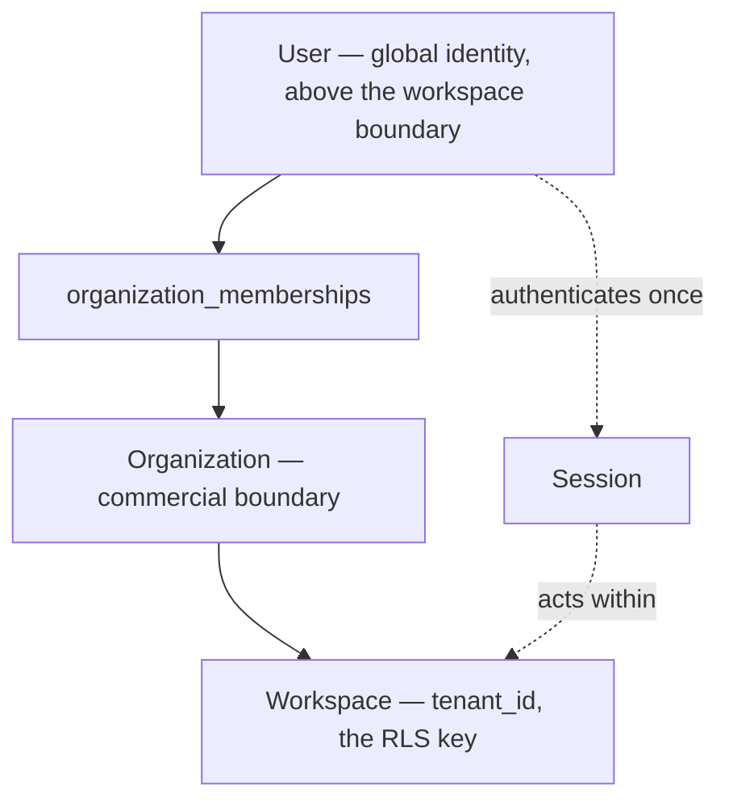
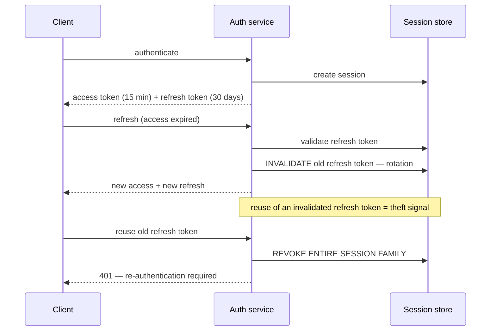
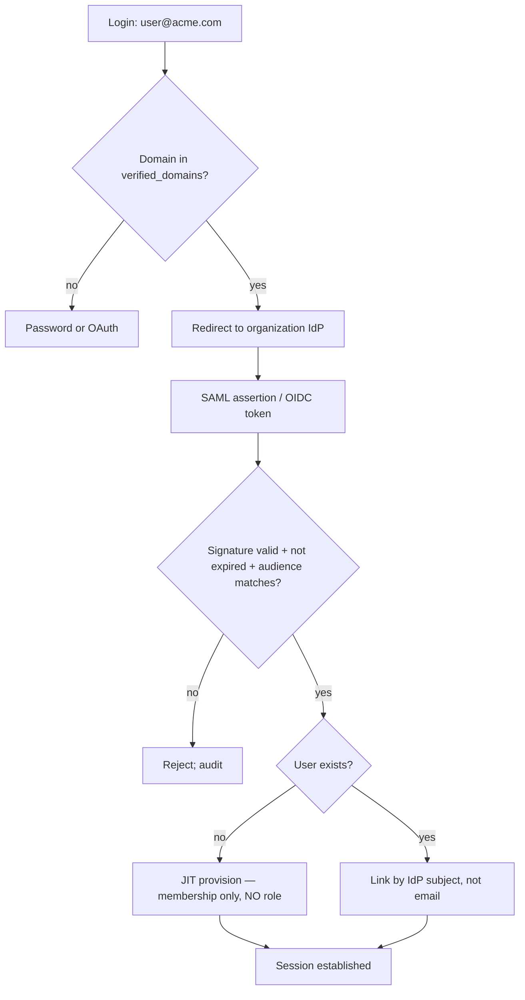

# Authentication

> **Status:** v1.0 — complete. New in Phase 9.
> **Authentication answers "who is this?" and stops there.** It never answers "may they?" — no token in this platform carries a permission, a role, or a workspace grant.

## Overview

**Business purpose.** Every request that reaches ContentOS must be attributable to a real subject: a person, an integration, or an internal service. Enterprise buyers additionally require that identity is governed centrally — SSO through their IdP, MFA enforced by policy, and immediate revocation when someone leaves. Authentication is the control that makes those commitments deliverable.

**Technical purpose.** Establish subject identity from a credential, maintain sessions, manage token lifecycle, and federate to external identity providers — producing an authenticated `Subject` that the authorization layer then evaluates.

**Better Auth is the implementation** (ADR-012), reached through the Provider Layer like any other external dependency (`09-integrations/`). This document specifies the platform's requirements on it, not its API.

## Responsibilities

- Subject identity establishment and credential verification.
- Session creation, refresh, and termination.
- Token lifecycle: issuance, rotation, revocation.
- Multi-factor authentication.
- Federation: OAuth providers and enterprise SSO.
- API key lifecycle for programmatic access.
- Service-to-service authentication.

## Non-responsibilities

| Not owned | Owner |
|---|---|
| **Whether a subject may do anything** | `authorization.md` |
| Roles and permission sets | `rbac.md` |
| Tenant context establishment | `tenant-isolation.md` |
| Data isolation | `row-level-security.md` |
| Rate limiting on auth endpoints | `api-security.md` |
| Credential storage for *providers* | `secrets-management.md` |
| The `users` table definition | `03-database/tables.md` |

## The separation rule

**A session establishes identity. It never carries authority.**

```ts
interface Subject {
  subjectId: string;            // user id, api key id, or service id
  kind: 'user' | 'api-key' | 'service';
  authenticatedAt: Date;
  method: AuthMethod;
  mfaSatisfied: boolean;
  sessionId: string | null;     // null for API keys and services
  // NO permissions. NO roles. NO workspace grants. NO tenantId.
}

type AuthMethod =
  | 'password' | 'oauth' | 'saml' | 'oidc'
  | 'api-key' | 'service-token' | 'recovery-code';
```

**Permissions are never embedded in a token, and this is a deliberate cost.** Embedding them would let authorization skip a lookup on every request — a real performance gain. It is refused because a token minted before a permission change carries stale authority until it expires. An administrator who revokes a colleague's access expects it to take effect now, not in fifteen minutes.

**Permissions are therefore evaluated per request against current state** (`authorization.md`). Revocation is immediate because there is nothing cached to invalidate.

**`Subject` deliberately carries no `tenantId`.** A user belongs to many workspaces; the tenant is determined by the *resource being addressed*, then checked against the subject's grants. A tenant baked into the session would make workspace switching a re-authentication and, worse, would make the tenant a claim the client influences.

## Identity model



**A user is global and exists above the tenant boundary.** `users` is one of the five RLS exception tables (`row-level-security.md`) because one person may belong to several organizations, and identity cannot be scoped to a tenant it spans. This follows directly from ADR-017.

**Identity is never duplicated per organization.** One person, one `users` row, many memberships. Duplicating would fragment MFA enrolment, session revocation, and audit attribution across records that are the same human.

**Email is verified but is not the identity.** `users.id` is. Email changes; SSO subjects change when an IdP is reconfigured. Keying identity on either produces account takeover the day one of them is reused.

## Credential verification

| Method | Verification | Notes |
|---|---|---|
| **Password** | Argon2id, per-user salt | Only where SSO is not enforced |
| **OAuth** | Provider token exchange, `sub` claim | Google, Microsoft |
| **SAML** | Signed assertion, verified against IdP certificate | Enterprise |
| **OIDC** | ID token signature and claim validation | Enterprise |
| **API key** | SHA-256 comparison against stored hash | Programmatic |
| **Service token** | Short-lived, signed, audience-bound | Internal only |

**Argon2id with per-user salt, not bcrypt.** Argon2id is memory-hard, which raises the cost of GPU-parallel cracking by orders of magnitude against a stolen hash set. Parameters are tuned to ~100 ms verification on production hardware and re-tuned at each infrastructure change — a fixed parameter set silently weakens as hardware improves.

**Timing-safe comparison everywhere**, and failure responses are uniform: wrong password, unknown email, and disabled account return the same response in the same time. A distinguishable "unknown email" turns the login endpoint into an account enumeration oracle.

**Failed attempts are rate-limited per account and per source**, with exponential lockout (`api-security.md`). Per-account alone allows credential stuffing across many accounts from one source; per-source alone allows distributed attacks on one account.

## Sessions

```ts
interface Session {
  sessionId: string;            // opaque, 256-bit random
  userId: string;
  createdAt: Date;
  lastActiveAt: Date;
  absoluteExpiresAt: Date;      // hard ceiling, never extended
  idleExpiresAt: Date;          // sliding
  mfaSatisfiedAt: Date | null;
  ipAddress: string;
  userAgent: string;
  revokedAt: Date | null;
  revokedReason: SessionRevocationReason | null;
}

type SessionRevocationReason =
  | 'user-logout' | 'admin-revoked' | 'password-changed'
  | 'mfa-reset' | 'suspicious-activity' | 'sso-deprovisioned';
```

| Bound | Value | Rationale |
|---|---|---|
| Idle timeout | 7 days | Sliding; typical working rhythm |
| Absolute lifetime | 30 days | **Never extended** — bounds a stolen session |
| MFA re-verification | 12 hours for sensitive operations | Limits damage from an unattended device |
| Concurrent sessions | Unlimited, all enumerable and revocable | Multi-device is normal; visibility is the control |

**The absolute lifetime is the one that matters after a compromise.** A purely sliding session, refreshed by ordinary activity, never expires for an attacker who holds it — they simply keep using it. The absolute ceiling guarantees every session dies on a known schedule regardless of activity.

**Session identifiers are opaque random values, not JWTs.** An opaque id requires a server-side lookup, which means revocation is immediate. A self-contained JWT is valid until expiry no matter what the server decides — acceptable for a 60-second token, unacceptable for a 30-day session.

**Session tokens are delivered in `HttpOnly`, `Secure`, `SameSite=Lax` cookies**, unreadable by JavaScript, so an XSS flaw cannot exfiltrate the session (`api-security.md`).

**Password change, MFA reset, and SSO deprovisioning revoke every session for that user**, on the reasoning that all three are the actions a user takes when they believe they have been compromised.

## Token lifecycle

Programmatic clients use bearer tokens rather than cookies.



| Token | Lifetime | Format | Revocable |
|---|---|---|---|
| Access | 15 minutes | Signed JWT, identity claims only | No — expiry only |
| Refresh | 30 days | Opaque, single-use, rotating | Yes, immediately |
| Service | 5 minutes | Signed JWT, audience-bound | No — expiry only |

**Refresh token rotation with reuse detection is the core control.** Each refresh invalidates its predecessor. A token that has already been used is either a replay or a stolen copy — and since the platform cannot distinguish the legitimate holder from the thief, it revokes the entire family and forces re-authentication. Both parties are inconvenienced; only one of them is stopped.

**Access tokens are short *because* they cannot be revoked.** Fifteen minutes bounds the exposure of a leaked access token to fifteen minutes. Lengthening it to reduce refresh traffic trades a bounded compromise window for an unbounded one.

**Access tokens carry identity claims only** — subject, issued-at, expiry, audience. No permissions, no roles, no tenant (see the separation rule).

## Multi-factor authentication

| Factor | Support | Notes |
|---|---|---|
| **WebAuthn / passkeys** | Preferred | Phishing-resistant; origin-bound |
| **TOTP** | Supported | RFC 6238, 30-second window, ±1 step drift |
| **Recovery codes** | 10 single-use, shown once | Hashed at rest like passwords |
| SMS | **Not supported** | SIM-swap vulnerable |

**SMS is deliberately absent.** It is the most familiar second factor and the weakest: SIM-swap attacks are routine and require no technical sophistication. Offering it would let an organization believe it has MFA while holding a factor an attacker can obtain from a phone carrier.

**MFA enforcement is an organization policy, not a user preference.** An organization may require MFA for all members; enrolment is then mandatory before any workspace access. The policy lives on the organization because that is the commercial and governance boundary (ADR-017).

**Recovery codes are shown exactly once and stored hashed.** A recoverable recovery code is a password with a friendlier name.

**Step-up authentication** re-verifies MFA for sensitive operations regardless of session age: changing authentication settings, managing API keys, altering billing, viewing DLQ contents, or triggering replay. The current session proves who logged in twelve hours ago; step-up proves who is at the keyboard now.

## Federation



**Domain verification gates SSO.** An organization claims a domain, proves control via DNS TXT record, and only then may enforce SSO for it — recorded in `verified_domains`, an RLS exception table (`row-level-security.md`). Without proof of control, any organization could claim `gmail.com` and intercept logins.

**JIT provisioning creates the membership and nothing else.** A newly provisioned user has no role and therefore no permissions — default deny in its purest form. An administrator grants access explicitly (`rbac.md`). Auto-assigning a default role on JIT provisioning would mean anyone who can authenticate against the IdP obtains platform access automatically.

**Accounts link by IdP subject identifier, never by email.** Email is mutable and reassignable; when an employee leaves and their address is later reissued to a new hire, email-based linking hands the new person the old person's account.

**SSO deprovisioning revokes all sessions immediately.** When the IdP signals removal, sessions terminate rather than expiring naturally — the entire point of central identity governance for an enterprise buyer.

## API keys

```ts
interface ApiKey {
  id: string;
  keyPrefix: string;            // 'cos_live_a1b2c3' — first 12 chars, stored plain
  keyHash: string;              // SHA-256 of the full key
  workspaceId: string;          // scoped to ONE workspace
  createdBy: string;
  label: string;
  lastUsedAt: Date | null;
  expiresAt: Date | null;
  revokedAt: Date | null;
}
```

**The full key is shown once at creation and never retrievable.** Storage is a hash; a platform that can display an existing key can also leak every key in a database compromise.

**The prefix is stored in plaintext deliberately.** It lets an operator identify which key appeared in a log or a public repository without holding the secret, and it makes automated secret-scanning of public repositories actionable.

**SHA-256 is correct for API keys where Argon2id is correct for passwords.** API keys are 256-bit random values with no guessable structure, so brute force is infeasible regardless of hash speed; passwords are low-entropy and human-chosen, which is what makes a slow, memory-hard function necessary.

**Every key is scoped to exactly one workspace.** A key spanning workspaces would be a cross-tenant credential — precisely the object the isolation model exists to prevent.

**A key's permissions are the *intersection* of its declared scopes and the creating user's current permissions.** A key cannot exceed its creator's authority, and it shrinks when their authority shrinks. Without the intersection rule, an administrator could mint a key, be demoted, and leave behind a credential holding privileges they no longer possess.

## Service-to-service

**Zero trust: internal callers authenticate exactly like external ones.** Network position grants nothing; a compromised service inside the cluster is an attacker inside the cluster.

Service tokens are short-lived, signed, and **audience-bound** — a token minted for the AI Gateway is rejected by the Knowledge Platform. Without audience binding, a compromised low-privilege service could replay its token against a higher-privilege one.

Workers authenticate as services but receive **no elevated database privileges**; they use the RLS-enforced application role with `TenantContext` set per event (`tenant-isolation.md`).

## Business rules

1. **Authentication never grants authority.** No token carries permissions, roles, or grants.
2. **`Subject` carries no `tenantId`.**
3. **Identity is `users.id`**, never email or IdP subject.
4. **Passwords use Argon2id**; API keys use SHA-256; both compare timing-safely.
5. **Failure responses are uniform** in content and timing.
6. **Sessions have both idle and absolute expiry**; absolute is never extended.
7. **Session ids are opaque**, enabling immediate revocation.
8. **Refresh tokens rotate; reuse revokes the entire family.**
9. **Access tokens are 15 minutes** and are not revocable.
10. **SMS MFA is not supported.**
11. **MFA enforcement is an organization policy.**
12. **Step-up MFA is required for sensitive operations.**
13. **SSO requires a verified domain.**
14. **JIT provisioning grants membership only — never a role.**
15. **Accounts link by IdP subject, never email.**
16. **API keys are workspace-scoped and bounded by their creator's current permissions.**
17. **Internal services authenticate**; network position grants nothing.
18. **Every authentication event is audited** (`audit.md`).

## Interfaces

```ts
interface Authenticator {
  authenticate(credential: Credential): Promise<AuthResult>;
  verifySession(sessionId: string): Promise<Subject | null>;
  refresh(refreshToken: string): Promise<TokenPair | ReuseDetected>;
  revokeSession(sessionId: string, reason: SessionRevocationReason): Promise<void>;
  revokeAllSessions(userId: string, reason: SessionRevocationReason): Promise<number>;
  requireStepUp(sessionId: string, operation: string): Promise<StepUpResult>;
}

type AuthResult =
  | { outcome: 'authenticated'; subject: Subject; tokens: TokenPair }
  | { outcome: 'mfa-required'; challengeId: string; factors: MfaFactor[] }
  | { outcome: 'failed'; reason: 'invalid-credentials' };   // NEVER more specific

type ReuseDetected = { outcome: 'reuse-detected'; sessionsRevoked: number };
```

**`AuthResult`'s failure variant carries one opaque reason.** A richer type — `unknown-user`, `wrong-password`, `account-disabled` — would eventually be surfaced in a response or a log and become an enumeration oracle. The type makes the leak unrepresentable rather than relying on every caller to flatten it correctly.

## Database impact

**No new tables.** Authentication uses `users`, `organization_memberships`, `sso_configurations`, and `verified_domains` — four of the five RLS exception tables (`03-database/tables.md`) — plus Better Auth's session and account tables managed by the provider.

`api_keys` is workspace-owned and **RLS-enabled** under the standard policy; it is not an exception, because a key belongs to exactly one workspace.

**No schema redesign.** Phase 3 is referenced, not modified.

## Security

- Credentials are **never logged**, at any level, including on failure.
- Session and refresh tokens are **never written to logs, traces, metrics, or events**.
- Cookies are `HttpOnly`, `Secure`, `SameSite=Lax`.
- IdP certificates are pinned and rotated through `secrets-management.md`.
- Password reset tokens are single-use, 15-minute, and invalidate on use or password change.
- Account enumeration is prevented across login, reset, and SSO discovery alike.
- All authentication events — success, failure, MFA, revocation, key use — are audited (`audit.md`).

## Performance

| Operation | Target |
|---|---|
| Session verification | **p95 < 5 ms** — Redis-cached, DB-backed |
| Password verification | ~100 ms **by design** |
| Access token validation | **p95 < 1 ms** — signature only, no I/O |
| API key verification | **p95 < 5 ms** — indexed hash lookup |
| Refresh rotation | p95 < 20 ms |

**Session verification is on every authenticated request**, which is why it is cached; revocation invalidates the cache entry synchronously, so immediacy is preserved.

## Observability

- **Metrics:** `auth_attempts_total{method,outcome}`, `auth_failures_total{method}`, `mfa_challenges_total{factor,outcome}`, `session_revocations_total{reason}`, `refresh_reuse_detected_total`, `api_key_uses_total{workspace}`, `sso_assertions_total{outcome}`, `step_up_challenges_total{operation}`.
- **Tracing:** authentication is a span with method and outcome; **never credentials**.
- **Logging:** subject id, method, outcome, IP, user agent, session id — never secrets.
- **Alerts:** `refresh_reuse_detected_total` > 0 (**page** — token theft signal); failure spike from one source (credential stuffing); MFA enrolment drop in an enforcing organization; SSO assertion validation failures (IdP misconfiguration or forgery attempt); API key used from an anomalous source.

## Cross references

- `authorization.md` — what the authenticated subject may do
- `rbac.md` — roles and permission sets
- `tenant-isolation.md` — how `TenantContext` is established after authentication
- `row-level-security.md` — the five exception tables identity depends on
- `api-security.md` — rate limiting, CSRF, transport
- `secrets-management.md` — signing keys and IdP certificates
- `audit.md` — the authentication audit trail
- `threat-model.md` — credential theft, replay, session fixation
- `02-domain-design/organizations.md` — the membership model
- `01-system-architecture/13-adr-log.md` — ADR-012, ADR-017
