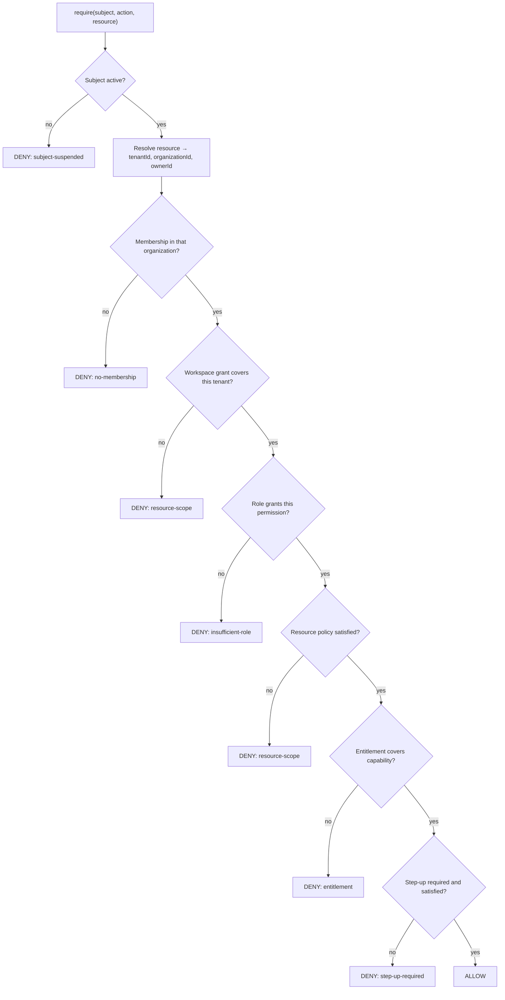

# Authorization

> **Status:** v1.0 — complete. New in Phase 9.
> **Absence of a grant is a denial.** Authorization decides whether an authenticated subject may perform an action on a specific resource — evaluated per request, against current state, never read from a token.

## Overview

**Business purpose.** A workspace member must be able to draft an article but not delete the workspace. An organization owner must manage billing without automatically gaining access to every workspace's content. A viewer invited to one project must not reach the next one. Authorization is what makes those distinctions real rather than aspirational.

**Technical purpose.** Provide a single evaluation path — `require(subject, action, resource)` — that every protected operation passes through, producing an explicit allow or deny with a reason, and defaulting to deny whenever a rule is absent.

**This document owns the evaluation engine; `rbac.md` owns the role and permission catalogue.** The split matters: the engine must be correct regardless of which permissions exist, and the catalogue must be changeable without touching evaluation logic.

## Responsibilities

- Permission evaluation and the decision contract.
- Policy composition and precedence.
- Resource-level checks including ownership and scope.
- The distinction between permission and entitlement.
- Denial reasons and their safe disclosure.

## Non-responsibilities

| Not owned | Owner |
|---|---|
| **Who the subject is** | `authentication.md` |
| The role catalogue and permission names | `rbac.md` |
| Database-level tenant enforcement | `row-level-security.md` |
| `TenantContext` establishment | `tenant-isolation.md` |
| Plan limits and quota values | `04-platform/billing.md` |
| Model output safety | `08-ai-platform/guardrails.md` |
| **Any business rule** | The owning domain component |

**Authorization never encodes business logic.** "A published article cannot be edited" is a domain invariant enforced by the Content Platform, not an authorization rule. Confusing the two puts business state transitions inside the security layer, where they drift from the domain that owns them and where a security change silently alters product behaviour.

## The decision contract

```ts
type AuthorizationDecision =
  | { effect: 'allow' }
  | { effect: 'deny'; reason: DenyReason; auditDetail: string };

type DenyReason =
  | 'no-membership'          // subject has no relationship to the tenant
  | 'insufficient-role'      // role lacks the permission
  | 'resource-scope'         // resource outside the subject's granted scope
  | 'entitlement'            // plan does not include the capability
  | 'step-up-required'       // sensitive operation needs fresh MFA
  | 'subject-suspended'      // subject or membership disabled
  | 'no-policy';             // DEFAULT — nothing granted it
```

**There is no third effect.** No `abstain`, no `not-applicable`, no `undefined` that a caller might treat as permissive. A decision is allow or deny, and every path that fails to produce an allow produces a deny.

**`no-policy` is the default and the most important variant.** An action with no matching rule is denied, not permitted. A new endpoint that nobody wrote a policy for fails closed — it returns 403 until someone grants access deliberately. The alternative, failing open on unknown actions, means every forgotten policy is a silent hole.

**`auditDetail` is separate from `reason` because they have different audiences.** The reason is coarse and safe to return to a caller; the detail is precise and goes only to the audit log (see *Safe disclosure*).

## Evaluation pipeline



**The order is deliberate: cheapest and most fundamental checks first.** Membership is a single indexed lookup and eliminates the overwhelming majority of denials; resource policy may require loading the resource. Evaluating entitlement before membership would perform commercial checks for subjects with no relationship to the tenant at all.

**Every stage can only deny.** No stage grants; passing a stage means proceeding to the next. Allow is reachable only by passing all seven — which is what makes default deny structural rather than a convention someone must remember.

**Resource resolution happens before any check.** The resource determines the tenant, and the tenant is never taken from a client-supplied parameter. A request specifying `?workspace=X` while addressing a resource belonging to workspace Y is evaluated against Y — the resource's actual owner. This is the control that defeats the most common IDOR pattern (`threat-model.md`).

## Permission and entitlement are different

| | **Permission** | **Entitlement** |
|---|---|---|
| Question | *May this subject do this?* | *Does this plan include this?* |
| Scope | Subject × resource | Organization |
| Source | Role bindings (`rbac.md`) | Subscription plan (`04-platform/billing.md`) |
| Failure | 403 — insufficient role | 402 / 403 — upgrade required |
| Changes when | Someone's role changes | The subscription changes |

**Both are checked and neither substitutes for the other.** An organization owner on a Starter plan has permission to configure SSO but no entitlement to it. A viewer on an Enterprise plan has the entitlement but not the permission. Collapsing them into one check produces exactly the wrong answer in both cases.

**Entitlement is evaluated last, after permission.** A subject with no permission must not learn what a higher plan would unlock — an upgrade prompt shown to someone who could never use the feature leaks the organization's plan configuration to an unprivileged member.

**Entitlement is a capability gate, not a quota.** "Does this plan include SSO?" is entitlement; "has this organization used its 50 runs this month?" is a quota enforced by the Billing Platform. Quota exhaustion is not a security decision and is not audited as one.

## Policy composition

**Deny always wins. There is no allow override.**

```ts
function compose(decisions: AuthorizationDecision[]): AuthorizationDecision {
  const denial = decisions.find((d) => d.effect === 'deny');
  if (denial) return denial;
  if (decisions.length === 0) {
    return { effect: 'deny', reason: 'no-policy', auditDetail: 'no policy matched' };
  }
  return { effect: 'allow' };
}
```

**An empty decision set denies.** This is the line that would be easiest to write the other way — `decisions.length === 0` returning allow reads as "nothing objected" and is catastrophic. Nothing objected because nothing was consulted.

**No allow-override exists**, deliberately. Systems that permit one policy to override another's denial become impossible to reason about: determining whether a subject may act requires evaluating every policy in the system and understanding their precedence. Deny-wins means a single denying rule is sufficient to guarantee refusal, which is a property a reviewer can verify locally.

**Roles are additive; denials are not.** A subject holding two roles has the union of their permissions. There is no "deny permission" in a role, because a subtractive grant in an additive model produces order-dependent results.

## Resource-level checks

Coarse permission is necessary but not sufficient. `article:update` means the subject may update *some* articles — not every article in the platform.

| Check | Question |
|---|---|
| **Tenant match** | Does the resource belong to a workspace the subject is granted? |
| **Scope** | Is the resource within the subject's project scope, where scoped roles apply? |
| **Ownership** | For owner-restricted actions, is the subject the creator? |
| **State** | Does the resource's state permit this action *as a security matter*? |

**The state check is narrow and easy to over-apply.** It covers security-relevant states only — a suspended workspace, a legally held record (`compliance.md`). Domain state transitions such as draft-versus-published belong to the domain component. The test: if the rule would still exist in a single-tenant system with one user, it is business logic, not authorization.

**Ownership checks are explicit, never inferred.** A subject is not granted extra authority merely for having created something; where creator-only access is intended, the policy states it.

## Safe disclosure

**Denial reasons returned to callers are coarse; audit records are precise.**

| Situation | Response to caller | Audit record |
|---|---|---|
| Resource in another tenant | **404 Not Found** | `deny: no-membership`, resource id, actual tenant |
| Resource exists, role insufficient | 403 Forbidden | `deny: insufficient-role`, permission required |
| Plan does not include it | 403 with upgrade hint | `deny: entitlement`, capability |
| Fresh MFA needed | 401 with step-up challenge | `deny: step-up-required`, operation |

**Cross-tenant access returns 404, not 403.** A 403 confirms the resource exists — letting an attacker enumerate resource ids across tenants and map another organization's content by probing. A 404 for anything outside the subject's tenants makes existence itself unobservable.

**403 is correct within a tenant.** A member who lacks permission on a resource they can already see gains nothing from a 404, and receives a confusing error instead of an actionable one.

## The guard

```ts
interface AuthorizationService {
  require(subject: Subject, action: Action, resource: ResourceRef): Promise<void>;
  check(subject: Subject, action: Action, resource: ResourceRef): Promise<AuthorizationDecision>;
  filter<T extends ResourceRef>(subject: Subject, action: Action, resources: T[]): Promise<T[]>;
  permissionsFor(subject: Subject, tenantId: string): Promise<Permission[]>;
}

interface ResourceRef {
  kind: ResourceKind;
  id: string;
  tenantId: string;         // resolved from the RESOURCE, never from the request
  organizationId: string;
  ownerId: string | null;
}
```

**`require` throws on denial; `check` returns a decision.** Two methods because the ergonomics differ: `require` is the default and makes the failure path unmissable — forgetting to inspect a returned value is a silent authorization bypass, while forgetting to catch an exception is a 500, which fails closed. `check` exists for UI affordances that legitimately need a decision without failing.

**`filter` exists so list endpoints do not authorize in a loop.** It applies the same evaluation set-wise, and its result is what the caller may see. It never post-filters a query that was permitted to read too much — RLS has already restricted the rows (`row-level-security.md`).

**`permissionsFor` is for UI rendering only** and is explicitly not an enforcement path. A client that hides a button is a usability feature; the server still evaluates every request.

## Authorization and RLS are independent

**Both enforce tenancy. Neither is trusted alone.** This is defense in depth applied to the single most damaging failure mode.

| Layer | Enforces | Fails when |
|---|---|---|
| Authorization | Subject may act on this resource | A check is forgotten on a new endpoint |
| RLS | The connection can only see this tenant's rows | Policy misconfigured or role over-privileged |

**Authorization is bypassable by omission; RLS is not.** A developer adding an endpoint can forget the guard, and the code will work in testing because the developer is authorized. RLS is enforced by the database regardless of what the application forgot — the query simply returns nothing.

**RLS alone is insufficient in the other direction.** It confines a request to one tenant but cannot express that a viewer may not delete. Role logic lives in the application; tenancy is enforced in both.

## Business rules

1. **Default deny.** No matching policy is a denial.
2. **`AuthorizationDecision` has exactly two effects.**
3. **Evaluation is per request against current state**, never from a token claim.
4. **Deny always wins**; there is no allow override.
5. **An empty decision set denies.**
6. **Roles are additive**; no subtractive grants.
7. **`tenantId` is resolved from the resource**, never from client input.
8. **Permission and entitlement are checked separately**, permission first.
9. **Cross-tenant denials return 404**, in-tenant denials 403.
10. **Denial reasons to callers are coarse; audit detail is precise.**
11. **Ownership is explicit, never inferred from creation.**
12. **Authorization contains no business rules.**
13. **RLS is independent** and never substitutes for an application check.
14. **Every denial is audited**; allows are audited for sensitive actions (`audit.md`).
15. **`permissionsFor` is never an enforcement path.**

## Database impact

**No new tables and no schema change.** Authorization reads `organization_memberships` and workspace grants (`03-database/tables.md`), and role bindings as specified in `rbac.md`.

**Membership and role lookups are cached in Redis with a 60-second TTL and explicit invalidation on change.** The TTL is a backstop; correctness comes from invalidation. A pure TTL would leave revoked access live for up to a minute, which contradicts the immediate-revocation guarantee in `authentication.md`.

## Security

- Evaluation is **fail-closed**: any error during evaluation — cache miss, database timeout, unresolvable resource — produces a denial, never an allow.
- Cache invalidation on role change is **synchronous with the change transaction**; a failed invalidation fails the change.
- **Denial reasons are never enriched with resource content**; the audit record holds ids, not data.
- `filter` results are never larger than what RLS would return; the two are checked for agreement in tests (`10-testing/`).
- Authorization decisions for **cross-tenant attempts are treated as security signals**, not ordinary denials (`security-observability.md`).
- Reference `audit.md` for the record format; every denial is recorded.

## Performance

| Operation | Target |
|---|---|
| `require` — cached membership | **p95 < 3 ms** |
| `require` — cold | p95 < 15 ms |
| `filter` — 100 resources | p95 < 20 ms, set-wise |
| `permissionsFor` | p95 < 10 ms |

**Authorization is on every request, so its cost is the platform's floor.** The 60-second membership cache is what keeps the common path to a Redis read; the cold path is two indexed queries.

**`filter` must be set-wise, not per item.** A 100-item list authorized in a loop is 100 evaluations and turns a fast endpoint into a slow one — the pressure that tempts developers to skip authorization on list endpoints entirely.

## Observability

- **Metrics:** `authz_decisions_total{action,effect,reason}`, `authz_denials_total{reason}`, `authz_cross_tenant_attempts_total{action}`, `authz_evaluation_duration_seconds`, `authz_cache_hit_ratio`, `authz_fail_closed_total{cause}`.
- **Tracing:** evaluation is a span with action, resource kind, effect, and reason — never resource content.
- **Logging:** subject id, action, resource kind and id, tenant id, effect, reason.
- **Alerts:** `authz_cross_tenant_attempts_total` non-zero (**page** — an isolation probe or a resolution bug); `authz_fail_closed_total` spike (evaluation is erroring, so legitimate users are being denied); denial-rate spike on one action (a misconfigured role or an attack); cache hit ratio collapse (invalidation storm).

**A cross-tenant attempt pages at count one.** Legitimate clients do not address resources in tenants they have no membership in; a single occurrence is either an attack or a resource-resolution bug, and both are urgent.

## Cross references

- `authentication.md` — the `Subject` this consumes
- `rbac.md` — the role catalogue and permission names
- `row-level-security.md` — the independent database enforcement
- `tenant-isolation.md` — `TenantContext` and cross-tenant assertions
- `api-security.md` — where `require` is invoked in the request path
- `audit.md` — decision records
- `threat-model.md` — IDOR, privilege escalation, enumeration
- `04-platform/billing.md` — entitlements and quotas
- `01-system-architecture/13-adr-log.md` — ADR-017
