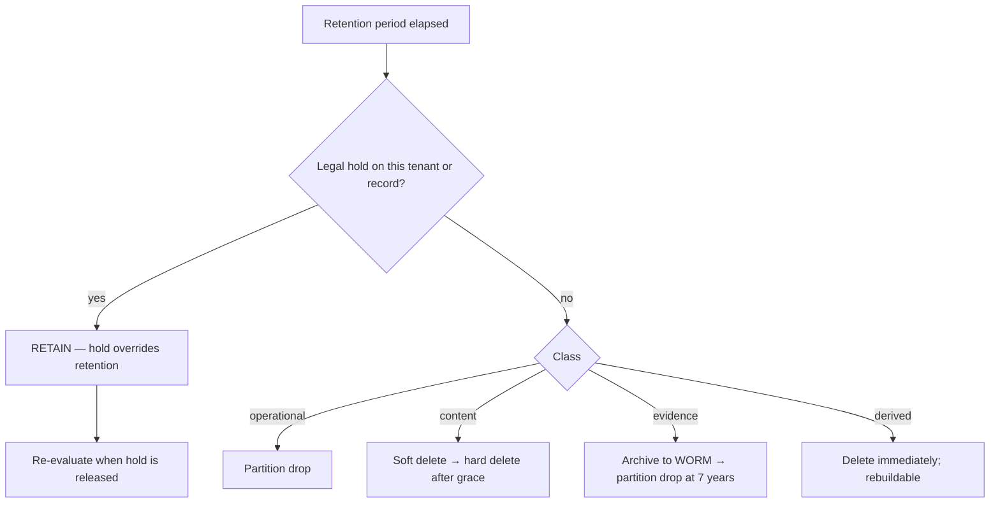
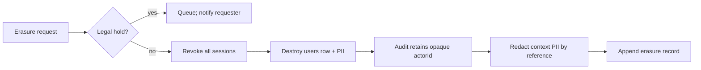

# Compliance

> **Status:** v1.0 — complete. New in Phase 9.
> **Compliance owns obligations, not mechanisms.** Every requirement here resolves to a control specified elsewhere in this folder. Where a control does not exist, that is stated plainly rather than implied.

## Overview

**Business purpose.** Enterprise contracts are gated on compliance answers: where does data live, how long is it kept, how is it deleted, what evidence exists that access controls work. ContentOS processes customer content, competitive research, and analytics identifiers — data that is commercially sensitive and, in the case of user accounts, personal.

**Technical purpose.** Map regulatory obligations to the platform's implemented controls, specify retention and legal hold mechanics, and define how erasure coexists with an immutable audit trail.

**The boundary.** This document never defines a business rule and never re-specifies a control. It states an obligation and names the document that satisfies it. Where the two conflict — retention versus legal hold, erasure versus audit immutability — this document defines the precedence.

## Responsibilities

- Regulatory obligation mapping.
- Retention schedules and their enforcement.
- Legal hold mechanics and precedence.
- Right to erasure and its interaction with audit.
- Data export and portability.
- Consent, purpose limitation, and minimization.
- Evidence production for audits.

## Non-responsibilities

| Not owned | Owner |
|---|---|
| **Any business rule** | The owning domain component |
| Encryption mechanics | `encryption.md` |
| Audit record format and immutability | `audit.md` |
| Access control | `authorization.md`, `rbac.md` |
| Tenant isolation | `tenant-isolation.md` |
| Backup execution | `14-operations/backup-recovery.md` |
| Legal interpretation | Counsel — this document states engineering obligations |

## Regulatory posture

| Framework | Position | Basis |
|---|---|---|
| **GDPR** | Processor for customer content; controller for account data | Customers control their content; ContentOS controls user accounts |
| **CCPA/CPRA** | Service provider | No sale or sharing of personal information |
| **SOC 2 Type II** | Alignment maintained; audit readiness by design | Controls specified across this folder |
| **ISO 27001** | Alignment; not certified in v1 | Control set mapped below |
| **HIPAA** | **Out of scope** | Platform is not designed for PHI; contractually excluded |
| **PCI DSS** | **Out of scope** | Card data never touches the platform — Stripe holds it |

**Being a processor for content and a controller for accounts is the distinction that drives everything below.** Customer content — articles, keywords, research — is processed under the customer's instruction; they decide retention and erasure. User accounts are ContentOS's own controller responsibility, with its own retention and its own erasure obligations.

**PCI is out of scope because card data never enters the platform.** Stripe Elements tokenizes in the browser; ContentOS stores a customer id and the last four digits (`04-platform/billing.md`). Any change that caused a PAN to reach platform infrastructure would bring the entire environment into PCI scope — a boundary worth naming explicitly.

**ISO 27001 certification is not claimed in v1.** The control set is aligned so certification is achievable without redesign, but claiming alignment is not claiming a certificate.

## Data classification

| Class | Examples | Encryption | Retention |
|---|---|---|---|
| **Personal — account** | Name, email, IdP subject | At rest (volume) | Life of account + 30 days |
| **Personal — sensitive** | OAuth tokens, integration credentials | **Column-level, per-tenant DEK** | Until revoked |
| **Customer content** | Articles, briefs, keywords, research | At rest (volume) | Customer-defined; default indefinite |
| **Derived** | Embeddings, extracted entities, mentions | At rest (volume) | Rebuildable; excluded from backup |
| **Operational** | Logs, metrics | At rest (volume) | 30 days / 13 months |
| **Evidence** | Audit records | At rest + backup DEK | **7 years** |

**Derived data is excluded from backups deliberately**, following the Phase 7 distinction between derived and authoritative (`11-knowledge-platform/provenance.md`). Embeddings and extracted entities are rebuildable from authoritative sources, so backing them up multiplies storage and — more importantly — creates additional copies of data that erasure must then reach.

**Evidence has the longest retention and the strongest protection**, because it is the class whose loss cannot be remediated (`audit.md`).

## Retention and legal hold



**Legal hold always overrides retention. This precedence is absolute and enforced, not procedural.**

```ts
interface LegalHold {
  readonly holdId: string;
  readonly scope: 'tenant' | 'organization' | 'subject';
  readonly targetId: string;
  readonly placedBy: string;
  readonly placedAt: Date;
  readonly reason: string;
  readonly releasedAt: Date | null;
  readonly releasedBy: string | null;
}
```

| Guarantee | Mechanism |
|---|---|
| Retention jobs skip held data | Every deletion path queries active holds first |
| Erasure requests are **queued, not executed** | Held subject's erasure defers until release |
| Archival is blocked | Partition drop refuses while a hold covers the range |
| Holds are audited | Placement and release both recorded (`audit.md`) |
| Holds cannot be deleted | Released, never removed — release is itself evidence |

**A held erasure request is acknowledged, queued, and disclosed to the requester** as required — deferred, not silently ignored. Executing an erasure under legal hold destroys evidence, which is a more serious failure than a delayed erasure.

**The check is inside the deletion transaction**, not a pre-flight check. A hold placed between a pre-check and the delete would be missed, and evidence destruction is not recoverable.

## Right to erasure

**Two distinct erasure paths, because the platform has two roles.**

### Account erasure — ContentOS as controller



**Audit integrity is preserved because audit records contain no personal data.** They carry `actorId` — an opaque UUID — never a name or email. Destroying the `users` row leaves an identifier that no longer resolves to a person, satisfying erasure without modifying a single immutable record (`audit.md`).

**This is the design decision that makes both obligations satisfiable**, and it is why "identifiers, never content" is a hard constraint rather than a style preference throughout the platform.

**Personal data in `context` — IP address, user agent — is stored by reference**, in a separate mutable structure. Redacting it neither modifies nor re-hashes an audit record; the record keeps its reference, and a redaction record is appended.

**An erasure record is appended describing what was erased, when, and under what request.** The erasure is itself evidence.

### Tenant erasure — ContentOS as processor

| Step | Mechanism |
|---|---|
| 1 · Verify authority and holds | `authorization.md`, legal hold check |
| 2 · **Destroy the tenant's DEK** | **Cryptographic erasure** (`encryption.md`) |
| 3 · Delete rows | Tenant-scoped, RLS-enforced |
| 4 · Purge cache | `invalidateTenant` — tenant-prefixed keys |
| 5 · Delete objects | Tenant-prefixed R2 prefix |
| 6 · Delete vectors | Tenant-filtered |
| 7 · Exclude from replay | Deleted tenants skipped (`13-event-platform/replay.md`) |
| 8 · Retain audit | Records persist; tenant id remains |

**Cryptographic erasure is what makes backup deletion tractable.** Backups are immutable snapshots retained for 35 days; selectively removing one tenant's rows from them is not possible. Destroying the tenant's DEK renders their ciphertext permanently unreadable *everywhere it exists*, including in every backup — a stronger guarantee than row deletion, and one that takes effect immediately.

**This works only because DEKs are per tenant** (`encryption.md`). A shared key would make cryptographic erasure impossible without destroying every customer's data.

**Column-level encryption covers sensitive personal data; content is volume-encrypted.** Cryptographic erasure therefore fully destroys credentials and tokens, while content rows are deleted directly and remain in backups until those backups expire — disclosed as a 35-day residual window rather than claimed away.

## Data export and portability

| Export | Scope | Format | Authorization |
|---|---|---|---|
| Subject access | One user's personal data | JSON | The subject, or an org admin |
| Tenant export | Workspace content and metadata | JSON + assets | `article:export` |
| Audit export | Audit records for a period | JSON, hash-chained | `audit:read` |
| Evidence export | Records under legal hold | JSON + chain proof | Legal, break-glass |

**Every export is audited with scope and record count** (`audit.md`). Count is the signal distinguishing a portability request from exfiltration.

**Audit exports include the hash chain and its anchors**, so the recipient can verify the records were not altered — which is what makes an audit export evidence rather than a report.

**Exports are generated asynchronously and delivered by presigned URL** with a 15-minute lifetime (`tenant-isolation.md`). The export object is itself tenant-prefixed and encrypted.

## Consent, purpose limitation, minimization

| Principle | Implementation |
|---|---|
| **Consent** | Recorded per purpose with timestamp, version, and method; withdrawal is as easy as granting |
| **Purpose limitation** | Data collected for a purpose is used only for it; secondary use requires new consent |
| **Minimization** | Only fields with a stated purpose are collected; schema review enforces this |

**Consent is versioned.** When a policy changes materially, prior consent does not carry forward — the version is part of the record, so it is answerable which policy a user agreed to and when.

**Purpose limitation has one platform-specific consequence worth stating.** Customer content is processed to produce customer content. It is **not** used to train models, and it is not shared across tenants for any purpose including quality improvement. AI Memory is tenant-scoped and never a source of truth (ADR-026), and the Knowledge Platform is tenant-isolated (`tenant-isolation.md`). A cross-tenant learning feature would require explicit consent and a new ADR.

**Minimization is enforced at schema review**, not by policy statement: a new column holding personal data requires a documented purpose and a retention class before the migration is approved.

## Data residency

**v1 is single-region. Data residency guarantees beyond that are not offered.**

| Data | Location |
|---|---|
| Primary database | Single region, EU or US per deployment |
| Object storage | Cloudflare R2, region-pinned |
| Backups | Same region; cross-region replication **only** where contractually required |
| Providers | Multi-region by their own architecture — disclosed in the subprocessor list |

**Provider processing is the honest limit.** Content sent to model providers, DataForSEO, Firecrawl, or Exa is processed under their architecture, which may be multi-region. This is disclosed in the subprocessor list rather than obscured; a customer requiring strict residency cannot use providers that do not offer it.

**Multi-region tenant residency is not implemented and would be a significant architectural change** — tenant-to-region routing, per-region key hierarchies, and cross-region event delivery. It is recorded as a Proposed ADR rather than decided here (`99-open-questions.md`).

## Evidence production

**SOC 2 and ISO 27001 evidence is produced by the controls themselves, not assembled manually.**

| Evidence | Source |
|---|---|
| Access control effectiveness | `audit_log` authorization decisions (`audit.md`) |
| Access reviews | Role binding history (`rbac.md`) |
| Tenant isolation | RLS conformance test results (`row-level-security.md`) |
| Encryption at rest and in transit | Key operation records, TLS config (`encryption.md`) |
| Secret rotation | Rotation records and age metrics (`secrets-management.md`) |
| Change management | Migration history, deploy records (`14-operations/`) |
| Incident handling | Incident records and postmortems (`incident-response.md`) |
| Vulnerability management | Dependency scan results (`threat-model.md`) |
| Backup and recovery | Restore test results (`14-operations/backup-recovery.md`) |

**Evidence generated as a byproduct of operation is trustworthy in a way that assembled evidence is not.** A screenshot taken for an auditor proves the state at one moment; a hash-chained audit trail proves a continuous record. The controls in this folder were specified to produce the second.

**Restore tests are evidence and are scheduled**, because an untested backup is a hypothesis (`14-operations/backup-recovery.md`).

## Backup retention

| Backup | Frequency | Retention | Encryption |
|---|---|---|---|
| Continuous WAL | Streaming | 7 days | Backup DEK |
| Daily full | Daily | 35 days | Backup DEK |
| Audit archive | Monthly | **7 years**, WORM | Backup DEK |

**The backup DEK is never destroyed while any backup referencing it is retained**, which is the one case where key retention outlives normal rotation policy (`encryption.md`).

**Backups contain all tenants' data and RLS does not apply to a restored dump.** Restore access is therefore break-glass, individually approved, and audited — a restored copy is the least-protected form the data takes (`row-level-security.md`).

## Business rules

1. **Compliance owns obligations, never business logic or mechanisms.**
2. **Legal hold always overrides retention**, checked inside the deletion transaction.
3. **Erasure under hold is queued and disclosed**, never executed, never silently dropped.
4. **Audit records are never modified or deleted for erasure.**
5. **Audit contains no personal data**, which is what makes rule 4 possible.
6. **Tenant erasure destroys the tenant DEK** — cryptographic erasure.
7. **The 35-day backup residual window is disclosed**, not claimed away.
8. **Every export is audited with scope and record count.**
9. **Audit exports include hash-chain proof.**
10. **Consent is versioned**; material policy changes do not inherit prior consent.
11. **Customer content is never used for model training or cross-tenant purposes.**
12. **New personal-data columns require a purpose and retention class before migration.**
13. **Holds are released, never deleted.**
14. **v1 is single-region**; multi-region residency requires an ADR.
15. **Derived data is excluded from backups.**

## Interfaces

```ts
interface ComplianceService {
  placeHold(hold: NewLegalHold, actor: string): Promise<LegalHold>;
  releaseHold(holdId: string, actor: string, reason: string): Promise<void>;
  activeHolds(scope: HoldScope, targetId: string): Promise<LegalHold[]>;
  requestErasure(req: ErasureRequest, actor: string): Promise<ErasureOutcome>;
  export(req: ExportRequest, actor: string): Promise<ExportHandle>;
  retentionEligibility(class: DataClass, olderThan: Date): Promise<EligibilityResult>;
}

type ErasureOutcome =
  | { status: 'completed'; erasedAt: Date; scope: string[] }
  | { status: 'deferred'; reason: 'legal-hold'; holdIds: string[] }
  | { status: 'rejected'; reason: 'unauthorized' | 'unknown-subject' };

type EligibilityResult =
  | { eligible: true; recordCount: number }
  | { eligible: false; blockedBy: LegalHold[] };
```

**`ErasureOutcome` has no silent-success variant.** A deferred erasure is a distinct status carrying the blocking hold ids, so a caller cannot treat "not executed" as "done" — which is exactly how an erasure obligation goes unmet without anyone noticing.

**`retentionEligibility` returns the blocking holds**, not a boolean. A retention job that learns only "no" cannot report why data is being retained past schedule.

## Database impact

**No new tables and no schema change.** Legal holds, consent records, and erasure requests use tables defined in Phase 3 (`03-database/tables.md`). Retention operates by partition drop where applicable (`13-event-platform/idempotency.md`, `audit.md`).

**Every deletion path queries active holds within the same transaction as the delete.** This is a query, not a constraint, because a hold may be placed at any tier — tenant, organization, or subject — and a foreign key cannot express that.

## Security

- Legal hold placement and release require a **legal capability** distinct from workspace administration, and both are audited (`audit.md`).
- Erasure requires verified subject identity or org admin authority (`authorization.md`).
- Exports are rate-limited and audited; volume anomalies alert (`security-observability.md`).
- Evidence exports carry hash-chain proof; a chain verification failure invalidates the export.
- **Restore access is break-glass**, individually approved, and audited.
- Subprocessor changes are disclosed to customers before taking effect.

## Performance

| Operation | Target |
|---|---|
| Hold check on delete | Indexed lookup; **p95 < 5 ms** |
| Account erasure | Synchronous; p95 < 2 s |
| Tenant erasure | Asynchronous; DEK destruction is immediate |
| Export generation | Asynchronous, rate-limited |
| Retention sweep | Tenant-by-tenant, bounded rate (`13-event-platform/workers.md`) |

**Tenant erasure takes effect immediately even though it completes asynchronously**, because destroying the DEK renders encrypted data unreadable the moment it happens — row deletion follows as cleanup.

## Observability

- **Metrics:** `legal_holds_active` (gauge), `erasure_requests_total{outcome}`, `erasure_deferred_total{reason}`, `retention_deletions_total{class}`, `retention_blocked_total{reason}`, `exports_total{kind,actor}`, `export_record_count` (histogram), `consent_records_total{purpose,version}`, `restore_operations_total`.
- **Logging:** hold id, scope, actor, reason; erasure request id and outcome — never the erased data.
- **Alerts:** erasure deferred beyond the regulatory response window (**page** — an obligation is at risk); retention blocked with no active hold (**page** — the retention job is failing, not being blocked); export record count above baseline (exfiltration signal); any restore operation (**page** — an unprotected copy now exists); consent version mismatch after a policy change.

## Cross references

- `audit.md` — immutable evidence; why erasure does not touch it
- `encryption.md` — cryptographic erasure, backup DEK, key retention
- `tenant-isolation.md` — tenant-scoped deletion across every subsystem
- `authorization.md` · `rbac.md` — export and erasure authority; access review evidence
- `row-level-security.md` — RLS conformance evidence; restore access
- `secrets-management.md` — rotation evidence
- `threat-model.md` — insider threat and exfiltration
- `security-observability.md` — export and erasure signals
- `incident-response.md` — regulatory notification timelines
- `11-knowledge-platform/provenance.md` — derived versus authoritative
- `14-operations/backup-recovery.md` — backup execution and restore testing
- `04-platform/billing.md` — Stripe tokenization keeping PCI out of scope
- `01-system-architecture/13-adr-log.md` — ADR-017, ADR-026
