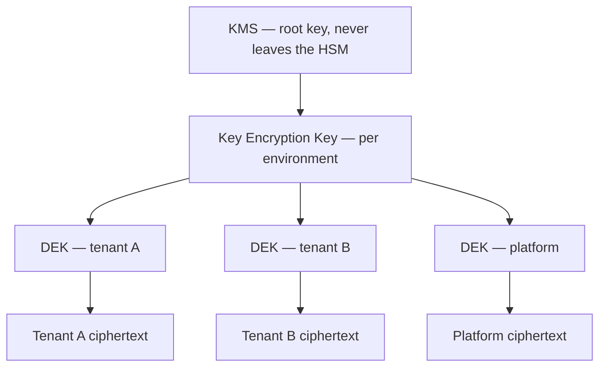
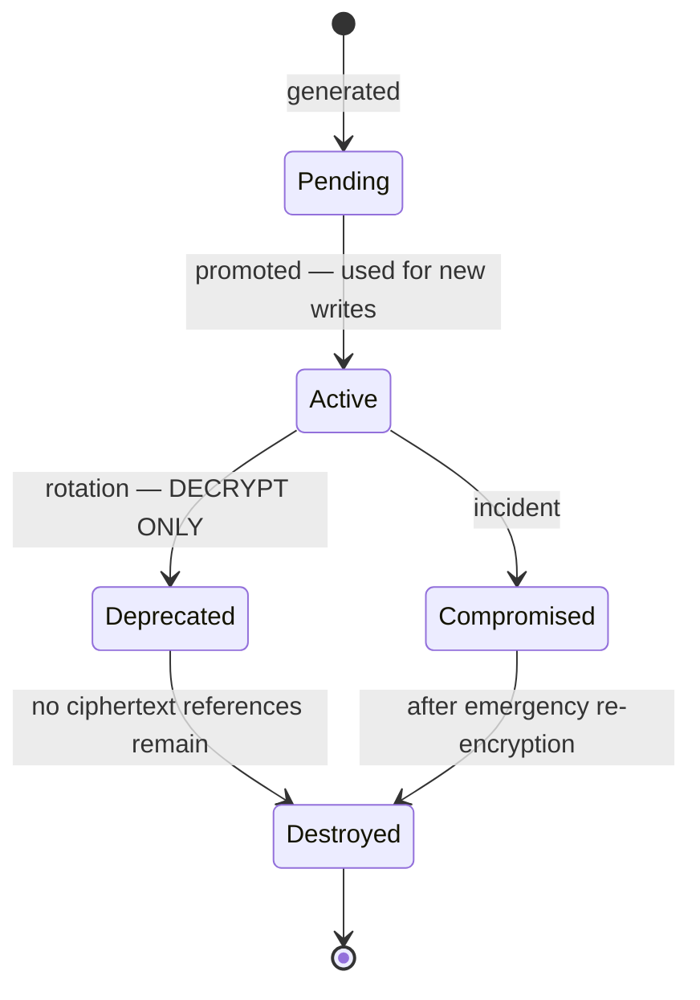
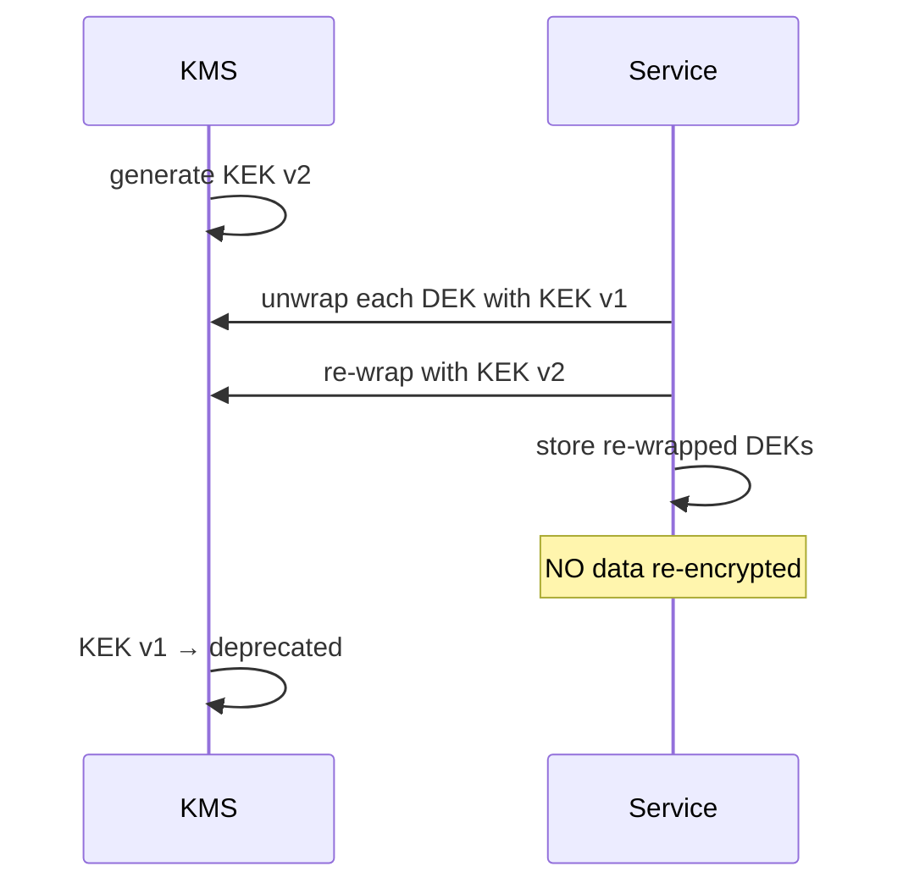

# Encryption

> **Status:** v1.0 — complete. New in Phase 9.
> **Every ciphertext carries the identity of the algorithm and key that produced it.** That one property is what makes algorithms replaceable, keys rotatable without redeployment, and historical data readable forever after.

## Overview

**Business purpose.** Enterprise procurement asks three questions: is data encrypted at rest, is it encrypted in transit, and who holds the keys. Answering them requires more than enabling disk encryption — it requires a key lifecycle that survives rotation, an algorithm choice that can change when one is broken, and a story for backups, which are the copies most often forgotten.

**Technical purpose.** Specify the ciphertext envelope format, the two-tier key hierarchy, the KMS abstraction, rotation mechanics for each key class, and the transport requirements at every hop.

**Cryptographic agility is the organizing principle.** AES-256-GCM is correct today. The design assumption is that it will not be correct forever, and that replacing it must not require a migration that decrypts and rewrites every row in one operation.

## Responsibilities

- Ciphertext envelope format and algorithm identification.
- Key hierarchy: key encryption keys and data encryption keys.
- KMS abstraction and provider independence.
- Key lifecycle and rotation for each class.
- Encryption at rest: database, object storage, backups.
- Encryption in transit: TLS, internal, webhooks.

## Non-responsibilities

| Not owned | Owner |
|---|---|
| Credential lifecycle | `secrets-management.md` |
| Password hashing | `authentication.md` — hashing is not encryption |
| Which data is sensitive | The owning domain component |
| Retention and erasure obligations | `compliance.md` |
| Certificate issuance | `14-operations/deployment.md` |

**Hashing is not encryption and is specified elsewhere.** Passwords use Argon2id and are never decryptable by design (`authentication.md`). This document covers reversible protection only.

## The ciphertext envelope

**Every encrypted value stored by the platform uses this format.**

```
┌─────────┬──────────────┬────────┬───────┬────────────┬─────┐
│ version │ algorithm_id │ key_id │ nonce │ ciphertext │ tag │
│  1 byte │    2 bytes   │ 16 B   │ 12 B  │  variable  │16 B │
└─────────┴──────────────┴────────┴───────┴────────────┴─────┘
```

```ts
interface Ciphertext {
  readonly version: number;        // envelope format version
  readonly algorithmId: number;    // registry entry, not a name
  readonly keyId: string;          // which DEK encrypted this
  readonly nonce: Uint8Array;      // 96-bit, unique per encryption
  readonly ciphertext: Uint8Array;
  readonly tag: Uint8Array;        // 128-bit GCM authentication tag
}
```

**Self-describing ciphertext is what delivers all three mandated rules.**

| Rule | How the envelope satisfies it |
|---|---|
| Algorithms may change without redesign | `algorithm_id` selects the decryptor; new algorithm = new id, old ciphertext still decrypts |
| Keys rotate independently of deployments | `key_id` resolves the key at read time; no code knows which key is current |
| Historical data readable after rotation | Old keys move to decrypt-only, never destroyed while ciphertext references them |

**Without `key_id` in the ciphertext, rotation requires re-encrypting everything atomically** — impossible at scale and catastrophic if interrupted. With it, rotation changes only what new writes use.

**`algorithm_id` is a numeric registry entry, not an algorithm name string.** Names invite parsing, and a parsed algorithm name is an injection point where an attacker who can influence stored ciphertext could select a weaker algorithm. The registry is compiled in and rejects unknown ids.

**Nonces are 96-bit random and never reused with the same key.** GCM nonce reuse is catastrophic — it leaks the XOR of two plaintexts and permits forgery. A DEK is retired after 2³² encryptions, well below the birthday bound for random 96-bit nonces.

## Key hierarchy



| Tier | Scope | Where it lives | Rotation |
|---|---|---|---|
| **Root** | Platform | KMS/HSM — **never exported** | KMS-managed, annual |
| **KEK** | Per environment | KMS; used only to wrap DEKs | Annual |
| **DEK** | **Per tenant** | Stored wrapped, cached in memory | 90 days, lazy |

**Envelope encryption exists because calling a KMS per operation does not scale.** A KMS call is 10–50 ms and metered; encrypting a field on every write would add that latency to every request and generate a bill proportional to traffic. Instead the KMS unwraps a DEK once, the DEK is cached, and encryption happens locally at microsecond cost.

**DEKs are per tenant, and that is a deliberate isolation choice.** A single platform-wide DEK would mean one key compromise exposes every customer. Per-tenant keys mean a compromised DEK exposes one tenant — and make cryptographic erasure possible: destroying a tenant's DEK renders their ciphertext permanently unrecoverable, which is the strongest available deletion guarantee (`compliance.md`).

**Wrapped DEKs are stored alongside the data they protect**, in the same database. This is safe because the wrapped form is useless without the KEK, which never leaves the KMS. A database compromise alone yields ciphertext and wrapped keys, neither of which decrypts anything.

## KMS abstraction

```ts
interface KeyManagementService {
  generateDataKey(keyRing: string): Promise<{ plaintext: Uint8Array; wrapped: Uint8Array }>;
  unwrap(keyRing: string, wrapped: Uint8Array): Promise<Uint8Array>;
  rotateKek(keyRing: string): Promise<void>;
  describeKey(keyId: string): Promise<KeyMetadata>;
}
```

**Four methods, and none exposes a root key.** The interface is deliberately narrow so that AWS KMS, GCP KMS, HashiCorp Vault Transit, or a self-hosted HSM can back it without touching application code — the same swap-point discipline applied to the event bus (`13-event-platform/event-bus.md`).

**`generateDataKey` returns both forms in one call** — plaintext for immediate use, wrapped for storage. The plaintext is never written anywhere.

**The KMS is a hard dependency and fails closed.** If it is unreachable, cached DEKs continue serving existing tenants, but new tenant provisioning and cache misses fail rather than falling back to unencrypted storage. There is no degraded mode that writes plaintext.

## Key lifecycle



| State | Encrypts | Decrypts |
|---|---|---|
| Pending | No | No |
| **Active** | Yes | Yes |
| **Deprecated** | **No** | **Yes** |
| Compromised | No | Yes, during re-encryption only |
| Destroyed | No | No — ciphertext is permanently unreadable |

**A key is destroyed only when no ciphertext references it**, verified by query rather than assumed from age. Destroying a key with live references is unrecoverable data loss with no restore path — the backup contains the same unreadable ciphertext.

**Cryptographic erasure is the exception**, where destruction is the intent: a tenant's DEK is destroyed deliberately to render their data unrecoverable, and the reference check is skipped by design (`compliance.md`).

## Rotation

**Two rotations with very different costs.**

### KEK rotation — cheap



**KEK rotation touches only wrapped DEKs — thousands of small records, not terabytes of data.** This is the primary reason for the two-tier hierarchy: the key most exposed to policy requirements rotates without reading a single row of customer data. It completes in minutes.

### DEK rotation — lazy

**New writes use the new DEK; existing ciphertext is re-encrypted opportunistically.**

| Trigger | Behaviour |
|---|---|
| New write | Uses the current DEK |
| Read of old ciphertext | Decrypts with the referenced DEK; **re-encrypts if the row is being written anyway** |
| Background sweep | Re-encrypts remaining rows at a bounded rate |
| Old DEK | Deprecated until zero references, then destroyed |

**Lazy rotation is the only approach that works at scale.** Eager re-encryption of every row is a long-running write storm that competes with production traffic and is not safely resumable. Laziness makes rotation a background property rather than an event.

**Rotation is independent of deployment.** No redeploy, no restart, no code change — services resolve keys by id at read time and ask the store which key is current for writes.

## Encryption at rest

| Layer | Mechanism | Key |
|---|---|---|
| **Database volume** | Provider-managed disk encryption, AES-256 | Provider-managed |
| **Sensitive columns** | Application-layer AES-256-GCM envelope | Per-tenant DEK |
| **Object storage** | SSE-KMS server-side encryption | Platform KEK |
| **Backups** | AES-256-GCM before leaving the database host | Dedicated backup DEK |
| **Redis** | TLS in transit; **no sensitive data at rest** | — |

**Disk encryption alone is insufficient and is often mistaken for sufficient.** It protects against physical media theft and nothing else: a compromised application, a leaked read replica, or an over-privileged query returns plaintext, because the volume is mounted and decrypted. Column-level encryption is what protects data from a database compromise.

**Column-level encryption is applied selectively**, to tenant integration credentials, OAuth tokens, and PII beyond email. Encrypting every column would make indexing, sorting, and searching impossible — an encrypted column supports equality only via deterministic encryption, which leaks frequency distribution.

**Redis holds no sensitive data at rest by policy**, which is why it is not encrypted at rest. It caches identifiers, counters, locks, and short-lived state; a cached value derived from tenant data is tenant-prefixed and TTL-bounded (`tenant-isolation.md`). Anything requiring encryption does not belong in Redis.

**Backups are encrypted before leaving the database host**, with a dedicated DEK retained for the full backup retention period. A backup encrypted only by the storage provider is readable by anyone with storage access — and backups are the copy most likely to be replicated to a second region with different access controls.

**The backup DEK is never destroyed while any backup referencing it is retained**, which is the one case where key retention outlives normal rotation policy.

## Encryption in transit

| Hop | Requirement |
|---|---|
| Client → edge | **TLS 1.3**; TLS 1.2 permitted only for legacy CMS webhook senders |
| Edge → services | TLS 1.3, internal CA |
| Service → service | **mTLS** — both sides authenticated |
| Service → PostgreSQL | TLS, `verify-full` |
| Service → Redis | TLS |
| Service → providers | TLS 1.2+, certificate validation **never disabled** |
| Outbound webhooks | HTTPS only; HTTP refused (`api-security.md`) |

**`verify-full` on the database connection, not `require`.** `require` encrypts but does not verify the server certificate, leaving the connection open to an active man-in-the-middle — encryption without authentication is a false assurance.

**mTLS between internal services implements zero trust at the transport layer.** Network position grants nothing; a compromised pod cannot call another service without a valid client certificate.

**Certificate validation is never disabled, including in development.** A `rejectUnauthorized: false` added to fix a local issue reaches production reliably, and its absence produces no symptom.

**Weak ciphers, TLS 1.0, and TLS 1.1 are disabled** everywhere. The TLS 1.2 allowance for inbound webhooks is scoped to that listener alone, because some CMS platforms have not upgraded.

## Webhook encryption

**Outbound webhooks are HTTPS-only and signed, not encrypted end-to-end.**

| Property | Mechanism |
|---|---|
| Confidentiality | TLS to the customer's endpoint |
| Integrity and authenticity | HMAC-SHA256 over the raw body |
| Freshness | Timestamp within 5 minutes |
| Uniqueness | Single-use nonce (`api-security.md`) |

**Payload-level encryption is not applied**, because webhook payloads carry identifiers rather than content — the same rule that governs event payloads (`13-event-platform/event-registry.md`). A webhook says *what happened* and *to which id*; the recipient fetches details through the authenticated API. There is nothing in the payload that TLS does not adequately protect.

## Cryptographic agility

**Adding an algorithm is additive, never a migration.**

1. Register the new algorithm with a new `algorithm_id`.
2. Deploy support for encrypting *and* decrypting with it.
3. Switch new writes to the new id.
4. Existing ciphertext continues decrypting under the old id.
5. Re-encrypt lazily, exactly as with DEK rotation.
6. Retire the old id when zero ciphertext references it.

**Step 2 must ship before step 3, in separate deploys.** Writing ciphertext an older instance cannot decrypt during a rolling deploy causes read failures for the overlap — the same expand/contract discipline used for schema changes (`03-database/migrations.md`).

**The algorithm registry is compiled in and rejects unknown ids**, so a corrupted or forged `algorithm_id` fails closed rather than selecting an unintended decryptor.

## Business rules

1. **Every ciphertext carries `version`, `algorithm_id`, and `key_id`.**
2. **Algorithms are numeric registry ids**, never parsed names.
3. **Nonces are 96-bit random**, never reused with a key; DEKs retire after 2³² encryptions.
4. **DEKs are per tenant.**
5. **Root keys never leave the KMS.**
6. **KEK rotation re-wraps DEKs only** — no data re-encryption.
7. **DEK rotation is lazy**, on write and by bounded sweep.
8. **Rotation is independent of deployment.**
9. **Keys are destroyed only when no ciphertext references them**, except cryptographic erasure.
10. **Deprecated keys decrypt but never encrypt.**
11. **Backups are encrypted before leaving the host**; the backup DEK outlives backup retention.
12. **Redis holds no data requiring encryption at rest.**
13. **Database connections use `verify-full`.**
14. **Certificate validation is never disabled, in any environment.**
15. **Internal service calls use mTLS.**
16. **The KMS fails closed**; no unencrypted fallback exists.

## Interfaces

```ts
interface EncryptionService {
  encrypt(ctx: TenantContext, plaintext: Uint8Array): Promise<Ciphertext>;
  decrypt(ctx: TenantContext, ciphertext: Ciphertext): Promise<Uint8Array>;
  reencrypt(ctx: TenantContext, ciphertext: Ciphertext): Promise<Ciphertext>;
  currentKeyId(ctx: TenantContext): Promise<string>;
}

interface KeyRegistry {
  resolve(keyId: string): Promise<KeyMaterial>;      // cached; KMS on miss
  current(scope: KeyScope): Promise<KeyMaterial>;
  deprecate(keyId: string): Promise<void>;
  destroy(keyId: string, force: boolean): Promise<DestroyResult>;
  referenceCount(keyId: string): Promise<number>;
}
```

**`encrypt` takes a `TenantContext`, making the per-tenant DEK structural.** There is no way to encrypt without naming a tenant, so a platform-wide key cannot be used for tenant data by accident.

**`destroy` requires an explicit `force` flag** and refuses when `referenceCount > 0` without it. The flag exists solely for cryptographic erasure and its use is audited as a destructive operation.

**`decrypt` resolves the key from the ciphertext's own `key_id`**, never from current configuration — the mechanism that keeps historical data readable across every rotation.

## Database impact

**No new tables and no schema change.** Encrypted columns store the serialized envelope as `BYTEA`; wrapped DEKs are stored with the tenant record as defined in Phase 3 (`03-database/tables.md`).

**Encrypted columns cannot be indexed for range or prefix queries.** Where lookup is required, a separate blind index — HMAC of the plaintext under a dedicated key — supports equality without revealing content. This is specified where used, not applied broadly, because a blind index leaks equality and therefore frequency.

## Security

- Plaintext DEKs exist **only in memory**, are never logged, and are excluded from core dumps (disabled in production).
- KMS access is by workload identity with per-service policies (`secrets-management.md`).
- **Key destruction is irreversible** and requires two-person approval outside cryptographic erasure.
- Backup encryption keys are stored separately from backups; co-locating them defeats the control.
- All key operations — generate, unwrap, rotate, deprecate, destroy — are audited (`audit.md`).
- Reference `threat-model.md` for the compromise paths this hierarchy bounds.

## Performance

| Operation | Target |
|---|---|
| Encrypt / decrypt — cached DEK | **< 0.1 ms** for values under 1 KB (AES-NI) |
| DEK unwrap — cache miss | p95 < 50 ms — one KMS call |
| DEK cache TTL | 15 minutes |
| KEK rotation | Minutes; wrapped DEKs only |
| Lazy re-encryption sweep | Rate-limited; yields to production traffic |

**The DEK cache is what makes column encryption viable.** Without it, every encrypted read is a KMS round trip; with it, the KMS is called roughly once per tenant per 15 minutes.

## Observability

- **Metrics:** `encryption_operations_total{operation,algorithm_id}`, `kms_calls_total{operation,outcome}`, `dek_cache_hit_ratio`, `key_rotation_age_days{scope}` (gauge), `deprecated_key_references{key_id}` (gauge), `reencryption_progress_ratio`, `key_destroy_total{forced}`.
- **Logging:** key id, algorithm id, operation, tenant id — **never plaintext, never key material**.
- **Alerts:** KMS unreachable (**page** — new tenants and cache misses fail); `key_rotation_age_days` past policy (**page**); `deprecated_key_references` not decreasing (re-encryption stalled — the old key can never be destroyed); `key_destroy_total{forced="true"}` (**page** — irreversible); DEK cache hit ratio collapse (KMS cost and latency spike); decryption failures non-zero (**page** — data corruption or a missing key).

**A stalled re-encryption sweep is a slow-motion problem worth alerting on.** Nothing breaks; the deprecated key simply cannot be destroyed, and the rotation is incomplete indefinitely while appearing to have succeeded.

## Cross references

- `secrets-management.md` — credential lifecycle; the boundary with key management
- `tenant-isolation.md` — per-tenant DEK scoping
- `compliance.md` — cryptographic erasure and backup retention
- `audit.md` — key operation records
- `api-security.md` — TLS and webhook signing
- `authentication.md` — password hashing, which is not encryption
- `incident-response.md` — key compromise procedure
- `threat-model.md` — credential theft and data-at-rest compromise
- `03-database/tables.md` — encrypted column storage
- `14-operations/deployment.md` — certificate issuance and workload identity
- `12-storage-platform/` — object storage SSE-KMS configuration
