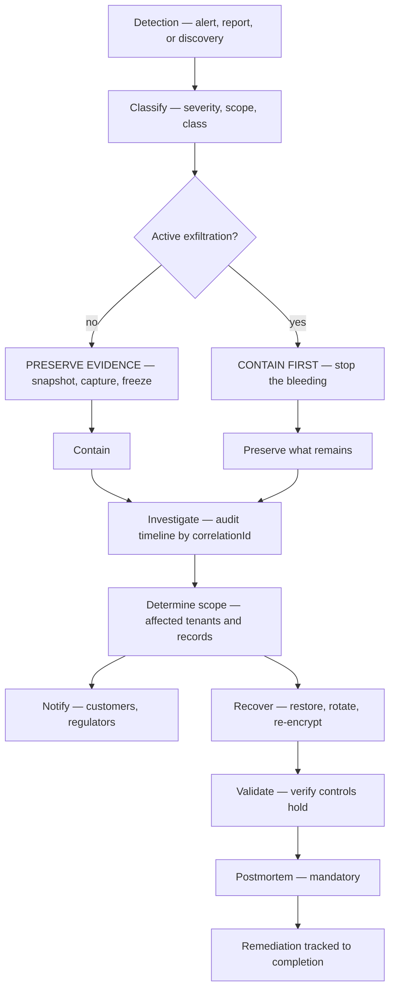
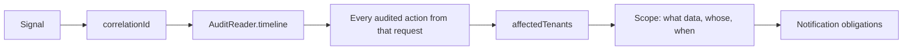

# Incident Response

> **Status:** v1.0 — complete. New in Phase 9.
> **Capture before you contain.** Killing a compromised process destroys the memory that proves what happened. The one exception is active exfiltration, where stopping the bleeding outranks the evidence.

## Overview

**Business purpose.** How an organization handles its first breach determines whether customers stay. The difference between a contained incident with a clear disclosure and an unbounded one is almost entirely preparation — decisions made calmly in advance rather than at 03:00 under pressure.

**Technical purpose.** Define detection-to-postmortem flow for security incidents: classification, containment sequencing, evidence preservation, recovery that does not weaken controls, notification obligations, and five runbooks for the incident types this platform is most likely to see.

**Distinct from operational incident response.** `14-operations/incident-response.md` handles availability — a stalled relay, a saturated database — where success is restoring service. This document handles confidentiality and integrity, where success may require **taking service away**. The two use different severity models and different first moves.

## Responsibilities

- Security incident classification and severity.
- Containment sequencing and evidence preservation.
- Investigation using immutable audit.
- Customer and regulatory notification.
- Recovery and validation.
- Postmortem and remediation tracking.
- Runbooks for recurring incident classes.

## Non-responsibilities

| Not owned | Owner |
|---|---|
| Availability incidents | `14-operations/incident-response.md` |
| Detection signals | `security-observability.md` |
| Threat definitions | `threat-model.md` |
| Regulatory interpretation | Counsel |
| Backup execution | `14-operations/backup-recovery.md` |

## Severity model

| Severity | Definition | Page | Containment target |
|---|---|---|---|
| **SEV-1** | Confirmed cross-tenant exposure, audit compromise, or platform credential loss | Immediate, all-hands | **< 60 min** |
| **SEV-2** | Single-tenant exposure, privilege escalation, active exploitation | Immediate | < 4 h |
| **SEV-3** | Attempted attack blocked by controls; limited disclosure | Business hours | < 24 h |
| **SEV-4** | Policy violation, hygiene failure, no exposure | Ticket | < 7 days |

**Severity is assigned on *suspicion*, not confirmation, and downgraded later.** An unexplained `cross_tenant_attempts_total` reading is SEV-1 until proven otherwise. Investigating at high severity and downgrading costs an hour of attention; starting low and escalating costs the containment window.

**Every invariant breach in `security-observability.md` opens at minimum SEV-2.** Those metrics have a target of zero, so a non-zero reading means a guarantee has broken.

## Response flow



**The evidence/containment ordering decision is the first real judgement call.** Terminating a compromised process destroys process memory, in-flight connections, and attacker tooling — often the only proof of what was accessed. Snapshot first, then contain. But when data is actively leaving, containment wins: unbounded exfiltration is worse than an incomplete forensic record.

## Detection

| Source | Path |
|---|---|
| Invariant breach alert | `security-observability.md` — pages automatically |
| Anomaly alert | Baseline deviation — exports, geography, privilege accumulation |
| Customer report | Support escalation with a security path |
| Researcher disclosure | Published security contact; safe-harbour policy |
| Internal discovery | Any engineer; **no-blame reporting** |
| Provider notification | Breach notice from a subprocessor |

**Researcher and internal reports are first-class detection sources**, not exceptions. Most breaches are found by people rather than dashboards, and a reporting path with friction is a reporting path that goes unused.

**A disclosure policy with safe harbour is published**, because researchers who fear legal exposure sell findings elsewhere.

## Classification

```ts
interface SecurityIncident {
  readonly incidentId: string;
  readonly severity: 'SEV-1' | 'SEV-2' | 'SEV-3' | 'SEV-4';
  readonly class: IncidentClass;
  readonly detectedAt: Date;
  readonly detectedBy: string;
  readonly correlationIds: string[];      // pivots into the audit trail
  readonly affectedTenants: string[];
  readonly commander: string;
  status: 'triaging' | 'contained' | 'investigating' | 'recovering' | 'resolved';
  readonly containedAt: Date | null;
  readonly resolvedAt: Date | null;
}

type IncidentClass =
  | 'cross-tenant-exposure' | 'credential-compromise' | 'secret-exposure'
  | 'key-compromise' | 'privilege-escalation' | 'data-corruption'
  | 'replay-abuse' | 'supply-chain' | 'insider' | 'availability-security';
```

**One incident commander is named at declaration.** Not a committee — a single person who decides, delegates, and owns the timeline. Contested authority during containment produces conflicting actions on the same system.

**`correlationIds` is the field that makes investigation tractable**, pivoting from a signal into every audited action caused by the originating request (`audit.md`).

## Containment

| Class | Containment |
|---|---|
| **Credential compromise** | Revoke sessions and keys; force re-authentication; rotate |
| **Secret exposure** | **Emergency replacement without overlap** (`secrets-management.md`) |
| **Cross-tenant exposure** | Disable the affected code path; **do not disable RLS** |
| **Key compromise** | Mark key compromised; begin re-encryption; **do not destroy** |
| **Privilege escalation** | Revoke bindings; suspend the subject |
| **Replay abuse** | Abort runs; suspend replay capability |
| **Supply chain** | Freeze deploys; pin last verified artifact |
| **Insider** | Suspend access; preserve devices; **HR and legal engaged before confrontation** |

**Containment never weakens a control.** Disabling RLS to "investigate more easily", removing rate limits to reduce noise, or granting broad access to speed the work all convert an incident into a larger one. The controls stay on; investigation uses break-glass paths that are themselves audited.

**Emergency secret replacement deliberately breaks in-flight work.** The overlap window that makes ordinary rotation seamless is exactly the window an attacker would use, so it is skipped and errors are expected (`secrets-management.md`).

**A compromised key is marked, never destroyed.** Destruction makes historical data permanently unreadable — including data needed to determine the scope. Re-encrypt under a new key, then destroy when references reach zero (`encryption.md`).

## Evidence preservation

**Never destroy forensic evidence.** This rule outranks convenience, tidiness, and — except under active exfiltration — speed.

| Evidence | Preservation |
|---|---|
| Audit records | **Already immutable** — append-only, hash-chained (`audit.md`) |
| Process state | Memory snapshot before termination |
| Database state | Point-in-time snapshot; **legal hold placed** |
| Logs | Retention extended for the window; export to WORM |
| Storage objects | Versioning frozen; lifecycle suspended |
| Network | Flow logs exported |
| Configuration | Deploy and migration history captured |

**A legal hold is placed at declaration for SEV-1 and SEV-2**, blocking retention deletion and erasure execution for affected tenants until released (`compliance.md`). Routine retention destroying evidence mid-investigation is a preventable and unrecoverable failure.

**The audit trail requires no special preservation, by design.** It cannot be modified or deleted, its hash chain proves integrity, and chain head hashes are anchored externally — so an attacker with database access cannot alter the record of what they did without detection.

**Chain verification runs at incident declaration.** If it fails, the incident's severity rises immediately: an altered audit trail means the investigation's foundation is compromised.

## Investigation



**Scope determination answers three questions in order:** what was accessed, whose data it was, and over what period. Notification obligations depend on all three, and answering them from logs alone is unreliable because logs are sampled and expire — the audit trail is not.

**`IncidentTimeline.affectedTenants` is the authoritative scope answer** (`security-observability.md`). Guessing scope produces either over-notification, which erodes trust, or under-notification, which is a regulatory failure.

**Investigators use break-glass access**, individually approved, time-boxed, and audited — including `contentos_operator` sessions, each of which pages (`row-level-security.md`). An investigation conducted with ambient elevated access is an investigation nobody can later audit.

## Notification

| Audience | Trigger | Timeline |
|---|---|---|
| **Affected customers** | Confirmed exposure of their data | **Without undue delay**, contractual terms |
| **All customers** | Platform-wide compromise | Within 72 h of confirmation |
| **Supervisory authority (GDPR)** | Personal data breach with risk to individuals | **72 h from awareness** |
| **CCPA/state authorities** | Per statutory thresholds | Per statute |
| Subprocessor-caused | Any of the above | Same, with attribution |

**The GDPR clock starts at *awareness*, not at confirmation.** Awareness is reasonable certainty a breach occurred — not completed forensics. Waiting for a finished investigation before starting the clock is a common and expensive misreading.

**Notification content is factual and specific**: what happened, what data, what period, what has been done, what the customer should do. It never speculates on attribution and never minimises.

**A holding notification is sent when the 72-hour deadline arrives before the investigation completes**, stating what is known and when the next update will come. Partial notification on time beats complete notification late.

**Notification decisions are recorded in the incident record and audited.** A decision not to notify is documented with its reasoning — that reasoning is what an auditor examines.

## Recovery

| Step | Rule |
|---|---|
| 1 · Eliminate the vector | Patch, revoke, or reconfigure; fix precedes restore |
| 2 · Rotate everything reachable | All credentials the attacker could have touched |
| 3 · Restore integrity | Range replay for corrupted projections (ADR-028) |
| 4 · Re-encrypt if keys are affected | Lazy rotation; destroy old key at zero references |
| 5 · Restore service | **With every control enabled** |
| 6 · Heightened monitoring | 30 days minimum |

**Recovery never bypasses security controls.** Restoring service with a control disabled "temporarily" makes the incident's root cause its own remediation gap. If a control blocks recovery, that is a finding, not an obstacle to route around.

**Data corruption is repaired by replay, not by manual writes.** Replaying events into a rebuilt projection uses the same handlers and the same idempotency guarantees as live traffic; hand-written repairs are unaudited, unverifiable, and routinely wrong (`13-event-platform/replay.md`).

**A restore from backup is a security event in itself.** Backups contain every tenant's data and RLS does not apply to a restored dump, so restore access is break-glass, individually approved, and audited (`row-level-security.md`).

## Validation

**Before an incident is closed, four things are verified:**

| Check | Method |
|---|---|
| Vector eliminated | Reproduce the attack against the patched system; it must fail |
| Controls intact | RLS conformance suite; invariant board all-zero (`row-level-security.md`) |
| Data integrity | Audit chain verification; projection reconciliation |
| No persistence | Review credentials, bindings, keys, and deploys for attacker-created artifacts |

**The persistence check is the one most often skipped and most consequential.** An attacker who created an API key, a role binding, or a deploy credential retains access after every other remediation. Every mutable security artifact created during the incident window is reviewed against the audit trail.

## Postmortem

**Every incident ends with a documented postmortem. No exceptions, including SEV-4.**

| Section | Contents |
|---|---|
| Timeline | Detection to resolution, with `correlationId` anchors |
| Impact | Tenants, records, duration — from audit, not estimated |
| Root cause | Technical and process, without individual blame |
| What worked | Controls that held and detections that fired |
| **What did not** | Controls that failed, detections that missed, delays |
| Remediation | Specific, owned, dated |
| Threat model updates | New or reclassified threats (`threat-model.md`) |

**Postmortems are blameless in construction and specific in fact.** "A developer added an endpoint without an authorization check" is a fact about a system that permits unchecked endpoints. The remediation is a CI check, not a conversation.

**"What did not work" is mandatory and is the section with the value.** A postmortem listing only successes is a status report. Detection that took six hours, a runbook that was wrong, an alert that went to an unmonitored channel — each is a finding.

**Remediation items are tracked to completion with owners and dates**, and reviewed monthly until closed. Unclosed items from prior incidents are reviewed at each new one.

**The threat model is updated whenever an incident reveals a threat that was absent, misclassified, or had a residual risk larger than stated.**

## Runbooks

### RB-1 · Credential compromise
1. Revoke all sessions for the subject (`authentication.md`). 2. Revoke API keys they created. 3. Force re-authentication with step-up. 4. Audit timeline for actions in the exposure window. 5. Review for created bindings or keys. 6. Notify if data was accessed. 7. Extend monitoring 30 days.

### RB-2 · Secret rotation (emergency)
1. Identify the secret and its **documented blast radius** (`secrets-management.md`). 2. Generate the replacement. 3. **Revoke the old version without overlap** — expect errors. 4. Propagate; verify adoption. 5. Rotate every secret the compromised one could reach. 6. Audit access history for the exposure window. 7. Confirm the leak source is closed before declaring resolution.

### RB-3 · Tenant isolation failure
1. **Declare SEV-1.** 2. Place legal holds on affected tenants. 3. Snapshot database state. 4. Disable the affected path — **never RLS**. 5. Run the RLS conformance suite to find the failed layer. 6. Determine scope via `IncidentTimeline.affectedTenants`. 7. Notify affected customers and, if personal data, the supervisory authority within 72 h. 8. Patch; verify all four isolation layers. 9. Postmortem with threat-model update.

### RB-4 · Replay abuse
1. Abort active runs (`13-event-platform/replay.md`). 2. Suspend the replay capability. 3. Identify scope from `replay_runs` and audit records. 4. Determine duplicate effects via `replay_duplicates_suppressed_total` — **zero suppressions where overlap was expected means duplicates occurred**. 5. Reconcile affected projections and ledgers. 6. Review the actor's authorization. 7. Restore capability with tightened scoping.

### RB-5 · Data corruption
1. Determine blast radius — which projections, which tenants, what period. 2. Place legal holds. 3. Snapshot before any repair. 4. Identify the authoritative source: `outbox_events` for projections, Knowledge Platform evidence for derived data. 5. Rebuild via **shadow-then-swap range replay** (`13-event-platform/replay.md`). 6. Verify against the authoritative source before cutover. 7. **Never hand-write repairs.** 8. Reconcile ledgers separately.

## Business rules

1. **Never destroy forensic evidence.** Capture before containment, except under active exfiltration.
2. **The audit trail remains immutable** throughout; it is never modified for any reason.
3. **Recovery never bypasses or weakens a security control.**
4. **Every incident ends with a documented postmortem**, including SEV-4.
5. **Severity is assigned on suspicion** and downgraded later.
6. **Every invariant breach opens at minimum SEV-2.**
7. **One named incident commander** per incident.
8. **Legal holds are placed at declaration** for SEV-1 and SEV-2.
9. **Chain verification runs at declaration.**
10. **The GDPR clock starts at awareness**, not confirmation.
11. **A holding notification is sent** when the deadline precedes the investigation's completion.
12. **Notification decisions, including not to notify, are documented and audited.**
13. **Compromised keys are marked, never destroyed** during an incident.
14. **Data corruption is repaired by replay**, never by manual writes.
15. **The persistence check is mandatory** before closure.
16. **Remediation is tracked to completion** and reviewed at each subsequent incident.

## Database impact

**No new tables and no schema change.** Incident records use the operational incident store (`14-operations/incident-response.md`) with a security classification; evidence lives in `audit_log`; legal holds use the compliance tables (`compliance.md`).

## Security

- Incident records are **access-controlled**; SEV-1 and SEV-2 details are restricted to responders.
- **Every response action is audited**, including break-glass and operator sessions.
- Communication uses out-of-band channels when platform compromise is suspected — coordinating a response through a system the attacker may control is a documented failure mode.
- Evidence exports carry hash-chain proof (`compliance.md`).
- **Postmortems are retained for 7 years** as compliance evidence.

## Observability

- **Metrics:** `security_incidents_total{severity,class}`, `time_to_detect_seconds`, `time_to_contain_seconds`, `time_to_resolve_seconds`, `postmortems_outstanding` (gauge), `remediation_items_open{age_bucket}`, `notifications_sent_total{audience}`, `holding_notifications_total`.
- **Alerts:** SEV-1 declared (all-hands); containment target exceeded; **postmortem outstanding beyond 5 business days**; remediation item older than 30 days; regulatory deadline within 12 hours.
- **SLOs:** time to detect p95 < 5 min for invariant breaches; time to contain p95 < 60 min for SEV-1; postmortem within 5 business days; remediation closure within 30 days.

**`postmortems_outstanding` is a leading indicator of security debt.** An organization that stops writing postmortems stops learning from incidents, and the same root cause returns.

## Cross references

- `security-observability.md` — detection signals and `IncidentTimeline`
- `threat-model.md` — threats, residual risks, updated by postmortems
- `audit.md` — immutable evidence and timeline reconstruction
- `compliance.md` — legal hold, notification obligations, evidence export
- `secrets-management.md` — emergency replacement (RB-2)
- `encryption.md` — key compromise handling
- `row-level-security.md` — conformance suite, break-glass access
- `tenant-isolation.md` — isolation failure scope (RB-3)
- `authentication.md` · `rbac.md` — revocation and binding review
- `13-event-platform/replay.md` — RB-4, RB-5 recovery
- `14-operations/incident-response.md` — availability incidents
- `14-operations/backup-recovery.md` — restore procedures
