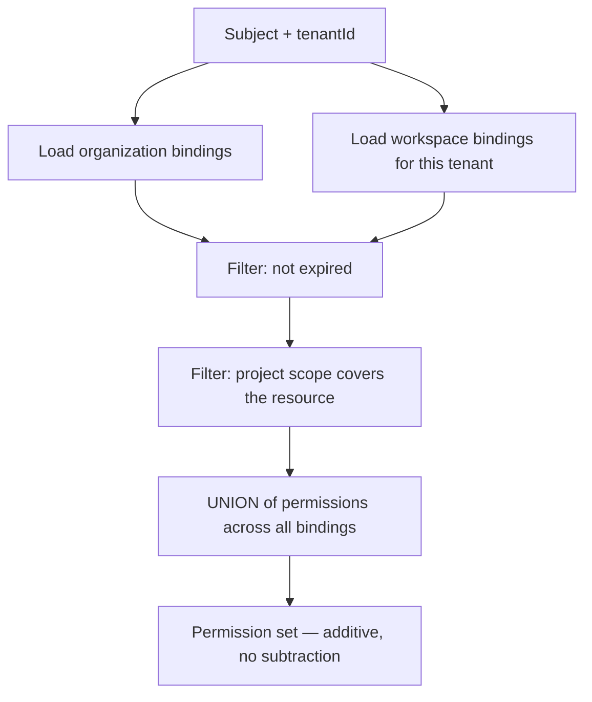

# Role-Based Access Control

> **Status:** v1.0 — complete. New in Phase 9.
> **Permissions are enumerated, never inferred.** There is no wildcard role, no permission that implies another, and no role that bypasses evaluation. This document is the catalogue; `authorization.md` is the engine that reads it.

## Overview

**Business purpose.** Organizations need to delegate: a content lead who manages writers without touching billing, a finance contact who pays invoices without reading drafts, a freelancer scoped to one project for one quarter. RBAC is what makes delegation expressible without handing out more access than the job requires.

**Technical purpose.** Define the permission namespace, the fixed role catalogue at each tier of the tenancy hierarchy, how bindings are stored and resolved, and the rules that keep the model additive and analysable.

**The catalogue is fixed in v1.** Custom roles are a recognised requirement and are deliberately deferred — see *Custom roles* below.

## Responsibilities

- The permission namespace and naming contract.
- The role catalogue at organization, workspace, and project tiers.
- Role binding storage and resolution.
- Scope semantics and inheritance rules.
- Service and system roles.

## Non-responsibilities

| Not owned | Owner |
|---|---|
| Decision evaluation | `authorization.md` |
| Subject identity | `authentication.md` |
| Database tenancy enforcement | `row-level-security.md` |
| Plan entitlements | `04-platform/billing.md` |
| **What a resource is or does** | The owning domain component |

## The permission namespace

```
<resource>:<action>
```

**Lowercase, singular resource, colon-separated, no wildcards.** `article:update`, not `articles:*` or `ARTICLE_UPDATE`.

**Wildcards are prohibited outright.** A wildcard grant silently expands whenever a new permission is added — an administrator who granted `article:*` in March holds `article:export` in June without anyone deciding they should. Every permission a role holds is listed explicitly, so adding a permission to the platform grants it to nobody until a role is edited deliberately.

**No permission implies another.** `article:delete` does not imply `article:read`. A role needing both lists both. Implication hierarchies are compact and become unanalysable: determining what a role can actually do requires transitively closing a graph, and reviewers stop doing that correctly at about the third hop.

### Action vocabulary

| Action | Meaning |
|---|---|
| `read` | Retrieve a single resource or list |
| `create` | Bring into existence |
| `update` | Modify an existing resource |
| `delete` | Remove or soft-delete |
| `manage` | Administer configuration of a resource *class* |
| `execute` | Trigger work — a run, a publish, a replay |
| `export` | Extract data out of the platform |

**`export` is separate from `read` because the risk differs.** Reading an article in the UI and exporting the workspace's entire content library are the same data and materially different exposures. Separating them lets an organization grant broad read access while restricting bulk extraction — the control that matters against insider threat (`threat-model.md`).

**`manage` is class-level, never instance-level.** `member:manage` administers membership generally; there is no `member:manage:<id>`. Instance-level restrictions are expressed by scope, not by permission name.

## Permission catalogue

### Organization tier

| Permission | Grants |
|---|---|
| `organization:read` | View organization profile and settings |
| `organization:update` | Change name, profile, defaults |
| `organization:delete` | Delete the organization and all workspaces |
| `member:read` | List members and their roles |
| `member:manage` | Invite, remove, change roles |
| `billing:read` | View plan, invoices, usage |
| `billing:manage` | Change plan, payment method, cancel |
| `sso:manage` | Configure SSO and domain verification |
| `workspace:create` | Create a workspace |
| `workspace:delete` | Delete a workspace |
| `audit:read` | Read the organization's audit trail |

### Workspace tier

| Permission | Grants |
|---|---|
| `workspace:read` | View workspace settings |
| `workspace:update` | Change workspace settings |
| `project:read` · `project:create` · `project:update` · `project:delete` | Project lifecycle |
| `article:read` · `article:create` · `article:update` · `article:delete` | Article lifecycle |
| `article:execute` | Trigger generation runs |
| `article:export` | Bulk export content |
| `keyword:read` · `keyword:create` · `keyword:update` · `keyword:delete` | Keyword data |
| `research:read` · `research:execute` | Research retrieval and runs |
| `knowledge:read` · `knowledge:update` | Knowledge Platform entities and curation |
| `run:read` · `run:execute` · `run:cancel` | Pipeline runs |
| `integration:read` · `integration:manage` | CMS and analytics connections |
| `publish:execute` | Publish to a connected target |
| `apikey:read` · `apikey:manage` | Workspace API keys |
| `analytics:read` · `analytics:export` | Performance data |

### Platform tier — operators only

| Permission | Grants |
|---|---|
| `dlq:read` · `dlq:manage` | Dead letter queue inspection and intervention |
| `replay:execute` | Event replay (ADR-028) |
| `platform:audit` | Cross-tenant audit access |
| `platform:support` | Time-boxed support access to a tenant |

**Platform-tier permissions are never held by customer subjects.** They belong to operator identities, are granted individually rather than through a customer role, and every use is audited as a cross-tenant operation (`audit.md`).

## Role catalogue

### Organization roles

| Role | Permissions | Intended for |
|---|---|---|
| **Owner** | All organization-tier permissions | Founder, account owner |
| **Admin** | All except `organization:delete`, `billing:manage` | Operations lead |
| **Billing Admin** | `organization:read`, `billing:read`, `billing:manage` | Finance |
| **Member** | `organization:read`, `member:read` | Everyone else |

**At least one Owner must exist at all times.** Removing the last Owner is rejected — an organization with no one able to manage it requires support intervention to recover.

**Billing Admin is deliberately narrow.** Finance contacts need invoices, not drafts. A single "Admin" role covering both is the most common over-grant in B2B SaaS, and it puts content in front of people who never asked for it.

### Workspace roles

| Role | Permissions | Intended for |
|---|---|---|
| **Workspace Admin** | All workspace-tier permissions | Workspace owner |
| **Editor** | All content permissions; `publish:execute`; **no** `apikey:manage`, `integration:manage`, `workspace:update` | Content lead |
| **Contributor** | Read all; create/update articles and keywords; `run:execute`; **no** delete, **no** publish, **no** export | Writer |
| **Viewer** | All `:read` permissions only | Stakeholder, reviewer |

**Contributor cannot publish or export**, which is the distinction that makes the role safe for freelancers and agency staff. They produce work; releasing it externally and extracting it in bulk are separate decisions.

**Viewer holds no `:export`.** Read access in the product is not bulk extraction.

### Project scope

Workspace roles may be **scoped to specific projects**. A scoped Contributor holds Contributor permissions within listed projects and nothing outside them.

```ts
interface RoleBinding {
  subjectId: string;
  subjectKind: 'user' | 'api-key' | 'service';
  role: RoleName;
  tier: 'organization' | 'workspace';
  organizationId: string;
  workspaceId: string | null;    // null for organization-tier
  projectScope: string[] | null; // null = all projects; [] is INVALID
  grantedBy: string;
  grantedAt: Date;
  expiresAt: Date | null;
}
```

**`projectScope: []` is invalid and rejected at write time.** An empty array is ambiguous — it reads as either "no projects" or "unset" — and the two interpretations differ by everything. `null` means all projects; a non-empty array means those projects. The database enforces this with a CHECK constraint rather than trusting callers.

**Bindings may expire.** `expiresAt` supports contractor access without a manual cleanup step that everyone forgets. An expired binding grants nothing; expiry is evaluated at decision time, not by a sweep, so there is no window in which a lapsed grant still works.

## Organization roles do not grant content access

**This is the model's most consequential rule.** An organization Owner has `workspace:create` and `workspace:delete` but **no** `article:read`. Administrative authority over a workspace is not access to its contents.

| Capability | Organization Owner | Workspace Admin |
|---|---|---|
| Create/delete workspace | ✅ | ❌ |
| Manage organization members | ✅ | ❌ |
| Read articles in a workspace | **❌** | ✅ |
| Publish content | **❌** | ✅ |

**An Owner may grant themselves a workspace role at any time — and that grant is a first-class audited event.** The control is not prevention; an account owner can always reach their organization's data, and pretending otherwise would be theatre. The control is that reaching it leaves a record: a visible, alerting, non-repudiable event rather than silent ambient access.

**This is what makes least privilege real at the organization tier.** Without it, every organization Owner permanently holds read access to every workspace, and the principle degrades to a slogan. With it, the default is no access and the exception is recorded.

## Resolution



**Resolution is a union.** A subject holding Editor on a workspace and Member on the organization has both permission sets. There is no precedence between roles and no subtraction, so the result is order-independent — a property that makes the model verifiable by inspection.

**Expiry and scope filter bindings before the union**, never after. Filtering a merged permission set cannot tell which binding contributed which permission.

## Service and system roles

| Role | Permissions | Notes |
|---|---|---|
| `service:worker` | None — operates under event `TenantContext` | RLS-enforced role; no elevated database access |
| `service:relay` | Outbox read/update only | Cannot read tenant content tables |
| `service:ai-gateway` | None on tenant data | Operates on request-supplied context |

**Services hold the minimum and are never granted customer permissions.** A worker processing events for every tenant does not hold cross-tenant read; it operates under the `TenantContext` carried on each event, against an RLS-enforced connection (`tenant-isolation.md`, `13-event-platform/workers.md`).

**`service:relay` is scoped to the outbox alone.** The relay moves rows from `outbox_events` to the bus and has no reason to read an article — so it cannot.

## Custom roles — deferred

Custom roles are a genuine enterprise requirement and are **not in v1**. The fixed catalogue is shipped first because a custom-role system introduces problems that must be decided rather than discovered: whether custom roles may hold platform-tier permissions, how they interact with entitlements, whether they are organization- or workspace-scoped, and how they are exported and audited.

**This is recorded as a Proposed ADR rather than decided here** (`99-open-questions.md`). Adding custom roles later is additive — a `custom_roles` table and a binding that references it — and requires no change to the evaluation engine, because `authorization.md` already reads permissions rather than roles.

## Business rules

1. **Permissions are enumerated constants.** No wildcards.
2. **No permission implies another.**
3. **Roles are additive**; no subtractive grants.
4. **Resolution is a union**, order-independent.
5. **`export` is separate from `read`.**
6. **Organization roles grant no content permissions.**
7. **Self-granting a workspace role is permitted and audited.**
8. **At least one organization Owner must exist.**
9. **`projectScope: []` is invalid**, enforced by CHECK constraint.
10. **Bindings may expire**; expiry is evaluated at decision time.
11. **Platform-tier permissions are never in a customer role.**
12. **Services hold minimum permissions** and no customer permissions.
13. **The catalogue is fixed in v1**; custom roles require an ADR.
14. **Every binding change is audited** with grantor, subject, role, and scope.
15. **Permission names are versioned with the codebase**, never runtime-editable.

## Interfaces

```ts
interface RoleCatalogue {
  permissionsOf(role: RoleName): readonly Permission[];
  rolesAt(tier: 'organization' | 'workspace'): readonly RoleName[];
  isValidPermission(p: string): p is Permission;
}

interface RoleBindingService {
  bind(binding: NewRoleBinding, grantedBy: string): Promise<RoleBinding>;
  unbind(bindingId: string, revokedBy: string): Promise<void>;
  bindingsFor(subjectId: string, organizationId: string): Promise<RoleBinding[]>;
  resolve(subjectId: string, tenantId: string, projectId: string | null): Promise<Set<Permission>>;
}

type Permission = `${ResourceKind}:${ActionName}`;
```

**`Permission` is a template literal type**, so an invalid permission string is a compile error. A typo like `article:updat` fails the build rather than silently denying at runtime — a denial that would look like a legitimate access-control decision in production.

**`resolve` returns a `Set`**, making the additive union explicit in the type and precluding an implementation that accidentally introduces precedence.

## Database impact

**No new tables. No schema change.** Bindings use `organization_memberships` and the workspace membership table defined in Phase 3 (`03-database/tables.md`).

| Constraint | Purpose |
|---|---|
| `CHECK (project_scope IS NULL OR cardinality(project_scope) > 0)` | Rejects the ambiguous empty array |
| `CHECK ((tier = 'organization') = (workspace_id IS NULL))` | Tier and scope cannot disagree |
| Partial unique on `(subject_id, organization_id)` where `role = 'owner'` … | Supports the last-Owner rule |

**The last-Owner rule is enforced transactionally**, not by constraint — it is a count check inside the transaction that removes or demotes a binding, because a constraint cannot express "at least one row must remain."

**`projectScope` is a `uuid[]` column**, not a join table. Scopes are small, read on every decision, and never queried independently; a join table would add a second lookup to the hot path for no benefit.

## Security

- The catalogue is **source-controlled and compiled in**; no runtime role editing exists, so a compromised process cannot mint a permission.
- Binding changes require `member:manage` and are **audited with grantor identity** (`audit.md`).
- **Self-grants are alerted**, not merely logged (`security-observability.md`).
- Expired bindings are filtered at decision time; there is no sweep window.
- Platform-tier grants are issued outside the customer role system entirely and reviewed quarterly.
- Reference `authorization.md` for evaluation and `row-level-security.md` for the independent database enforcement.

## Performance

| Operation | Target |
|---|---|
| `resolve` — cached | **p95 < 3 ms** |
| `resolve` — cold | p95 < 12 ms, two indexed queries |
| Catalogue lookup | In-memory constant; **< 0.1 ms** |
| `bind` / `unbind` | p95 < 30 ms including cache invalidation |

Resolved permission sets are cached for 60 seconds with **synchronous invalidation on binding change**, so revocation is immediate (`authorization.md`).

## Observability

- **Metrics:** `role_bindings_total{role,tier}` (gauge), `binding_changes_total{action,role}`, `self_grants_total{organization}`, `expired_binding_denials_total`, `permission_resolution_duration_seconds`, `owner_count{organization}` (gauge).
- **Logging:** grantor, subject, role, tier, scope, expiry — never resource content.
- **Alerts:** `self_grants_total` non-zero (an Owner granted themselves workspace access — expected occasionally, always reviewed); a subject granted Workspace Admin across many workspaces in a short window (privilege accumulation); `owner_count` reaching 1 (single point of administrative failure); binding changes outside business hours from an unusual source.

## Cross references

- `authorization.md` — the evaluation engine reading this catalogue
- `authentication.md` — the subject bindings attach to
- `row-level-security.md` — independent tenancy enforcement
- `tenant-isolation.md` — scope and `TenantContext`
- `audit.md` — binding-change records
- `threat-model.md` — privilege escalation and insider threat
- `compliance.md` — access review evidence
- `02-domain-design/organizations.md` — the tenancy hierarchy
- `04-platform/billing.md` — entitlements, distinct from permissions
- `01-system-architecture/13-adr-log.md` — ADR-017
