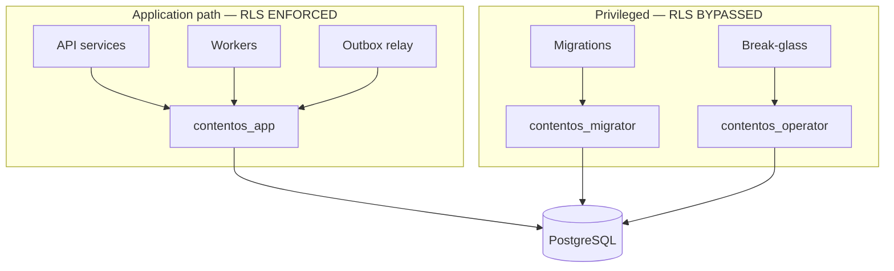

# Row-Level Security

> **Status:** v1.0 — complete. New in Phase 9. **Canonical RLS model.**
> **This is the control that cannot be bypassed by application code.** Every layer above it can be defeated by a forgotten check; RLS is enforced by PostgreSQL against a role that has no permission to see another tenant's rows.

## Overview

**Business purpose.** Multi-tenancy is only sellable if one customer's data is unreachable from another's session — not "unreachable if the code is correct", but unreachable as a property of the database. RLS is what lets the platform make that claim honestly to a security reviewer.

**Technical purpose.** Specify the canonical RLS model: the roles, the session variable that carries tenant context, the policy template applied to every workspace-owned table, the closed exception set, and the failure modes that silently disable the whole mechanism.

**This document references Phase 3 and redesigns nothing.** Table definitions, constraints, and indexes are specified in `03-database/` and are not restated or modified here.

## Responsibilities

- The database role model and their privileges.
- Tenant context propagation into the session.
- The canonical policy template.
- The closed exception set and its justification.
- Connection pooling interaction.
- Verification and failure modes.

## Non-responsibilities

| Not owned | Owner |
|---|---|
| Table, column, index, constraint definitions | `03-database/` |
| Role and permission logic | `rbac.md` |
| Decision evaluation | `authorization.md` |
| `TenantContext` in application code | `tenant-isolation.md` |
| Migration mechanics | `03-database/migrations.md` |

## The tenancy key

**`tenant_id` *is* the workspace id.** Not a reference to one, not derived from one — the same value. This is ADR-017 and it is what makes a single-column policy sufficient across the entire schema.

| Column | Role |
|---|---|
| `tenant_id` | **The RLS key.** Present on every workspace-owned table. Equals the workspace id. |
| `organization_id` | Denormalized commercial boundary. **Never the RLS key.** |

**`organization_id` is deliberately not the isolation key**, even though it is present on the same rows. Isolating at the organization tier would let any member of an organization read every workspace within it, which contradicts the RBAC model where organization roles grant no content access (`rbac.md`). It exists for billing aggregation and for efficient organization-scoped reporting, not for isolation.

**Every workspace-owned table carries `tenant_id` directly.** No table determines its tenant by joining to a parent. A policy requiring a join is a policy that can be defeated by a query the planner reorders, and it makes every read pay for a join it did not need.

## Role model



| Role | `BYPASSRLS` | Used by | Notes |
|---|---|---|---|
| **`contentos_app`** | **No** | All application code, workers, relay | The only role in the request path |
| `contentos_migrator` | No — but table owner | Migrations only | Owns tables; DDL only |
| `contentos_operator` | **Yes** | Break-glass only | Human-initiated, audited, time-boxed |

**`contentos_app` must never hold `BYPASSRLS`.** This is the single most important database privilege statement in the platform. A role with `BYPASSRLS` ignores every policy, silently — no error, no log, just full visibility. Granting it to the application role would disable tenant isolation platform-wide while every test still passed.

**`contentos_app` is not the table owner**, and that is deliberate. **A table's owner bypasses RLS by default**, regardless of policies. If the application connected as the owner, RLS would be inert. Ownership sits with `contentos_migrator`, which never serves requests.

**`contentos_operator` exists because break-glass access is real.** Pretending no privileged path exists drives operators to share the migrator credential instead. It requires human initiation, is time-boxed, and every session is audited (`incident-response.md`).

## FORCE ROW LEVEL SECURITY

```sql
ALTER TABLE articles ENABLE ROW LEVEL SECURITY;
ALTER TABLE articles FORCE ROW LEVEL SECURITY;
```

**Both statements are required on every RLS-protected table.** `ENABLE` activates policies for ordinary roles; **`FORCE` additionally applies them to the table owner.**

Without `FORCE`, any connection as the owning role sees every tenant's rows. That includes migrations, ad-hoc maintenance scripts, and any future service that is granted ownership for convenience. `FORCE` closes the gap that `ENABLE` alone leaves open — and its absence is invisible until it matters.

**CI verifies that every workspace-owned table has both.** A table created with `ENABLE` but not `FORCE` fails the build (see *Verification*).

## Tenant context propagation

```sql
BEGIN;
SET LOCAL app.tenant_id = '018f...';   -- from TenantContext, never from client input
SELECT * FROM articles WHERE status = 'draft';
COMMIT;
```

**`SET LOCAL`, never `SET`.** `SET LOCAL` is scoped to the transaction and reverts on commit or rollback. A plain `SET` persists on the connection — and when that connection returns to the pool, the next borrower inherits the previous tenant's context. That is a cross-tenant leak produced by a single missing keyword.

**The value comes from `TenantContext`**, which is resolved from the authenticated subject and the addressed resource (`tenant-isolation.md`). It is never taken from a header, a query parameter, or a request body.

**Absence of the setting denies everything.** The policy uses `current_setting('app.tenant_id', true)`, whose second argument returns `NULL` rather than raising when the setting is missing. A `NULL` tenant matches no row, so a connection that forgot to set context reads zero rows and writes nothing.

**Failing closed on a missing setting is the correct default and it is verified by test.** The alternative — raising an exception — sounds stricter but produces a 500 that a caller may retry, and encourages a `try/catch` that swallows it. Returning no rows is unambiguous and safe.

## The canonical policy

Applied identically to every workspace-owned table:

```sql
CREATE POLICY tenant_isolation ON articles
  FOR ALL
  TO contentos_app
  USING      (tenant_id = current_setting('app.tenant_id', true)::uuid)
  WITH CHECK (tenant_id = current_setting('app.tenant_id', true)::uuid);
```

| Clause | Governs | Omission causes |
|---|---|---|
| `USING` | Which rows are **visible** to `SELECT`, `UPDATE`, `DELETE` | Cross-tenant reads |
| `WITH CHECK` | Which rows may be **written** by `INSERT`, `UPDATE` | **Writing rows into another tenant** |

**`WITH CHECK` is the clause that gets forgotten, and its absence is worse than a read leak.** With `USING` alone, a subject can `INSERT` a row carrying another tenant's `tenant_id` — injecting data into a tenant they cannot even read. Detection is unlikely, because the writer never sees the result.

**`FOR ALL` covers every command with one policy.** Separate per-command policies are permitted by PostgreSQL and are a maintenance hazard: four policies per table across a large schema means a missing `DELETE` policy on one table goes unnoticed. One policy, one shape, verified uniformly.

**The policy is identical on every table.** Not similar — identical, differing only in table name. Uniformity is what makes automated verification possible: any deviation is a finding, without a human deciding whether a variation is legitimate.

## The exception set — exactly five tables

| Table | Why it cannot be tenant-scoped |
|---|---|
| `users` | One person belongs to many organizations; identity spans tenants |
| `organizations` | The organization *contains* workspaces; it is above the boundary |
| `organization_memberships` | Resolves which tenants a subject may reach — consulted **before** tenant context exists |
| `verified_domains` | Domain ownership is organization-level and consulted at login, pre-tenant |
| `sso_configurations` | SSO is resolved from the email domain before any workspace is known |

**All five sit above the workspace boundary, and their common property is the reason.** Each is consulted at a point in the request lifecycle where `tenant_id` is not yet known — during authentication, or while determining which tenants the subject may access. A tenant-scoped policy on a table needed to *determine the tenant* is circular.

**The set is closed. A sixth requires an ADR** (`03-database/tables.md`). This is not bureaucratic friction: every exception is a table where isolation is enforced by application code alone, and the count of such tables is the honest measure of how much of the isolation guarantee rests on code review.

**Exception tables are protected by explicit application-layer filtering**, and their access paths are enumerated and tested (`tenant-isolation.md`). `organization_memberships` is the most sensitive — an unfiltered read reveals the membership graph across all customers.

**ADR-025 (Proposed) would add a second bounded class** for reference data — shared, non-tenant, read-only lookup tables. It is not accepted, so **no such table exists today**, and any reference data must currently carry `tenant_id` like everything else (`99-open-questions.md`).

## Connection pooling

**This is where correct RLS breaks in production.**

| Pool mode | `SET LOCAL` safe? | Verdict |
|---|---|---|
| Session pooling | Yes | Safe, poor connection reuse |
| **Transaction pooling** | **Yes — `SET LOCAL` is transaction-scoped** | **Required mode** |
| Statement pooling | **No** | **Prohibited** |

**Transaction pooling is the required mode**, and it works precisely because `SET LOCAL` is bound to the transaction that the pooler keeps intact. The connection is returned only at commit, after the setting has reverted.

**Statement pooling is prohibited outright.** It may route statements of one logical transaction to different backend connections, so `SET LOCAL` and the query it protects can land on different connections — the query then runs with no tenant context or, worse, with another transaction's. Under statement pooling, RLS provides no guarantee at all.

**Every query must run inside an explicit transaction.** An autocommit statement outside a transaction has no `SET LOCAL` scope to inherit; it reads zero rows, which fails safely but breaks the feature. The data access layer opens a transaction and sets context as one unit, so the unsafe combination is not constructible.

## Verification

RLS correctness is asserted by automated tests, not by review (`10-testing/`):

| Test | Asserts |
|---|---|
| **Schema conformance** | Every non-exception table has `ENABLE` **and** `FORCE` and exactly the canonical policy |
| **Read isolation** | Tenant A's context returns zero rows of tenant B, on every table |
| **Write isolation** | Inserting a row with tenant B's id under tenant A's context is **rejected** |
| **Missing context** | No context returns zero rows and rejects writes |
| **Role privileges** | `contentos_app` lacks `BYPASSRLS` and owns no tables |
| **Pool mode** | The configured mode is transaction pooling |
| **Exception count** | Exactly five tables lack RLS — a sixth fails the build |

**The exception-count test is the one that prevents drift.** A developer adding a table and forgetting RLS produces a sixth exception; the build fails naming the table. Without it, the omission is invisible until a security review or a leak.

**Tests run against a real PostgreSQL instance**, never a mock. RLS is a database behaviour, and a mocked database asserts the test's assumptions rather than PostgreSQL's semantics.

## Failure modes

| Failure | Symptom | Consequence |
|---|---|---|
| `contentos_app` granted `BYPASSRLS` | **None — everything works** | Total isolation loss |
| `FORCE` omitted | None, until something connects as owner | Owner-path leak |
| `SET` instead of `SET LOCAL` | None, intermittent under load | Cross-tenant leak via pooled connections |
| `WITH CHECK` omitted | None | Cross-tenant **writes** |
| Statement pooling enabled | Intermittent empty results | RLS unenforced |
| Query outside a transaction | Empty results | Fails safe; feature broken |
| Sixth exception table added | None | Silent isolation gap |

**Six of these seven have no symptom.** That is the defining property of RLS failure: it does not produce errors, slow queries, or alerts — the application keeps working, and returns more data than it should. Verification must therefore be automated and continuous, because nothing else will surface it.

**Only the last two fail closed.** Every other failure fails *open*, which is why the tests target them specifically.

## Business rules

1. **`tenant_id` is the RLS key and equals the workspace id.**
2. **`organization_id` is never the isolation key.**
3. **`contentos_app` never holds `BYPASSRLS`** and never owns tables.
4. **Every workspace-owned table has `ENABLE` and `FORCE`.**
5. **The canonical policy is identical on every table**, with `USING` and `WITH CHECK`.
6. **Context is set with `SET LOCAL`**, from `TenantContext`, never client input.
7. **Missing context returns zero rows and rejects writes.**
8. **The exception set is exactly five tables**; a sixth requires an ADR.
9. **Transaction pooling is required; statement pooling is prohibited.**
10. **Every query runs inside an explicit transaction.**
11. **Exception tables are filtered in application code**, with enumerated access paths.
12. **`contentos_operator` is break-glass only**, time-boxed and audited.
13. **RLS conformance is verified by automated tests** against real PostgreSQL.
14. **RLS never substitutes for authorization**, and authorization never substitutes for RLS.

## Interfaces

```ts
interface TenantScopedConnection {
  withTenant<T>(ctx: TenantContext, work: (tx: Transaction) => Promise<T>): Promise<T>;
  withoutTenant<T>(reason: ExceptionTableAccess, work: (tx: Transaction) => Promise<T>): Promise<T>;
}

type ExceptionTableAccess =
  | 'authentication'        // users, sso_configurations, verified_domains
  | 'membership-resolution' // organization_memberships
  | 'organization-admin';   // organizations
```

**`withTenant` is the only ordinary data access path.** It opens the transaction, issues `SET LOCAL`, runs the work, and commits — so a caller cannot obtain a connection without context.

**`withoutTenant` requires a typed reason**, drawn from a closed union naming the three legitimate cases. It cannot be called for a general query, its uses are countable by grep, and each is reviewed. An untyped escape hatch would be used for convenience within a month.

## Database impact

**No new tables, no schema change, no redesign.** This document specifies policies and roles over the schema defined in `03-database/`. Policy and role creation are ordinary migrations (`03-database/migrations.md`).

**New tables are RLS-protected in the same migration that creates them.** A table created in one migration and secured in a later one is unprotected in production for the interval between deploys.

## Security

- RLS is **defense in depth**, not the only tenancy control; `authorization.md` enforces independently and neither is trusted alone.
- `contentos_operator` sessions are **time-boxed, individually approved, and fully audited** (`audit.md`).
- Credentials for all three roles are managed through `secrets-management.md` and rotated on schedule.
- **Read replicas enforce identical policies**; a replica without RLS would be a complete bypass, and analytics or reporting paths are the usual way this is introduced.
- Backups contain all tenants' data and are protected by encryption and access control (`encryption.md`); RLS does not apply to a restored dump.
- Reference `tenant-isolation.md` for isolation beyond PostgreSQL — cache, vectors, events, storage.

## Performance

| Concern | Approach |
|---|---|
| Policy evaluation | Predicate merged into the query plan; **no measurable overhead** |
| Index requirement | **Every index on a workspace-owned table leads with `tenant_id`** |
| Planner behaviour | `current_setting` is stable within a statement; evaluated once |
| Connection overhead | One `SET LOCAL` per transaction; negligible |

**Leading every index with `tenant_id` is what makes RLS free.** The policy predicate becomes the first index condition rather than a filter applied after retrieval. An index not led by `tenant_id` forces a scan across all tenants' rows followed by a discard — correct, but with cost proportional to total table size rather than to the tenant's share. This is specified in `03-database/indexes.md` and is a performance requirement created by a security control.

## Observability

- **Metrics:** `rls_context_missing_total{table}` (**must be zero**), `rls_policy_violations_total{table}`, `exception_table_access_total{reason}`, `operator_sessions_total`, `rls_conformance_check_failures_total`.
- **Logging:** tenant id, table, operation for exception-table access; `contentos_operator` sessions logged in full with the initiating human.
- **Alerts:** `rls_context_missing_total` non-zero (**page** — a code path is reaching the database without context); `rls_policy_violations_total` non-zero (**page — invariant breach**: an attempted cross-tenant write); `contentos_operator` session opened (**page** — always, every time); conformance check failure in CI or production (**page**); exception-table access from an unenumerated call site.

**A `contentos_operator` session pages unconditionally.** Break-glass access is legitimate and rare; a page is not an accusation but a guarantee that no privileged session happens unobserved.

## Cross references

- `tenant-isolation.md` — isolation outside PostgreSQL, `TenantContext` lifecycle
- `authorization.md` — the independent application-layer control
- `rbac.md` — why organization tier is not the isolation key
- `audit.md` — operator sessions and exception-table access records
- `secrets-management.md` — database role credentials
- `encryption.md` — backups and replicas
- `threat-model.md` — cross-tenant leakage
- `03-database/tables.md` — schema and the exception set
- `03-database/indexes.md` — `tenant_id`-leading index requirement
- `03-database/migrations.md` — policy and role migrations
- `10-testing/` — RLS conformance tests
- `01-system-architecture/13-adr-log.md` — ADR-017, ADR-025 (Proposed)
