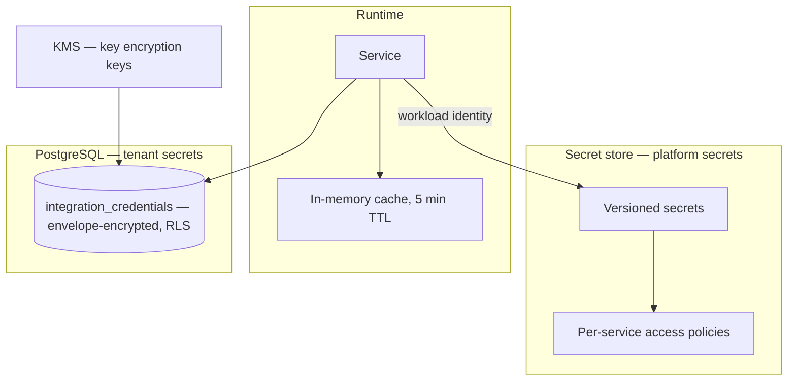

# Secrets Management

> **Status:** v1.0 — complete. New in Phase 9.
> **A secret that has been written to a log is already compromised.** Rotation, revocation, and least privilege are the controls that limit the damage; keeping secrets out of every observable surface is what prevents it.

## Overview

**Business purpose.** ContentOS holds two categories of credential: its own — database roles, signing keys, provider API keys — and its customers' — CMS publishing tokens, analytics OAuth grants. A leak of the first compromises the platform; a leak of the second compromises a customer's website, which is the more damaging of the two commercially.

**Technical purpose.** Define the secret lifecycle: classification, storage, access, versioning, rotation, revocation, and emergency replacement — with a rotation model that does not require a deployment.

**Two classes, two mechanisms.** Platform secrets live in a secret store, outside the database. Tenant secrets live in the database, envelope-encrypted and RLS-protected. The distinction runs through this entire document.

## Responsibilities

- Secret classification and inventory.
- Storage for platform and tenant secrets.
- Access control and least privilege.
- Versioning and overlapping-validity rotation.
- Revocation and emergency replacement.
- Environment separation.
- Access audit trail.

## Non-responsibilities

| Not owned | Owner |
|---|---|
| Encryption algorithms and key derivation | `encryption.md` |
| Data-encryption key lifecycle | `encryption.md` |
| Provider credential *usage* | `09-integrations/` |
| API key issuance to customers | `authentication.md` |
| Database role privileges | `row-level-security.md` |

**`encryption.md` owns cryptographic keys; this document owns everything else.** The boundary: a key that encrypts data is a cryptographic concern; a credential that authenticates to a service is a secret. Both rotate, and the mechanisms differ enough to warrant separate treatment.

## Classification

| Class | Examples | Storage | Rotation | Blast radius |
|---|---|---|---|---|
| **Platform · critical** | DB role passwords, JWT signing key, master encryption key | Secret store | 90 days | Total |
| **Platform · provider** | OpenRouter, DataForSEO, Firecrawl, Exa, Stripe | Secret store | 180 days | Provider account |
| **Platform · integration** | Webhook signing secrets | Secret store, per-integration | 180 days | One integration |
| **Tenant** | CMS tokens, OAuth refresh tokens | **Database, envelope-encrypted** | Customer-controlled | One customer |
| **Ephemeral** | Presigned URLs, service tokens, reset tokens | Never stored | Expiry only | Single use |

**Tenant secrets are deliberately not in the secret store.** They number in the tens of thousands, are created and revoked by customers at their own pace, and must be tenant-scoped. Secret stores are built for hundreds of operator-managed values, not for per-row customer data — using one here would put tenant data outside RLS and make erasure unverifiable (`compliance.md`).

**Tenant secrets are envelope-encrypted with a per-tenant data key** and stored in a workspace-owned, RLS-protected table. A database compromise alone does not yield usable credentials; the key encryption key lives in the KMS (`encryption.md`).

**Ephemeral secrets are never persisted.** A presigned URL, a service token, and a password reset token are all bearer credentials whose only control is a short lifetime. Storing one for debugging turns a 15-minute exposure into a permanent one.

## Storage



| Rule | Rationale |
|---|---|
| **Never in source control** | Git history is permanent; a committed secret is compromised even after removal |
| **Never in container images** | Images are distributed and cached across registries and hosts |
| **Never in environment variables at rest** | Readable via `/proc`, crash dumps, and most process inspectors |
| **Fetched at startup and on refresh** | Rotation takes effect without redeployment |
| Cached in memory, 5-minute TTL | Bounds staleness after rotation |
| Never written to disk | Including temp files and core dumps |

**Environment variables are permitted only as the bootstrap credential** — the workload identity that lets a service authenticate to the secret store. That single value is injected by the platform, is short-lived, and grants nothing except the ability to fetch the secrets the service is authorized for.

**This is the practical compromise.** A truly zero-secret bootstrap requires hardware attestation the deployment targets do not uniformly provide (`14-operations/deployment.md`). One bootstrap credential with a narrow policy is a far smaller surface than a dozen provider keys in the environment.

**Core dumps are disabled in production**, because a dump contains every secret the process had in memory.

## Access control

**Each service holds a policy naming exactly the secrets it needs.**

| Service | May read |
|---|---|
| API | DB app role, JWT signing key, Stripe |
| Worker | DB app role, provider keys, KMS key ids |
| Relay | DB app role only |
| Migration job | DB migrator role only |

**No service holds a policy granting all secrets**, and there is no wildcard. The relay moves outbox rows to the bus and has no reason to hold a provider key — so it cannot read one, and a compromised relay yields one credential rather than the platform.

**Access is by workload identity, not by a shared credential.** Each service authenticates as itself, so access is attributable and revocable per service.

**Human access is separate and stricter.** No engineer holds standing read access to production secrets. Retrieval is break-glass: individually approved, time-boxed, fully audited, and it **triggers rotation of the retrieved secret** — a secret a human has seen is treated as exposed, which removes the temptation to read one "just to check."

## Versioning

```ts
interface SecretVersion {
  secretId: string;
  version: number;
  state: 'pending' | 'current' | 'previous' | 'revoked';
  createdAt: Date;
  activatedAt: Date | null;
  retiredAt: Date | null;
}
```

**Two versions are valid simultaneously during rotation.** `current` is used for new operations; `previous` remains accepted for verification until the overlap window closes.

**Overlapping validity is what makes zero-downtime rotation possible.** Without it, the instant a secret changes, every in-flight request signed with the old value fails, and every service that has not yet refreshed its cache is broken. The overlap must exceed the cache TTL plus the longest legitimate token lifetime.

| Secret | Overlap window |
|---|---|
| JWT signing key | 24 hours — exceeds max access token lifetime |
| Webhook signing secret | 7 days — external senders update slowly |
| Provider API key | 1 hour — internal use only |
| Database role password | 15 minutes — connection pool cycle |

**Webhook secrets get seven days because the other party controls the update.** A CMS platform may take days to apply a new secret, and a shorter window silently breaks inbound publishing.

## Rotation

```mermaid
sequenceDiagram
    participant SCH as Scheduler
    participant SS as Secret store
    participant SVC as Services
    participant EXT as External system

    SCH->>SS: create version N+1 (pending)
    SS->>EXT: register new credential where applicable
    SS->>SS: promote N+1 to current; N becomes previous
    SVC->>SS: refresh on cache expiry (≤ 5 min)
    Note over SVC: both N and N+1 accepted during overlap
    SCH->>SS: overlap elapsed — revoke N
    SS->>EXT: deregister old credential
```

**Rotation is scheduled and automatic**, not a manual runbook. A rotation requiring human steps is a rotation that stops happening after the second quarter.

**Rotation is independent of deployment.** Services refresh from the store on a timer; no redeploy, no restart, no configuration change. Coupling rotation to deploys means the rotation schedule becomes the deploy schedule.

**Verification precedes revocation.** Before revoking version N, the store confirms the new version is in active use — otherwise a rotation that silently failed to propagate takes the platform down when the old version is revoked.

**Failed rotation alerts and retains the old version.** The failure mode must be "rotation did not happen" rather than "both versions are invalid."

## Revocation

| Trigger | Response |
|---|---|
| Scheduled rotation | Graceful, with overlap |
| Suspected compromise | **Immediate, no overlap** |
| Employee departure | Rotate everything they could reach |
| Provider breach notice | Immediate, coordinated with the provider |
| Break-glass human access | Automatic rotation after use |

**Emergency revocation deliberately breaks in-flight work.** The overlap window that makes ordinary rotation seamless is exactly the window an attacker would use, so it is skipped. Emergency revocation is expected to cause errors — that is the trade being made knowingly.

**Emergency replacement is a documented, rehearsed procedure** (`incident-response.md`): revoke, generate, propagate, verify, audit. It is rehearsed because it is executed under pressure and touches the credentials that make the platform work.

**Every secret has a documented blast radius**, recorded in the inventory, so an incident responder knows what a given compromise reaches without reasoning it out mid-incident.

## Environment separation

| Environment | Secret store | Provider keys | Data |
|---|---|---|---|
| Production | Isolated instance | Live | Real |
| Staging | Separate instance | **Separate test keys** | Anonymized |
| Development | Local, dummy values | Sandbox | Synthetic |
| CI | Ephemeral, per-run | Mocked | Synthetic |

**No production secret exists outside production.** Not in staging, not on a developer machine, not in CI. Staging holding a production provider key means every engineer with staging access effectively holds production credentials.

**Cross-environment access is impossible by construction**, not by policy: environments use separate secret store instances with separate identity providers, so a staging workload identity cannot authenticate to the production store even if it tried.

**CI secrets are ephemeral and scoped to a single run.** A long-lived CI credential is reachable by anyone who can modify a workflow file.

## Secrets and AI models

**Secrets are never visible to AI models. This is an absolute rule with three enforcement points.**

| Point | Control |
|---|---|
| **Context Builder** | Constructs the `ContextManifest` from typed sources; secret-bearing fields are structurally excluded |
| **Prompt assembly** | Assembled from allowlisted fields, never by serializing an object graph |
| **Output scanning** | Model output is scanned for credential patterns before storage or display |

**The threat is prompt injection.** A competitor's page fetched during research may contain instructions telling the model to emit its configuration or repeat its system context (`threat-model.md`). If a secret were ever in the context window, that instruction could exfiltrate it into an article draft.

**Structural exclusion is the control, not filtering.** Filtering a prompt for secrets requires knowing what every secret looks like and catching every encoding. The Context Builder instead assembles from typed, allowlisted sources, so a secret has no path into a prompt at all (`08-ai-platform/context-builder.md`).

**Output scanning is defense in depth**, catching a model that hallucinates a plausible key or echoes something injected — and its detections are security signals, not content-quality findings.

## Secrets in observable surfaces

**Never in logs, event payloads, audit records, traces, metrics, or error responses.**

| Surface | Control |
|---|---|
| Logs | Structured only; redacting serializer for known secret fields |
| Event payloads | Registration rejects credential-patterned fields (`13-event-platform/event-registry.md`) |
| Audit records | Record *that* a secret was accessed, never its value (`audit.md`) |
| Traces | Attributes are allowlisted; headers never attached |
| Error responses | Provider errors never forwarded (`api-security.md`) |
| Metrics | Bounded, registry-derived labels only |

**Audit records name the secret, never its value.** "`actor X read secret stripe-api-key version 4`" is the useful record; including the value would make the audit log the highest-value target in the platform — and it is append-only, so a leak there is permanent and unredactable.

**Redaction is by allowlisted output, not blocklisted input.** A blocklist of field names fails the moment someone adds `apiToken` next to the `apiKey` on the list. Loggers serialize explicitly-permitted fields, so a new field is invisible until deliberately added.

**CI scans for committed secrets** on every commit and blocks the merge. Pre-commit hooks are advisory — they are bypassable and not every contributor installs them.

## Business rules

1. **Secrets never appear in logs, event payloads, audit records, traces, metrics, or responses.**
2. **Secrets are never visible to AI models**, enforced structurally at the Context Builder.
3. **Applications never hardcode secrets**; CI blocks committed secrets.
4. **Platform secrets live in the secret store; tenant secrets are envelope-encrypted in the database.**
5. **Environment variables carry only the bootstrap workload identity.**
6. **Each service holds a policy naming exactly the secrets it needs.** No wildcards.
7. **No standing human access to production secrets.**
8. **Break-glass retrieval triggers rotation of the retrieved secret.**
9. **Two versions are valid during rotation**; overlap exceeds cache TTL plus token lifetime.
10. **Rotation is scheduled, automatic, and independent of deployment.**
11. **Revocation verifies new-version adoption first**; failed rotation retains the old version.
12. **Emergency revocation skips the overlap** and is expected to break in-flight work.
13. **No production secret exists outside production.**
14. **Every secret access is audited** with actor, secret id, version, and purpose.
15. **Core dumps are disabled in production.**

## Interfaces

```ts
interface SecretStore {
  get(secretId: string): Promise<SecretValue>;          // current version
  getVersion(secretId: string, version: number): Promise<SecretValue>;
  rotate(secretId: string): Promise<RotationResult>;
  revoke(secretId: string, version: number, reason: RevocationReason): Promise<void>;
  emergencyReplace(secretId: string, actor: string, reason: string): Promise<RotationResult>;
}

interface SecretValue {
  readonly value: string;
  readonly version: number;
  toString(): '[REDACTED]';     // prevents accidental interpolation
  toJSON(): '[REDACTED]';       // prevents accidental serialization
}

interface TenantCredentialStore {
  put(ctx: TenantContext, kind: CredentialKind, plaintext: string): Promise<string>;
  use<T>(ctx: TenantContext, id: string, work: (secret: string) => Promise<T>): Promise<T>;
  revoke(ctx: TenantContext, id: string): Promise<void>;
}
```

**`SecretValue` overrides `toString` and `toJSON` to return `[REDACTED]`.** This is the highest-leverage line in the document: template interpolation and `JSON.stringify` are how secrets reach logs, and both call these methods. The accident becomes structurally impossible rather than a review item.

**`TenantCredentialStore.use` never returns the plaintext.** It passes the decrypted value into a callback and discards it — so a caller cannot hold it, store it, or return it up the stack. There is deliberately no `get` method.

## Database impact

**No new tables.** Tenant credentials use `integration_credentials` as defined in Phase 3 (`03-database/tables.md`), which is workspace-owned and RLS-protected under the standard policy.

**Ciphertext, key id, and algorithm identifier are stored; plaintext never is.** The key id makes rotation possible without re-encrypting every row (`encryption.md`).

## Security

- The secret store is the **only** source of platform secrets; no fallback path exists.
- **Fail closed**: a service that cannot fetch a required secret fails to start rather than running degraded.
- Secret store access is over mTLS with workload identity.
- Every access is audited; **anomalous patterns alert** (`security-observability.md`).
- Tenant credentials are decrypted only in memory, only inside `use`, and are never logged or cached.
- Reference `encryption.md` for envelope encryption and `incident-response.md` for emergency replacement.

## Performance

| Operation | Target |
|---|---|
| Secret fetch — cached | **< 0.1 ms**, in-memory |
| Secret fetch — cold | p95 < 50 ms |
| Tenant credential decrypt | **p95 < 10 ms** — cached data key, KMS not called per use |
| Rotation | Background; no request-path impact |

**The KMS is not called per credential use.** Data keys are cached per tenant with a short TTL; calling the KMS on every publish would add latency and cost proportional to traffic (`encryption.md`).

## Observability

- **Metrics:** `secret_accesses_total{secret_id,service}`, `secret_rotations_total{secret_id,outcome}`, `secret_rotation_age_days{secret_id}` (gauge), `secret_fetch_failures_total{secret_id}`, `break_glass_accesses_total{actor}`, `committed_secret_blocks_total`, `tenant_credential_decrypts_total`.
- **Logging:** secret id, version, service, actor, purpose — **never values**.
- **Alerts:** any break-glass access (**page** — every time); `secret_rotation_age_days` exceeding policy (**page** — an overdue critical secret); rotation failure (**page**); `secret_fetch_failures_total` spike (store unreachable — services will fail to start); a service reading a secret outside its policy (**page** — misconfiguration or compromise); `committed_secret_blocks_total` non-zero (a secret nearly entered source control).

## Cross references

- `encryption.md` — envelope encryption, KMS, key lifecycle
- `authentication.md` — JWT signing keys, API key hashing
- `row-level-security.md` — database role credentials
- `tenant-isolation.md` — tenant credential scoping
- `audit.md` — secret access records
- `incident-response.md` — emergency replacement procedure
- `threat-model.md` — credential theft, prompt injection, supply chain
- `api-security.md` — webhook signing secrets
- `08-ai-platform/context-builder.md` — structural exclusion from prompts
- `09-integrations/` — provider credential usage
- `13-event-platform/event-registry.md` — credential-pattern rejection in payloads
- `14-operations/deployment.md` — workload identity bootstrap
