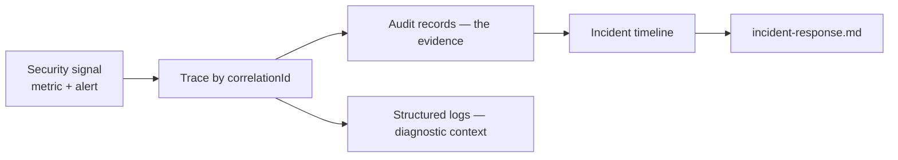

# Security Observability

> **Status:** v1.0 — complete. New in Phase 9.
> **Most security metrics have a target of zero.** They are not percentile objectives to be tuned — they are invariants, and a single non-zero reading is an incident. The meaningful SLOs here measure *time to detect* and *time to contain*, not availability.

## Overview

**Business purpose.** Security failures are quiet. A cross-tenant leak returns a 200. A stolen session behaves like a legitimate one. An exfiltrating insider uses features exactly as designed. Without deliberate telemetry, the first notification is a customer, a researcher, or a regulator.

**Technical purpose.** Define the security metric catalogue, the trace correlation model that links a signal to its evidence, alert routing by severity class, dashboards, and security SLIs and SLOs.

**The boundary.** `14-operations/monitoring.md` owns the metrics infrastructure. `13-event-platform/observability.md` owns event-platform signals. **This document owns security semantics**: which signals indicate compromise, which are invariants, and what must page.

## Responsibilities

- The security metric catalogue with frozen names.
- Trace correlation from signal to audit evidence.
- Alert classification and routing.
- Security dashboards.
- Security SLIs and SLOs.
- Detection coverage mapping.

## Non-responsibilities

| Not owned | Owner |
|---|---|
| Metrics infrastructure and retention | `14-operations/monitoring.md` |
| Event platform signals | `13-event-platform/observability.md` |
| Incident procedure | `incident-response.md` |
| Audit record content | `audit.md` |
| Threat definitions | `threat-model.md` |

## Two classes of signal

| | **Invariant** | **Rate** |
|---|---|---|
| Target | **Zero** | A threshold or baseline |
| Examples | Cross-tenant attempts, RLS violations, audit write failures | Authentication failures, rate-limit rejections |
| Alerting | **Page at count one** | Threshold and duration, or anomaly |
| Meaning | A guarantee has broken | Activity worth attention |
| Aggregation | **Never** | Yes |

**Invariants are never aggregated into a digest.** Cross-tenant isolation, audit immutability, and RLS enforcement are guarantees other components are built against; a single violation means something now-unknown is possible, and the damage compounds while it is batched for a morning report.

**Rate signals need baselines, not fixed thresholds.** Fifty authentication failures per minute is normal at 09:00 Monday and suspicious at 03:00 Sunday. Static thresholds are either too noisy to keep or too loose to catch anything.

## Metric catalogue

Names are **frozen**. No component emits an alternate name for a catalogued concept.

### Identity and access

| Metric | Class | Labels |
|---|---|---|
| `auth_attempts_total` | rate | `method`, `outcome` |
| `auth_failures_total` | rate | `method`, `reason_class` |
| `mfa_challenges_total` | rate | `factor`, `outcome` |
| `refresh_reuse_detected_total` | **invariant** | — |
| `session_revocations_total` | rate | `reason` |
| `step_up_challenges_total` | rate | `operation`, `outcome` |
| `sso_assertions_total` | rate | `outcome` |
| `api_key_uses_total` | rate | `workspace` |

**`reason_class` is coarse by design** — `credential`, `locked`, `mfa` — never the specific failure, which would rebuild the enumeration oracle `authentication.md` closes.

### Authorization

| Metric | Class | Labels |
|---|---|---|
| `authz_decisions_total` | rate | `action`, `effect`, `reason` |
| `authz_denials_total` | rate | `reason` |
| **`authz_cross_tenant_attempts_total`** | **invariant** | `action` |
| `authz_fail_closed_total` | **invariant** | `cause` |
| `self_grants_total` | rate | `organization` |
| `expired_binding_denials_total` | rate | — |

**`authz_fail_closed_total` is an invariant even though failing closed is correct behaviour.** It means evaluation is *erroring* — cache unreachable, resource unresolvable — and legitimate users are being denied. Correct, but broken.

### Tenant isolation

| Metric | Class |
|---|---|
| **`cross_tenant_attempts_total{surface}`** | **invariant** |
| **`tenant_context_missing_total{entry_point}`** | **invariant** |
| **`cache_key_unscoped_total`** | **invariant** |
| **`vector_foreign_tenant_results_total`** | **invariant** |
| **`rls_policy_violations_total{table}`** | **invariant** |
| `rls_context_missing_total{table}` | **invariant** |
| `exception_table_access_total{reason}` | rate |
| `operator_cross_tenant_operations_total` | **invariant** |

**Six of the eight are invariants**, which reflects that isolation is the platform's load-bearing guarantee. Every one has a target of zero and pages at count one.

### Secrets and encryption

| Metric | Class |
|---|---|
| `secret_accesses_total{secret_id,service}` | rate |
| **`break_glass_accesses_total{actor}`** | **invariant** |
| `secret_rotation_age_days{secret_id}` | threshold |
| `secret_rotations_total{outcome}` | rate |
| **`secret_fetch_failures_total`** | **invariant** |
| **`committed_secret_blocks_total`** | **invariant** |
| `kms_calls_total{operation,outcome}` | rate |
| **`encryption_failures_total{operation}`** | **invariant** |
| `key_rotation_age_days{scope}` | threshold |
| `deprecated_key_references{key_id}` | gauge |
| **`key_destroy_total{forced}`** | **invariant** |

**Break-glass access is an invariant, not a rate.** It is legitimate and expected occasionally — the invariant framing means every occurrence is seen, not that it is forbidden. Unobserved privileged access is the failure being prevented.

**`encryption_failures_total` non-zero means either corruption or a missing key**, both of which put data at risk of being permanently unreadable.

### Audit

| Metric | Class |
|---|---|
| **`audit_write_failures_total`** | **invariant** |
| **`chain_verification_total{outcome="invalid"}`** | **invariant** |
| `audit_records_total{action,result}` | rate |
| `audit_reads_total{scope}` | rate |
| **`audit_cross_tenant_reads_total`** | **invariant** |
| `audit_exports_total{actor}` | rate |
| `export_record_count` | histogram |

**`audit_write_failures_total` is the most serious invariant in this document.** A failed audit write means either an action was refused because it could not be recorded — acceptable but visible — or, if the atomicity guarantee has broken, an action proceeded unaudited. The second is unfalsifiable after the fact, which is why the first non-zero reading pages.

### Platform and workers

| Metric | Class |
|---|---|
| **`worker_identity_failures_total{service}`** | **invariant** |
| **`event_context_validation_failures_total`** | **invariant** |
| `event_security_rejections_total{reason}` | rate |
| `replay_runs_total{mode,outcome}` | rate |
| **`replay_deleted_tenant_skips_total`** | rate — **investigated** |
| `dlq_interventions_total{action}` | rate |
| `mtls_handshake_failures_total{service}` | rate |

**`worker_identity_failures_total` catches a service authenticating as something it is not** — a misconfiguration or a compromised workload identity. Under zero trust, an internal caller failing authentication is exactly as significant as an external one.

**`replay_deleted_tenant_skips_total` is a rate that is always investigated.** A skip is correct behaviour — erased data must not be resurrected — but a non-zero value means a replay was scoped to include an erased tenant, which is a scoping error worth understanding.

### API surface

| Metric | Class |
|---|---|
| `rate_limit_rejections_total{scope}` | rate |
| **`ssrf_blocks_total{reason}`** | **invariant** |
| `csrf_failures_total` | rate |
| `webhook_signature_failures_total{source}` | rate |
| `webhook_replay_rejections_total` | rate |
| `validation_failures_total{route,field}` | rate |
| `upload_rejections_total{reason}` | rate |

**`ssrf_blocks_total` is an invariant because a block means someone submitted a URL resolving to a private address.** Legitimate users do not. Every occurrence is a probe or a bug.

## Trace correlation



**Four identifiers connect a signal to its evidence**, and all four are mandatory on security telemetry:

| Identifier | Role |
|---|---|
| `correlationId` | Groups everything caused by one originating request, across services and asynchronous work |
| `tenantId` | Which customer is affected — **span attribute, never a metric label** |
| `actorId` | Who did it |
| `auditId` | The immutable evidence record |

**`tenantId` is never a metric label.** Per-tenant cardinality multiplies every time series by the customer count and would take down the metrics backend before any attack did. Per-tenant analysis is derived from logs and audit records on demand — the same discipline as `13-event-platform/observability.md`.

**`correlationId` is the pivot for every investigation.** From an alert to the request that caused it, to every event it produced, to every audited action across every service — one query (`audit.md`, `AuditReader.timeline`).

**Security-relevant traces are always sampled.** Head-based sampling drops most traces; an invariant breach dropped by a 1% sampler is a correctness incident with no trace attached, at the moment the trace matters most.

## Alerting

### Page immediately — count of one

| Alert | Signal | Meaning |
|---|---|---|
| **Cross-tenant breach** | `cross_tenant_attempts_total`, `rls_policy_violations_total`, `cache_key_unscoped_total`, `vector_foreign_tenant_results_total` | Isolation has failed or is being probed |
| **Audit failure** | `audit_write_failures_total`, `chain_verification_total{outcome="invalid"}` | Evidence is missing or altered |
| **Secret exposure** | `committed_secret_blocks_total`, anomalous `secret_accesses_total`, policy-violating access | A credential may be compromised |
| **RLS bypass** | `rls_context_missing_total`, conformance-check failure | The database control is not enforcing |
| **Key compromise** | `key_destroy_total{forced}`, `encryption_failures_total` | Irreversible or data at risk |
| **Replay abuse** | `replay_runs_total{outcome="failed"}`, zero duplicates suppressed where overlap expected | Duplicate effects may have occurred |
| **Credential abuse** | `refresh_reuse_detected_total` | Token theft |
| **Threat detection** | `ssrf_blocks_total`, `worker_identity_failures_total`, `authz_cross_tenant_attempts_total` | Active probing |
| **Privileged session** | `break_glass_accesses_total`, `contentos_operator` connection | Elevated access in use |

**Every entry above pages regardless of magnitude and is never rate-limited into a digest.**

### Threshold and anomaly

| Alert | Condition |
|---|---|
| Credential stuffing | `auth_failures_total` spike from one source or across many accounts |
| Impossible travel | Successful logins from distant geographies within an implausible interval |
| Exfiltration | `export_record_count` above tenant baseline |
| Privilege accumulation | One subject granted Workspace Admin across many workspaces quickly |
| Overdue rotation | `secret_rotation_age_days` or `key_rotation_age_days` past policy |
| Stalled re-encryption | `deprecated_key_references` not decreasing |
| Enumeration | `validation_failures_total` or 404 rate spike on id-bearing routes |
| MFA erosion | Enrolment drop in an enforcing organization |

**Exfiltration detection is baseline-relative per tenant.** An agency exporting 5,000 articles weekly is normal; the same volume from a tenant that has never exported is not. A global threshold cannot express that.

## Dashboards

| Dashboard | Contents | Audience |
|---|---|---|
| **Invariant board** | Every zero-target metric, current and 24 h | On-call — **all green or there is an incident** |
| Identity | Auth rates, MFA, SSO, session revocations, geography | Security |
| Access | Denials by reason, cross-tenant attempts, self-grants, binding changes | Security |
| Secrets & keys | Rotation age, break-glass, KMS health, re-encryption progress | Security, platform |
| Audit health | Write rate, failures, chain verification, export volume | Security, compliance |
| Threat activity | SSRF blocks, webhook failures, rate limits, validation spikes | Security |

**The invariant board is the primary on-call artifact and is designed to be boring.** Every panel reads zero. There are no thresholds to interpret and no judgement required — a non-zero panel is an incident, which makes it usable at 03:00 by someone who did not build it.

## Security SLIs and SLOs

**Availability percentages are the wrong frame.** "99.9% of requests were properly isolated" concedes that one in a thousand was not.

| SLI | SLO | Class |
|---|---|---|
| **Isolation integrity** | **100%** — zero cross-tenant events | Invariant |
| **Audit completeness** | **100%** — zero write failures, zero chain breaks | Invariant |
| **Time to detect** | p95 < 5 min for invariant breaches | Objective |
| **Time to page** | p95 < 60 s from signal to notification | Objective |
| **Time to contain** | p95 < 60 min for Critical (`incident-response.md`) | Objective |
| Secret rotation currency | 100% within policy age | Objective |
| Key rotation currency | 100% within policy age | Objective |
| MFA coverage | 100% in enforcing organizations | Objective |
| Detection coverage | 100% of threat-model threats have a signal | Objective |
| Patch currency | Critical CVEs remediated < 7 days | Objective |

**Time to detect and time to contain are the SLOs that actually improve security posture.** The invariants are binary and non-negotiable; what varies — and what can be measurably improved — is how fast a breach is noticed and stopped.

**Detection coverage is measured, not assumed.** Every threat in `threat-model.md` maps to a signal here; a threat with no signal is an accepted risk and is labelled as one. The mapping is verified when the threat model is reviewed quarterly.

## Business rules

1. **Metric names are frozen.**
2. **Invariant metrics have a target of zero** and page at count one.
3. **Invariant alerts are never aggregated, digested, or rate-limited.**
4. **`tenantId` is a span attribute and log field, never a metric label.**
5. **All four correlation identifiers accompany security telemetry.**
6. **Security-relevant traces are always sampled.**
7. **Rate alerts are baseline-relative** where behaviour is tenant-dependent.
8. **Failure reasons in metrics are coarse**, preventing enumeration oracles.
9. **Secrets, payloads, and credentials never appear** in metrics, logs, traces, or alerts.
10. **Every threat-model threat maps to a signal**; gaps are labelled accepted risks.
11. **The invariant board is all-zero by design.**
12. **Detection SLOs measure time to detect and contain**, not availability.

## Interfaces

```ts
interface SecurityTelemetry {
  recordInvariantBreach(breach: SecurityInvariantBreach): void;
  recordSecurityEvent(event: SecurityEvent): void;
  correlate(correlationId: string): Promise<IncidentTimeline>;
}

interface SecurityInvariantBreach {
  kind: 'cross-tenant' | 'rls-violation' | 'audit-failure' | 'chain-tampering'
      | 'secret-exposure' | 'key-compromise' | 'replay-abuse' | 'credential-abuse'
      | 'worker-identity' | 'cache-unscoped' | 'vector-isolation';
  tenantId: string | null;
  actorId: string | null;
  correlationId: string;
  auditId: string | null;
  detail: string;          // NEVER contains data, secrets, or payloads
}

interface IncidentTimeline {
  correlationId: string;
  auditRecords: AuditRecord[];
  spans: SpanSummary[];
  affectedTenants: string[];
  firstEventAt: Date;
  lastEventAt: Date;
}
```

**`recordInvariantBreach` is separate from `recordSecurityEvent`** so that reporting a breach cannot be mistaken for reporting a metric. It always pages, always logs at `error`, always samples the trace, and never batches — routing that would be easy to get wrong on a shared code path.

**`IncidentTimeline` returns `affectedTenants` explicitly**, because scope determination is the first question in every isolation incident and the answer drives notification obligations (`compliance.md`).

## Database impact

**No new tables and no schema change.** Metrics and traces export via OpenTelemetry (`14-operations/monitoring.md`); evidence lives in `audit_log` (`audit.md`).

**`IncidentTimeline` queries `audit_log` by `correlation_id`**, served by the index specified in `audit.md`. That index exists for exactly this query.

## Security

- **Security telemetry is itself protected**: metrics and dashboards require the security capability, and `IncidentTimeline` requires `platform:audit` for cross-tenant scope.
- **`detail` fields are sanitised** — classifications and identifiers only, never data, secrets, or payloads.
- Alert channels are authenticated; alert bodies carry identifiers and links, never content.
- **Telemetry pipeline failure is itself alerted.** A blind detection layer is indistinguishable from a quiet platform, which is the condition an attacker most wants.
- Reference `incident-response.md` for what happens after an alert fires.

## Performance

| Concern | Approach |
|---|---|
| Metric recording | In-process counters; **< 0.1 ms**, no hot-path I/O |
| Cardinality | Bounded labels; no `tenant_id`, `actor_id`, or `event_id` |
| Invariant breach path | Bypasses sampling and batching; **< 5 ms** to alert queue |
| `IncidentTimeline` | Indexed on `correlation_id`; **p95 < 500 ms** |
| Baseline computation | Precomputed hourly, not per evaluation |

**Cardinality discipline is what keeps the detection layer alive under attack.** An attack generating millions of distinct values would, with unbounded labels, take down the metrics backend — disabling detection precisely when it is needed.

## Observability of the observability

- `security_alerts_fired_total{severity,kind}`, `security_alert_latency_seconds`, `telemetry_pipeline_failures_total`, `detection_coverage_ratio`, `invariant_metrics_reporting` (gauge — **a metric that stops reporting is itself an alert**).
- **A silent invariant metric is alerted.** A counter reading zero because nothing bad happened and one reading zero because the emitting code was removed are indistinguishable without a liveness signal — the same silence-detection principle applied to consumer groups in `13-event-platform/observability.md`.

## Cross references

- `threat-model.md` — the threats these signals detect
- `incident-response.md` — response procedures triggered by these alerts
- `audit.md` — evidence and `timeline`
- `tenant-isolation.md` · `row-level-security.md` — isolation invariants
- `secrets-management.md` · `encryption.md` — secret and key signals
- `authentication.md` · `authorization.md` · `rbac.md` — identity and access signals
- `api-security.md` — API surface signals
- `compliance.md` — export and erasure signals
- `14-operations/monitoring.md` — metrics infrastructure
- `13-event-platform/observability.md` — event platform signals and the silence-alert precedent
