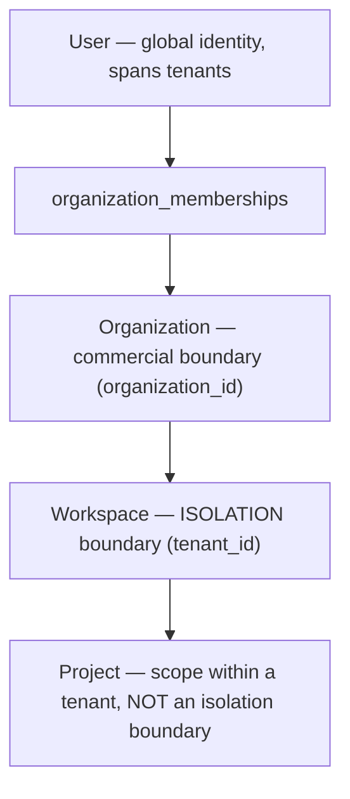
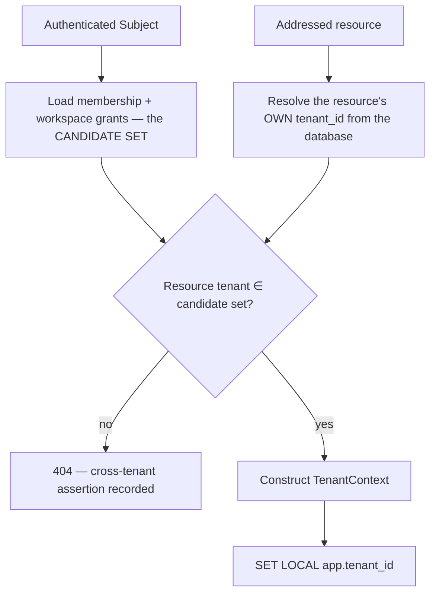

# Tenant Isolation

> **Status:** v1.0 — complete. New in Phase 9. **Canonical.**
> **This is the single authority on tenant isolation for the entire platform.** Every folder — Platform, AI, Knowledge, Event, Storage — references this document rather than defining its own model. Cross-tenant access is a security incident, not a bug.

## Overview

**Business purpose.** ContentOS holds one customer's unpublished drafts, competitive research, and performance data in the same infrastructure as their direct competitors'. Isolation is not a feature of the product; it is the precondition for the product existing.

**Technical purpose.** Define `TenantContext` — its lifecycle, its immutability, and how it is established, propagated, and enforced across every subsystem that touches tenant data: PostgreSQL, Redis, pgvector, R2, the event platform, and background workers.

**Why one canonical document.** Isolation fails at seams. Each subsystem enforcing its own model correctly still leaks where two of them meet — a cache populated under one context and read under another, an event handler that inherits ambient context from whatever ran before it. A single specification is what makes the seams checkable.

## Responsibilities

- The `TenantContext` type and its lifecycle.
- Establishment rules and the prohibition on payload-derived tenancy.
- Propagation across process, transaction, and asynchronous boundaries.
- Per-subsystem isolation: database, cache, vector, storage, event, audit.
- Cross-tenant assertion and incident classification.

## Non-responsibilities

| Not owned | Owner |
|---|---|
| RLS policies, roles, pooling | `row-level-security.md` |
| Permission evaluation | `authorization.md` |
| Subject identity | `authentication.md` |
| Vector index structure | `11-knowledge-platform/embedding-pipeline.md` |
| Cache invalidation strategy | `04-platform/caching.md` |
| Event delivery mechanics | `13-event-platform/` |
| **Any business rule** | The owning domain component |

## The tenancy model



| Tier | Identifier | Is it an isolation boundary? |
|---|---|---|
| Organization | `organization_id` | **No.** Commercial and billing boundary only |
| **Workspace** | **`tenant_id`** | **Yes. The only one.** |
| Project | `project_id` | No. A scope enforced by authorization |

**`tenant_id` *is* the workspace id** — the same value, not a reference (ADR-017). This is what makes a single-column predicate sufficient across the entire schema.

**The organization is not an isolation boundary**, which follows from `rbac.md`: organization roles grant no content access, so members of an organization must not automatically read every workspace within it. `organization_id` exists on rows for billing aggregation and reporting, never for isolation.

**Project scope is authorization, not isolation.** A scoped Contributor is confined to certain projects by policy evaluation. That confinement is enforced in the application; it is not backed by RLS, and it is not a security boundary of the same class. Two projects in one workspace share a tenant.

## TenantContext

```ts
interface TenantContext {
  readonly tenantId: string;        // the workspace — the isolation key
  readonly organizationId: string;  // commercial boundary, carried for audit and billing
  readonly source: 'request' | 'event' | 'replay' | 'scheduled';
  readonly establishedAt: Date;
}
```

**Immutable, and enforced by the type.** All fields are `readonly`; there is no setter, no mutation method, and no re-scoping operation. Work for a different tenant requires constructing a new context — which forces the establishment rules to run again rather than letting a value be edited in place.

**`source` is retained for audit and diagnostics**, distinguishing a context derived from an authenticated request from one reconstructed off an event. It is never used to vary enforcement: an event-sourced context is exactly as constrained as a request-sourced one.

**There is no `TenantContext.none()` and no nullable variant.** Code paths that legitimately operate outside tenancy — authentication, membership resolution — use the typed exception path in `row-level-security.md` (`withoutTenant`), not an empty context. A nullable context would be checked inconsistently and would eventually be treated as permissive.

## Establishment

**Two rules that must be read together:**

1. **The tenant is never read from a request payload, header, or query parameter.**
2. **The candidate tenant set comes from the authenticated identity; the addressed resource selects which one.**



**This reconciles the two statements that could read as contradictory.** `authorization.md` states the tenant is resolved from the resource; this document states it derives from authenticated identity. Both hold, and neither alone is sufficient:

- **Identity alone** cannot pick a tenant when a user belongs to twelve workspaces.
- **Resource alone** would let any caller reach any resource by addressing it.

The resource proposes; identity disposes. A resource whose `tenant_id` is outside the subject's candidate set is not merely denied — the attempt is a cross-tenant assertion (see below).

**A workspace selector in a request is a *hint*, never a source of truth.** The UI sends the active workspace so the server can scope a listing, and the server intersects it with the candidate set. A hint naming a workspace the subject cannot reach yields an empty result, never an error that confirms the workspace exists.

**Creation is the one case with no resource to resolve.** Creating an article specifies the target workspace explicitly, and the value is validated against the candidate set before the context is built. The `WITH CHECK` clause then independently rejects a row written into any other tenant (`row-level-security.md`).

## Propagation

```ts
function withTenantContext<T>(ctx: TenantContext, work: () => Promise<T>): Promise<T>;
```

**Context is passed explicitly, never read from a global.** It travels as a parameter or through an `AsyncLocalStorage` scope bound by `withTenantContext` — and the scope is established at exactly three entry points: the API request handler, the event delivery path, and the scheduled-job runner.

**Ambient context inherited across work items is the failure this design prevents.** A worker that sets context once and processes a queue of events for different tenants leaks the first tenant's context into the rest. Every event delivery opens its own scope, so there is nothing to inherit.

## Database isolation

Fully specified in `row-level-security.md`. The interaction points:

| Concern | Behaviour |
|---|---|
| Context → session | `SET LOCAL app.tenant_id` inside the transaction |
| Missing context | Zero rows returned; writes rejected |
| Cross-tenant write | Rejected by `WITH CHECK` |
| Application role | `contentos_app`, never `BYPASSRLS`, never table owner |
| Exception tables | Five, closed; typed `withoutTenant` access only |

**Application authorization and RLS enforce tenancy independently**, and neither is trusted alone (`README.md`).

## Cache isolation

```
cos:{tenantId}:{namespace}:{key}
```

**Every cache key begins with the tenant id.** Not contains it — begins with it, so the prefix is scannable and a whole tenant's cache is deletable with one pattern.

```ts
interface TenantScopedCache {
  get<T>(ctx: TenantContext, namespace: string, key: string): Promise<T | null>;
  set<T>(ctx: TenantContext, namespace: string, key: string, value: T, ttl: number): Promise<void>;
  invalidateTenant(ctx: TenantContext): Promise<number>;
}
```

**The context is a required first parameter on every method.** A cache API that accepted a bare key would eventually be called with one, and an unprefixed key is shared state between tenants — the exact condition the "no shared tenant state" principle forbids.

**Cache poisoning across tenants is the risk this prevents.** A key like `keywords:seo-tools` populated by tenant A and read by tenant B returns A's data to B, with no database involvement and therefore no RLS protection. Caches sit *in front of* the control that enforces isolation, which is why they must carry it themselves.

**Global caches exist and are strictly non-tenant.** Provider rate-limit state, model catalogues, feature flags — data owned by no tenant. They use a reserved `cos:global:` prefix, and CI rejects a global-namespace write whose value derives from tenant data.

## Vector search isolation

**Vector search is tenant-filtered at query time, never post-filtered on results.** This is one of the platform's non-negotiable invariants (`README.md`).

```ts
interface VectorSearch {
  search(ctx: TenantContext, query: number[], k: number, filter?: Filter): Promise<Match[]>;
}
```

```sql
SELECT id, embedding <=> $1 AS distance
FROM knowledge_embeddings
WHERE tenant_id = current_setting('app.tenant_id', true)::uuid
ORDER BY embedding <=> $1
LIMIT $2;
```

**Post-filtering leaks two ways, and both are severe:**

1. **Result count leaks existence.** Requesting k=10 and receiving 3 after filtering tells the caller that 7 semantically similar documents exist in other tenants — a measurable signal about competitors' content, obtainable by probing.
2. **Any filter bug returns content directly.** A post-filter is a line of application code; when it fails, the retrieved rows are already in memory and headed for a response.

**Pre-filtering also happens to be correct for relevance.** Post-filtering k=10 across all tenants returns fewer than 10 usable results and misses the tenant's own nearer neighbours — so the secure design is also the accurate one.

**The tenant predicate must be part of the index scan**, satisfied by the `tenant_id`-leading composite index (`03-database/indexes.md`). A filter applied after an approximate-nearest-neighbour scan is post-filtering wearing a `WHERE` clause.

**AI Memory follows the same rule and is never a source of truth** (ADR-026). It is tenant-scoped, non-authoritative, and never merged with the Knowledge Platform.

## Object storage isolation

```
{bucket}/{tenantId}/{resourceType}/{resourceId}/{filename}
```

**Tenant id is the first path segment**, making bucket policies and lifecycle rules expressible per tenant and making a whole tenant's objects enumerable for erasure (`compliance.md`).

| Control | Rule |
|---|---|
| Object keys | Always tenant-prefixed |
| Access | **Presigned URLs only** — the bucket is never public |
| URL lifetime | 15 minutes, single resource |
| Upload | Presigned PUT with content-type and size constraints |
| Path traversal | Keys constructed server-side from validated ids; client input never concatenated |

**Presigned URLs are bearer credentials and are treated as such.** Anyone holding one has access for its lifetime, which is why the lifetime is short and each URL names one object. They are never logged (`secrets-management.md`).

**The key is constructed, never accepted.** A client-supplied path segment permits traversal into another tenant's prefix; the server builds the key from `ctx.tenantId` and validated resource ids.

## Event isolation

**Every outbound event carries tenant identifiers.** `tenantId` and `organizationId` are mandatory, non-nullable envelope fields (`13-event-platform/event-apis.md`) — an event cannot be constructed without them.

**Every inbound delivery reconstructs and validates context:**

```ts
async function deliver(entry: DeliveredEvent) {
  const ctx = TenantContext.fromEvent(entry.event);   // throws if absent or malformed
  await withTenantContext(ctx, () => handler.handle(entry.event, ctx, tx, signal));
}
```

**Validation is not merely presence.** The tenant must exist, must not be deleted, and `organizationId` must match the workspace's actual organization. An event whose identifiers disagree with the database is treated as poisoned and dead-lettered rather than handled (`13-event-platform/dead-letter-queue.md`).

**Event payloads carry identifiers, never content or credentials** — enforced at registration (`13-event-platform/event-registry.md`). Events fan out to notification channels and webhook subscribers with weaker controls than the source table, so a payload is the wrong place for anything sensitive.

**Streams are shared across tenants and that is safe by design.** One stream per event type, all tenants interleaved (`13-event-platform/event-bus.md`). Isolation comes from per-delivery context and RLS at the point of data access — not from stream separation, which would multiply topology by tenant count and still not protect a handler that ignored context.

## Background workers

**Workers hold no elevated privileges.** They connect as `contentos_app` with RLS enforced — identical to the request path. A background process granted broader access "because it processes all tenants" is the most common way isolation fails in systems that otherwise enforce it correctly (`13-event-platform/workers.md`).

**Context is restored per work item, before any business logic runs**, and is torn down after. The scope is bound by the delivery path, so a handler cannot execute outside one.

**Cross-tenant scheduled jobs iterate tenant by tenant**, each iteration in its own context and its own transaction. Retention sweeps and reconciliation never issue a single cross-tenant query — one query returning every tenant's rows is precisely the object RLS exists to prevent, and it would require a privileged role to run.

## Replay isolation

**Replay restores the original `TenantContext` from each event's envelope** — not the operator's, not the current session's (`13-event-platform/replay.md`).

| Property | Rule |
|---|---|
| Context source | The replayed event's own `tenantId` / `organizationId` |
| Privilege | Replay workers use `contentos_app`; no elevation |
| Operator authority | Governs *which events* replay, never *what access* the handler gets |
| Cross-tenant replay | Platform-operator only, audited as a cross-tenant operation |
| Deleted tenant | Events for a deleted tenant are **skipped and recorded**, never delivered |

**An operator triggering a replay does not lend their privileges to the handlers.** The operator's authority is the decision to replay; each delivered event then executes under its own original context. Otherwise a replay would run every handler with operator-level reach.

**Skipping events for deleted tenants matters for erasure.** Replaying an event belonging to an erased tenant would resurrect data that was deliberately destroyed (`compliance.md`).

## Audit isolation

**Audit records carry `tenantId` and `organizationId` and are readable only by subjects with `audit:read` in that organization** (`rbac.md`).

**Cross-tenant audit access requires the `platform:audit` permission** and is itself audited — reading the audit log is an auditable event. Without that, an operator could inspect every tenant's activity without leaving a trace, which defeats the purpose of an audit trail.

**Audit records are append-only and never deleted** — including under erasure, where they are redacted rather than removed (`audit.md`, `compliance.md`).

## Cross-tenant assertions

**A cross-tenant access attempt is a security incident**, not an ordinary denial.

| Signal | Meaning |
|---|---|
| Resource tenant outside the candidate set | IDOR probe or a resolution bug |
| `rls_policy_violations_total` non-zero | An attempted cross-tenant **write** |
| Cache read returning a foreign-tenant value | Key construction defect |
| Vector result with a foreign `tenant_id` | Pre-filter failure |
| Event context disagreeing with the database | Poisoned or corrupted event |

**All five page at count one.** Legitimate clients do not address resources in tenants they have no membership in. A single occurrence is either an attack or a bug in tenant resolution, and both are urgent.

**Assertions are compiled in, not conditional on environment.** A production build that skipped the checks would remove detection exactly where it matters:

```ts
function assertTenantMatch(ctx: TenantContext, row: { tenantId: string }): void {
  if (row.tenantId !== ctx.tenantId) {
    throw new CrossTenantViolation(ctx.tenantId, row.tenantId);
  }
}
```

**This is defense in depth against RLS itself.** RLS should make a foreign row unreachable; the assertion catches the case where it did not — a misconfigured policy, a missing `FORCE`, a query that ran outside a transaction.

## Business rules

1. **`tenant_id` is the workspace id and the only isolation boundary.**
2. **`organization_id` is never the isolation key.**
3. **Project scope is authorization, not isolation.**
4. **`TenantContext` is immutable**; re-scoping constructs a new one.
5. **Tenant is never read from a payload, header, or query parameter.**
6. **Identity bounds the candidate set; the resource selects within it.**
7. **Context is passed explicitly**, scoped at three entry points only.
8. **Every cache key is tenant-prefixed**; global caches are reserved and non-tenant.
9. **Vector search filters at query time**, never post-filters.
10. **Object keys are tenant-prefixed and server-constructed.**
11. **Every event carries `tenantId` and `organizationId`**, non-nullable.
12. **Every delivery reconstructs and validates context** against the database.
13. **Workers hold no elevated privileges.**
14. **Cross-tenant jobs iterate tenant by tenant.**
15. **Replay restores the event's original context**, never the operator's.
16. **Cross-tenant assertions are compiled in** and page at count one.
17. **Cross-tenant access is a security incident.**

## Interfaces

```ts
interface TenantContextFactory {
  fromRequest(subject: Subject, resource: ResourceRef): Promise<TenantContext>;
  fromEvent(event: DomainEvent<unknown>): TenantContext;          // throws if invalid
  fromSchedule(tenantId: string, job: string): Promise<TenantContext>;
}

interface TenantIsolation {
  withTenantContext<T>(ctx: TenantContext, work: () => Promise<T>): Promise<T>;
  assertTenantMatch(ctx: TenantContext, row: { tenantId: string }): void;
  currentContext(): TenantContext;   // throws outside a scope — never returns null
}
```

**`currentContext()` throws rather than returning null.** A nullable accessor invites `ctx?.tenantId`, which silently produces `undefined` and a query matching nothing — or worse, a cache key of `cos:undefined:`, shared across every context that made the same mistake.

**`fromEvent` throws on malformed identifiers** rather than returning a partial context, so an event missing tenancy cannot be handled at all.

## Database impact

**No new tables, no schema change.** Isolation uses `tenant_id` and `organization_id` as defined in Phase 3 (`03-database/tables.md`) with the policies in `row-level-security.md`.

**Every index on a workspace-owned table leads with `tenant_id`** (`03-database/indexes.md`) — the requirement that makes the RLS predicate an index condition rather than a post-scan filter.

## Security

- Isolation is enforced at **four independent layers**: authorization, RLS, tenant-scoped subsystem APIs, and compiled-in assertions. No single layer is load-bearing.
- **Presigned URLs, cache values, and vector payloads are never logged.**
- Cross-tenant operations by platform operators are **time-boxed, individually approved, and audited** (`incident-response.md`).
- Deleted tenants are excluded from replay, scheduled jobs, and search (`compliance.md`).
- Reference `threat-model.md` for the leakage paths this model closes and the residual risks it does not.

## Performance

| Concern | Approach |
|---|---|
| RLS predicate | Merged into the plan; free given `tenant_id`-leading indexes |
| Context establishment | One membership lookup, cached 60 s with synchronous invalidation |
| Cache key construction | String concatenation; negligible |
| Vector pre-filter | **Faster** than post-filtering — smaller candidate set |
| Assertions | One comparison per row batch; **< 0.01 ms** |

**Pre-filtering vector search is the case where security and performance agree.** Restricting the ANN scan to one tenant's vectors searches a smaller index region and returns more relevant results than filtering a global top-k afterwards.

## Observability

- **Metrics:** `cross_tenant_attempts_total{surface}`, `tenant_context_missing_total{entry_point}` (**must be zero**), `cache_key_unscoped_total` (**must be zero**), `vector_foreign_tenant_results_total` (**must be zero**), `event_context_validation_failures_total`, `replay_deleted_tenant_skips_total`, `operator_cross_tenant_operations_total`.
- **Tracing:** `tenant_id` is a span attribute on every operation; **never a metric label** — per-tenant cardinality would multiply every time series by the customer count (`13-event-platform/observability.md`).
- **Logging:** tenant id, organization id, context source, entry point — never payloads, cache values, or presigned URLs.
- **Alerts — all page at count one:** `cross_tenant_attempts_total`, `tenant_context_missing_total`, `cache_key_unscoped_total`, `vector_foreign_tenant_results_total`, `rls_policy_violations_total`, and any `contentos_operator` session.

**These are invariant breaches, not SLO degradations** — the same treatment given to ordering violations in `13-event-platform/observability.md` and provenance integrity in `11-knowledge-platform/observability.md`.

## Cross references

- `row-level-security.md` — the database enforcement this depends on
- `authorization.md` — resource-based tenant resolution; the independent control
- `rbac.md` — why the organization tier is not an isolation boundary
- `authentication.md` — the `Subject` contexts derive from
- `audit.md` — audit isolation and cross-tenant access records
- `compliance.md` — erasure, deleted tenants, legal hold
- `threat-model.md` — cross-tenant leakage and vector search leakage
- `04-platform/caching.md` — cache strategy under these key rules
- `11-knowledge-platform/retrieval-pipeline.md` — vector retrieval
- `13-event-platform/event-apis.md` — the envelope's tenancy fields
- `13-event-platform/workers.md` · `replay.md` — worker and replay context
- `03-database/tables.md` · `indexes.md` — tenancy columns and index requirement
- `01-system-architecture/13-adr-log.md` — ADR-017, ADR-026
