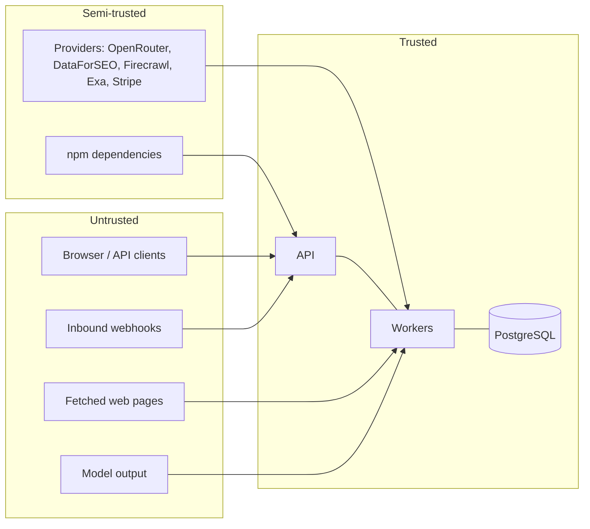

# Threat Model

> **Status:** v1.0 — complete. New in Phase 9. **Canonical.**
> **Twenty-five threats, each with an attack path, mitigations that name an implemented control, and an honestly stated residual risk.** Threats deliberately outside scope are listed rather than omitted.

## Overview

**Business purpose.** A threat model that lists only defeated threats is marketing. This one records what the platform defends against, how, and what remains — because the residual risks are what incident response must be ready for and what enterprise security reviews will ask about.

**Technical purpose.** Enumerate attack paths against ContentOS, map each to the controls that mitigate it, and state the residual exposure, detection signal, and recovery path.

**Every mitigation names a specified control.** A mitigation that cannot cite a document in this folder is not a mitigation; it is an intention. Where a control does not yet exist, the residual risk says so.

## Trust boundaries

**Fetched web pages and model output sit in the untrusted zone.** This is the boundary most often drawn wrongly: a competitor's page retrieved during research is attacker-influenced content, and a model's output is derived from it. Both are sanitised before use.

## Severity model

| Severity | Definition |
|---|---|
| **Critical** | Cross-tenant data exposure, audit compromise, or platform-wide credential loss |
| **High** | Single-tenant data exposure, privilege escalation, or service-wide outage |
| **Medium** | Degraded service, limited disclosure, or abuse requiring valid credentials |
| **Low** | Nuisance, cost impact, or requiring implausible preconditions |

---

## Identity and access

**T-01 · Identity spoofing** — *High*
Attacker forges a session token, SAML assertion, or IdP subject to authenticate as another user.
| | |
|---|---|
| **Impact** | Full account takeover within the victim's tenants |
| **Mitigations** | Opaque 256-bit session ids, server-side lookup; SAML signature verification against pinned IdP certificates; **accounts link by IdP subject, never email** (`authentication.md`) |
| **Residual** | A compromised IdP issues valid assertions — outside platform control |
| **Detection** | `sso_assertions_total{outcome="invalid"}`; login from anomalous geography |
| **Recovery** | Revoke all sessions for the user; rotate IdP trust; audit timeline by `correlationId` |

**T-02 · Authentication bypass** — *Critical*
Attacker reaches an endpoint that skipped the authentication middleware.
| | |
|---|---|
| **Impact** | Unauthenticated access to tenant data |
| **Mitigations** | Authentication is pipeline-ordered, not per-route opt-in (`api-security.md`); **RLS returns zero rows without tenant context**, so an unauthenticated path reads nothing (`row-level-security.md`) |
| **Residual** | A route bypassing both the pipeline and the data layer — requires two independent errors |
| **Detection** | `tenant_context_missing_total` — must be zero |
| **Recovery** | Patch route; audit for prior access via the same path |

**T-03 · Credential theft** — *High*
Password, API key, or refresh token obtained via phishing, stuffing, or a leaked repository.
| | |
|---|---|
| **Impact** | Access at the victim's privilege level |
| **Mitigations** | Argon2id; **refresh token rotation with reuse detection revoking the whole family**; WebAuthn preferred, **SMS refused**; API keys hashed with plaintext prefix for secret scanning; per-account and per-source rate limiting (`authentication.md`) |
| **Residual** | A stolen valid session before detection; 15-minute access token window |
| **Detection** | `refresh_reuse_detected_total` > 0 (**page**); impossible-travel; `api_key_uses_total` from a new source |
| **Recovery** | Revoke sessions and keys; force re-authentication; rotate |

**T-04 · Privilege escalation** — *Critical*
Subject obtains permissions beyond their role via mass assignment, wildcard grant, or role confusion.
| | |
|---|---|
| **Impact** | Administrative control of an organization |
| **Mitigations** | **No wildcards; no permission implies another**; roles additive, resolution is a union (`rbac.md`); `.strict()` schemas reject unknown keys, defeating mass assignment (`api-security.md`); **API keys bounded by their creator's current permissions** |
| **Residual** | An organization Owner can self-grant workspace access — permitted, audited, alerted |
| **Detection** | `self_grants_total`; Workspace Admin granted across many workspaces quickly |
| **Recovery** | Revoke bindings; review the audit trail of binding changes |

**T-05 · Authorization bypass (IDOR)** — *Critical*
Attacker substitutes another tenant's resource id in a request.
| | |
|---|---|
| **Impact** | Cross-tenant read or write |
| **Mitigations** | **`tenantId` resolved from the resource, never client input**; identity bounds the candidate set (`tenant-isolation.md`); RLS independently returns nothing; **404 rather than 403** prevents existence probing (`authorization.md`) |
| **Residual** | Near-zero — requires authorization, RLS, and assertions to fail together |
| **Detection** | `cross_tenant_attempts_total` — **pages at count one** |
| **Recovery** | Treat as a security incident; audit scope by actor |

---

## Tenant isolation

**T-06 · Cross-tenant data leakage** — *Critical*
Data from one workspace becomes reachable from another through any subsystem.
| | |
|---|---|
| **Impact** | Existential — competitor content exposure |
| **Mitigations** | Four independent layers: authorization, **RLS with `FORCE` and `WITH CHECK`**, tenant-scoped subsystem APIs, and **compiled-in assertions** (`tenant-isolation.md`, `row-level-security.md`) |
| **Residual** | A backup restore has no RLS — break-glass and audited |
| **Detection** | `cross_tenant_attempts_total`, `rls_policy_violations_total`, `cache_key_unscoped_total` — all must be zero |
| **Recovery** | Contain, scope via audit, notify per `incident-response.md` |

**T-07 · Vector search leakage** — *High*
Semantic search returns or reveals the existence of another tenant's documents.
| | |
|---|---|
| **Impact** | Competitive intelligence disclosure without direct content access |
| **Mitigations** | **Query-time tenant filtering, never post-filtering**; the predicate is part of the index scan (`tenant-isolation.md`); AI Memory tenant-scoped and never authoritative (ADR-026) |
| **Residual** | Embedding inversion could reconstruct fragments from vectors, if vectors leaked |
| **Detection** | `vector_foreign_tenant_results_total` — must be zero |
| **Recovery** | Rebuild indexes; scope exposure by query logs |

**T-08 · Cache poisoning** — *High*
An unscoped cache key lets one tenant's value be served to another.
| | |
|---|---|
| **Impact** | Cross-tenant disclosure **bypassing RLS entirely** — the cache sits in front of it |
| **Mitigations** | **Every key prefixed `cos:{tenantId}:`**; `TenantContext` is a required parameter on every cache method; reserved `cos:global:` namespace with CI enforcement (`tenant-isolation.md`) |
| **Residual** | A global-namespace value derived from tenant data, if CI enforcement is evaded |
| **Detection** | `cache_key_unscoped_total` — must be zero |
| **Recovery** | Flush affected namespaces; audit reads during the window |

**T-09 · Storage compromise** — *High*
Object storage misconfiguration or a leaked presigned URL exposes assets.
| | |
|---|---|
| **Impact** | Media and export exposure |
| **Mitigations** | Bucket never public; **presigned URLs only, 15 minutes, single resource**; tenant-prefixed server-constructed keys; SSE-KMS (`tenant-isolation.md`, `encryption.md`) |
| **Residual** | A presigned URL is a bearer credential for its lifetime |
| **Detection** | Access from unexpected sources; export volume anomalies |
| **Recovery** | Rotate bucket credentials; invalidate; re-key |

---

## Application surface

**T-10 · SQL injection** — *Critical*
Malicious input reaches SQL as executable syntax.
| | |
|---|---|
| **Impact** | Arbitrary data access or destruction |
| **Mitigations** | **Drizzle parameterized queries throughout**; identifiers validated as UUIDs before use; **RLS confines even a successful injection to one tenant** (`api-security.md`, `row-level-security.md`) |
| **Residual** | Raw SQL in a migration or analytics path — reviewed, and CI flags string-concatenated SQL |
| **Detection** | SQL errors in logs; anomalous query shapes |
| **Recovery** | Patch; assess exposure via audit; rotate DB credentials |

**T-11 · XSS** — *High*
Injected script executes in a victim's browser session.
| | |
|---|---|
| **Impact** | Session theft, actions as the victim |
| **Mitigations** | **CSP with nonces, no `unsafe-inline`**; React escaping by default; **`HttpOnly` cookies make sessions unreadable to JS**; uploads served from a separate origin with `Content-Disposition: attachment` (`api-security.md`, `authentication.md`) |
| **Residual** | Stored XSS via model-generated content rendered as HTML — sanitised, see T-14 |
| **Detection** | CSP violation reports |
| **Recovery** | Patch; revoke sessions; purge stored payloads |

**T-12 · CSRF** — *Medium*
A malicious site triggers an authenticated state change using the victim's cookies.
| | |
|---|---|
| **Impact** | Unwanted actions as the victim |
| **Mitigations** | `SameSite=Lax` **plus** double-submit token on cookie-authenticated mutations; **no `GET` mutates**; CORS allowlist with **reflection prohibited** (`api-security.md`) |
| **Residual** | Low — bearer-token clients are structurally immune |
| **Detection** | `csrf_failures_total` spike |
| **Recovery** | Patch; audit affected actions |

**T-13 · SSRF** — *Critical*
Customer-supplied URL causes the platform to request an internal address.
| | |
|---|---|
| **Impact** | **Cloud metadata credential theft** (`169.254.169.254`); internal service access |
| **Mitigations** | `https` only; private/loopback/link-local blocklist; **connect to the validated resolved IP, defeating DNS rebinding**; every redirect re-validated; dedicated egress path with no internal route; single `SafeUrlFetcher` chokepoint enforced by lint (`api-security.md`) |
| **Residual** | A novel bypass in the resolver — bounded by egress isolation |
| **Detection** | `ssrf_blocks_total` > 0 (**page** — someone is probing) |
| **Recovery** | Rotate instance credentials; review egress logs |

**T-14 · Prompt injection** — *High*
Instructions embedded in a fetched page or user input redirect model behaviour.
| | |
|---|---|
| **Impact** | Fabricated content, attempted secret disclosure, ungrounded claims |
| **Mitigations** | **Secrets structurally excluded from the Context Builder — never filtered, never present** (`secrets-management.md`); fetched content marked untrusted; grounding invariant requires evidence anchors; guardrails and output scanning (`08-ai-platform/guardrails.md`) |
| **Residual** | **Prompt injection is not fully solvable.** Content quality remains influenceable; the platform bounds *consequences*, not the injection itself |
| **Detection** | Guardrail block rate; credential patterns in output; grounding failures |
| **Recovery** | Block the source; re-run affected generations |

**T-15 · Model abuse** — *Medium*
A subject drives model usage for cost or out-of-purpose generation.
| | |
|---|---|
| **Impact** | Cost inflation; reputational content |
| **Mitigations** | Per-tenant credit accounting with atomic charging; **cost budgets in the AI Council** (ADR-019); guardrails; rate limits (`04-platform/billing.md`, `08-ai-platform/`) |
| **Residual** | Legitimate-looking abuse within quota |
| **Detection** | Cost per tenant vs baseline; guardrail block rate |
| **Recovery** | Throttle; suspend; review |

---

## Platform and infrastructure

**T-16 · Event poisoning** — *High*
A malformed or forged event causes consumers to corrupt state.
| | |
|---|---|
| **Impact** | Corrupted projections; cross-tenant writes if context is trusted blindly |
| **Mitigations** | **Registry validation inside the producer's transaction — invalid events cannot reach the outbox**; `additionalProperties: false`; **every delivery revalidates tenant context against the database**; poison rows quarantined (ADR-020, ADR-027, `13-event-platform/event-registry.md`, `tenant-isolation.md`) |
| **Residual** | A valid event with semantically wrong payload from a compromised producer |
| **Detection** | `event_context_validation_failures_total`; `terminal_failures_total{code="SchemaViolation"}` (**page**) |
| **Recovery** | Quarantine; fix; **range replay to rebuild** (ADR-028) |

**T-17 · Replay attacks** — *High*
A captured signed request or webhook is resent.
| | |
|---|---|
| **Impact** | Duplicated state changes, double charges |
| **Mitigations** | **Signature + 5-minute timestamp window + single-use nonce**, verified over the raw body; API idempotency keys returning the original response; **exactly-once effects via `processed_events`** (`api-security.md`, `13-event-platform/idempotency.md`) |
| **Residual** | Replay inside the 5-minute window with an unused nonce — requires interception |
| **Detection** | `webhook_replay_rejections_total`; `idempotency_replays_total` spike |
| **Recovery** | Rotate webhook secret; reconcile affected records |

**T-18 · Replay abuse (platform)** — *High*
An operator or compromised account triggers event replay to duplicate effects or resurrect deleted data.
| | |
|---|---|
| **Impact** | Duplicated side effects; erased data restored |
| **Mitigations** | Replay is privileged and audited; **`targetGroups` required — no broadcast default**; registry revalidation; **idempotency suppresses duplicates**; **deleted tenants skipped** (ADR-028, `13-event-platform/replay.md`, `compliance.md`) |
| **Residual** | A replay to a correct target legitimately re-emits notifications |
| **Detection** | `replay_runs_total`; **zero duplicates suppressed where overlap expected** (**page**) |
| **Recovery** | Abort run; reconcile; audit by actor |

**T-19 · Secrets leakage** — *Critical*
A credential reaches logs, source control, an event payload, or a model context.
| | |
|---|---|
| **Impact** | Provider account compromise; database access |
| **Mitigations** | **`SecretValue.toString()`/`toJSON()` return `[REDACTED]`**; allowlisted log serialization; event registry rejects credential-patterned fields; CI blocks committed secrets; **structural exclusion from prompts** (`secrets-management.md`) |
| **Residual** | A secret in a provider error body — provider errors are never forwarded |
| **Detection** | `committed_secret_blocks_total`; secret scanning; anomalous access |
| **Recovery** | **Emergency replacement without overlap** (`secrets-management.md`) |

**T-20 · Key compromise** — *Critical*
A DEK or KEK is exposed.
| | |
|---|---|
| **Impact** | Decryption of one tenant (DEK) or all wrapped keys (KEK) |
| **Mitigations** | **Root keys never leave the KMS**; **per-tenant DEKs bound blast radius to one customer**; plaintext DEKs in memory only; core dumps disabled (`encryption.md`) |
| **Residual** | Memory disclosure in a compromised process exposes cached DEKs |
| **Detection** | Anomalous KMS call patterns; `key_destroy_total{forced}` |
| **Recovery** | Mark compromised, re-encrypt, destroy; **ciphertext carries `key_id` so rotation needs no redeploy** |

**T-21 · Supply-chain compromise** — *Critical*
Build pipeline, artifact registry, or deployment credentials are subverted.
| | |
|---|---|
| **Impact** | Arbitrary code in production |
| **Mitigations** | Signed commits; protected branches; **ephemeral per-run CI credentials**; **no production secret outside production**; reproducible builds; least-privilege deploy identity (`secrets-management.md`, `14-operations/deployment.md`) |
| **Residual** | A compromised maintainer account with valid signing authority |
| **Detection** | Unexpected build artifacts; deploys outside change windows |
| **Recovery** | Rebuild from verified source; rotate all secrets; audit deploy history |

**T-22 · Dependency compromise** — *High*
A malicious or vulnerable npm package is introduced.
| | |
|---|---|
| **Impact** | Code execution with application privileges |
| **Mitigations** | Lockfiles with integrity hashes; automated vulnerability scanning gating merges; **dependency review for new packages**; minimal transitive surface |
| **Residual** | **Zero-day in a trusted dependency — not preventable, only detectable.** Runtime egress restrictions bound exfiltration |
| **Detection** | Scan alerts; unexpected outbound connections |
| **Recovery** | Pin or remove; rotate secrets reachable by the process; audit |

---

## Abuse and availability

**T-23 · Denial of service** — *Medium*
Resource exhaustion via volume, large payloads, or expensive operations.
| | |
|---|---|
| **Impact** | Degraded or unavailable service |
| **Mitigations** | **Size limits before authentication**; JSON nesting depth cap; array element caps preventing amplification; pre-auth and post-auth rate limiting; bounded worker concurrency derived from the connection pool (`api-security.md`, `13-event-platform/workers.md`) |
| **Residual** | Distributed volumetric attack — upstream provider handles L3/L4 |
| **Detection** | `rate_limit_rejections_total`; latency and queue depth |
| **Recovery** | Tighten limits; block sources; scale |

**T-24 · Rate-limit bypass** — *Medium*
Attacker evades limits via rotated IPs, multiple keys, or an uncounted dimension.
| | |
|---|---|
| **Impact** | Effective DoS or cost inflation |
| **Mitigations** | **Limits on multiple dimensions — IP pre-auth, subject and tenant post-auth**; per-tenant credit accounting caps cost regardless of request count; array caps prevent single-request amplification (`04-platform/rate-limiting.md`) |
| **Residual** | Distributed low-rate abuse under every threshold |
| **Detection** | Aggregate volume vs per-key volume divergence |
| **Recovery** | Add a dimension; suspend keys |

**T-25 · Insider threat** — *High*
An employee or compromised operator account accesses or exfiltrates customer data.
| | |
|---|---|
| **Impact** | Broad exposure; regulatory and contractual breach |
| **Mitigations** | **No standing production secret access — break-glass triggers rotation**; `contentos_operator` sessions **page every time**; **`export` separated from `read`** so bulk extraction is a distinct grant; every export audited with record count; **reading the audit log is itself audited** (`secrets-management.md`, `row-level-security.md`, `rbac.md`, `audit.md`) |
| **Residual** | An operator with legitimate break-glass authority can access data — controlled by *detection*, not prevention |
| **Detection** | Every operator session; export volume above baseline; cross-tenant audit reads |
| **Recovery** | Revoke; preserve evidence; rotate; notify |

**T-26 · Business logic abuse** — *Medium*
Valid operations sequenced to obtain unintended outcomes — credit manipulation, quota evasion.
| | |
|---|---|
| **Impact** | Revenue loss; unfair resource use |
| **Mitigations** | **Atomic credit charging with holds**; database-enforced invariants (CHECK, UNIQUE) rather than application checks; idempotency preventing duplicate-effect exploitation (`04-platform/billing.md`, `03-database/tables.md`) |
| **Residual** | Novel sequences not anticipated by invariants |
| **Detection** | Credit ledger anomalies; usage inconsistent with plan |
| **Recovery** | Reconcile ledger; add an invariant |

---

## Explicitly out of scope

**Naming these is as important as the threats above.** Each is a deliberate boundary, not an oversight.

| Threat | Why out of scope |
|---|---|
| **Physical data-centre security** | Delegated to the cloud provider; covered by their attestations |
| **L3/L4 volumetric DDoS** | Handled upstream by the edge provider |
| **Nation-state persistent adversaries** | Out of the platform's threat tier; controls do not assume this attacker |
| **Compromise of a customer's own IdP** | Outside platform control; **detectable, not preventable** |
| **Provider-side breaches** | DataForSEO, Firecrawl, Exa, OpenRouter — mitigated by contract and subprocessor disclosure |
| **Malicious customer content** | Customers may write anything for their own site; the platform is not a content censor |
| **Fully solving prompt injection** | **Not solvable with current techniques.** The platform bounds consequences |
| **Card data compromise** | Never touches the platform — Stripe tokenizes in-browser |
| **Endpoint compromise of a customer device** | Outside platform control; MFA and session bounds limit impact |

## Review cadence

**The model is reviewed quarterly and on every architectural change**, with three triggers: a new external integration, a new data class, or a new trust boundary. Additions are recorded here rather than in an incident.

**Every threat maps to a detection signal in `security-observability.md` and a recovery path in `incident-response.md`.** A threat with no detection is an accepted risk and is labelled as one.

## Cross references

- `authentication.md` — T-01 through T-03
- `authorization.md` · `rbac.md` — T-04, T-05, T-25
- `tenant-isolation.md` · `row-level-security.md` — T-06 through T-09
- `api-security.md` — T-10 through T-13, T-17, T-23, T-24
- `secrets-management.md` — T-19, T-21
- `encryption.md` — T-09, T-20
- `audit.md` — evidence for every threat
- `compliance.md` — notification obligations
- `security-observability.md` — detection signals
- `incident-response.md` — recovery procedures
- `08-ai-platform/guardrails.md` — T-14, T-15
- `13-event-platform/` — T-16, T-17, T-18
- `04-platform/rate-limiting.md` · `billing.md` — T-15, T-24, T-26
