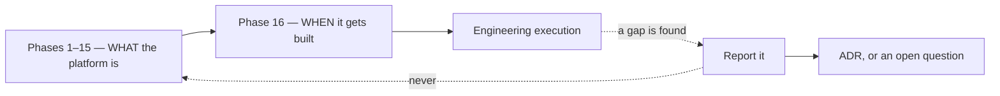
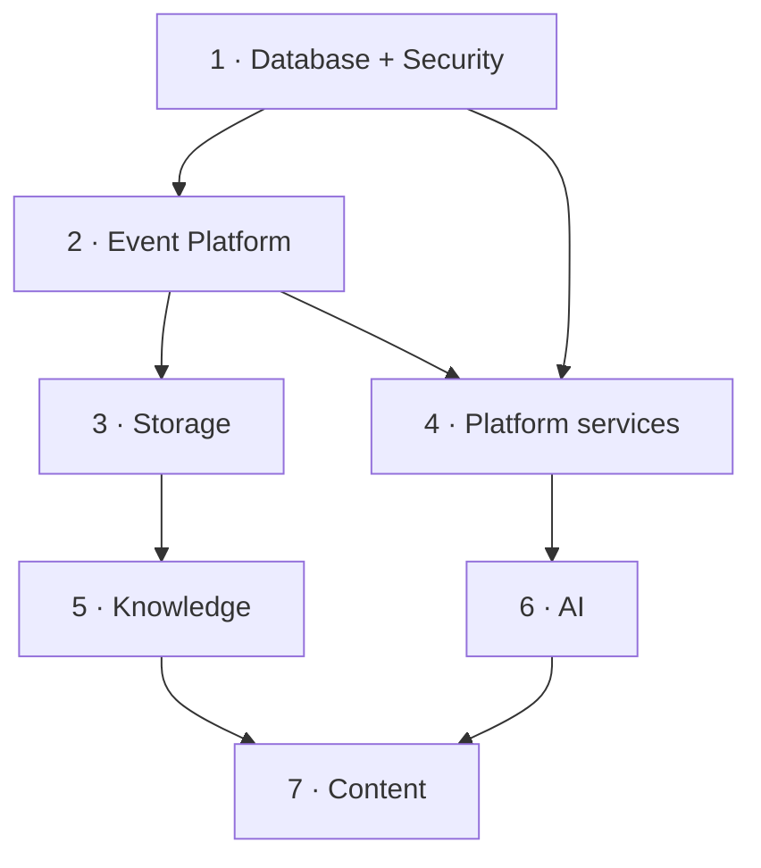

# Implementation Blueprint

> **Status:** v1.0 — complete. Phase 16.
> **The architecture is frozen. This folder decides order, not design.** Every document here answers *when* and *in what sequence*; none answers *what* or *why*. Where a question about behaviour arises, the answer is already written in Phases 1–15.

## Overview

**Purpose.** Bridge architecture to engineering execution: what to build first, what depends on what, which work can run in parallel, and how releases happen.

**The governing constraint.** No document in this folder may introduce architecture, modify an API, amend an ADR, or add a bounded context. Where a sequencing decision appears to require one, that is a finding to report — not a decision to make.

**Written for two audiences.** Human engineers planning sprints, and AI coding agents executing them. The implementation contract for agents is in `implementation-playbook.md` and extends the binding rules already set in `07-development-guide/implementation-checklists.md` Part 1.

## What this folder owns

- Implementation strategy: slicing, sequencing, parallelization, definitions of ready and done.
- The canonical build order and sprint plan.
- Module dependency graphs and the critical path.
- Repository bootstrap — clone to verified running system.
- Per-context development checklists.
- Testing, deployment, and release roadmaps.
- Implementation risks and mitigations.
- The daily workflow playbook.

## What this folder never owns

| Not owned | Owner |
|---|---|
| **Any architectural decision** | `01-system-architecture/13-adr-log.md` |
| **Any business rule** | The owning domain component |
| API contracts | `06-api/` |
| **How to write code** | `07-development-guide/` |
| Test strategy, coverage thresholds, the CI gate contract | `10-testing/testing-strategy.md` |
| Production deployment operations | `14-operations/deployment.md` |
| Security controls | `16-security/` |
| Screen behaviour | `15-application-ui/` |

**The boundary with `07-development-guide/` is the one most easily blurred.** That folder owns *how* to build — coding standards, project structure, error handling, CI composition, migration process, per-platform readiness checklists. **This folder owns *when*.** A rule about naming belongs there; a decision that Knowledge is built before Content belongs here.

**Where both could plausibly own something, Phase 11 wins** and this folder references it. Phase 11 is approved and older; duplicating it would create drift.

## The frozen-architecture rule

**Implementation never amends architecture.** An engineer or agent encountering a constraint that appears wrong records an open question or proposes an ADR (`99-open-questions.md`). Working around it in code produces a codebase that silently disagrees with its own specification — the exact condition the Phase 1 review found in the original repository.

**Sequencing decisions that would require an architectural change are reported, not made.** This folder contains one such report, below.

## Finding — the proposed sprint order omits the Event Platform

**The approved build sequence in `07-development-guide/implementation-checklists.md` Part 2 places the Event Platform at position 2**, before Storage and before Platform services:

Its rationale is explicit: *"The Event Platform precedes everything that publishes. Retrofitting the outbox means finding every direct publication path, and the ones that are missed are exactly the ones that lose events."*

**The sprint order proposed for this phase contains no Event Platform sprint.** Platform services appear in Sprint 1 and Storage in Sprint 2, both of which publish events.

**Resolution applied in `implementation-order.md`:** the Event Platform is built in **Sprint 1**, alongside Database and Security completion and ahead of Platform services. Everything else follows the proposed structure. The change is marked in that document and is the only deviation from the proposed order.

**Why this is a sequencing correction and not an architectural change:** ADR-020 makes the transactional outbox the sole publication path, and `07-development-guide/coding-standards.md` enforces it by signature — `publish(tx, event)` requires a transaction handle. Building Platform services before the outbox exists would mean either stubbing that signature or publishing outside a transaction, and the second is unrepresentable by design.

## Document map

| Document | Owns |
|---|---|
| `implementation-strategy.md` | Slicing, dependency-first sequencing, parallelization, Definition of Ready and Done |
| `repository-structure.md` | The monorepo as built, mapped to the frozen layout |
| **`implementation-order.md`** | **The canonical build order — eight sprints with exit criteria** |
| `sprint-planning.md` | Sprint mechanics, sizing, ceremonies, capacity |
| `module-dependencies.md` | Hard and soft dependencies, the critical path, parallel tracks |
| `repository-bootstrap.md` | Clone → install → seed → run → verify |
| `development-checklists.md` | Per bounded context: database, backend, frontend, workers, tests, docs, monitoring, deployment, acceptance |
| `testing-roadmap.md` | When each test type arrives and what gates on it |
| `deployment-roadmap.md` | Environment progression and cutover |
| `release-plan.md` | Alpha → closed beta → open beta → GA; versioning and hotfixes |
| `implementation-risks.md` | Technical, security, operational, cost, AI, infrastructure, schedule |
| `implementation-playbook.md` | Daily workflow, branch and PR strategy, **the Claude Code implementation contract** |

## Outstanding gates from Phase 11

`07-development-guide/implementation-checklists.md` defines cross-platform pre-launch gates. **One is partially resolved and one remains open.**

| Gate | Status |
|---|---|
| ADR-020, ADR-027, ADR-028 accepted | ✅ **Resolved** — governance cleanup, 2026-07-29 |
| **ADR-022, 023, 024, 025 still Proposed** | ⚠️ **Open** |

**Four ADRs remain Proposed:** PostgreSQL 17 + Drizzle ORM (022), feature flags in-house (023), hierarchical settings resolution (024), and reference-data tables as a bounded RLS exception class (025).

**ADR-022 is the one that blocks Sprint 0.** It selects the ORM and the schema toolchain, and the repository cannot be bootstrapped without that decision. The documentation is written against it as a working assumption, and Sprint 0 proceeds on that basis — but it should be formally accepted or explicitly accepted-as-risk before the first migration ships.

**ADR-025 has no implementation consequence yet.** No reference-data table exists; any such table must currently carry `tenant_id` like everything else (`16-security/row-level-security.md`).

## How to use this folder

**Planning a sprint:** `implementation-order.md` for the sprint's contents and exit criteria, then `sprint-planning.md` for mechanics.

**Starting on the codebase:** `repository-bootstrap.md`, then `07-development-guide/local-development.md`.

**Building a bounded context:** `development-checklists.md` for the context, alongside `07-development-guide/implementation-checklists.md` Part 3 for its per-platform architecture gates.

**Deciding what can run in parallel:** `module-dependencies.md`.

**Executing as an AI agent:** `implementation-playbook.md` §Claude Code contract, which is binding and extends Phase 11 Part 1.

**Shipping:** `deployment-roadmap.md`, then `release-plan.md`.

## Cross references

- `07-development-guide/implementation-checklists.md` — **the approved build sequence and per-platform gates**
- `07-development-guide/project-structure.md` — the frozen repository layout
- `07-development-guide/ci-cd.md` — pipeline composition and gates
- `07-development-guide/deployment-guide.md` — artifact identity, migration ordering, rollback
- `07-development-guide/migration-guide.md` — expand/contract discipline
- `10-testing/testing-strategy.md` — the CI gate contract and coverage thresholds
- `14-operations/deployment.md` — production deployment operations
- `16-security/` — every control the build order sequences around
- `01-system-architecture/13-adr-log.md` — the twenty-eight decisions this phase implements
- `99-open-questions.md` — where a sequencing gap is recorded
