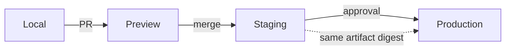
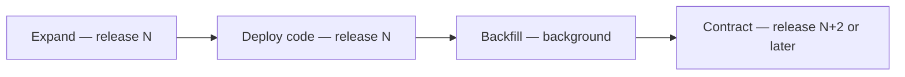

# Deployment Roadmap

> **Status:** v1.0 — complete. Phase 16.
> **This document owns environment progression — which environment exists when, and what promotes between them.** Deployment *mechanics* are `07-development-guide/deployment-guide.md`; production *operations* are `14-operations/deployment.md`. Neither is restated.

## Overview

**Purpose.** Sequence the five environments against the sprint plan, and define what moves between them.

**The boundary, stated once.** Artifact identity, migration ordering, health probe semantics, rollout strategies, rollback, and post-deployment gates are all specified in `07-development-guide/deployment-guide.md`. This document says **when each environment comes online and what promotion requires**.

## The five environments

| Environment | Comes online | Purpose | Deploys on |
|---|---|---|---|
| **Local** | **Sprint 0** | Development | Manual |
| **Preview** | Sprint 1 | Per-PR verification | PR open |
| **Development** | Sprint 1 | Shared integration | Merge to `main` |
| **Staging** | **Sprint 0** | Production-shaped verification | **Merge to `main`** |
| **Production** | **Sprint 2** | Customers | **Explicit approval** |

**Staging exists in Sprint 0, before any feature.** An environment first created in Sprint 5 has never been deployed to, and every deployment defect surfaces at once. Deploying an empty application on day one is how the pipeline gets exercised.

**Production comes online in Sprint 2**, deliberately early. A system first deployed to production in Sprint 7 has never been operated (`implementation-strategy.md`).

**Development is optional for a small team.** Where preview environments exist per PR and staging is production-shaped, a shared development environment adds a promotion step without adding a signal. It is listed because larger teams need it; the plan does not assume it.

## Promotion flow

**One artifact is built and promoted; it is never rebuilt per environment.** Rebuilding produces two artifacts, only one of which was tested. Configuration differs per environment and is injected at runtime (`07-development-guide/deployment-guide.md`).

**Deployment is by digest, never by tag.** A digest identifies exactly one set of bytes, so the artifact running in production is provably the artifact that passed CI.

## Local

| Property | Value |
|---|---|
| Composition | Containers per `07-development-guide/local-development.md` |
| Data | Seeded — **two tenants minimum** |
| Deploy | `pnpm dev` |
| **Never differs in** | Auth, authorization, RLS, tenant scoping, the outbox, scanning, validation |

**Local runs the same architecture with the same controls on.** The declared differences are a closed list — MinIO for R2, Mailpit for SMTP, dummy secrets, debug logging, relaxed rate limits, single-process worker, no CDN, seed data. **Anything not on that list is identical.**

## Preview

| Property | Value |
|---|---|
| Trigger | PR opened |
| Lifetime | Until the PR closes |
| Database | Ephemeral, migrated and seeded |
| Secrets | **Ephemeral, per environment** |
| **Fork PRs** | **No preview** — runs without credentials |

**Preview environments make a change reviewable rather than describable.** A UI change reviewed against a running instance is reviewed; the same change reviewed against a screenshot is guessed at.

**Fork PRs get no preview and no secrets.** A workflow file is code, and a PR that could modify the workflow and access credentials in the same run is a straightforward exfiltration path (`07-development-guide/ci-cd.md`).

**Preview data is synthetic and disposable.** No customer data reaches a preview environment, ever.

## Staging

| Property | Value |
|---|---|
| Trigger | **Automatic on merge to `main`** |
| Data | **Production-shaped volume**, anonymized |
| Secrets | Separate store instance; **no production secret** |
| Providers | **Separate test keys** |
| Runs | E2E, conformance, smoke |

**Staging runs the same artifact and the same migrations against production-shaped data volume.** A migration verified against a thousand rows says nothing about a hundred million (`07-development-guide/migration-guide.md`).

**No production secret exists in staging.** Staging holding a production provider key means every engineer with staging access effectively holds production credentials (`16-security/secrets-management.md`).

**Staging is where exit criteria are demonstrated.** Sprint review runs there, not on a laptop (`sprint-planning.md`).

## Production

| Property | Value |
|---|---|
| Trigger | **Explicit approval by a named approver** |
| Strategy | Rolling by default; canary for high-risk change |
| Migrations | **Expand before deploy; contract in a later release** |
| Post-deploy | Automatic validation with rollback |
| **Audited** | Artifact digest, actor, approver, migration set, outcome |

**Every production deployment is audited** (`16-security/audit.md`).

**The rollback target is recorded before the deploy starts**, never reconstructed from registry history during an incident.

## Migration sequencing

**Owned by `07-development-guide/migration-guide.md`. The environment-progression view:**

| Phase | Environment sequence |
|---|---|
| **Expand** | Preview → staging → production, **before the code deploy** |
| **Deploy** | Same sequence |
| **Backfill** | Background, rate-limited, tenant-scoped |
| **Contract** | **A later release entirely** |

**Contract never ships with the code that stopped using the structure.** If that release rolls back, the structure is gone and the rolled-back code fails against a schema it cannot use.

**CI enforces this by running the previous release's test suite against the new schema.** Everything else in migration discipline is a rule; that job is a gate (`07-development-guide/ci-cd.md`).

**Long-running index builds run concurrently and outside the deploy**, ahead of the release that needs them.

## Rollout strategies

**Specified in `07-development-guide/deployment-guide.md`. Which applies when:**

| Change | Strategy | First used |
|---|---|---|
| Routine backend | Rolling | Sprint 2 |
| Behaviour change | **Feature flag** | Sprint 2 |
| Infrastructure risk | Blue/green | Sprint 6 |
| Broad-impact | Canary, **metric-gated** | Sprint 7 |

**Feature flags are the preferred rollback for behaviour changes** — seconds, no deploy, no migration concern. They evaluate per tenant and fail closed to their compiled-in default (`07-development-guide/configuration.md`).

**Canary promotion is gated on metrics, never elapsed time.** A canary promoted on a timer proves nothing.

**Worker deployments always drain**, and `ShutdownReport.abandoned` must be zero. A worker killed mid-handler leaves entries pending until the idle-claim timeout, turning a routine deploy into a latency spike (`13-event-platform/workers.md`).

## Health verification

**Three probes, three distinct questions** (`07-development-guide/deployment-guide.md`):

| Probe | Failure action |
|---|---|
| Startup | Keep waiting |
| **Liveness** | **Restart — and it never checks dependencies** |
| Readiness | **Remove from rotation; never restart** |

**Liveness checking a dependency would fail every instance simultaneously during a blip, restart the fleet, and prevent it starting because the dependency is still degraded.** A recoverable incident becomes a total outage caused by the health check.

## Post-deployment validation

| Gate | Failure |
|---|---|
| All instances ready in window | **Auto-rollback** |
| Smoke: critical paths | **Auto-rollback** |
| Error rate within baseline, 15 min | Alert |
| **Invariant board all-zero** | **Page — never auto-rollback** |
| Consumer lag | Alert |
| `worker_shutdown_abandoned_total` zero | Alert |

**An invariant breach pages rather than rolling back automatically.** A cross-tenant violation needs a human decision, and automatic rollback could destroy the state needed to determine scope (`16-security/incident-response.md`).

## Environment readiness by sprint

| Sprint | Milestone |
|---|---|
| **0** | Local + staging; empty application deployed through the full pipeline |
| 1 | Preview per PR; workers deployed; first real migrations |
| **2** | **Production live**; smoke and rollback exercised |
| 3–4 | Provider credentials per environment; cost monitoring |
| 5 | Web app deployed; CDN configured |
| 6 | `apps/admin` on the isolated network; billing in production |
| **7** | **DR drill; blue/green and canary exercised; every gate green** |

**Sprint 0 deploys an application with no features.** That is the point — the pipeline, probes, migrations, and rollback are exercised before anything depends on them.

**Sprint 2's first production deployment is expected to be uncomfortable**, which is exactly why it happens then rather than in Sprint 7.

## Incident response entry points

| Trigger | Entry |
|---|---|
| Deployment failed or auto-rolled-back | `07-development-guide/deployment-guide.md` |
| Availability degradation | `14-operations/incident-response.md` |
| **Invariant breach** | **`16-security/incident-response.md`** |
| Data loss or corruption | `12-storage-platform/disaster-recovery.md` |
| DLQ growth or replay | `06-api/admin-api.md` |

**Availability and security incidents use different runbooks with different first moves.** An availability incident is resolved by restoring service; a security incident may require taking service away (`16-security/README.md`).

**Capture before contain, except under active exfiltration.** Terminating a compromised process destroys the memory proving what was accessed.

## Business rules

1. **Staging exists in Sprint 0**, before any feature.
2. **Production comes online in Sprint 2**, not at the end.
3. **One artifact is promoted by digest**, never rebuilt per environment.
4. **No production secret exists outside production.**
5. **Fork PRs get no preview and no credentials.**
6. **Preview data is synthetic and disposable.**
7. **Staging runs production-shaped volume.**
8. **Expand precedes the deploy; contract ships a later release.**
9. **CI runs the previous release's tests against the new schema.**
10. **Liveness never checks dependencies.**
11. **Canary promotion is metric-gated, never time-gated.**
12. **Worker deploys drain; abandoned work is zero.**
13. **The rollback target is recorded before the deploy starts.**
14. **Smoke failures auto-roll-back; invariant breaches page instead.**
15. **Production deployments are approved by a named person and audited.**
16. **Sprint 0 deploys an application with no features**, to exercise the pipeline.

## Cross references

- `07-development-guide/deployment-guide.md` — **artifact identity, migration ordering, probes, rollout, rollback, post-deploy gates**
- `07-development-guide/migration-guide.md` — expand/contract in full
- `07-development-guide/ci-cd.md` — pipeline stages, fork PR handling, migration validation
- `07-development-guide/configuration.md` — flags, environment values, production guards
- `07-development-guide/local-development.md` — the local environment's declared differences
- `14-operations/deployment.md` — **production deployment operations**
- `14-operations/incident-response.md` — availability incidents
- `16-security/incident-response.md` — security incidents
- `16-security/secrets-management.md` — environment separation
- `16-security/audit.md` — deployment audit records
- `12-storage-platform/disaster-recovery.md` — recovery entry point
- `13-event-platform/workers.md` — graceful drain
- `implementation-order.md` — the sprints this schedule tracks
- `release-plan.md` — what promotion to production means commercially
