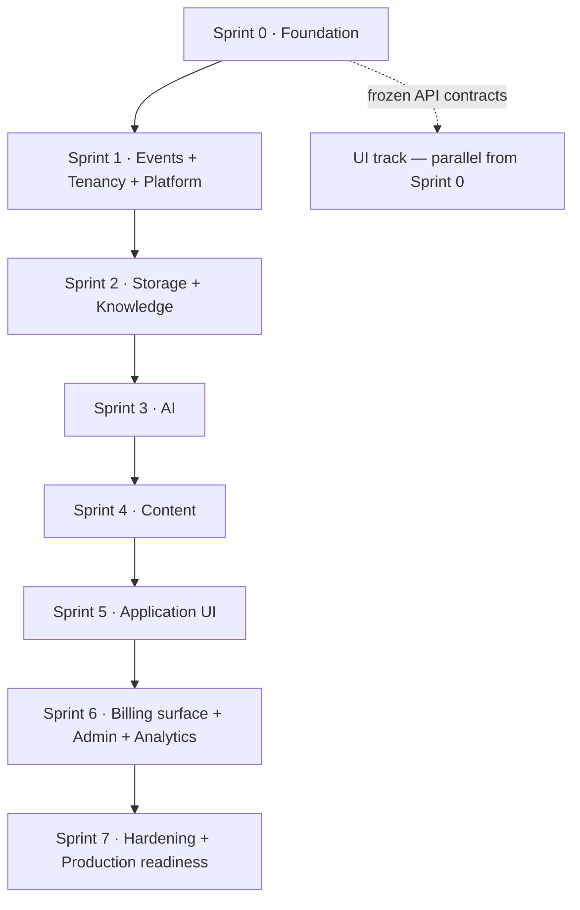

# Implementation Order

> **Status:** v1.0 — complete. Phase 16. **Canonical build order.**
> **One deviation from the proposed order:** the Event Platform is added to Sprint 1, ahead of Platform services. Everything else follows the proposal exactly. The reason is recorded below.

## Overview

**Purpose.** The canonical sprint sequence — eight sprints, each with objectives, deliverables, dependencies, risks, and exit criteria.

**Derivation.** The order derives from the approved build sequence in `07-development-guide/implementation-checklists.md` Part 2 and is not re-derived. Where the proposed sprint structure and that sequence disagreed, the approved sequence wins.

## The deviation

**The proposed order contained no Event Platform sprint**, while placing Platform services in Sprint 1 and Storage in Sprint 2 — both of which publish events.

**Correction applied:** the Event Platform is built in **Sprint 1, before Platform services within that sprint.**

**Why this is not optional.** ADR-020 makes the transactional outbox the sole publication path, and `07-development-guide/coding-standards.md` enforces it by signature: `publish(tx, event)` requires a transaction handle, and publishing outside a transaction is unrepresentable. Building Platform services first would require stubbing that signature — and the approved sequence states the consequence plainly: *"Retrofitting the outbox means finding every direct publication path, and the ones that are missed are exactly the ones that lose events."*

**Capacity note, stated honestly:** Sprint 1 is now the largest in the plan. `13-event-platform/` is fourteen documents, and combining it with tenancy completion and Platform services may exceed one sprint. Splitting it into 1a (Event Platform) and 1b (tenancy + Platform) is the recommended contingency and is reflected in `sprint-planning.md`.

## Sequence

---

## Sprint 0 · Foundation

**Objectives.** Establish the repository, the pipeline, and the platform's non-negotiable substrate: schema, RLS, and authentication.

**Deliverables**

| Area | Contents |
|---|---|
| Repository | Monorepo scaffold; `contracts`, `database`, `security`, `observability`; `apps/web` shell; `services/api` |
| CI/CD | All Sprint 0 gates: type, lint, boundaries, secrets, licences, install-script audit |
| Containers | PostgreSQL 17 + pgvector, Redis 7, MinIO, Mailpit, ClamAV |
| Database | Core schema, migrations, **RLS policies with `ENABLE` + `FORCE`** |
| **Conformance** | **RLS suite enumerating `information_schema`** |
| Security | `TenantContext`, Better Auth integration, sessions, MFA, authorization evaluation, audit writer |
| API | Request pipeline middleware; health, readiness, startup probes |
| Observability | Structured logging, tracing, metric scaffolding |

**Dependencies.** None. This is the root.

**Risks**

| Risk | Mitigation |
|---|---|
| **RLS misconfiguration with no symptom** | Conformance suite lands before tables accumulate |
| **ADR-022 still Proposed** | Sprint proceeds on the working assumption; accept or accept-as-risk before the first migration ships |
| Pipeline ordering wrong | Ordered once, in `services/api`, per `16-security/api-security.md` |

**Exit criteria**

- [ ] `pnpm setup` reaches a working stack in one command, idempotently
- [ ] **RLS conformance green; exactly five exception tables; a sixth fails the build**
- [ ] `contentos_app` verified to lack `BYPASSRLS` and own no tables
- [ ] Transaction pooling configured; statement pooling refused
- [ ] Authentication works end-to-end, including MFA and step-up
- [ ] Audit writes are transactional; the append-only trigger is active
- [ ] All four boundary mechanisms block the build
- [ ] Two seeded tenants and the negative-test outsider account exist

---

## Sprint 1 · Event Platform + Tenancy + Platform services

**Objectives.** Build the event backbone, complete the tenancy model, and land the platform services everything else consumes.

**Order within the sprint is fixed:** Event Platform → tenancy → Platform services.

**Deliverables**

| Area | Contents |
|---|---|
| **Event Platform** | Outbox + relay, `EventBus` over Redis Streams, registry, consumer groups, `workers/host`, retry engine, DLQ, idempotency, ordering |
| Tenancy | Organizations, workspaces, memberships, role bindings, invitations, ownership transfer |
| Permissions | The full permission catalogue and evaluation |
| Platform services | **Credit accounting**, rate limiting, notifications, workflow, settings, feature flags |

**Dependencies.** Sprint 0 in full — every consumer uses the RLS-enforced role and reconstructs `TenantContext` per delivery.

**Risks**

| Risk | Mitigation |
|---|---|
| **Sprint overloaded** | Split into 1a / 1b; see `sprint-planning.md` |
| **Ordering and idempotency hard to retrofit** | Spike first; conformance tests before consumers multiply |
| **Credit accounting under concurrency** | Atomic charge with holds; concurrency tests are a sprint gate |
| Relay reading a replica | Configuration asserted in the conformance suite |

**Exit criteria**

- [ ] An event published in a transaction is delivered exactly once in effect
- [ ] A rolled-back transaction publishes nothing
- [ ] **Relay lag p95 < 2 s under load**
- [ ] Per-aggregate ordering holds under retry, failover, and replay
- [ ] Poison rows quarantine without blocking the relay
- [ ] DLQ entries retain correlation, producer, consumer, reason, and full retry history
- [ ] **Credits charge atomically under concurrent load; 402 on exhaustion**
- [ ] Every registered consumer group has a heartbeating worker
- [ ] Organization and workspace lifecycles work, including the last-Owner rule

---

## Sprint 2 · Storage + Knowledge

**Objectives.** Binary storage with its full lifecycle, and the evidence layer built on it.

**Order within the sprint:** Storage → Media processing → Knowledge → Research.

**Deliverables**

| Area | Contents |
|---|---|
| Storage | `ObjectStoreDriver` with MinIO and R2, object lifecycle, multipart, integrity |
| Media | Validation, malware scanning, derivations, CDN delivery |
| Retention | Reference counting, soft delete, GC, orphan detection |
| Knowledge | Evidence Bank, entities, embeddings, retrieval, provenance, freshness, deduplication |
| Research | Research engine, SERP and competitor collection |
| Integrations | Firecrawl, DataForSEO, Exa behind the Provider Layer |

**Dependencies.** Sprint 1 — storage and knowledge both publish events. Knowledge stores source documents, so Storage precedes it.

**Risks**

| Risk | Mitigation |
|---|---|
| **SSRF on customer-supplied URLs** | `SafeUrlFetcher` chokepoint; lint rule already active from Sprint 0 |
| **Vector search leaking existence** | Query-time filtering asserted by test; post-filtering rejected in review |
| Provider rate limits and cost | Provider Layer with retry and budget from day one |
| Media parser exploitation | Process isolation, no network, bounded memory, SVG disabled |

**Exit criteria**

- [ ] Upload reaches `available` through scan and derivation; p95 < 60 s for images
- [ ] Driver conformance passes against real MinIO
- [ ] **Cross-tenant vector search returns nothing; `vector_foreign_tenant_results_total` is zero**
- [ ] Deletion refused while referenced; grace period and restore work
- [ ] Evidence carries provenance; merges preserve lineage
- [ ] A research run produces evidence identifiers resolvable through Knowledge
- [ ] SSRF validation rejects private ranges and re-validates redirects

---

## Sprint 3 · AI Platform

**Objectives.** Model access with guardrails, cost control, and the Council.

**Deliverables**

| Area | Contents |
|---|---|
| Gateway | Single egress point; provider adapters via OpenRouter |
| Context | Context Builder with **structural secret exclusion** |
| Prompts | Prompt Engine; variables escaped, never concatenated |
| Guardrails | Input and output evaluation; terminal blocks |
| Council | Enforced diversity, real conflict detection, disclosure, budget |
| Cost | Per-call attribution; usage reporting |
| Memory | AI Memory — tenant-scoped, never a source of truth |

**Dependencies.** Sprint 1 for credits and rate limiting; Sprint 2 for evidence to ground against.

**Risks**

| Risk | Mitigation |
|---|---|
| **Prompt injection** | Structural exclusion; content framed as data; output scanned; evaluation harness |
| **Cost overrun** | Budgets enforced per call; usage visible from day one |
| Provider outage or latency | Retry with classification; **no fallback on safety refusal** |
| Council theatre | Diversity assertion is a test, not a claim |

**Exit criteria**

- [ ] No secret can reach a prompt — asserted structurally, not by filtering
- [ ] **Guardrail blocks are terminal and never retried, in any component**
- [ ] **Safety refusals never trigger automatic fallback**
- [ ] Council enforces diversity and detects real conflict; `no-consensus` is a valid outcome
- [ ] Cost is attributed per call and reconciles with the credit ledger
- [ ] Scores conform to ADR-021 with mandatory explanations
- [ ] Injection resistance evaluation passes (`10-testing/ai-evaluation.md` §11)

---

## Sprint 4 · Content Platform

**Objectives.** The thirteen engines and the durable pipeline that runs them.

**Deliverables**

| Area | Contents |
|---|---|
| Orchestration | Temporal workflows; durable, resumable, human-gated |
| Engines | Keyword, SERP, competitor, research wiring, planning, writing, review, SEO, publishing, analytics, optimization, refresh |
| Gates | Quality gates with `pass` / `soft-warn` / `block` |
| Citations | The grounding chain with its CHECK constraint |
| Publishing | CMS targets, gate verification per revision |

**Dependencies.** Sprints 2 and 3 — Content consumes Knowledge, AI, and Storage.

**Risks**

| Risk | Mitigation |
|---|---|
| **Pipeline duration and resumability** | Temporal from the start; replay tests mandatory |
| **Gate verdict bypass** | Verified per revision; `CONTENT_GATE_MISMATCH` is distinct |
| Human waits stalling runs | `awaiting_input` surfaced as a required action |
| Outline constraint | Enforced by database CHECK, not application logic |

**Exit criteria**

- [ ] A full pipeline run completes end-to-end and survives a worker restart
- [ ] **Writing cannot proceed without an approved outline** — constraint verified
- [ ] Publishing verifies the gate verdict **for that specific revision**
- [ ] A `block` verdict cannot be overridden through any path
- [ ] Citations resolve; a dangling anchor is unrepresentable
- [ ] Refresh applies to published only; optimize to drafts only
- [ ] One active run per article, enforced

---

## Sprint 5 · Application UI

**Objectives.** The customer-facing application against APIs that now exist.

**Deliverables**

| Area | Contents |
|---|---|
| Shell | Navigation, workspace switcher, breadcrumbs, search |
| Dashboard | Widgets with independent states and real destinations |
| Screens | Organizations, workspaces, content, research, knowledge, AI, media, settings |
| States | The canonical sixteen-state catalogue |
| Notifications | In-app inbox, toasts, preferences |
| Accessibility | WCAG 2.2 AA, asserted in CI |

**Dependencies.** Sprints 1–4 for APIs. The shell and design system were built in parallel from Sprint 0.

**Risks**

| Risk | Mitigation |
|---|---|
| Screens diverging from contracts | Built against `06-api/api-reference.md`; contract tests |
| Permission leakage through navigation | Absent-not-disabled; revalidation on render |
| Accessibility deferred | Blocking CI gate from Sprint 0 |

**Exit criteria**

- [ ] Every screen in `15-application-ui/` is implemented and reachable
- [ ] **No orphan screens**; every route is navigable or documented as cross-link-only
- [ ] Cross-tenant resources render as not-found, never as permission denied
- [ ] Accessibility gate green; keyboard-only journeys pass
- [ ] Long-running work renders as runs, never as loading states

---

## Sprint 6 · Billing surface + Admin + Analytics

**Objectives.** Commercial surfaces, the operator console, and performance reporting.

**Note:** credit *accounting* shipped in Sprint 1 because AI depends on it. This sprint delivers the billing *surface* — Stripe, invoices, plan changes.

**Deliverables**

| Area | Contents |
|---|---|
| Billing | Stripe integration, plans, invoices, payment methods, entitlements |
| **`apps/admin`** | Operator console: status, config, flags, jobs, DLQ, replay, audit, tenant lookup |
| Analytics | GSC and GA4 integration, performance reporting, the analytics engine |

**Dependencies.** Sprint 1 for credits; Sprint 5 for UI patterns.

**Risks**

| Risk | Mitigation |
|---|---|
| **PCI scope creep** | Stripe Elements tokenizes in-browser; no PAN reaches the platform |
| **Operator console exposure** | Network-isolated, mTLS, platform-tier permissions, audited reads |
| Analytics provider quotas | Provider Layer with backoff |

**Exit criteria**

- [ ] No card data touches platform infrastructure
- [ ] Plan changes and entitlements enforce correctly; `402` distinguishes credits from plan
- [ ] **Operator console is not publicly routable; every request is audited including reads**
- [ ] Replay requires estimation and non-empty target groups
- [ ] DLQ resolve and discard require a note, enforced by constraint

---

## Sprint 7 · Hardening + Production readiness

**Objectives.** Meet every pre-launch gate.

**Deliverables**

| Area | Contents |
|---|---|
| Performance | Load testing against stated NFRs; index tuning |
| Security | Penetration testing; threat-model detection coverage |
| Recovery | Backup verification; **restore tests; a full DR drill** |
| Observability | Invariant board; all alerts wired and tested |
| Operations | Runbooks, on-call, incident response rehearsal |

**Dependencies.** All prior sprints.

**Risks**

| Risk | Mitigation |
|---|---|
| **Untested recovery** | DR drill is an exit criterion, not a plan |
| Alert fatigue | Invariant alerts separated from SLO alerts |
| Load behaviour unknown | Load testing against production-shaped volume |

**Exit criteria — the Phase 11 pre-launch gates**

- [ ] RLS conformance green; exactly five exception tables
- [ ] **Invariant board all-zero across every platform**
- [ ] Verified backup age within window; restore test passed
- [ ] **DR drill completed with measured RTO and RPO**
- [ ] Every registered consumer group has a heartbeating worker
- [ ] Secret rotation current; no break-glass credentials outstanding
- [ ] Threat-model detection coverage at 100%
- [ ] Every frozen interface has a signature test
- [ ] **Every Proposed ADR accepted or explicitly accepted-as-risk**

## Business rules

1. **The order derives from the approved build sequence** and is not re-derived.
2. **The Event Platform is built in Sprint 1, before Platform services.**
3. **Within a sprint, dependency order is fixed** and stated.
4. **Credit accounting ships in Sprint 1**; the billing surface in Sprint 6.
5. **Production deployment begins in Sprint 2.**
6. **Every sprint has exit criteria that are verifiable, not asserted.**
7. **A sprint does not close with unmet exit criteria** — it carries them forward visibly.
8. **Sprint 7's exit criteria are the Phase 11 pre-launch gates**, unchanged.
9. **The UI track runs in parallel from Sprint 0** against frozen contracts.
10. **Sprint 1 may split into 1a and 1b** if capacity requires; the order within it does not change.

## Cross references

- `07-development-guide/implementation-checklists.md` — **the approved sequence and per-platform gates**
- `implementation-strategy.md` — slicing, risk-first, parallelization
- `sprint-planning.md` — mechanics, sizing, the 1a/1b contingency
- `module-dependencies.md` — the graph behind this order
- `testing-roadmap.md` · `deployment-roadmap.md` · `release-plan.md`
- `implementation-risks.md` — the risks named per sprint
- `01-system-architecture/13-adr-log.md` — ADR-020, ADR-022
