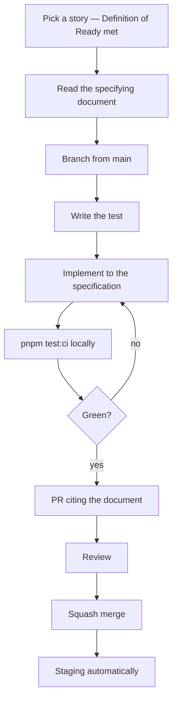
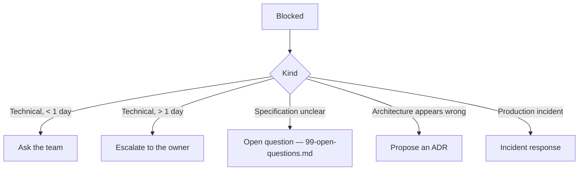
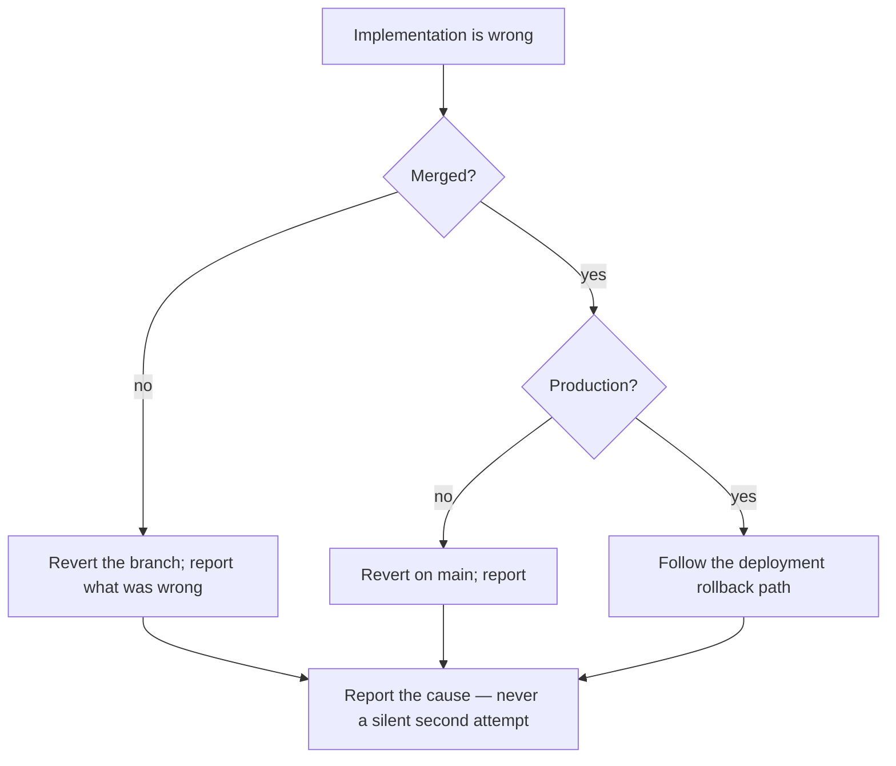

# Implementation Playbook

> **Status:** v1.0 — complete. Phase 16. **Canonical engineering handbook.**
> **Everything mechanical is owned elsewhere and referenced here.** Branch naming, commit format, pipeline stages, and review depth are `07-development-guide/`. This document is the daily workflow that strings them together, plus the binding contract for AI coding agents.

## Overview

**Purpose.** One document an engineer or agent opens each day: what to do, in what order, and when to stop.

**Scope.** Workflow synthesis and the Claude Code contract. Nothing here overrides `07-development-guide/`; where they meet, that folder wins.

---

# Part 1 — Daily workflow

## The loop



**Step 2 is not optional and is the step most often skipped.** The story names its specifying document; reading it after implementing produces code that matches an assumption rather than a specification.

**Step 6 exists so a pipeline failure is reproducible without pushing.** `pnpm test:ci` runs everything CI runs (`repository-bootstrap.md`).

## Branch, commit, merge

**All three are specified in `07-development-guide/ci-cd.md` §Source control workflow.** In summary: short-lived branches from `main`, Conventional Commits with signed commits, **squash merge only**, force push and direct push to `main` blocked.

**Squash merging keeps `main` bisectable** — every commit on `main` is one reviewed change that passed the full pipeline.

**Hotfixes use the same pipeline.** There is no expedited path that skips gates (`release-plan.md`).

## Pull requests

| Property | Expectation |
|---|---|
| **Size** | **≤ 400 changed lines, ≤ 10 files** — excluding lockfiles and generated output |
| Scope | **One logical change, one bounded context** |
| Description | What, why, **and the specifying document** |
| Uncertainty | **Called out by the author** |
| CI | **Green before review is requested** |

**Review quality collapses past a few hundred lines.** A 1,500-line PR receives an approval, not a review.

**The author calling out their own uncertainty is the highest-value line in a description.** It directs attention where it is most needed, and reviewers routinely miss what authors already suspect.

**Requesting review with a red pipeline wastes a reviewer on findings the machine already produced.**

## Review

**Depth, reviewer count, and the checklist are `07-development-guide/code-review.md`.** The operative summary:

| Change | Reviewers |
|---|---|
| Standard | 1 |
| **Security-sensitive** | **2, one named security reviewer** |
| **Schema migration** | **2, one database owner** |
| **New event type or version** | **2, one contract owner** |
| **Architecture-affecting** | **2 + an approved ADR first** |

**CODEOWNERS enforces the second reviewer mechanically**, so the requirement is not remembered.

**An architecture-affecting change without an approved ADR is closed, not reviewed.** Reviewing it invites negotiating architecture in a PR thread, which is how decisions get made without a record.

**Reviewers never approve undocumented architectural drift.**

**The reviewer's minimum, on every PR:**

1. **Where is this specified, and does it match?**
2. **What happens when this fails?**
3. **Could this expose one tenant's data to another?**

## Merge policy

| Gate | Required |
|---|---|
| All CI stages green | ✅ — **no exclusions added** |
| Required approvals | ✅ |
| Up to date with `main` | ✅ |
| Conversations resolved | ✅ |

**No gate is bypassable.** A coverage exclusion, `eslint-disable`, `@ts-expect-error`, or pipeline skip requires an explicit, reviewed justification, and its unexplained appearance is a review-blocking finding.

## Code ownership

| Area | Owner |
|---|---|
| `packages/security`, RLS, audit | Security owner |
| `packages/database`, migrations | Database owner |
| `packages/contracts`, event registry | Contract owner |
| `packages/events` | Tech lead |
| `apps/web`, `apps/admin` | UI owner |
| CI, deploy, infrastructure | Ops owner |
| **Architecture and ADRs** | **Architect** |

**Ownership means review authority, not exclusive authorship.** Anyone may change any area; the owner reviews it.

## Escalation



**A blocker older than one day escalates.** On a small team a stuck engineer is a meaningful fraction of capacity.

**Recurring friction with the same boundary escalates to an open question**, never to accumulated exceptions. If the team repeatedly fights a boundary, the boundary may be wrong.

## Documentation update policy

| Change | Documentation |
|---|---|
| Behaviour matching the spec | None — the spec already describes it |
| **Behaviour differing from the spec** | **Spec updated in the same PR, or the change is wrong** |
| New endpoint | `06-api/api-reference.md` in the same PR |
| New event type | Registry in the same PR |
| Architectural change | **ADR first**, then the affected documents |
| A discovered contradiction | Reported — **never reconciled silently** |

**Documentation changes ship in the PR that changes behaviour.** A follow-up documentation PR is a documentation PR that does not happen.

**An endpoint absent from `06-api/api-reference.md` does not exist**, and CI asserts the implemented route table against it.

---

# Part 2 — Claude Code implementation contract

**Binding on every agent-authored change.** It extends `07-development-guide/implementation-checklists.md` Part 1, which is not restated — the source-of-truth rule, the change-process rule, the invariant list, and the Definition of Done all apply unchanged.

## The seventeen rules

**Claude Code must:**

1. **Implement only approved architecture.**
2. **Never invent behaviour** — including a default for something unspecified.
3. **Never change an ADR**, mark one accepted, or treat a Proposed ADR as settled.
4. **Never change an API contract** — `06-api/` is frozen.
5. **Never bypass a security control** — RLS, authorization, tenant scoping, the outbox, audit, validation.
6. **Never weaken a test** — no deletion, skip, loosened assertion, or exclusion to make a change pass.
7. **Never ignore failing CI** — no stacking work on red.
8. **Implement one bounded context at a time.**
9. **Keep pull requests small** — ≤ 400 lines, ≤ 10 files.
10. **Always reference the owning document** in the PR description.
11. **Respect the implementation order** — never build ahead of a dependency.
12. **Never introduce an undocumented dependency** — package, provider, or service.
13. **Prefer composition over shortcuts** — inheritance depth ≤ 1, no `protected`.
14. **Preserve tenant isolation** — `ctx` first, keys prefixed, vectors filtered at query time.
15. **Preserve event ownership** — publication only through `publish(tx, event)`.
16. **Preserve API ownership** — no endpoint absent from the registry.
17. **Preserve UI ownership** — no screen redefines a shared pattern.

**Rule 6 is the most damaging to violate**, because it looks like progress. A failing test is doing its job; weakening it converts a caught defect into a shipped one.

## Required workflow

| Step | Action |
|---|---|
| 1 | **Read the specifying document before writing code** |
| 2 | Confirm the story meets Definition of Ready; **if not, stop and ask** |
| 3 | Confirm upstream dependencies have landed |
| 4 | Branch; write the failing test first where practical |
| 5 | Implement to the cited specification |
| 6 | Run `pnpm test:ci` locally |
| 7 | Open a PR citing the document and stating any uncertainty |
| 8 | **Wait for green CI and human review before continuing** |

**Step 8 is a hard stop.** An agent proceeding to the next story on a red pipeline compounds failure across contexts.

## Expected pull request size

| Metric | Target | Hard limit |
|---|---|---|
| Changed lines | ~200 | **400** |
| Files | ~5 | **10** |
| Bounded contexts | **1** | **1** |
| Migrations | ≤ 1 | 1 |

**Exceeding a hard limit means splitting the work, not requesting an exception.** A cross-context change cannot be reviewed against a single specification.

**Generated files and lockfiles are excluded from the count** but are called out in the description.

## Review gates

| Gate | Blocks |
|---|---|
| All CI stages green, no exclusions | Merge |
| Specifying document cited | Merge |
| Denial and failure paths tested | Merge |
| New table has `tenant_id`, policy, isolation test | Merge |
| Human review by a named owner for sensitive paths | Merge |
| **Uncertainties stated rather than resolved silently** | Review |

**Agent-authored work is always human-reviewed against the architecture.** The review question is unchanged: *where is this specified, and does it match?*

## Stopping conditions

**Eight conditions require stopping and reporting. None permits a default.**

| # | Condition | Action |
|---|---|---|
| 1 | **Behaviour is unspecified** | Stop. Ask. Do not choose a default |
| 2 | **The specification is ambiguous** | Stop. Ask. Do not pick the likelier reading |
| 3 | **Two documents contradict** | **Report both.** Do not reconcile |
| 4 | **The specification appears wrong** | Say so, then ask. Do not work around |
| 5 | **The task requires breaking an invariant** | Stop. The task is wrong, or it needs an ADR |
| 6 | **CI is red and the cause is unclear** | Stop. Do not stack changes |
| 7 | **The change would span two bounded contexts** | Stop. Split it |
| 8 | **A test must be weakened to pass** | **Stop. This is never permitted** |

**Conditions 1 through 4 are the four situations the Phase 11 rules already enumerate**, and three of them resolve to *stop and ask*.

**Condition 8 has no exception path.** If a test blocks a change, either the change is wrong or the test is wrong — and deciding which is a human review, not an agent's edit.

## Recovery from a failed implementation



**Revert rather than repair when the approach was wrong.** Piling fixes onto a wrong approach produces a change nobody can review and a history nobody can bisect.

**Never retry silently.** A second attempt without reporting the first leaves the reviewer unaware that an approach already failed — which is the information most useful to them.

**Report honestly when work is incomplete.** Naming the part that could not be finished and why is more valuable than a completion claim covering unfinished work.

**A rolled-back change is not a failure to hide.** It is the gate working.

## Requesting clarification

**When the architecture is silent, ask in this shape:**

```
CLARIFICATION REQUIRED

Story:        <what was being implemented>
Document:     <the specifying document read>
Question:     <the specific unanswered question>
Options:      <the readings considered, if any>
Blocked:      <what cannot proceed>
Recorded:     <99-open-questions.md entry, if opened>
```

**Naming the document read is what distinguishes a genuine gap from an unread specification.** Most apparent gaps are answered somewhere in ~300,000 words.

**Listing the options considered lets the owner answer in one message** rather than asking what was meant.

**A contradiction is reported differently — both sides, no recommendation:**

```
CONTRADICTION FOUND

Document A:   <path> says <X>
Document B:   <path> says <Y>
Conflict:     <why both cannot hold>
Blocked:      <what cannot proceed>
```

**No recommendation is offered on a contradiction.** Choosing silently leaves one document wrong and nobody knowing, and recommending a side pre-empts a decision that belongs to the owner.

**An agent that reports a contradiction has done its job.** Roughly 300,000 words will contain some, and surfacing one is more valuable than reconciling it.

## Business rules

1. **Everything mechanical is owned by `07-development-guide/`** and referenced here.
2. **Read the specifying document before writing code.**
3. **PRs are ≤ 400 lines, ≤ 10 files, one bounded context.**
4. **Green CI before review is requested.**
5. **Architecture-affecting changes are closed without an approved ADR**, not reviewed.
6. **The reviewer's minimum is three questions**, asked on every PR.
7. **No gate is bypassable without a reviewed justification.**
8. **Documentation ships in the PR that changes behaviour.**
9. **Ownership is review authority, not exclusive authorship.**
10. **A blocker older than one day escalates.**
11. **Agents follow the seventeen rules** and stop on any of eight conditions.
12. **A test is never weakened** — no exception path exists.
13. **Revert rather than repair a wrong approach; never retry silently.**
14. **Clarification requests name the document read and the options considered.**
15. **Contradictions are reported with both sides and no recommendation.**

## Cross references

- `07-development-guide/ci-cd.md` — **branch, commit, PR, merge, pipeline stages**
- `07-development-guide/code-review.md` — **review depth, CODEOWNERS, the checklist**
- `07-development-guide/implementation-checklists.md` — **Part 1 agent rules; Definition of Done**
- `07-development-guide/coding-standards.md` — composition, immutability, `ctx` first
- `07-development-guide/testing-guide.md` — test authoring
- `07-development-guide/migration-guide.md` — schema change process
- `implementation-strategy.md` — Definition of Ready and Done
- `implementation-order.md` — the order agents respect
- `module-dependencies.md` — what may not be built ahead
- `deployment-roadmap.md` — rollback path
- `implementation-risks.md` — what the gates protect against
- `06-api/api-reference.md` — the frozen registry
- `99-open-questions.md` — where clarification requests are recorded
