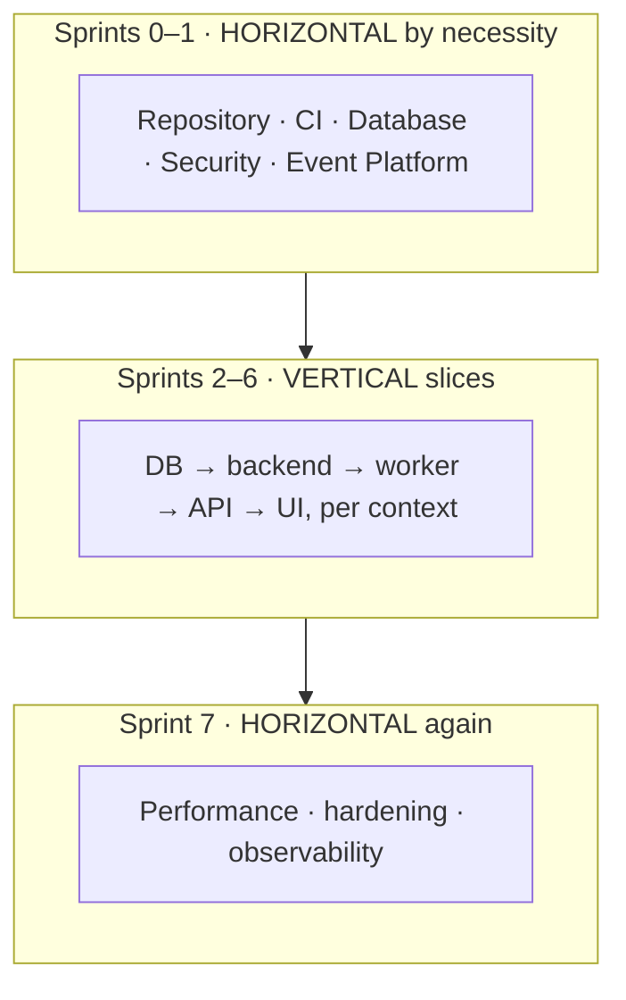
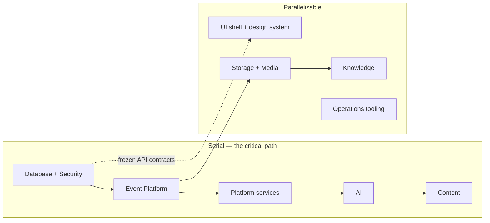
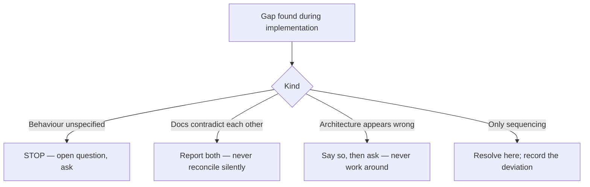

# Implementation Strategy

> **Status:** v1.0 — complete. Phase 16.
> **Foundations are horizontal; features are vertical.** The first two sprints have no user-facing slice to cut, and pretending otherwise produces a demo built on stubs that then become the integration contract.

## Overview

**Purpose.** Define how the work is sliced, sequenced, parallelized, and accepted.

**Scope.** Strategy only. The order itself is `implementation-order.md`; the mechanics are `sprint-planning.md`.

## The strategy in one paragraph

Build the platform's non-negotiable substrate first — tenancy, isolation, and the event backbone — because every later component assumes them and retrofitting either reliably misses cases. Then build each bounded context as a vertical slice through database, backend, worker, API, and UI, in the dependency order the architecture already fixed. Front-load the work most likely to be wrong. Ship to staging continuously and to production behind flags.

## Vertical slices — and where they do not apply

**A vertical slice is a thin path through every layer for one capability**, delivered complete rather than layer-by-layer. It is the default from Sprint 2 onward.

**Sprints 0 and 1 are deliberately horizontal**, and this is the strategy's most consequential choice. Tenancy, RLS, authentication, and the transactional outbox have no user-facing slice to cut. Attempting one produces an article-creation demo whose isolation was added later — and `16-security/row-level-security.md` documents six failure modes with no symptom, every one of which survives a demo.

**Sprint 7 returns to horizontal work** because performance, hardening, and observability cut across contexts by nature.

**Within a vertical slice, the order is fixed:** schema and RLS policy → domain logic → worker or engine → API contract → UI. Each layer is testable when it lands, and the API contract is already frozen, so no layer negotiates with the next.

## Dependency-first sequencing

**The build order is not a preference. It is derived from the architecture and was fixed in Phase 11.**

| Rule | Consequence |
|---|---|
| **Database + Security first** | Every component assumes `TenantContext` and RLS |
| **Event Platform before anything that publishes** | Retrofitting the outbox misses publication paths |
| **Storage before Knowledge** | Knowledge stores source documents |
| **Platform services before AI** | AI needs credit accounting and rate limiting |
| **Knowledge and AI before Content** | Content consumes both |
| **UI after its API** | The contract is frozen; the screen follows it |

**Building against a stub creates an integration contract nobody agreed to.** A mocked AI Gateway shaped by what Content found convenient becomes the de facto interface, and reconciling it with `08-ai-platform/` later is a rewrite of both.

**The one permitted exception is the UI shell**, which can be built against the frozen API contracts before their handlers exist. `06-api/api-reference.md` freezes 127 endpoints with schemas, so a UI built to that contract integrates without negotiation — this is what makes the frontend track parallelizable.

## Risk-first milestones

**Within the dependency order, the riskiest work in each sprint goes first.** A risk discovered in week four of a sprint is a schedule problem; discovered in week one it is a design conversation.

| Risk | Sprint | Why it is front-loaded |
|---|---|---|
| **RLS conformance across every table** | 0 | Six failure modes have no symptom; the conformance suite must exist before tables accumulate |
| **Outbox + relay under load** | 1 | The platform's durability guarantee; ordering and idempotency are hard to retrofit |
| **Provider reliability and cost** | 3 | External dependency with variable latency and real spend |
| **Prompt injection defence** | 3 | Not fully solvable; consequences must be bounded before content generation ships |
| **Pipeline duration and resumability** | 4 | Multi-minute, multi-stage, human-gated — the product's core loop |
| **Credit accounting under concurrency** | 1 | Money; atomic charging must be right the first time |

**Each of these is a spike before it is a story.** A time-boxed proof lands before the sprint's implementation work commits to an approach.

## Incremental delivery

| Property | Rule |
|---|---|
| Merge cadence | Continuous to `main`; `main` always deployable |
| Staging | **Automatic on merge** |
| Production | **Explicit approval**, from Sprint 2 |
| Incomplete work | **Behind a feature flag**, never on a long-lived branch |
| Branch lifetime | Short — days, not weeks |

**Feature flags carry incomplete work, not branches.** A two-week branch is a merge conflict accumulating interest, and it hides work from CI until the moment it is riskiest to break (`07-development-guide/ci-cd.md`).

**Every flag has a removal date recorded at creation** (`07-development-guide/configuration.md`). Flags are temporary; a permanent one is configuration wearing a flag's clothes.

**No flag gates a security control.** There is no flag that disables RLS, skips authorization, or bypasses audit.

**Production deployment begins in Sprint 2**, not at the end. A system first deployed to production in Sprint 7 has never been operated, and every operational defect surfaces at once.

## Parallel implementation

| Track | Can start | Depends on |
|---|---|---|
| **Critical path** | Sprint 0 | Serial by nature |
| **Storage + Media** | After Event Platform | Publishes events |
| **Knowledge** | After Storage | Stores source documents |
| **UI shell + design system** | **Sprint 0** | **Frozen API contracts only** |
| Operations tooling | Sprint 1 | Deployed environments |

**The UI track is the largest parallelization opportunity and it exists because the API is frozen.** Design system, navigation shell, state patterns, and accessibility scaffolding can all be built against `06-api/api-reference.md` before a single handler exists. Screens then connect as their APIs land.

**Two teams is the practical minimum to exploit this**; a third can take Storage and Knowledge from Sprint 2. Beyond that, coordination cost exceeds the gain — the critical path is genuinely serial.

**Parallel tracks integrate through frozen contracts, never through coordination.** A track that needs a meeting to integrate has found a gap in the contract, which is a finding to report.

## Feature completion

**A feature is complete when it works end-to-end for a real user under real controls.** Three things are explicitly not completion:

| Not complete | Why |
|---|---|
| API returns the right shape | No UI, no user |
| UI renders against a mock | No behaviour, no isolation |
| Happy path works | Failure and denial paths are where the product is judged |

**Denial paths are part of the feature.** A permission that is never tested for denial is a permission that may be granting more than intended (`07-development-guide/testing-guide.md`).

## Definition of Ready

**A story is ready when all of these hold. Anything less is a conversation, not a commitment.**

| Criterion |
|---|
| The owning architecture document is identified and read |
| The API contract exists in `06-api/api-reference.md`, or the story is explicitly UI-only |
| Acceptance criteria are written and testable |
| Permissions required are named, from `16-security/rbac.md` |
| Events emitted are named, from `13-event-platform/event-registry.md` |
| Audit implications are stated |
| Dependencies are landed, or the story is flagged as blocked |
| **Any ambiguity is resolved, or the story is not started** |

**The last criterion is the one that matters for agent execution.** `07-development-guide/implementation-checklists.md` Part 1 requires an agent to stop and ask rather than choose a default — a story with unresolved ambiguity guarantees that stop mid-flight.

**A story requiring an architectural decision is not ready.** It becomes an ADR or an open question first.

## Definition of Done

**Phase 11 sets the code-level Definition of Done and it is not restated here.** A change is done when behaviour matches the cited document, all CI gates pass with no exclusions added, tests cover failure and denial paths, new tables carry `tenant_id` plus a policy and an isolation test, errors are typed with correct retryability, nothing forbidden is logged, metric labels are bounded, affected documentation is updated in the same PR, and uncertainties are stated rather than resolved silently.

**This document adds the delivery-level criteria:**

| Criterion |
|---|
| Acceptance criteria demonstrably met |
| Deployed to staging and exercised there |
| **Observability live** — metrics emitting, alerts wired |
| **Runbook entry exists** where the feature can fail operationally |
| Feature flag created with a removal date, where shipped dark |
| Documentation cross-references resolve |

**"Observability live" is a completion criterion, not a follow-up.** A feature that works and cannot be observed becomes an incident nobody can shorten (`07-development-guide/code-review.md`).

**"Runbook entry exists" applies where the feature has an operational failure mode** — a consumer group, a scheduled job, a provider dependency. It does not apply to a settings form.

## Acceptance criteria

**Written before implementation, in behavioural terms, and testable.**

| Property | Rule |
|---|---|
| Form | Given / when / then |
| Coverage | Happy path, **failure path, denial path** |
| Permissions | Named explicitly |
| **Never** | "Works correctly" · "Is fast" · "Handles errors" |

**Every story with a permission has a denial criterion.** Without it, the positive test passes on a system that allows everything.

**Every story touching a tenant boundary has a cross-tenant criterion**, asserting that a second tenant cannot see the result. Per-test tenants make this nearly free (`07-development-guide/testing-guide.md`).

## Handling discovered gaps

**Only the fourth branch is decided within this phase.** The first three escalate, matching the binding rules in `07-development-guide/implementation-checklists.md` Part 1.

**A discovered gap is expected, not a failure.** Roughly 300,000 words of specification will contain some, and finding them during implementation is the cheapest time to find them.

## Business rules

1. **The architecture is frozen**; this folder decides order only.
2. **Sprints 0–1 are horizontal; Sprints 2–6 are vertical slices; Sprint 7 is horizontal.**
3. **Within a slice, the order is schema → domain → worker → API → UI.**
4. **The build order derives from Phase 11 and is not re-derived.**
5. **Nothing is built against a stub of a component that will exist**, except the UI against frozen contracts.
6. **The riskiest work in each sprint goes first**, as a time-boxed spike.
7. **Incomplete work ships behind a flag**, never on a long-lived branch.
8. **Every flag has a removal date; no flag gates a security control.**
9. **Production deployment begins in Sprint 2.**
10. **Parallel tracks integrate through frozen contracts, never coordination.**
11. **A feature is complete only end-to-end, including failure and denial paths.**
12. **Definition of Ready includes resolved ambiguity** — otherwise the story is not started.
13. **Definition of Done extends Phase 11's** with acceptance, staging, observability, and runbook.
14. **Acceptance criteria include denial and cross-tenant assertions.**
15. **Unspecified behaviour and contradictions escalate; only sequencing is decided here.**

## Cross references

- `07-development-guide/implementation-checklists.md` — **the build sequence, Part 1 agent rules, per-platform gates**
- `07-development-guide/testing-guide.md` — denial paths, per-test tenants
- `07-development-guide/ci-cd.md` — merge cadence, gates, branch discipline
- `07-development-guide/configuration.md` — feature flags and removal dates
- `07-development-guide/code-review.md` — the review criteria Done depends on
- `10-testing/testing-strategy.md` — coverage thresholds and the gate contract
- `implementation-order.md` — the order this strategy sequences
- `module-dependencies.md` — the graph behind the parallel tracks
- `sprint-planning.md` — mechanics and capacity
- `implementation-risks.md` — the risks front-loaded here
- `16-security/row-level-security.md` — why isolation cannot be retrofitted
- `99-open-questions.md` — where escalated gaps are recorded
