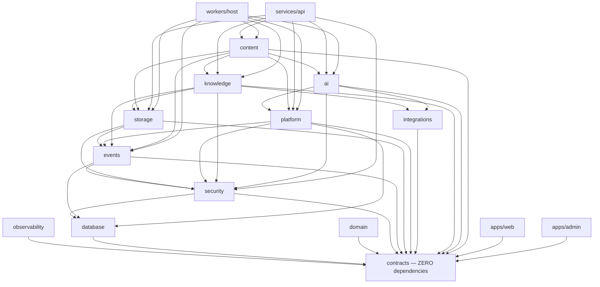
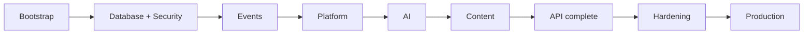

# Module Dependencies

> **Status:** v1.0 — complete. Phase 16. **Canonical dependency map.**
> **The graph is acyclic, and one architectural decision is why.** Audit is written synchronously in-transaction rather than as an event — which is what prevents Security and Events from depending on each other.

## Overview

**Purpose.** Map every bounded context's dependencies, distinguish build-time from runtime, identify the critical path, and name what can proceed in parallel.

**Scope.** Dependency facts derived from the architecture. Import direction is specified in `07-development-guide/project-structure.md`; this document reads it rather than restating it.

## Dependency kinds

| Kind | Means | Enforced by |
|---|---|---|
| **Build-time** | Package A imports package B | `dependency-cruiser`, TypeScript, `exports` |
| **Runtime** | A needs B *running* to function | Integration tests, readiness probes |
| **Hard** | A cannot exist without B | Build order |
| **Soft** | A degrades without B but functions | Graceful degradation |

**Build-time and runtime dependencies differ, and conflating them distorts the plan.** `packages/content` imports `contracts` at build time and needs the AI Gateway *running* at runtime. The first sets compile order; the second sets integration order.

**A soft dependency is a real dependency with a defined degradation.** AI Memory is soft for the AI Platform — a memory outage degrades personalization and nothing else, because memory is never a source of truth (ADR-026).

## The build-time graph

**`contracts` has zero dependencies and everything imports it.** One dependency on `database` would pull Drizzle into the browser bundle.

**`apps/web` and `apps/admin` import `contracts` only.** They reach everything else over HTTP, which is what makes the UI track parallelizable from Sprint 0.

**No cycles exist**, and the layered import direction makes them unrepresentable — a reverse import fails `dependency-cruiser` at build.

## Why Security and Events do not cycle

**This is the graph's most load-bearing property and it is a deliberate architectural choice.**

Events depends on Security: every consumer uses the RLS-enforced role and reconstructs `TenantContext` per delivery (`13-event-platform/consumer-groups.md`).

Security appears to need Events — audit records what happened, and events describe what happened. **It does not**, because audit is written **synchronously, inside the action's transaction**, and is explicitly not an event:

> *"Audit is deliberately not an event. Events are at-least-once, eventually delivered, and can be dead-lettered. Every one of those properties is disqualifying here: a dead-lettered audit record is a missing record."* — `16-security/audit.md`

**Had audit been event-driven, Security and Events would depend on each other**, and neither could be built first. The decision that made audit trustworthy also made the build order possible.

## Per-context dependencies

### Security

| | |
|---|---|
| **Hard build-time** | `database`, `contracts` |
| **Hard runtime** | PostgreSQL, secret store, KMS |
| **Soft** | Redis — session cache; degrades to database lookup |
| **Depended on by** | **Everything** |
| **Parallel** | Nothing until it exists |

**The KMS is a hard runtime dependency and fails closed.** A service that cannot reach it fails to start rather than running with unencrypted fallback (`16-security/encryption.md`).

### Events

| | |
|---|---|
| **Hard build-time** | `database`, `security`, `contracts` |
| **Hard runtime** | PostgreSQL (outbox is truth), Redis (transport) |
| **Soft** | None |
| **Depended on by** | Storage, Platform, Knowledge, Content |
| **Parallel** | Storage may start once the `EventBus` interface is stable |

**Redis is a hard runtime dependency but not a durability dependency.** Stream loss is recoverable by republishing from the outbox — *Redis is transport; PostgreSQL is truth* (ADR-020).

### Storage

| | |
|---|---|
| **Hard build-time** | `events`, `security`, `contracts` |
| **Hard runtime** | Object store (MinIO or R2), PostgreSQL, KMS |
| **Soft** | **CDN** — loss degrades latency, never correctness; **ClamAV** — unavailable means objects quarantine rather than release |
| **Depended on by** | Knowledge, Content |
| **Parallel** | Media processing parallel with object lifecycle |

**ClamAV unavailable is a soft dependency with a hard-failing default.** Unscannable means unsafe: objects quarantine rather than release, so the platform degrades toward safety (`12-storage-platform/blob-lifecycle.md`).

### Platform services

| | |
|---|---|
| **Hard build-time** | `events`, `security`, `database`, `contracts` |
| **Hard runtime** | PostgreSQL, Redis |
| **Soft** | Stripe — billing surface degrades; credit accounting continues |
| **Depended on by** | AI (credits, rate limiting), Content |
| **Parallel** | Credits, rate limiting, notifications, workflow, settings are independent of each other |

**Platform's five services are mutually independent** and are the largest intra-context parallelization opportunity in the plan.

### Knowledge

| | |
|---|---|
| **Hard build-time** | `storage`, `events`, `security`, `integrations`, `contracts` |
| **Hard runtime** | PostgreSQL + pgvector, object store |
| **Soft** | Firecrawl, Exa, DataForSEO — degrade retrieval breadth, never fabricate |
| **Depended on by** | Content |
| **Parallel** | Evidence Bank, entities, embeddings, freshness parallel after the schema lands |

**A provider outage degrades retrieval and never fabricates evidence** (`11-knowledge-platform/`). Degradation is bounded and honest.

### AI Platform

| | |
|---|---|
| **Hard build-time** | `platform`, `integrations`, `security`, `contracts` |
| **Hard runtime** | Model provider via OpenRouter, PostgreSQL |
| **Soft** | **AI Memory** — degrades personalization only (ADR-026) |
| **Depended on by** | Content |
| **Parallel** | Gateway, guardrails, prompts, cost accounting parallel after the Gateway interface |

**AI depends on Platform for credits, not the reverse.** Credit accounting knows nothing about models.

**Knowledge is not a build-time dependency of AI.** The Context Builder assembles from typed sources including evidence, but the AI Platform imports the *contract*, not the Knowledge package — which is why AI and Knowledge can be built in parallel after Storage.

### Content Platform

| | |
|---|---|
| **Hard build-time** | `ai`, `knowledge`, `storage`, `platform`, `events`, `contracts` |
| **Hard runtime** | Temporal, PostgreSQL, everything above |
| **Soft** | CMS targets — publishing degrades; drafting continues |
| **Depended on by** | API, workers |
| **Parallel** | **Engines parallelize once orchestration exists** |

**Content is last because it consumes everything.** Building it earlier produces mocks that become the integration contract.

**The thirteen engines parallelize substantially once orchestration and the shared engine anatomy exist** — the largest late-stage opportunity.

### Integrations

| | |
|---|---|
| **Hard build-time** | `contracts` only |
| **Hard runtime** | Per provider |
| **Depended on by** | Knowledge, AI, Platform |
| **Parallel** | **Every provider adapter is independent** |

**`integrations` depends only on `contracts`**, so each adapter is independently buildable and testable against a recorded fixture. This is genuinely parallel work with no coordination.

### API and workers

| | |
|---|---|
| **Hard build-time** | Every feature package |
| **Hard runtime** | Everything |
| **Parallel** | Endpoints parallelize per resource once the pipeline exists |

**The request pipeline is built once and inherited**, so endpoints added later parallelize freely (`16-security/api-security.md`).

### Applications

| | |
|---|---|
| **Hard build-time** | `contracts` only |
| **Hard runtime** | The API |
| **Soft** | Individual endpoints — a screen degrades to its error state |
| **Parallel** | **From Sprint 0**, against frozen contracts |

## The critical path

**Nine nodes, entirely serial, and adding people does not shorten it.** Each depends on the previous existing — not being planned, existing and verified.

**Everything off the critical path is opportunistic:**

| Off-path work | Earliest start | Blocks |
|---|---|---|
| **UI shell + design system** | **Bootstrap** | Nothing |
| Integrations adapters | Bootstrap | Nothing until Knowledge |
| Storage + Media | After Events | Knowledge |
| Knowledge | After Storage | Content |
| Operations tooling | After first deployment | Nothing |

**Storage and Knowledge sit adjacent to the critical path rather than on it.** Content needs both, so they must complete before Sprint 4 — but they do not block Platform or AI, which means a third track can carry them without contending for critical-path capacity.

## Parallel opportunities, ranked

| Rank | Opportunity | Value |
|---|---|---|
| 1 | **UI track from Sprint 0** | Largest — runs the whole project against frozen contracts |
| 2 | **Storage + Knowledge as a third track** | Removes two contexts from the critical path |
| 3 | **Provider adapters** | Independent, fixture-testable, no coordination |
| 4 | **Platform's five services** | Mutually independent |
| 5 | **Content's engines after orchestration** | Large but late |

**Opportunities 1 and 3 require no coordination at all**, because both integrate through frozen contracts. That is what makes them worth taking first.

## Independent modules

**Buildable and testable with no dependency on another context beyond `contracts`:**

| Module | Testable against |
|---|---|
| Provider adapters | Recorded fixtures |
| Design system | Nothing |
| `contracts` itself | Schema validation |
| `observability` | In-memory collectors |

**Everything else has at least one hard dependency**, and the graph above says which.

## Runtime dependency failures

| Dependency | Failure | Degradation |
|---|---|---|
| PostgreSQL | **Total** | Nothing functions |
| KMS | **Fails closed** | New tenants and cache misses fail; no plaintext fallback |
| Redis | Severe | Delivery stalls; **no data loss** — outbox is truth |
| Object store | Severe | Media unavailable; text unaffected |
| Model provider | Moderate | Generation fails; **no fallback on safety refusal** |
| Research providers | Moderate | Retrieval narrows; **evidence is never fabricated** |
| CDN | **Minor** | Latency only |
| ClamAV | Minor | Objects quarantine rather than release |
| Stripe | Minor | Billing surface degrades; credits continue |
| Temporal | Severe | Pipelines stall; **existing runs resume on recovery** |

**Two entries are load-bearing.** Redis loss stalls delivery without losing events, because the outbox is durable. And Temporal loss stalls pipelines without losing work, because runs are durable and resumable (ADR-004).

## Cycle verification

| Check | Result |
|---|---|
| Build-time cycles | **None** — enforced by `dependency-cruiser` |
| Runtime cycles | **None** |
| Security ↔ Events | **Broken by synchronous audit** |
| AI ↔ Knowledge | **Broken** — AI imports the contract, not the package |
| Content → anything → Content | **None** — Content is a leaf |

**Cycle absence is enforced, not asserted.** `dependency-cruiser` fails the build on a cycle, and the check runs on every PR (`07-development-guide/ci-cd.md`).

## Business rules

1. **Build-time and runtime dependencies are distinguished** and neither is inferred from the other.
2. **`contracts` has zero dependencies.**
3. **Applications import `contracts` only** and reach the rest over HTTP.
4. **The graph is acyclic**, enforced by CI.
5. **Security and Events do not cycle because audit is synchronous, not an event.**
6. **AI and Knowledge do not cycle** — AI imports the contract.
7. **The critical path is nine serial nodes** and does not shorten with more people.
8. **Storage and Knowledge are adjacent to the path**, not on it.
9. **Soft dependencies have a defined degradation**, never an undefined one.
10. **The KMS fails closed**; there is no unencrypted fallback.
11. **Redis loss stalls delivery without losing events.**
12. **A provider outage never fabricates evidence.**
13. **Provider adapters and the UI track need no coordination.**
14. **A track needing a meeting to integrate has found a contract gap** — a finding, not a process problem.

## Cross references

- `07-development-guide/project-structure.md` — **import direction, banned imports, enforcement**
- `07-development-guide/implementation-checklists.md` — the approved build sequence
- `implementation-order.md` — the sprints this graph sequences
- `implementation-strategy.md` — parallelization strategy
- `16-security/audit.md` — **synchronous audit; why the graph is acyclic**
- `16-security/encryption.md` — KMS failing closed
- `13-event-platform/transactional-outbox.md` — Redis as transport, PostgreSQL as truth
- `12-storage-platform/blob-lifecycle.md` — unscannable means unsafe
- `08-ai-platform/context-builder.md` — why AI imports contracts, not Knowledge
- `01-system-architecture/13-adr-log.md` — ADR-004, ADR-020, ADR-026
