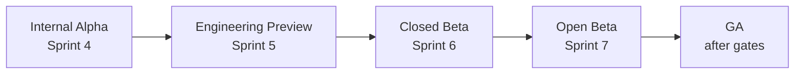
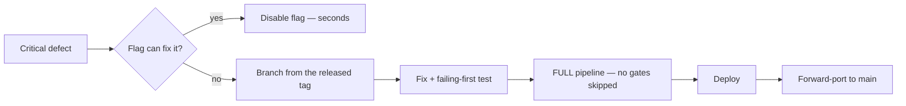

# Release Plan

> **Status:** v1.0 — complete. Phase 16.
> **The product version and the API version are independent.** The API is `/v1` and evolves under `06-api/api-versioning.md`; the product ships releases on its own cadence. Coupling them would force every integrator to migrate whenever an unrelated screen changed.

## Overview

**Purpose.** Define the release stages from internal alpha to general availability, their success criteria, and the ongoing release cadence afterwards.

**Scope.** Release governance. Deployment mechanics are `deployment-roadmap.md`; API versioning and deprecation are `06-api/api-versioning.md`.

## Two versioning schemes

| Scheme | Applies to | Changes when |
|---|---|---|
| **Product release** | The application as shipped | Features, fixes, hardening |
| **API version** (`/v1`) | The public contract | **Only on a breaking contract change** |

**A product major release does not imply an API major version.** The API stays at `v1` through every product release until a breaking contract change requires `v2` — and that change follows the six-month deprecation window regardless of the product's release schedule.

**Event versions are independent of both** (`13-event-platform/versioning.md`). A customer on API v1 may subscribe to event v3.

## Release stages

---

### Internal Alpha — Sprint 4

| | |
|---|---|
| **Audience** | The team only |
| **Purpose** | Prove the pipeline works end to end |
| **Data** | Synthetic |
| **Support** | None |

**Success criteria**

- [ ] A full pipeline run completes: research → outline → approval → draft → review → publish
- [ ] The run **survives a worker restart** mid-pipeline
- [ ] Outline approval and gate review both block correctly
- [ ] Credits charge and reconcile
- [ ] **Cross-tenant isolation holds across every subsystem**

**This stage answers one question: does the core loop work at all.** Everything else is deferred.

---

### Engineering Preview — Sprint 5

| | |
|---|---|
| **Audience** | Internal, plus design partners under NDA |
| **Purpose** | Validate the experience, not the scale |
| **Data** | Real content, non-production-critical |
| **Support** | Direct, best-effort |

**Success criteria**

- [ ] Every screen in `15-application-ui/` implemented and reachable
- [ ] A non-engineer completes the full journey unaided
- [ ] **Accessibility gate green; keyboard-only journeys pass**
- [ ] No cross-tenant leakage under multi-tenant use
- [ ] Long-running work renders as runs, never as loading states

**The gate that matters here is the third one.** A product that requires an engineer to operate is not ready for a design partner.

---

### Closed Beta — Sprint 6

| | |
|---|---|
| **Audience** | Invited customers, ~10–25 |
| **Purpose** | Real usage, real billing, real support load |
| **Data** | **Production data with production controls** |
| **Support** | Named contact; defined response times |

**Success criteria**

- [ ] Billing works end to end; **no card data touches the platform** |
- [ ] Credits, quotas, and entitlements enforce correctly
- [ ] Operator console usable for real support requests
- [ ] **Backups verified; a restore test has passed**
- [ ] Cost per tenant within the modelled envelope
- [ ] Support load sustainable at this customer count

**This is the first stage with real customer data**, so it is the first requiring the full security and compliance posture — audit, retention, erasure, and legal hold all functional.

**Cost per tenant is a gate.** A unit economics problem discovered at open beta is a pricing crisis; discovered here it is a tuning exercise.

---

### Open Beta — Sprint 7

| | |
|---|---|
| **Audience** | Self-serve signup, capacity-capped |
| **Purpose** | Scale, abuse resistance, operational load |
| **Data** | Production |
| **Support** | Standard channels; published response times |

**Success criteria**

- [ ] Load testing meets every stated NFR target
- [ ] **Penetration test complete; findings remediated or accepted**
- [ ] **DR drill completed with measured RTO and RPO**
- [ ] Rate limiting and abuse controls hold under adversarial use
- [ ] On-call rotation operating; runbooks exercised
- [ ] Change failure rate within target for four consecutive weeks

**Open beta is where operational readiness is proven, not claimed.** The DR drill is an exit criterion, not a plan.

---

### General Availability

| | |
|---|---|
| **Audience** | Public |
| **Purpose** | Commercial commitment |
| **Support** | Contractual SLAs |

**Success criteria — the Phase 11 pre-launch gates, unchanged**

- [ ] RLS conformance green; exactly five exception tables
- [ ] **Invariant board all-zero across every platform**
- [ ] Verified backup age within window; restore test passed
- [ ] DR drill completed with measured RTO/RPO
- [ ] Every registered consumer group has a heartbeating worker
- [ ] Secret rotation current; no break-glass credentials outstanding
- [ ] Threat-model detection coverage at 100%
- [ ] Every frozen interface has a signature test
- [ ] **Every Proposed ADR accepted or explicitly accepted-as-risk**

**Plus commercial readiness**

- [ ] Terms, DPA, and subprocessor list published
- [ ] SOC 2 evidence collection operating (`16-security/compliance.md`)
- [ ] Deprecation policy published and reachable
- [ ] Status page and incident communication live

**The last gate is currently outstanding.** Four ADRs remain Proposed — 022, 023, 024, 025 — and ADR-022 selects the ORM and schema toolchain (`README.md`).

---

## Ongoing releases

| Type | Contains | Cadence | Approval |
|---|---|---|---|
| **Patch** | Fixes, no contract change | As ready | Standard review |
| **Minor** | Additive features, compatible API changes | Every 2–4 weeks | Release owner |
| **Major** | Breaking product change | Planned | Named approver + notice |
| **Hotfix** | Critical production defect | Immediate | Release owner, retrospective review |

**A minor release may add API endpoints or optional fields without changing `/v1`.** Additive is compatible (`06-api/api-versioning.md`).

**A major product release does not force an API version bump** unless it removes or changes a contract.

## Hotfix workflow

**A hotfix uses the same pipeline as any other change.** There is no expedited path that skips gates — the changes most likely to break production are the ones written fastest (`07-development-guide/ci-cd.md`).

**Feature flags are checked first.** If a flag can disable the defect, that is seconds versus a full release cycle, and it is the preferred remedy.

**A hotfix branches from the released tag, not from `main`**, so unrelated unreleased work is not dragged into a production fix.

**Forward-porting is mandatory and same-day.** A fix that exists only on a release branch reappears in the next release.

**A hotfix requires a failing-first test**, exactly like any fix. Under time pressure this is where discipline slips, and it is where regressions come from (`testing-roadmap.md`).

## Support lifecycle

| Stage | Support |
|---|---|
| Current release | Full |
| Previous minor | Security and critical fixes |
| Older | None — upgrade required |
| **Deprecated API version** | **Security fixes backported for the full window** |

**Security fixes are backported to every supported API version.** An unpatched old version is an open door, and clients pinned to it have no signal to migrate (`06-api/api-versioning.md`).

## Version compatibility

| Combination | Supported |
|---|---|
| New client, current API | ✅ |
| **Old client, current API** | ✅ — additive changes only within a version |
| Client on a deprecated version | ✅ for the deprecation window |
| **Client on a sunset version** | ❌ — **`410 Gone`**, never a silent fallback |

**Silently routing a `v1` call to `v2` applies `v2` semantics — including authorization semantics — to a client expecting `v1`.** That is why sunset is a hard `410` (`16-security/api-security.md`).

## Deprecation

**Owned by `06-api/api-versioning.md`. The release-governance view:**

| Stage | Duration |
|---|---|
| Announced | Docs updated; `Deprecation` header on every response |
| Deprecated | **≥ 6 months**, fully functional, security fixes backported |
| Sunset | `410 Gone` with the migration link |

**Deprecation is announced in-band on every response**, because a client integrated two years ago is not reading the changelog.

**Customers with active traffic on a deprecating version are contacted at 90, 30, and 7 days**, and traffic is observable per version per tenant — so this is a query, not a guess.

**Sunset can be deferred for a specific customer**, time-boxed and recorded. Breaking an enterprise integration on a date rather than a readiness signal turns a migration into an incident.

## Release checklist

**Every release, regardless of size:**

- [ ] Full pipeline green on the candidate **digest**
- [ ] Pre-release verification passed (`testing-roadmap.md`)
- [ ] Migrations reviewed for expand/contract phase
- [ ] **No contract migration shipping with the code that stopped using the structure**
- [ ] Rollback target recorded
- [ ] Feature flags reviewed; stale flags noted
- [ ] Release notes written — customer-facing, not commit log
- [ ] Deprecation headers present where applicable
- [ ] Named approver recorded for production
- [ ] Post-deployment validation configured

**Release notes describe what changed for a customer.** A generated commit log is not release notes.

## Approval

| Release | Approver |
|---|---|
| Patch, minor | Release owner |
| Major | Named approver + customer notice |
| Hotfix | Release owner; retrospective review **within one business day** |
| **Production deployment** | **Named approver, audited** |

**Approval is recorded, not assumed.** Every production deployment is audited with artifact digest, actor, approver, migration set, and outcome (`16-security/audit.md`).

## Business rules

1. **Product releases and API versions are independent.**
2. **A major product release does not force an API version bump.**
3. **Each stage has success criteria that are verified, not asserted.**
4. **Closed beta is the first stage with real customer data** and requires the full compliance posture.
5. **Cost per tenant is a closed-beta gate.**
6. **GA criteria are the Phase 11 pre-launch gates, unchanged.**
7. **Hotfixes use the full pipeline; no gates are skipped.**
8. **A flag is checked before a hotfix is cut.**
9. **Hotfixes branch from the released tag and forward-port same-day.**
10. **A hotfix requires a failing-first test.**
11. **Security fixes are backported to every supported version.**
12. **Sunset returns `410`**, never a silent fallback.
13. **Deprecation runs at least six months, announced in-band.**
14. **Customers on a deprecating version are contacted at 90, 30, and 7 days.**
15. **Release notes are customer-facing, not a commit log.**
16. **Production approval is recorded and audited.**

## Cross references

- `06-api/api-versioning.md` — **API versioning, deprecation, sunset**
- `16-security/api-security.md` — unknown versions rejected; backported fixes
- `13-event-platform/versioning.md` — event versions, independent again
- `07-development-guide/ci-cd.md` — hotfixes use the same pipeline
- `07-development-guide/deployment-guide.md` — artifact digest, rollback target
- `07-development-guide/implementation-checklists.md` — **the pre-launch gates GA inherits**
- `deployment-roadmap.md` — environment progression
- `testing-roadmap.md` — pre-release verification
- `implementation-order.md` — the sprints each stage follows
- `16-security/compliance.md` — SOC 2 evidence, DPA, subprocessors
- `16-security/audit.md` — deployment approval records
