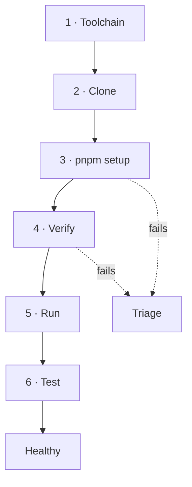

# Repository Bootstrap

> **Status:** v1.0 — complete. Phase 16.
> **This is the first-day path, not the local development reference.** `07-development-guide/local-development.md` owns setup mechanics, container versions, seed contents, and debugging. This document owns the order, the checkpoints, and the definition of a healthy environment.

## Overview

**Purpose.** Take an engineer or agent from no access to a verified working environment, with a checkpoint at each stage and a triage path when one fails.

**Deliberately short.** Every mechanic it references is specified once in Phase 11. Restating them here would create the duplicate ownership the governance review exists to prevent.

## Before the repository

**Four things are needed before the first clone**, and none is in the repository.

| Prerequisite | Grants |
|---|---|
| Source control access | Clone and push |
| **Secret store access — development scope only** | Dummy values for local |
| Container runtime | Docker or equivalent |
| Registry read access | Base images |

**No production secret is ever needed to develop.** Local uses a local secret store with dummy values, and `nodeEnv === 'production'` rejects them outright — which is what makes the separation enforceable rather than procedural (`07-development-guide/configuration.md`).

**Requesting production secret access as part of onboarding is a red flag.** There is no standing human access to production secrets; retrieval is break-glass and triggers rotation (`16-security/secrets-management.md`).

## The path



**Target: under one hour on a prepared machine**, dominated by container image pulls.

### 1 · Toolchain

**Node 22 LTS and pnpm, both pinned.** Versions come from `.nvmrc`, `engines`, and `packageManager` — `engine-strict` makes a wrong version a clear error rather than a confusing runtime failure.

**No global installs.** Every tool is a dev dependency invoked through pnpm scripts; a README instructing `npm i -g` produces a machine-dependent toolchain nobody can reproduce.

**Checkpoint:** `node --version` and `pnpm --version` match the pinned values.

### 2 · Clone

**Checkpoint:** the working tree is clean and `docs/` is present — the architecture travels with the code.

### 3 · Setup

```bash
pnpm setup
```

**One command, idempotent.** Its eight steps are specified in `07-development-guide/local-development.md`: version verification, frozen install, containers, database creation and migration, **RLS policy application and conformance**, bucket creation, seeding, and credential output.

**Running it twice is safe** and re-converges a drifted environment — the most common action after pulling a branch that changed migrations.

**Step 5 is the one that matters.** The RLS conformance suite runs during setup, so an environment missing policies fails immediately rather than after a feature is built against an unprotected schema.

**Checkpoint:** setup exits zero and prints test credentials.

### 4 · Verify

**Six assertions define a healthy environment.** All must pass before writing code.

| # | Assertion | Command |
|---|---|---|
| 1 | Containers healthy | `pnpm containers:status` |
| 2 | **RLS conformance green; exactly five exception tables** | `pnpm test:conformance` |
| 3 | Migrations current | `pnpm db:status` |
| 4 | **Two tenants and the outsider account seeded** | `pnpm db:verify-seed` |
| 5 | Unit tests pass | `pnpm test` |
| 6 | API and web start; probes respond | `pnpm dev` |

**Assertion 2 is the gate.** Six RLS failure modes have no symptom, and every one of them survives a running application (`16-security/row-level-security.md`).

**Assertion 4 is not optional.** With one tenant every cross-tenant bug is invisible: an unscoped query returns the right answer, a missing `WHERE tenant_id` looks correct, an unprefixed cache key never collides.

### 5 · Run

| Command | Runs |
|---|---|
| `pnpm dev` | API, worker, web with hot reload |
| `pnpm dev:api` · `dev:worker` · `dev:web` | Individually |

**Worker reload restarts and drains** rather than hot-swapping modules — which exercises the production graceful-shutdown path dozens of times a day (`13-event-platform/workers.md`).

**Checkpoint:** sign in as `editor@acme-test.example`, see the dashboard, switch workspaces.

### 6 · Test

| Command | Scope |
|---|---|
| `pnpm test` | Unit, watch mode |
| `pnpm test:integration` | Containers, real infrastructure |
| `pnpm test:conformance` | RLS, drivers, signatures |
| `pnpm test:ci` | **Everything CI runs** |

**`pnpm test:ci` exists so a pipeline failure is reproducible without pushing.** A gate that can only be evaluated on CI turns every failure into a multi-minute round trip.

**Checkpoint:** `pnpm test:ci` passes on a clean checkout of `main`.

## Definition of a healthy local environment

**All ten. Anything less is not ready for work.**

- [ ] Node and pnpm at pinned versions
- [ ] All containers healthy — PostgreSQL 17 + pgvector, Redis 7, MinIO, Mailpit, ClamAV
- [ ] **RLS conformance green; exactly five exception tables**
- [ ] Migrations current; no pending or divergent
- [ ] **Two tenants seeded, plus the negative-test outsider account**
- [ ] All seeded roles usable — Owner through Viewer
- [ ] `pnpm test:ci` passes on clean `main`
- [ ] API, worker, and web all start; probes respond
- [ ] **Real authentication works** — no bypass
- [ ] Local telemetry emitting to the local collector

**The last two are where shortcuts appear and must not.** Authentication, authorization, RLS, tenant scoping, the outbox, scanning, and validation are **never disabled in any environment**, and no configuration flag can disable them (`07-development-guide/local-development.md`).

**Local telemetry catches instrumentation bugs before production.** Unbounded metric cardinality, a missing `correlationId`, or a payload attached to a span are all visible locally and invisible in code review.

## Triage

**Ordered by likelihood. Each names its owning document.**

| Symptom | Cause | Action |
|---|---|---|
| **Queries return zero rows** | **No tenant context — RLS working** | Set context; not a bug (`16-security/row-level-security.md`) |
| Setup fails at migrations | Divergent branch migrations | `pnpm db:reset` (`07-development-guide/migration-guide.md`) |
| Conformance fails: sixth exception | A table lacks a policy | Add it in the table's own migration |
| Containers unhealthy | Port conflict or insufficient memory | `pnpm containers:down` then up |
| `already-exists` on write | Conditional write; key reused | Objects are immutable (`12-storage-platform/object-storage.md`) |
| Uploads stuck at `scanning` | ClamAV not running | Start containers (`12-storage-platform/blob-lifecycle.md`) |
| Events never delivered | Worker not running | `pnpm dev:worker` |
| Auth fails after reseed | Sessions invalidated | Sign in again |
| Frozen-lockfile install fails | Lockfile and manifest disagree | Regenerate, never hand-merge (`07-development-guide/dependency-management.md`) |
| Wrong Node version | `engine-strict` | Use `.nvmrc` |

**The first row is the most common and most misdiagnosed.** It is RLS failing closed on a missing tenant context — correct behaviour, and every developer hits it once.

**A triage step that requires disabling a control is not a triage step.** If the only way past a failure is switching off RLS or authentication, the failure is the finding.

## First contribution

**Once healthy, the first change follows the standard path** — no special onboarding flow.

| Step | Reference |
|---|---|
| 1 · Read the specifying architecture document | The story names it |
| 2 · Branch from `main` | `07-development-guide/ci-cd.md` |
| 3 · Write the test first where practical | `07-development-guide/testing-guide.md` |
| 4 · Implement to the cited specification | `07-development-guide/coding-standards.md` |
| 5 · `pnpm test:ci` locally | Green before requesting review |
| 6 · PR citing the document | `07-development-guide/code-review.md` |

**Requesting review with a red pipeline wastes a reviewer on findings the machine already produced.**

**Agents follow the same path, bound additionally by `07-development-guide/implementation-checklists.md` Part 1** — implement only documented architecture, stop and ask rather than choose a default, never weaken a test.

## Business rules

1. **No production secret is ever needed to develop**; requesting one is a red flag.
2. **`pnpm setup` is one command and idempotent.**
3. **RLS conformance runs during setup**, not after.
4. **Ten assertions define health**; all must pass before work begins.
5. **Two tenants plus the outsider account are mandatory**, never one.
6. **Real authentication is used locally** — no bypass exists.
7. **Local telemetry runs the production pipeline.**
8. **Zero rows is RLS working**, not a bug.
9. **A triage step requiring a disabled control is not a triage step.**
10. **`pnpm test:ci` reproduces the pipeline locally.**
11. **No global tool installs.**
12. **The first contribution uses the standard path**, with no onboarding exception.

## Cross references

- `07-development-guide/local-development.md` — **setup steps, containers, seed data, credentials, debugging, common failures**
- `07-development-guide/configuration.md` — `.env` policy, production guards
- `07-development-guide/dependency-management.md` — pinned runtimes, frozen install
- `07-development-guide/migration-guide.md` — `db:reset` and migration conflicts
- `07-development-guide/testing-guide.md` — local test workflow
- `07-development-guide/ci-cd.md` — the pipeline `test:ci` reproduces
- `07-development-guide/code-review.md` — PR expectations
- `07-development-guide/implementation-checklists.md` — Part 1 agent rules
- `16-security/row-level-security.md` — conformance, zero-row behaviour
- `16-security/secrets-management.md` — why no production secret is needed
- `repository-structure.md` — what setup produces
- `implementation-order.md` — what to build once healthy
