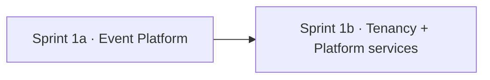

# Sprint Planning

> **Status:** v1.0 — complete. Phase 16.
> **Exit criteria are binary.** A sprint closes when its criteria are met or it carries them forward visibly. "Mostly done" is not a state, because every downstream sprint assumes the previous one's guarantees hold.

## Overview

**Purpose.** Define sprint mechanics: length, capacity, sizing, ceremonies, carry-forward, spikes, and how AI agents participate.

**Scope.** Process. The sequence and its exit criteria are `implementation-order.md`.

**Assumption stated explicitly:** a small team. ADR-002 selected a modular monolith on exactly that basis — *"small team, many bounded contexts, shared types."* The mechanics below assume two to four engineers plus AI agents, and the parallelization ceiling in `implementation-strategy.md` reflects it.

## Sprint shape

| Property | Value |
|---|---|
| Length | **Two weeks** |
| Planning | Half day at the start |
| Review | Demo against exit criteria, not against stories |
| Retrospective | One hour, ending in at most three actions |
| Daily | 15 minutes, blockers only |

**Two weeks is chosen against the pipeline's rhythm.** The product's core loop — research through publication — takes minutes to hours to exercise end-to-end. A one-week sprint spends too much of itself on ceremony relative to integration time; a four-week sprint discovers integration problems too late.

**Review demonstrates exit criteria, not story completion.** A sprint where every story closed and the exit criteria did not pass has not finished, and reviewing stories would obscure that.

## Capacity

**Three tracks, sized against the critical path.**

| Track | Capacity | Runs |
|---|---|---|
| **Critical path** | The majority | Sprints 0–4, serial |
| **UI** | One engineer + agents | **Sprint 0 onward, parallel** |
| **Storage / Knowledge** | Opportunistic | Sprint 2 onward |

**The critical path is genuinely serial and cannot be parallelized by adding people.** Database and Security must exist before the Event Platform, which must exist before Platform services. Adding a fourth engineer to Sprint 1 produces coordination cost, not throughput.

**The UI track is where additional capacity pays.** It starts in Sprint 0 against frozen API contracts and never blocks on the critical path — 127 endpoints with schemas mean the shell, design system, state patterns, and accessibility scaffolding are all buildable before a handler exists.

**Agents extend a track; they do not constitute one.** An agent implementing a bounded context still needs a human reviewing against the architecture, and `07-development-guide/code-review.md` requires a named reviewer on security-sensitive, schema, and contract changes regardless of who authored them.

## Sizing

**Estimation here is less uncertain than usual, and the uncertainty sits in a specific place.**

| Source of estimate | Confidence |
|---|---|
| **Behaviour** — what to build | **High** — specified in ~300,000 words |
| **Contracts** — interfaces and schemas | **High** — frozen |
| **Integration** — components meeting | **Low** |
| **External providers** — latency, quotas, failure shapes | **Low** |

**Size the integration, not the implementation.** A story implementing a documented interface is predictable; a story wiring two platforms together for the first time is not. The Event Platform's first real consumer, the first provider call through the Gateway, and the first end-to-end pipeline run are the three points where estimates should be widest.

**Stories are sized in days, not points.** Points abstract away a conversation the team needs to have on a project where the specification is this complete.

**A story over three days is split.** Beyond that it hides a dependency or an unresolved question, and `implementation-strategy.md` requires ambiguity resolved before a story is Ready.

## Sprint 1 — the split contingency

**Sprint 1 is oversized and this is stated rather than discovered.** It contains the Event Platform (fourteen architecture documents), tenancy completion, and Platform services.

| Split | Contents | Exit criteria |
|---|---|---|
| **1a** | Outbox, relay, bus, registry, consumers, workers, retry, DLQ, idempotency, ordering | The event-related criteria from Sprint 1 |
| **1b** | Organizations, workspaces, permissions, credits, rate limiting, notifications | The remaining Sprint 1 criteria |

**The split is by dependency, not by convenience.** Platform services depend on the Event Platform, so 1a must complete before 1b starts — splitting the other way would reintroduce the retrofit problem the order exists to prevent.

**The decision is made at Sprint 1 planning**, based on the Sprint 0 velocity signal, and does not change the order within.

## Ceremonies

### Planning

| Step | Output |
|---|---|
| 1 · Confirm the sprint's exit criteria | Shared understanding of "done" |
| 2 · Confirm prior criteria are met | Carry-forward identified |
| 3 · Identify the riskiest work | A spike, time-boxed |
| 4 · Break down deliverables | Stories meeting Definition of Ready |
| 5 · Assign tracks | Critical path, UI, opportunistic |

**Step 2 gates the sprint.** Starting Sprint 3 while Sprint 2's isolation criteria are unmet means building AI on an unverified foundation.

**Step 3 produces a spike, not an estimate.** The riskiest work is proven before the sprint commits to an approach (`implementation-strategy.md`).

### Daily

**Blockers only, fifteen minutes.** Status is visible in the pipeline and the board; a daily meeting that recites it is a meeting about a dashboard.

**A blocker older than one day escalates.** On a small team, a stuck engineer is a meaningful fraction of capacity.

### Review

**Demonstrate the exit criteria, in a running environment, on staging.** Not slides, not a local machine, and not a recording.

**Criteria that cannot be demonstrated are not met.** "RLS conformance green" is shown by running it.

### Retrospective

**At most three actions, each with an owner and a date.** A retrospective producing twelve actions produces none.

**Recurring themes escalate to the architecture** as an open question, never as a workaround. If the team repeatedly fights the same boundary, the boundary may be wrong — and that belongs in `99-open-questions.md`, not in accumulated exceptions.

## Carry-forward

| Situation | Handling |
|---|---|
| Story incomplete | Carries with its remaining work re-estimated |
| **Exit criterion unmet** | **Carries as a blocking item; the next sprint starts with it** |
| Criterion unmet twice | **Escalates** — the plan or the estimate is wrong |
| Scope discovered mid-sprint | Added only if a criterion depends on it |

**An unmet exit criterion is never silently deferred.** Every downstream sprint assumes the previous one's guarantees, and a deferred isolation criterion means every subsequent sprint builds on an unverified assumption.

**Carried criteria are visible in the next planning session's step 2**, which is what makes them impossible to lose.

## Spikes

| Property | Rule |
|---|---|
| Purpose | Reduce uncertainty on the riskiest work |
| Time box | **Two days maximum** |
| Output | A decision and a written finding — **not production code** |
| Failure | A spike that ends without a decision is itself a finding |

**Spike code is thrown away.** Code written to answer a question was not written to the standards in `07-development-guide/coding-standards.md`, and keeping it means shipping code nobody reviewed against the architecture.

**Six spikes are scheduled by `implementation-order.md`**: RLS conformance, outbox under load, credit concurrency, provider reliability, prompt injection defence, and pipeline resumability.

## Working with AI agents

**Agents are bound by `07-development-guide/implementation-checklists.md` Part 1**, which is not restated here. Sprint-level participation adds four rules:

| Rule | Reason |
|---|---|
| **One bounded context at a time** | A cross-context change cannot be reviewed against a single specification |
| **PRs stay small** | Review quality collapses past a few hundred lines |
| **Green CI before continuing** | Stacking work on a red pipeline compounds failure |
| **A blocked agent reports and stops** | It does not choose a default (`implementation-strategy.md`) |

**Agent-authored work is reviewed by a human against the architecture**, and the review question is the same as for anyone: *where is this specified, and does it match?*

**An agent that reports a contradiction has done its job.** Roughly 300,000 words will contain some, and surfacing one is more valuable than silently reconciling it.

**Agent throughput does not shorten the critical path.** Sequencing is set by dependencies, not by authorship speed.

## Metrics worth tracking

| Metric | Signals |
|---|---|
| **Exit criteria met on time** | Whether the plan is realistic |
| Carry-forward count | Systematic over-commitment |
| **Change failure rate** | Whether gates are sufficient |
| Time to first review | Whether review is a bottleneck |
| Pipeline flake rate | **A flaky gate is a gate people bypass** |
| Spike outcomes | Whether risk identification is working |

**Velocity is not tracked.** On a plan whose order is fixed by dependencies, velocity measures nothing actionable — the sequence cannot be reordered to exploit a faster team.

**Change failure rate is the most informative metric here.** A rising rate means the gates are letting defects through, which matters more on a project where later sprints assume earlier guarantees.

## Business rules

1. **Two-week sprints.**
2. **Review demonstrates exit criteria on staging**, not stories on a laptop.
3. **Planning step 2 confirms prior exit criteria** before committing new work.
4. **The riskiest work becomes a time-boxed spike**; spike code is discarded.
5. **Stories over three days are split.**
6. **Size the integration, not the implementation.**
7. **Sprint 1 may split into 1a and 1b**, by dependency, decided at planning.
8. **An unmet exit criterion carries visibly and blocks**; twice escalates.
9. **Scope is added only if a criterion depends on it.**
10. **Recurring friction escalates to an open question**, never a workaround.
11. **Agents work one bounded context at a time, in small PRs, on green CI.**
12. **Agent work is human-reviewed against the architecture.**
13. **Velocity is not tracked**; change failure rate is.
14. **Retrospectives produce at most three owned actions.**

## Cross references

- `implementation-order.md` — **the sprints, their contents, and their exit criteria**
- `implementation-strategy.md` — Definition of Ready and Done, risk-first, parallelization
- `module-dependencies.md` — what genuinely blocks what
- `implementation-playbook.md` — daily workflow and the Claude Code contract
- `implementation-risks.md` — the risks spikes address
- `07-development-guide/implementation-checklists.md` — **Part 1 agent rules; the build sequence**
- `07-development-guide/code-review.md` — review depth and named reviewers
- `07-development-guide/ci-cd.md` — pipeline health and flake rate
- `01-system-architecture/13-adr-log.md` — ADR-002, the small-team basis
- `99-open-questions.md` — where recurring friction is recorded
