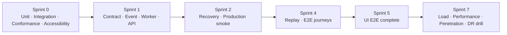

# Testing Roadmap

> **Status:** v1.0 — complete. Phase 16.
> **This document owns *when* each test stage arrives. It owns no thresholds.** Coverage numbers and the CI gate contract are `10-testing/testing-strategy.md` §9; authoring conventions are `07-development-guide/testing-guide.md`.

## Overview

**Purpose.** Sequence fourteen test stages against the sprint plan: what arrives when, who owns it, what it gates, and what a failure blocks.

**The organizing principle.** A test stage arrives *before* the code it protects, not after. The RLS conformance suite exists in Sprint 0 before tables accumulate; the accessibility gate exists before the first component; replay tests exist before the second workflow.

## Arrival schedule

| Stage | Arrives | Runs |
|---|---|---|
| Unit | **Sprint 0** | Every PR |
| Integration | **Sprint 0** | Every PR |
| **Conformance (RLS)** | **Sprint 0** | **Every PR — merge gate** |
| Accessibility | **Sprint 0** | Every PR |
| Contract | Sprint 1 | Every PR |
| Event | Sprint 1 | Every PR |
| Worker | Sprint 1 | Every PR |
| API | Sprint 1 | Every PR |
| Security (denial paths) | Sprint 0, per context | Every PR |
| Recovery (restore test) | Sprint 2 | **Weekly** |
| Production smoke | Sprint 2 | Every production deploy |
| Regression | Sprint 1 | Every PR, growing |
| Load | Sprint 7 (baseline Sprint 2) | Scheduled |
| Performance | Sprint 7 | Scheduled |
| Penetration | Sprint 7 | Per release |
| **DR drill** | Sprint 7 | **Quarterly** |

---

## Unit

| | |
|---|---|
| **Purpose** | Pure functions and the functional core |
| **Owner** | The engineer or agent writing the code |
| **Entry** | A package exists |
| **Exit** | Coverage meets `10-testing/testing-strategy.md` §9 |
| **Blocks** | **Merge** |
| **CI** | Stage 3 — fast, runs first |

**Where a unit test needs elaborate mocking, the code has I/O in its core** and the design is the finding, not the test (`07-development-guide/coding-standards.md`).

**Watch mode is the default**, which is why unit tests must stay sub-second.

---

## Integration

| | |
|---|---|
| **Purpose** | Cross-package behaviour against **real** PostgreSQL, Redis, MinIO |
| **Owner** | The engineer writing the change |
| **Entry** | Containers running locally and in CI |
| **Exit** | 100% pass |
| **Blocks** | **Merge** |
| **CI** | Stage 4 |

**The database is never mocked.** RLS semantics, constraint behaviour, and transaction isolation are exactly what a mock gets wrong.

**Each test rolls back** unless it is testing commit behaviour, and **each creates its own tenant** — which makes cross-tenant assertions nearly free.

---

## Conformance — the Sprint 0 gate

| | |
|---|---|
| **Purpose** | Assert the code still matches the architecture |
| **Owner** | Whoever changes the schema, a driver, or a frozen interface |
| **Entry** | **Sprint 0, before tables accumulate** |
| **Exit** | Green |
| **Blocks** | **Merge — unconditionally** |
| **CI** | Stage 4 |

| Suite | Asserts |
|---|---|
| **RLS coverage** | Every table has `tenant_id`, a policy, and a named isolation test; **exactly five exceptions** |
| Role privileges | `contentos_app` lacks `BYPASSRLS`, owns no tables |
| Pool mode | Transaction pooling configured |
| Driver capability | Every declared capability actually works |
| **Interface signature** | Frozen APIs have not drifted |

**This suite converts the platform's primary isolation risk from a review-time concern into a build-time one.** Six RLS failure modes have no symptom, and a running application does not reveal any of them (`16-security/row-level-security.md`).

**The signature suite would have caught the drift the Phase 8, 10, and 12 reviews found by hand** — nine, ten, and eight items respectively.

---

## Contract

| | |
|---|---|
| **Purpose** | Consumer expectations match producer schemas |
| **Owner** | The producing context |
| **Entry** | Sprint 1 — the registry exists |
| **Exit** | Every registered event and endpoint has a contract test |
| **Blocks** | **Merge** |
| **CI** | Stage 4 |

**Contract tests read the registry, never a copy.** A test asserting a hand-written schema drifts from the registered one and passes while production breaks (`13-event-platform/event-registry.md`).

**The API route table is asserted against `06-api/api-reference.md`** — an endpoint absent from the registry does not exist.

---

## Event

| | |
|---|---|
| **Purpose** | Delivery guarantees hold under failure |
| **Owner** | Event Platform, then every consumer |
| **Entry** | Sprint 1 |
| **Exit** | All four guarantees demonstrated |
| **Blocks** | **Merge** |
| **CI** | Stage 4 |

| Guarantee | Test |
|---|---|
| Durability | Event exists **iff** its transaction committed |
| Exactly-once effects | Redelivery suppressed by `processed_events` |
| **Per-aggregate ordering** | Holds under **retry, failover, and replay** |
| No silent loss | Poison rows quarantine; nothing drops |

**Ordering is tested under all three conditions.** Ordering that holds in steady state and breaks under retry is ordering that breaks exactly when it matters (`13-event-platform/ordering.md`).

**A `SchemaViolation` at a consumer is a paradox and fails the build.** The registry validates pre-commit, so seeing one downstream means the registry was bypassed.

---

## Worker

| | |
|---|---|
| **Purpose** | Lifecycle, cancellation, graceful drain |
| **Owner** | Event Platform |
| **Entry** | Sprint 1 — `workers/host` exists |
| **Exit** | Drain reports zero abandoned |
| **Blocks** | Merge |
| **CI** | Stage 4 |

**Cancellation never acknowledges**, so a cancelled handler's entry is redelivered — safe only because handlers are idempotent.

**Local worker reload restarts and drains**, which exercises the production shutdown path dozens of times a day (`07-development-guide/local-development.md`).

---

## API

| | |
|---|---|
| **Purpose** | Endpoints behave as contracted |
| **Owner** | The implementing context |
| **Entry** | Sprint 1 — the pipeline exists |
| **Exit** | Every endpoint has success, failure, **and denial** tests |
| **Blocks** | **Merge** |
| **CI** | Stage 4 |

**Every endpoint has a denial test.** A permission never tested for denial may be granting more than intended, and positive-only tests pass on a system that allows everything.

**Cross-tenant access is asserted to return `404`, not `403`** — the security control, not a preference.

**Idempotency is tested**: the same key with the same body returns the original response; a different body returns `422`.

---

## UI and accessibility

| | |
|---|---|
| **Purpose** | Screens render, behave, and are usable |
| **Owner** | The UI track |
| **Entry** | **Accessibility: Sprint 0.** E2E: Sprint 5 |
| **Exit** | Journeys pass; accessibility gate green |
| **Blocks** | **Merge (accessibility) · release (E2E)** |
| **CI** | Stage 2 (a11y), Stage 10 (E2E) |

**The accessibility gate exists from the first component**, not from Sprint 5. Adding it later means retrofitting every component, which reliably does not happen.

**E2E covers journeys, not features.** Sign up → workspace → article → outline approval → publish is one test; a feature-per-test suite becomes the slowest and flakiest part of CI.

**Automated accessibility coverage is not claimed as complete.** A manual keyboard and screen-reader protocol runs per release (`15-application-ui/accessibility.md`).

---

## Security

| | |
|---|---|
| **Purpose** | Controls hold under adversarial input |
| **Owner** | Every context for its own; a named reviewer for the release |
| **Entry** | **Denial paths: Sprint 0.** Penetration: Sprint 7 |
| **Exit** | Threat-model detection coverage at 100% |
| **Blocks** | **Merge (denial, isolation) · release (penetration)** |
| **CI** | Stages 4 and 5 |

| Test | Arrives |
|---|---|
| Denial paths | Sprint 0, per context |
| Cross-tenant isolation | Sprint 0, per table |
| **SSRF validation** | Sprint 2 — private ranges, redirect re-validation |
| **Injection resistance** | Sprint 3 — `10-testing/ai-evaluation.md` §11 |
| Secret scanning | Sprint 0 — diff **and history** |
| Penetration testing | Sprint 7 |

**Every threat in `16-security/threat-model.md` maps to a detection signal**, and coverage is measured rather than assumed.

---

## Recovery

| | |
|---|---|
| **Purpose** | Backups restore; the platform recovers |
| **Owner** | Operations |
| **Entry** | Sprint 2 — first backups exist |
| **Exit** | **Restore test passes weekly; DR drill quarterly** |
| **Blocks** | **Release** |
| **CI** | Scheduled, not per PR |

**A completed backup is not a valid backup.** The dashboard tracks `verified_backup_age_seconds`, never completion age (`12-storage-platform/backups.md`).

**The weekly restore test verifies referential integrity across database and object storage**, which is what validates the backup ordering rule — database snapshotted before objects.

**It also verifies RLS policies survived the restore.** A restore that recreated tables without them produces a working database with no tenant isolation.

**The quarterly DR drill measures real RTO and RPO**, and measured values supersede targets where they diverge (`12-storage-platform/disaster-recovery.md`).

---

## Load and performance

| | |
|---|---|
| **Purpose** | Behaviour at production scale |
| **Owner** | The team, against stated NFRs |
| **Entry** | Baseline Sprint 2; full Sprint 7 |
| **Exit** | Every stated target met |
| **Blocks** | **Release** |
| **CI** | Scheduled |

| Target | Source |
|---|---|
| Relay lag p95 < 2 s | `13-event-platform/observability.md` |
| Presign p95 < 10 ms | `12-storage-platform/storage-apis.md` |
| API read p95 < 200 ms | `06-api/api-observability.md` |
| Time to `available` p95 < 60 s | `12-storage-platform/blob-lifecycle.md` |

**Thresholds map to stated targets, so a regression fails against the specification** rather than against a number someone chose.

**Load testing runs against production-shaped data volume.** A migration or query verified against a thousand rows says nothing about a hundred million.

**A Sprint 2 baseline exists so Sprint 7 has something to compare against.**

---

## Regression

| | |
|---|---|
| **Purpose** | Fixed defects stay fixed |
| **Owner** | Whoever fixes the defect |
| **Entry** | Sprint 1 — the first defect |
| **Exit** | Every fixed defect has a test that failed before the fix |
| **Blocks** | **Merge of the fix** |
| **CI** | Stage 3–4 |

**A fix without a failing-first test is not a fix.** The test must be demonstrated failing before the change, or it may be asserting the bug.

**Property-test failures are shrunk and pinned as example tests**, so a found bug stays found without re-running the generator.

---

## Pre-release verification

| | |
|---|---|
| **Purpose** | Confirm a release candidate meets every gate |
| **Owner** | The release owner |
| **Entry** | A candidate artifact exists |
| **Exit** | **All Phase 11 pre-launch gates pass** |
| **Blocks** | **Release** |
| **CI** | Staging, stages 9–10 |

- [ ] Full suite green on the candidate digest
- [ ] Conformance green; exactly five exception tables
- [ ] **Invariant board all-zero**
- [ ] Verified backup age within window
- [ ] DR drill within the quarter
- [ ] Every consumer group has a heartbeating worker
- [ ] Secret rotation current
- [ ] Threat-model detection coverage 100%
- [ ] Every frozen interface has a signature test
- [ ] **Every Proposed ADR accepted or explicitly accepted-as-risk**

**These are the Phase 11 gates, unchanged.** This stage runs them against a specific artifact rather than against the codebase in general.

---

## Production smoke

| | |
|---|---|
| **Purpose** | Confirm a deployment works in production |
| **Owner** | The deploying engineer |
| **Entry** | Deployment complete, instances ready |
| **Exit** | Critical paths respond |
| **Blocks** | **Triggers automatic rollback on failure** |
| **CI** | Stage 12 |

| Check | Failure action |
|---|---|
| Health and readiness | **Auto-rollback** |
| Authentication round trip | **Auto-rollback** |
| One read per platform | **Auto-rollback** |
| Event published and delivered | **Auto-rollback** |
| **Invariant board zero** | **Page — never auto-rollback** |

**The last row is deliberate.** Startup and smoke failures are unambiguous and roll back automatically; an invariant breach needs a human decision, and automatic rollback could destroy the state needed to determine scope (`07-development-guide/deployment-guide.md`).

**Smoke tests use a dedicated production tenant**, never customer data.

---

## Blocking summary

| Failure | Blocks |
|---|---|
| Unit, integration, contract, event, worker, API, accessibility, denial | **Merge** |
| **Conformance** | **Merge, unconditionally** |
| Secret scan | **Merge — and triggers rotation** |
| E2E, load, performance, penetration, recovery | **Release** |
| Pre-release gates | **Release** |
| Smoke | **Triggers rollback** |
| Invariant breach in production | **Pages; never auto-rollback** |

**No stage is advisory.** A gate that warns is a gate that erodes at exactly the rate people are busy (`07-development-guide/ci-cd.md`).

## Business rules

1. **A test stage arrives before the code it protects.**
2. **Conformance exists in Sprint 0, before tables accumulate.**
3. **The accessibility gate exists from the first component.**
4. **The database is never mocked; each test creates its own tenant.**
5. **Contract tests read the registry, never a copy.**
6. **Ordering is tested under retry, failover, and replay.**
7. **Every endpoint has a denial test; cross-tenant asserts `404`.**
8. **E2E covers journeys, not features.**
9. **Restore tests are weekly; DR drills quarterly; measured RTO supersedes target.**
10. **Load thresholds map to stated NFR targets.**
11. **A fix without a failing-first test is not a fix.**
12. **Pre-release runs the Phase 11 gates against a specific artifact.**
13. **Smoke failures auto-roll-back; invariant breaches page instead.**
14. **No stage is advisory.**
15. **Coverage thresholds belong to `10-testing/testing-strategy.md` §9** and are not set here.

## Cross references

- `10-testing/testing-strategy.md` — **taxonomy, coverage thresholds, the CI gate contract**
- `10-testing/unit-testing.md` · `integration-testing.md` · `e2e-testing.md` · `ai-evaluation.md`
- `07-development-guide/testing-guide.md` — authoring conventions
- `07-development-guide/ci-cd.md` — pipeline stages and blocking behaviour
- `07-development-guide/deployment-guide.md` — smoke gating and rollback
- `07-development-guide/implementation-checklists.md` — the pre-launch gates
- `16-security/row-level-security.md` — the conformance suite
- `16-security/threat-model.md` — detection coverage
- `12-storage-platform/backups.md` · `disaster-recovery.md` — restore tests and drills
- `implementation-order.md` — the sprints these stages align to
- `development-checklists.md` — per-context test tasks
