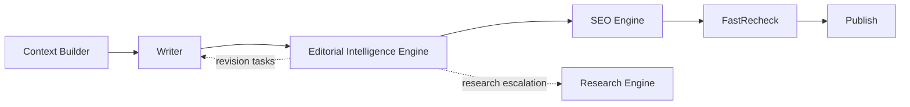

# Editorial Intelligence Engine

> **Status:** v1.0 — complete. Phase 17. **New bounded context.**
> **One model writes. Many specialist editors review. No editor ever rewrites.** Editors communicate only through structured Issues, disagree only through structured Debate, and publication happens only after deterministic Consensus.

## Overview

**What this is.** An AI editorial board that sits between the Writer and structural optimization. Sixteen editors, each owning exactly one concern, review a draft and produce **Issues** — never replacement text. Where they disagree, a **Debate Thread** resolves it. A deterministic **Consensus Engine** decides whether the draft advances, and a **Revision Planner** turns unresolved issues into discrete tasks the Writer executes.

**What it is not.** It is not a generator, not a second writer, and not a replacement for any existing platform. It adds a review layer that consumes what the platform already produces.

**Why it exists.** A single model asked to write and then critique its own work produces critique shaped by the same blind spots that produced the draft. Separating generation from review — and making review adversarial, specialised, and structurally incapable of rewriting — is the difference between an AI writing tool and an editorial process.

## The core inversion

| Traditional AI writing | ContentOS EIE |
|---|---|
| One model writes and self-reviews | **One Writer; sixteen specialist Editors** |
| Critique is prose | **Critique is a typed Issue** |
| Reviewer rewrites the text | **Editors cannot produce text** |
| Disagreement is invisible | **Disagreement is a Debate Thread** |
| "Looks good" | **Deterministic consensus over severity, evidence, and hierarchy** |
| Publish when generation completes | **Publish only after consensus** |

**The Writer never reviews itself, never scores itself, and never approves itself.** Those three prohibitions are what make the board meaningful rather than decorative.

**Editors never rewrite.** An editor that could produce replacement text would become a second writer with none of the Writer's context, and its output would be unattributable. Editors produce Issues; the Writer executes Tasks.

## Position in the pipeline

**EIE occupies the `Review` stage of the approved pipeline.** ADR-011 requires Review before SEO — *"structural optimization applies only to content that has already passed quality"* — and EIE sits exactly there. The approved state machine is unchanged: `Writing → Review → Seo → FastRecheck → ReadyToPublish` (`05-content-platform/orchestration.md`).

**The Review Engine is not replaced.** It continues to own its ADR-021 score categories and continues to compute the gate verdict. EIE wraps the editorial board around it: the Review Engine supplies measured scores, the editors supply Issues, and consensus reconciles both into the verdict the orchestrator consumes.

**The Writer never publishes directly.** Every path to publication passes through consensus.

## What EIE never does

| Never | Owner |
|---|---|
| Generate or replace article text | The **Writer** |
| Retrieve or store evidence | `11-knowledge-platform/` |
| Assemble the model context | `08-ai-platform/context-builder.md` |
| Call a model provider | `08-ai-platform/ai-gateway.md` |
| Compute an ADR-021 `Score` for a category with an existing producer | That producer |
| Apply structural SEO changes | `05-content-platform/seo-engine.md` |
| Decide the final gate verdict shape | ADR-009 — three verdicts |
| Publish anything | `05-content-platform/publishing-engine.md` |
| Emit an event outside the outbox | ADR-020 |

**EIE adds a bounded context; it takes nothing from an existing one.**

## Two architectural reconciliations

**These were resolved before this folder was written**, and both preserve Accepted ADRs without amendment.

### Verdict mapping — ADR-009 preserved

**Consensus produces five internal outcomes. The gate receives three verdicts.**

| EIE consensus | ADR-009 verdict | Meaning at the gate |
|---|---|---|
| `PASS` | `pass` | Advance |
| `PASS_WITH_WARNINGS` | `soft-warn` | Advance; warnings recorded |
| `REVISION_REQUIRED` | **`block`** | Revision tasks issued to the Writer |
| `BLOCK` | **`block`** | Cannot advance without change |
| `HUMAN_REVIEW_REQUIRED` | **`block`** | Routed to `AwaitHumanReview` |

**The three blocking outcomes are distinguished by an EIE-internal reason, not by a fourth verdict.** ADR-009 fixes the verdict set at three, `03-database/tables.md` enforces it with a CHECK constraint, and Phase 15 states a fourth is unrepresentable. The distinction customers need lives in the Editorial Report; the distinction the *gate* needs is binary.

**`HUMAN_REVIEW_REQUIRED` uses a path that already exists.** The approved orchestration reaches `AwaitHumanReview` on `verdict block`, so routing is not new behaviour.

### Issues are not Scores — ADR-021 preserved

**ADR-021 fixes twelve canonical categories with exactly one producer each.** Sixteen editors emitting scores would create duplicate producers.

**Editors emit Issues, which are a different artifact.** An Issue is a located, evidenced, categorised defect with a suggested resolution. A `Score` is a measured 0–100 value with confidence. They answer different questions and are stored separately.

**The four per-editor scores — Confidence, Evidence, Coverage, Risk — are internal to EIE** and are never ADR-021 `Score` objects. They describe an editor's certainty about its own findings, not the article's quality.

**Where EIE surfaces a quality measure, it comes from the producer that owns that category** — the Review Engine, the SEO Engine, or whichever engine ADR-021 assigns.

## Relationship to the AI Council

**The Council (ADR-019) already exists and is not replaced.** It enforces model diversity, performs real conflict detection, discloses participants and disagreements, and operates under a cost budget.

| | AI Council | Editorial Board |
|---|---|---|
| Scope | **Bounded, high-value decisions** | **Every draft, every revision** |
| Output | Positions, conflicts, a recommendation | **Issues, debates, consensus** |
| Invocation | On demand | **Always, as the Review stage** |
| Relationship | **EIE may convene a Council** for an unresolved debate | — |

**EIE consumes the Council rather than competing with it.** Where a Debate Thread reaches its round limit without resolution, EIE may escalate to a Council for a bounded adjudication — using the diversity, conflict detection, and disclosure guarantees ADR-019 already provides.

## Provider independence

**No document in this folder names a model, a family, or a provider. Ever.**

**Editors are logical roles.** The Fact Editor is a responsibility, not a model. Which model serves which role is a runtime routing decision owned by the AI Platform, expressed as policy, and changeable without touching this architecture (`provider-mapping.md`).

**Model diversity across roles is a requirement, not an accident.** An editorial board where every seat is the same model is a single model wearing sixteen masks — precisely the failure ADR-019 was written to prevent, and the AUDIT finding that produced it.

**The API exposes no provider information**, matching `06-api/ai-api.md`: no model name, no routing decision, no per-model token counts.

## Cost posture

**Only the Writer generates long text.** Editors receive the draft, relevant context, evidence, and issue history — and return Issues. An editor that regenerated the article would multiply cost by the board size for no additional signal.

**Incremental review is the default.** After a revision, only changed sections are re-reviewed, plus any section an open Issue references.

**Every editorial run reports its credits consumed**, and cost is a first-class field in the Editorial Report (`04-platform/credits.md`).

## Document map

| Document | Owns |
|---|---|
| `architecture.md` | Components, boundaries, data flow, what EIE consumes and produces |
| `editorial-workflow.md` | The end-to-end run: draft → review → debate → consensus → revision |
| `editor-roles.md` | **The sixteen editors and their exclusive concerns** |
| `issue-model.md` | **The Issue schema, categories, severity, lifecycle** |
| `debate-engine.md` | Structured challenge, thread mechanics, round limits, termination |
| `consensus-engine.md` | **Deterministic decision over severity, evidence, confidence, hierarchy** |
| `revision-planner.md` | Issues → discrete Writer tasks |
| `confidence-engine.md` | Confidence, Evidence, Coverage, Risk — and what each is not |
| `provider-mapping.md` | Role-to-provider assignment as policy, never as architecture |
| `orchestration.md` | Temporal workflow, research escalation, self-critique, resumability |
| `implementation-guide.md` | Schema, events, API, storage, the Claude Code contract for EIE |

## Immutability

**Nothing EIE produces is ever overwritten.**

| Artifact | Rule |
|---|---|
| Issues | Append-only; resolution is a new state, not an edit |
| Debate threads | Append-only |
| Consensus decisions | One per round, immutable |
| Revision plans | Immutable; a new plan supersedes |
| Editorial reports | Immutable per run |

**Issue history survives every revision.** An issue raised in round one and resolved in round three is visible in both states, because the editorial record is the product's evidence that review happened.

## Why this is not replicable with one LLM

**Four properties compound, and none is achievable by prompting a single model:**

**Separation of generation from review.** A model critiquing its own output shares the blind spots that produced it. EIE's Writer is structurally incapable of reviewing, and its editors are structurally incapable of writing.

**Exclusive concern ownership.** Sixteen editors each own exactly one category, so nothing is reviewed by everyone-and-therefore-no-one. A single prompt asking for "all issues" produces a list weighted by whatever the model finds salient.

**Real disagreement, structurally captured.** Debate Threads reference Issue IDs and terminate deterministically. A single model asked to argue with itself synthesises disagreement — the exact failure ADR-019 documents from v1.

**Deterministic consensus.** The same issue set always produces the same outcome, because consensus is computed from severity, evidence strength, confidence, and a fixed editorial hierarchy — not sampled from a model.

**The user-facing consequence:** the product is not *"this tool writes articles."* It is *"this tool runs my content through an editorial board before publication, and shows me the board's work."*

## Cross references

- `08-ai-platform/` — the Gateway, Context Builder, guardrails, and Council EIE consumes
- `05-content-platform/orchestration.md` — **the pipeline stage EIE occupies**
- `05-content-platform/review-engine.md` — the engine EIE wraps, not replaces
- `05-content-platform/writing-engine.md` — the Writer
- `11-knowledge-platform/` — evidence, provenance, citations; always the source of truth
- `01-system-architecture/13-adr-log.md` — **ADR-009, ADR-011, ADR-019, ADR-021, ADR-026**
- `01-system-architecture/14-scoring-contract.md` — why Issues are not Scores
- `13-event-platform/` — every EIE event through the outbox
- `16-security/` — tenant isolation, audit, prompt-injection posture
- `06-api/ai-api.md` — the provider-hiding rules EIE inherits
- `15-application-ui/` — where the Editorial Report is rendered
