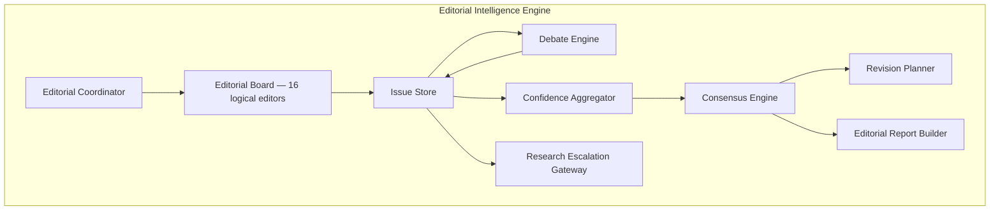
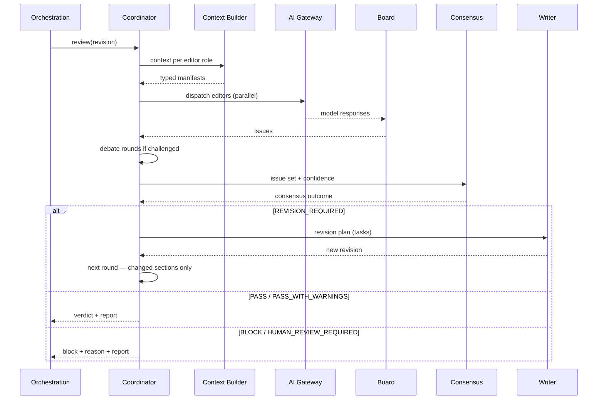

# Architecture

> **Status:** v1.0 — complete. Phase 17.
> **EIE is a coordinator, not a capability provider.** It owns no models, no evidence, no storage primitives, and no scoring algorithms. Every capability it uses belongs to a platform that already exists; what EIE adds is the structure that turns those capabilities into an editorial process.

## Overview

**Purpose.** Define EIE's components, its boundaries, what it consumes, what it produces, and where it lives in the codebase.

**Scope.** Structure and data flow. The run sequence is `editorial-workflow.md`; the decision logic is `consensus-engine.md`.

## Components



| Component | Owns | Never |
|---|---|---|
| **Editorial Coordinator** | Run lifecycle, round management, dispatch | Reviews anything itself |
| **Editorial Board** | Invoking editors, collecting Issues | Produces text |
| **Issue Store** | Issue persistence and lifecycle | Merges or edits Issues |
| **Debate Engine** | Challenge threads, round limits | Free-form conversation |
| **Confidence Aggregator** | Per-editor certainty roll-up | Quality measurement |
| **Consensus Engine** | The deterministic decision | Model invocation |
| **Revision Planner** | Issues → discrete tasks | Writing the fix |
| **Research Escalation Gateway** | Requesting new research | Retrieving evidence itself |
| **Editorial Report Builder** | The explainability artifact | Interpreting outcomes |

**The Consensus Engine never calls a model.** It is pure computation over an issue set, and that is what makes it deterministic (`consensus-engine.md`).

## What EIE consumes

**Every capability comes from an existing platform through its published interface.**

| Capability | Source | EIE never |
|---|---|---|
| Model invocation | **`08-ai-platform/ai-gateway.md`** | Calls a provider |
| Context assembly | **`08-ai-platform/context-builder.md`** | Builds a prompt |
| Guardrail evaluation | `08-ai-platform/guardrails.md` | Decides safety itself |
| Multi-model adjudication | `08-ai-platform/` Council (ADR-019) | Reimplements diversity |
| Evidence and citations | **`11-knowledge-platform/`** | Touches a vector index |
| New research | `05-content-platform/research-engine.md` | Fetches a page |
| Measured scores | The ADR-021 producer for that category | Computes a duplicate |
| The draft | `05-content-platform/writing-engine.md` | Edits it |
| Credits and cost | `04-platform/credits.md` | Charges directly |
| Persistence | `03-database/` | Invents storage |
| Events | **`13-event-platform/` outbox** | Publishes directly |

**The Context Builder boundary is the one most easily violated.** EIE requests a context *for an editor role*; the Context Builder assembles it from typed, allowlisted sources. EIE never constructs prompt text, which is what preserves the structural exclusion of secrets (`16-security/secrets-management.md`).

**Retrieval prepares evidence; the Context Builder assembles the manifest.** EIE never bypasses that boundary — it is mandatory in `11-knowledge-platform/retrieval-pipeline.md`.

## What EIE produces

| Artifact | Consumed by | Immutable |
|---|---|---|
| **Issues** | Debate, consensus, planner, UI | ✅ Append-only |
| **Debate Threads** | Consensus, UI | ✅ Append-only |
| **Consensus Decision** | Orchestration, gate | ✅ One per round |
| **Revision Plan** | The Writer | ✅ Superseded, never edited |
| **Editorial Report** | UI, API, audit | ✅ One per run |
| **Gate verdict** | `05-content-platform/orchestration.md` | Per ADR-009 |
| **Events** | Subscribers, via the outbox | Per ADR-020 |

**The gate verdict is the only artifact the existing pipeline requires.** Everything else is explainability — which is the product, but not the contract.

## Data flow



**Editors are dispatched in parallel.** They are independent by construction — each owns one concern and none reads another's output in the first round — so a round costs the latency of the slowest editor, not the sum.

**Debate is a second phase, not interleaved.** Editors see peer Issues only after the first round completes, which prevents an early Issue from anchoring the rest of the board.

## Boundaries with the Review Engine

**Both exist. They answer different questions.**

| | Review Engine | EIE |
|---|---|---|
| Produces | **ADR-021 `Score` objects** for its categories | **Issues** |
| Answers | *How good is this, measured?* | *What specifically is wrong, and where?* |
| Determinism | Algorithmic | **Consensus is deterministic; editor findings are not** |
| Owns the verdict | Historically | **Now derived from consensus, which consumes its scores** |

**EIE consumes Review Engine scores as one input to consensus.** A low measured score raises the weight of related Issues; a high one does not suppress a `CRITICAL` Issue, because severity and hierarchy dominate (`consensus-engine.md`).

**The Review Engine keeps its ADR-021 categories and its single-producer status.** EIE adds no competing producer.

## Boundaries with the Writer

**Three prohibitions define the relationship.**

| The Writer | The Board |
|---|---|
| Generates the draft | **Cannot generate text** |
| Executes revision tasks | **Cannot execute tasks** |
| **Never reviews itself** | Reviews only |
| **Never scores itself** | — |
| **Never approves itself** | — |
| May raise self-critique Issues | Treats them identically |

**Self-critique Issues receive no special treatment.** They enter the same store, carry the same schema, are subject to the same debate, and count identically in consensus. A self-raised Issue that a peer editor disputes goes to a Debate Thread like any other (`editorial-workflow.md`).

**The Writer executes discrete tasks, not free-form rewrites.** "Rewrite the article" is not a task; "replace the unsupported claim at §3¶2 with an evidenced statement" is (`revision-planner.md`).

## Codebase placement

**EIE is a content-lifecycle capability and lives inside the existing content package.**

```
packages/content/src/editorial/
├── coordinator/
├── board/            # editor role definitions — NO provider names
├── issues/
├── debate/
├── consensus/        # pure functions, no I/O
├── planner/
├── confidence/
├── escalation/
├── report/
└── internal/
```

**No new package is created.** `07-development-guide/project-structure.md` freezes twelve packages and its decision table routes a content-lifecycle capability to the content package. A thirteenth package would require an ADR, and EIE does not need one.

**`consensus/` contains pure functions with no I/O**, matching the functional-core discipline — which is what makes determinism testable (`07-development-guide/coding-standards.md`).

**`board/` contains role definitions only.** Role-to-provider assignment is runtime policy owned by the AI Platform and never appears here (`provider-mapping.md`).

## Concurrency and resumability

| Property | Mechanism |
|---|---|
| Editor dispatch | Parallel, bounded by AI Gateway concurrency |
| Round progression | Serial — a round completes before the next begins |
| Durability | **Temporal workflow** (ADR-004) |
| Resumability | Activities idempotent on `(workflowId, step)` |
| Cancellation | Cooperative; committed work not rolled back |

**An editorial run is a Temporal workflow, not an in-process loop.** It spans minutes, includes human waits on `HUMAN_REVIEW_REQUIRED`, and must survive deploys — the same requirements that put the content pipeline on Temporal (`05-content-platform/orchestration.md`).

**Each editor invocation is an idempotent activity.** A worker crash mid-round replays without re-charging for completed invocations.

## Tenant isolation

**EIE inherits every control; it defines none.**

| Control | Source |
|---|---|
| `TenantContext` first parameter on every operation | `16-security/tenant-isolation.md` |
| Every EIE table carries `tenant_id` with an RLS policy | `16-security/row-level-security.md` |
| Evidence retrieved with query-time tenant filtering | `11-knowledge-platform/` |
| Events carry `tenantId` and `organizationId` | `13-event-platform/event-apis.md` |
| Audit written in-transaction | `16-security/audit.md` |

**An editorial run never crosses a tenant boundary**, and no editor can request evidence outside its run's tenant — retrieval is filtered at query time, not after (`16-security/tenant-isolation.md`).

## Prompt-injection posture

**EIE increases exposure to injected content and inherits the platform's bounded response.**

**Editors read evidence, competitor content, and the draft — all untrusted.** Content fetched during research may contain instructions aimed at a reviewer; the draft may contain instructions the Writer absorbed from that content.

| Control | Source |
|---|---|
| Every context segment framed as data, never instruction | `08-ai-platform/context-builder.md` |
| Secrets structurally absent from every prompt | `16-security/secrets-management.md` |
| No side effect reachable from source text | `16-security/prompt-injection.md` |
| **An Issue cannot cause a publish** | Consensus decides; Issues only inform |
| Guardrail blocks are terminal | `08-ai-platform/retry-strategy.md` |

**The fourth row is EIE's specific contribution.** An injected instruction that persuaded an editor to raise a spurious `PASS`-favouring Issue still cannot advance the draft, because consensus is computed from severity and hierarchy rather than from editor sentiment.

## Failure behaviour

| Failure | Behaviour |
|---|---|
| One editor fails after retry | **Recorded as an Issue-less result with reduced Coverage**; the run continues |
| **Majority of editors fail** | Run fails; no consensus is computed |
| A hierarchy-critical editor fails | **`HUMAN_REVIEW_REQUIRED`** — see below |
| Guardrail blocks an editor prompt | Terminal for that editor; recorded |
| Research escalation unavailable | Issue remains open; consensus proceeds with reduced Coverage |
| Debate exceeds round limit | **Unresolved; severity escalates** (`debate-engine.md`) |
| Temporal worker restart | Run resumes from checkpoint |

**A failed Safety or Compliance editor forces `HUMAN_REVIEW_REQUIRED`.** Those two sit at the top of the editorial hierarchy, and proceeding without their finding would be asserting a clearance nobody gave.

**Coverage is reduced, not faked.** A missing editor lowers the run's Coverage score and is visible in the Editorial Report rather than silently absorbed (`confidence-engine.md`).

## Cost model

| Cost driver | Control |
|---|---|
| Board size | 16 editors, each receiving a **bounded** context |
| Long-text generation | **Writer only** |
| Re-review after revision | **Changed sections plus Issue-referenced sections only** |
| Debate | Bounded rounds, configurable |
| Council escalation | Under ADR-019's cost budget |

**An editorial run costs roughly one generation plus sixteen bounded reviews per round.** Editors receive the draft, their concern's context, evidence, and issue history — never the full corpus, and never a regeneration instruction.

**Incremental re-review is what keeps multi-round runs affordable.** Round two reviews changed sections and any section an open Issue references; unchanged, unreferenced sections carry their prior Issues forward unchanged.

**Every run reports credits consumed**, and cost appears in the Editorial Report (`04-platform/credits.md`).

## Storage

**Five tables, all additive, all workspace-owned and RLS-protected.** Schema is specified in `implementation-guide.md`.

| Table | Holds |
|---|---|
| `editorial_runs` | Run lifecycle, round count, outcome |
| `editorial_issues` | **Append-only** Issues with full lifecycle state |
| `editorial_debates` | **Append-only** threads and challenges |
| `editorial_consensus` | One immutable decision per round |
| `editorial_reports` | One immutable report per run |

**Nothing is overwritten.** Issue resolution is a new state transition recorded alongside the original, never an edit — which is what makes the editorial record evidence rather than a summary.

## Events

**Ten event types, all published through the transactional outbox** (ADR-020, `implementation-guide.md`):

`IssueCreated` · `IssueResolved` · `DebateStarted` · `DebateResolved` · `ConsensusReached` · `RevisionRequested` · `RevisionCompleted` · `EditorialPassed` · `EditorialBlocked` · `ResearchEscalated`

**Payloads carry identifiers only** — never draft text, Issue prose, or evidence content (`13-event-platform/event-registry.md`).

## Business rules

1. **EIE owns no models, evidence, storage primitives, or scoring algorithms.**
2. **Every capability comes from an existing platform's published interface.**
3. **EIE never constructs prompt text**; the Context Builder assembles every context.
4. **The Consensus Engine never calls a model.**
5. **Editors are dispatched in parallel; rounds are serial.**
6. **Debate is a separate phase**, so early Issues do not anchor the board.
7. **The Review Engine keeps its ADR-021 categories and single-producer status.**
8. **The Writer never reviews, scores, or approves itself.**
9. **Self-critique Issues receive no special treatment.**
10. **EIE lives in `packages/content/src/editorial/`** — no new package, no ADR.
11. **`consensus/` is pure, with no I/O.**
12. **An editorial run is a Temporal workflow**, resumable and idempotent per activity.
13. **A failed Safety or Compliance editor forces `HUMAN_REVIEW_REQUIRED`.**
14. **Coverage is reduced rather than faked** when an editor fails.
15. **An Issue can never cause a publish** — consensus decides.
16. **Only the Writer generates long text**; re-review is incremental.
17. **All five tables are append-only; nothing is overwritten.**
18. **Every event goes through the outbox.**

## Cross references

- `README.md` — the two architectural reconciliations
- `editorial-workflow.md` — the run sequence this structure executes
- `consensus-engine.md` — the deterministic decision
- `implementation-guide.md` — schema, events, API
- `08-ai-platform/ai-gateway.md` · `context-builder.md` · `guardrails.md`
- `05-content-platform/orchestration.md` — the stage EIE occupies
- `05-content-platform/review-engine.md` — scores EIE consumes
- `11-knowledge-platform/retrieval-pipeline.md` — the retrieval boundary
- `16-security/tenant-isolation.md` · `prompt-injection.md` · `audit.md`
- `13-event-platform/transactional-outbox.md` · `event-registry.md`
- `07-development-guide/project-structure.md` — why no new package
- `01-system-architecture/13-adr-log.md` — ADR-004, ADR-009, ADR-011, ADR-019, ADR-021
