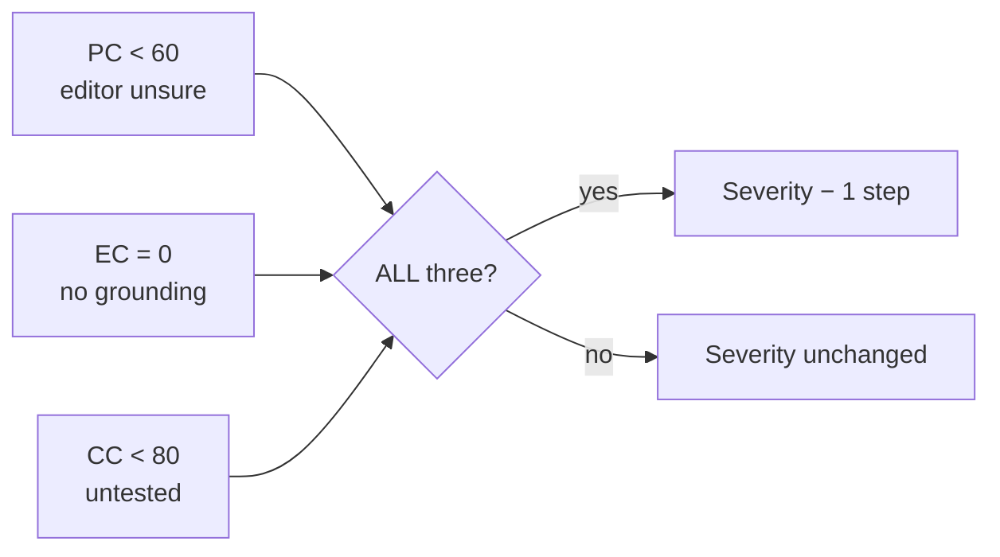
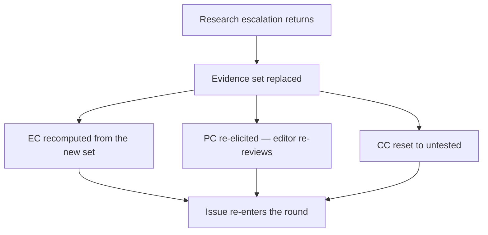

# Confidence Engine

> **Status:** v1.0 — complete. Phase 17. **Canonical confidence model.**
> **There is no single confidence score.** Every editorial decision evaluates three orthogonal confidences that answer different questions and are never averaged into one number.

## Overview

**Purpose.** Define what confidence means in EIE, how each dimension is computed, when it decays, when it goes stale, and exactly how it may and may not influence consensus.

**Scope.** The confidence model. Its use in the decision is `consensus-engine.md`; the field it annotates is `issue-model.md`.

## Why three

**A single confidence number conflates three unrelated questions**, and once conflated they cannot be separated again:

| Question | Dimension |
|---|---|
| How certain is the editor of its own judgement? | **Prediction Confidence** |
| How well grounded is the finding in retrieved evidence? | **Evidence Confidence** |
| Has the board tested this finding? | **Consensus Confidence** |

**These fail independently.** An editor can be highly certain about a claim with no evidence (high PC, zero EC). A finding can be perfectly evidenced and never challenged (high EC, low CC). A weak finding can survive debate because nobody contested it (low PC, high CC). Averaging produces a number that hides every one of these states.

**A single score cannot answer "why is this uncertain," which is the only question worth asking.** The three dimensions each have a different remedy: low PC needs a second opinion, low EC needs research, low CC needs debate. One number tells you none of that (ADR-021, orthogonal confidence).

## Relationship to the stored field

**`EditorialIssue.confidence` is Prediction Confidence.** It is the only confidence persisted on the Issue, and the other two are derived from data the Issue already carries.

| Dimension | Storage |
|---|---|
| **Prediction** | `EditorialIssue.confidence` — **stored** |
| **Evidence** | Derived from `EditorialIssue.evidence[]` |
| **Consensus** | Derived from the debate thread and Issue state |

**No schema change is required, and none is proposed.** `issue-model.md` defines the field and defers its meaning to this document; the derived dimensions are pure functions of records that already exist (`issue-model.md`).

**Derived confidences are computed, never stored.** Persisting them would create a second source of truth that drifts the moment evidence or debate changes, and it would let a stale value outlive the facts that produced it.

## Prediction Confidence

**Source.** The editor, self-reported with its finding.

**Calculation.** Reported directly as an integer 0–100. It is validated, not transformed — the Confidence Engine does not second-guess the editor's stated certainty.

```
PC = issue.confidence                        // integer 0–100, validated at write
```

**Thresholds.**

| Band | Range | Meaning |
|---|---|---|
| **Asserted** | 80–100 | The editor is confident |
| **Probable** | 60–79 | Above the consensus floor |
| **Tentative** | 40–59 | Below the floor |
| **Speculative** | 0–39 | Below the floor |

**Failure behaviour.** A missing, non-integer, or out-of-range value causes the **Issue to be discarded at validation**. It is never defaulted, clamped, or inferred — validation discards, never repairs (`issue-model.md`).

**Relationship to consensus.** PC below `CONFIDENCE_FLOOR` (60) is one of the three conditions in the severity downgrade, and it is never sufficient alone (`consensus-engine.md`).

**Calibration is deliberately absent.** Adjusting PC by an editor's historical accuracy requires outcome data across runs, which is the Learning Engine's concern and does not exist in Phase 17. Applying an uncalibrated correction factor would be worse than applying none.

## Evidence Confidence

**Source.** `EditorialIssue.evidence[]` — references into the Knowledge Platform.

**Calculation.** Deterministic from the reference set. `EvidenceRef.relevance` is a four-value enum, so grounding strength comes from a fixed weight table, not from a numeric relevance score.

```
WEIGHT = { supports: 100, contradicts: 100, insufficient: 55, absent: 25 }
CORROBORATION_TARGET = 3

EC = 0                                                   if evidence is empty
   = round(0.6 × strength + 0.4 × corroboration)         otherwise

strength      = max over refs of WEIGHT[ref.relevance]
distinct      = |{ ref.evidenceId : ref.evidenceId ≠ '' }|
corroboration = 100 × min(distinct − 1, 2) / 2
```

**`supports` and `contradicts` weigh the same, which is intentional.** EC measures **grounding, not direction** — whether the editor retrieved and classified real documents. Whether those documents favour the Issue is what debate decides, and folding direction into EC would let the confidence model pre-judge the argument.

**`absent` scores 25 because an absence claim is the weakest grounding there is.** "I found nothing" is a real editorial finding — it is the Evidence Editor's most common one — but it is evidence about the search, not about the subject (`issue-model.md`).

**Worked values:**

| Evidence set | strength | distinct | EC |
|---|---|---|---|
| Empty | — | 0 | **0** |
| 1 × `absent` | 25 | 0 | **15** |
| 1 × `insufficient` | 55 | 1 | **33** |
| 1 × `contradicts` | 100 | 1 | **60** |
| 2 × `contradicts`, distinct docs | 100 | 2 | **80** |
| 3 × `contradicts`, distinct docs | 100 | 3 | **100** |
| 3 × `contradicts`, **same doc** | 100 | 1 | **60** |

**The last two rows are the point of `distinct`.** Three citations to one document are one source, and counting them as three would let a single article corroborate itself.

**Thresholds.**

| Band | Range | Consequence |
|---|---|---|
| **Corroborated** | 80–100 | No further evidence needed |
| **Grounded** | 50–79 | Sufficient |
| **Thin** | 1–49 | Research recommended |
| **Ungrounded** | 0 | **Research escalation if `evidenceRequired`** |

**Failure behaviour.** If a referenced `evidenceId` cannot be resolved in the Knowledge Platform, **that reference contributes nothing and `evidenceRequired` is forced true**. An unresolvable reference is treated as an absent one, never as a valid one, and the Issue routes to research (`editorial-workflow.md`).

**Relationship to consensus.** `EC = 0` is the second downgrade condition, and it is what `consensus-engine.md` expresses as "evidence is empty." EC also drives research escalation independently of the decision.

## Consensus Confidence

**Source.** The debate thread for the Issue, plus its lifecycle state.

**Calculation.** A fixed mapping from debate outcome, adjusted by distinct supporting editors.

```
BASE = {
  no debate : 55,     // untested, not endorsed
  UPHELD    : 90,
  MODIFIED  : 75,
  UNRESOLVED: 35,
  ESCALATED : 35      // until the escalation returns
}
CC = clamp(BASE[outcome] + 5 × min(distinctSupporters, 2), 0, 100)
```

**`REFUTED`, `MERGED`, and `SPLIT` have no CC**, because the Issue is `Rejected` or `Archived` and no longer participates in the decision (`debate-engine.md`).

**"No debate" is 55, below the floor, and that is deliberate.** An unchallenged finding has not been endorsed by the board — it has been *ignored* by it. Treating silence as agreement would make consensus confidence a function of editor attention rather than editorial judgement.

**`MODIFIED` carries its own confidence in the outcome**, and that value replaces **Prediction** Confidence on the resulting Issue. CC for a `MODIFIED` outcome is 75 regardless — debate reached a conclusion, which is what CC measures (`debate-engine.md`).

**Thresholds.**

| Band | Range | Meaning |
|---|---|---|
| **Endorsed** | 80–100 | Survived challenge |
| **Untested** | 50–79 | No challenge raised |
| **Contested** | 0–49 | **Debate failed to resolve** |

**Failure behaviour.** A missing or unreadable debate thread yields **untested (55)**, never endorsed. Absence of a record is never read as agreement.

**Relationship to consensus.** CC below 50 contributes to `HUMAN_REVIEW_REQUIRED` through the `UNRESOLVED` severity escalation already defined in debate, and "not upheld in debate" is the third downgrade condition.

## The three conditions are one rule

**The approved downgrade rule in `consensus-engine.md` is exactly the conjunction of all three dimensions being low:**

| Approved wording | Dimension |
|---|---|
| `issue.confidence < CONFIDENCE_FLOOR` | **PC** < 60 |
| `issue.evidence is empty` | **EC** = 0 |
| `issue was not upheld in debate` | **CC** < 80 |

**This document names what that rule already encoded.** No approved behaviour changes; the three-dimensional model makes explicit why a finding must fail on all three axes before its severity moves. One low dimension is not uncertainty — it is a finding with a specific, addressable gap.



## What confidence may never do

| Never | Why |
|---|---|
| **Override evidence** | Evidence is fact; confidence is a claim about certainty |
| **Upgrade severity** | Certainty about a small problem does not enlarge it |
| **Un-block a blocking Issue** | `blocking: true` is unaffected by any confidence |
| **Downgrade `CRITICAL`** | A low-confidence safety finding is still a safety finding |
| **Be averaged into one number** | The dimensions answer different questions |
| **Substitute for research** | Low EC is a request for evidence, not a discount |
| **Be inferred when missing** | Missing PC discards the Issue; missing CC is untested |

**Confidence only reduces uncertainty; it never creates authority.** The single direction of travel — downgrade only, never upgrade — is what prevents a confident editor from escalating its own findings by assertion.

**No confidence value can move `blocking` or clear a `CRITICAL`.** These are the two places where a numeric model touching a safety decision would be most dangerous, and both are closed by construction rather than by policy.

## Decay

**Decay applies to Evidence Confidence only.** Prediction Confidence is a statement about a specific revision and does not age; Consensus Confidence is a record of a debate that happened.

**Age is computed from recorded timestamps, never from a clock read:**

```
evidenceAge = run.createdAt − evidence.retrievedAt
```

**This preserves determinism exactly.** Both values are stored facts, so recomputing a historical run yields the same decay it originally had — which would not be true if decay read wall-clock time (`consensus-engine.md`).

**`retrievedAt` is the approved age basis, not `publishedAt`.** The Freshness Engine already establishes that provenance retrieval time is authoritative and a source's own published date is never trusted alone; EIE decay uses the same basis rather than introducing a second notion of evidence age (`11-knowledge-platform/freshness-engine.md`).

**Three bands against a category-specific horizon:**

| Age | Factor |
|---|---|
| ≤ horizon | **1.00** — fresh |
| ≤ 2 × horizon | **0.75** — aging |
| > 2 × horizon | **0.50** — stale |

| Category class | Categories | Horizon |
|---|---|---|
| **Regulated** | `safety` `compliance` `bias` | **30 days** |
| **Volatile** | `facts` `evidence` `freshness` `entities` `seo` `duplicate_content` `external_links` | **90 days** |
| **Stable** | `logic` `structure` `metadata` `accessibility` `readability` `brand` `tone` `internal_links` | **No decay** |

**The three classes partition all eighteen categories exactly.** Every category has a horizon, and none has two (`editor-roles.md`).

**Bands, not a curve.** A continuous decay function implies precision the model does not have; three bands are explainable to a reviewer and testable with fixed cases.

**Decay floors at 0.50 and never reaches zero.** Old evidence is weaker than new evidence, not equivalent to no evidence — and treating it as absent would trigger research escalation on every article citing an established source.

**Stable categories do not decay.** A readability finding about sentence length is not less true because the supporting style reference is two years old.

## Stale confidence

**Stale is not decayed. It is a different failure, with a different remedy.**

| | Decayed | Stale |
|---|---|---|
| Cause | Evidence is old | **Bound to different facts** |
| Applies to | EC | **All three** |
| Remedy | Reduced weight | **Recompute** |
| Reusable | Yes | **Never** |

**A confidence is stale when any of these holds:**

- Its `revisionId` differs from the revision under review
- The Issue's evidence set has changed since it was computed
- The debate thread has gained messages since CC was computed
- The Issue was `MODIFIED` or `SPLIT` after the value was derived

**Stale confidence is never reused, never aged, never carried forward.** It is recomputed from current records, and if it cannot be recomputed the Issue does not participate in the round.

**This is why derived confidences are not stored.** A stored EC has no way to know its evidence set changed, and the failure is silent — the decision uses a number that describes facts no longer present.

**Prediction Confidence is inherently revision-bound.** An editor's certainty about revision 3 says nothing about revision 4, which is why every round re-elicits findings rather than carrying them forward (`editorial-workflow.md`).

## Confidence after new research

**New evidence invalidates all three confidences for the affected Issue. None is merged, maximised, or partially updated.**



| Dimension | After research |
|---|---|
| **EC** | **Recomputed** from the new evidence set alone |
| **PC** | **Re-elicited** — the editor reviews again with the evidence |
| **CC** | **Reset to untested (55)** |

**EC is recomputed, never merged.** Taking the maximum of old and new would let superseded evidence prop up a finding the new research undermines.

**CC resets because the debate ran on a different evidence set.** Arguments made without the research are not endorsements of the finding as it now stands, and preserving CC would let a pre-research consensus survive post-research facts.

**The editor may withdraw its Issue on re-review**, which is the outcome research escalation exists to make possible. An Issue that survives research with recomputed confidence is materially stronger than one that was never tested.

**Research never raises confidence directly.** It replaces the evidence; the confidence follows from the evidence. This ordering is what keeps research from becoming a mechanism for confidence inflation.

## Determinism

| Property | Mechanism |
|---|---|
| **No model invocation** | All three are arithmetic over stored records |
| **No wall-clock input** | Decay uses `run.createdAt − retrievedAt` |
| **Integer output** | 0–100, rounded once at the end |
| **Stable ordering** | Evidence sorted by `evidenceId` before aggregation |
| **Total functions** | Every input, including empty and malformed, has a defined result |

**`confidence/` contains pure functions with no I/O**, tested by recomputing historical runs and asserting identical values (`architecture.md`).

**Rounding happens once, at the end of each dimension.** Rounding intermediates would make results sensitive to evaluation order.

## Observability

| Signal | Meaning |
|---|---|
| `editorial_prediction_confidence{editor}` | Per-editor certainty distribution |
| `editorial_evidence_confidence{category}` | Grounding quality |
| `editorial_consensus_confidence` | How much is actually tested |
| `editorial_ec_zero_total{category}` | **Ungrounded findings** |
| `editorial_stale_confidence_recomputes_total` | Recomputation volume |
| `editorial_decay_applied_total{band}` | Evidence ageing |
| `editorial_issues_discarded_invalid_confidence_total` | **Malformed PC — a defect** |

**Rising `editorial_ec_zero_total` means editors are asserting without retrieving**, which inflates research cost and is the earliest sign of prompt drift.

**`editorial_issues_discarded_invalid_confidence_total` should be zero.** Every occurrence is an editor emitting a malformed integer — a contract defect, not a content problem, targeting zero and paging at count one (`13-event-platform/observability.md`).

**A high mean PC with a low mean EC is the signature worth alerting on.** It describes a board that is certain and ungrounded, which is exactly the failure mode the three-dimensional model exists to make visible.

## Business rules

1. **There is no single confidence score.** Three orthogonal dimensions, never averaged.
2. **`EditorialIssue.confidence` is Prediction Confidence.** No schema change.
3. **Evidence and Consensus Confidence are derived, never stored.**
4. **PC is reported, validated, and never transformed.**
5. **A malformed PC discards the Issue.** Never defaulted or clamped.
6. **EC measures grounding, not direction**: `supports` and `contradicts` weigh equally.
7. **Distinct sources corroborate; repeated citations to one document do not.**
8. **An unresolvable evidence reference forces `evidenceRequired`.**
9. **No debate yields 55 — untested, never endorsed.** Silence is not agreement.
10. **Confidence never overrides evidence.**
11. **Confidence never upgrades severity and never un-blocks a blocking Issue.**
12. **`CRITICAL` is never downgraded by any confidence.**
13. **All three dimensions must be low before severity moves one step.**
14. **Decay applies to EC only**, in three bands, floored at 0.50.
15. **Decay uses recorded timestamps**, never a clock read.
16. **Stable categories do not decay.**
17. **Stale confidence is recomputed, never aged or reused.**
18. **New research invalidates all three confidences**; EC recomputed, PC re-elicited, CC reset.
19. **Research never raises confidence directly** — it replaces the evidence.
20. **No confidence computation invokes a model.**

## Cross references

- `issue-model.md` — the stored field, `EvidenceRef`, validation discards
- `consensus-engine.md` — the confidence floor and the downgrade rule
- `debate-engine.md` — outcomes, `MODIFIED`, `UNRESOLVED`
- `editorial-workflow.md` — research escalation and re-review
- `editor-roles.md` — the categories decay is classed by
- `architecture.md` — the `confidence/` module
- `11-knowledge-platform/evidence-bank.md` — evidence resolution, provenance
- `11-knowledge-platform/freshness-engine.md` — **`retrievedAt` as the authoritative age basis**
- `13-event-platform/observability.md` — invariant alerting
- `01-system-architecture/13-adr-log.md` — **ADR-021** orthogonal confidence, **ADR-026** knowledge as source of truth
