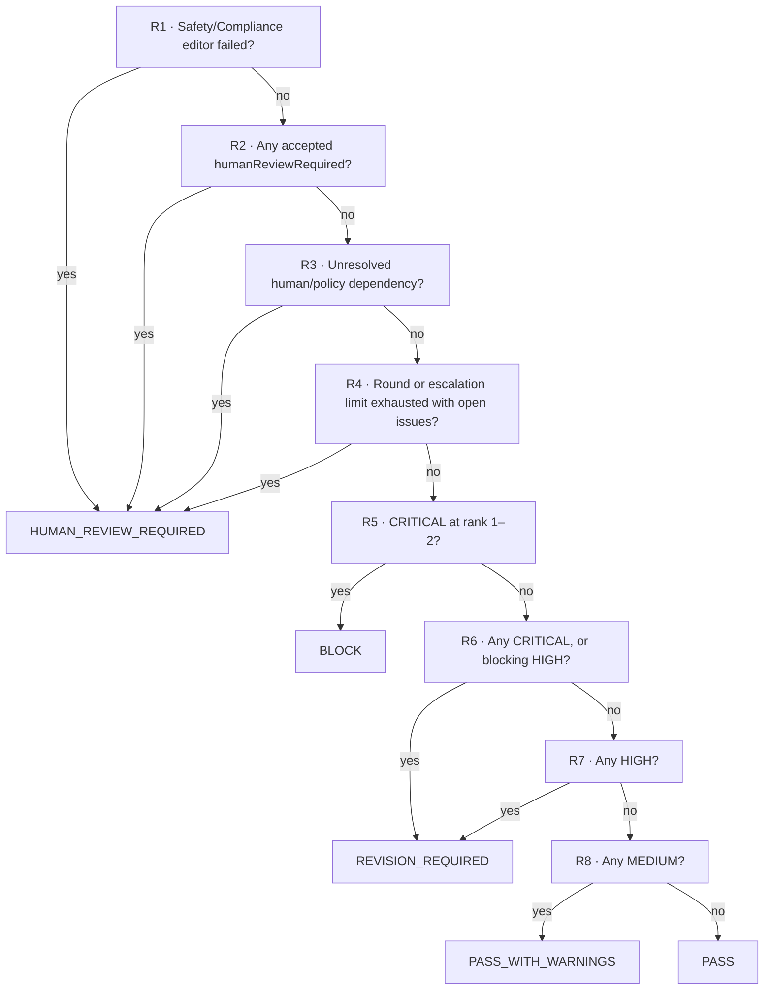
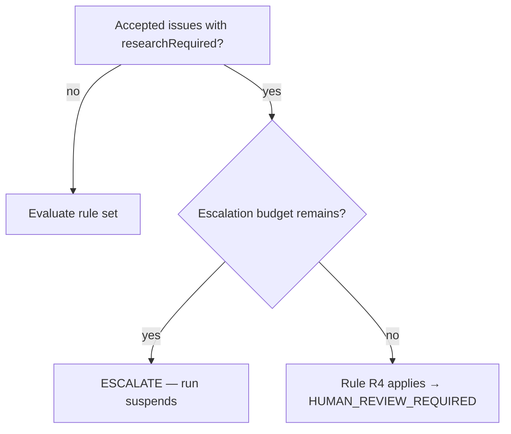

# Consensus Engine

> **Status:** v1.0 — complete. Phase 17. **Canonical decision logic.**
> **Consensus is not voting.** It is an ordered rule set evaluated over the accepted Issue set. The same inputs always produce the same outcome, and no model is consulted at any point.

## Overview

**Purpose.** Define the deterministic computation from Issues to an editorial outcome, and its mapping to ADR-009 gate verdicts.

**Scope.** The decision. Issues are `issue-model.md`; debate outcomes feeding it are `debate-engine.md`.

## Why not voting

**Majority voting fails on this problem in three specific ways.**

| Voting failure | What consensus does instead |
|---|---|
| A `CRITICAL` safety finding loses 15–1 | **Hierarchy and severity dominate; count is irrelevant** |
| Sixteen `INFO` findings outvote one `HIGH` | **Severity is ordinal, never additive** |
| An unevidenced assertion counts as much as an evidenced one | **Evidence modulates weight** |

**One editor can block. Fifteen editors cannot un-block.** That asymmetry is the point of an editorial board: the Safety Editor's `CRITICAL` is not a vote, it is a veto within its concern.

## Inputs

**Seven inputs. All are facts about the Issue set, none is an opinion about the article.**

| Input | Source |
|---|---|
| **Severity** | Each accepted Issue |
| **Evidence quality** | `EvidenceRef.relevance` per Issue |
| **Confidence** | Each Issue's `confidence` |
| **Hierarchy** | The eighteen-rank category order |
| **Blocking rules** | `blocking` and `humanReviewRequired` flags |
| **Research status** | Escalation state and remaining budget |
| **Issue dependencies** | The acyclic dependency graph |

**Consensus consumes Issues, never editor opinions.** An editor's prose, its enthusiasm, or the length of its response has no representation in the computation — only its typed findings do.

**Only `Accepted` and `Open` Issues count.** `Rejected` Issues are excluded entirely; `Archived` Issues from merge or split are excluded in favour of their parent or children (`issue-model.md`).

## Confidence normalisation

**Confidence has one defined role: it downgrades unevidenced, uncertain findings by one severity step. It never upgrades anything.**

```
effectiveSeverity(issue):
  if issue.confidence < CONFIDENCE_FLOOR
     and issue.evidence is empty
     and issue was not upheld in debate
  then severity - 1 step (floor: INFO)
  else severity
```

| Property | Value |
|---|---|
| `CONFIDENCE_FLOOR` | **60**, configurable per workspace |
| Applies to | Unevidenced, undebated Issues only |
| Direction | **Downgrade only** |
| `CRITICAL` | **Never downgraded** |

**A debated Issue is exempt**, because debate already weighed its evidence and confidence — applying the floor afterwards would penalise it twice (`debate-engine.md`).

**`CRITICAL` is never downgraded by confidence.** A low-confidence safety finding is still a safety finding, and the correct response is human review, not dismissal.

**Confidence never raises severity.** A supremely confident `LOW` finding is still `LOW`. Certainty about a small problem does not make it a large one (`confidence-engine.md`).

## The rule set

**Ordered. First match wins. Evaluated once per round.**



| # | Condition | Outcome |
|---|---|---|
| **R1** | A rank 1–2 editor (Safety, Compliance) failed to produce a result | **`HUMAN_REVIEW_REQUIRED`** |
| **R2** | Any accepted Issue carries `humanReviewRequired: true` | **`HUMAN_REVIEW_REQUIRED`** |
| **R3** | Any accepted Issue depends on an unresolved `human` or `policy` dependency | **`HUMAN_REVIEW_REQUIRED`** |
| **R4** | Round limit or escalation limit exhausted with Issues still `Open` | **`HUMAN_REVIEW_REQUIRED`** |
| **R5** | Any accepted `CRITICAL` at hierarchy rank 1–2 | **`BLOCK`** |
| **R6** | Any accepted `CRITICAL`, or any `HIGH` with `blocking: true` | **`REVISION_REQUIRED`** |
| **R7** | Any accepted `HIGH` | **`REVISION_REQUIRED`** |
| **R8** | Any accepted `MEDIUM` | **`PASS_WITH_WARNINGS`** |
| — | Otherwise | **`PASS`** |

**R1 is first because absence of a finding is not a clean finding.** A Safety Editor that failed produced no `CRITICAL` — and treating that as safety clearance would be asserting a judgement nobody made (`architecture.md`).

**R5 separates `BLOCK` from `REVISION_REQUIRED`, and the distinction is whether revision can plausibly help.** A `CRITICAL` safety or compliance finding is not a drafting problem; iterating the Writer against it produces rounds of failed attempts. Everything else `CRITICAL` is revisable.

**R4 makes limit exhaustion a human decision, never a pass.** A run that ran out of rounds has unresolved Issues by definition (`editorial-workflow.md`).

**`INFO` and `LOW` never affect the outcome.** They appear in the Editorial Report and in the revision plan as optional tasks, and they never gate publication.

## Research status

**Research is a side path evaluated before the rule set, not an outcome.**



**An accepted Issue requiring research suspends the run rather than producing an outcome.** Deciding on evidence known to be incomplete would produce a verdict the next round invalidates (`editorial-workflow.md`).

**Escalation is bounded.** Exhausting the budget falls through to R4, which is `HUMAN_REVIEW_REQUIRED` — never a pass.

**Only `Accepted` Issues trigger escalation.** An `Open`, unchallenged Issue requesting research is escalated; a `Rejected` one is not.

## Dependencies

**An Issue blocked on an unresolved dependency is treated by its dependency kind, not by its severity.**

| Dependency kind | Effect |
|---|---|
| `human` · `policy` | **R3 → `HUMAN_REVIEW_REQUIRED`** |
| `research` · `evidence` | Triggers escalation; run suspends |
| `issue` | The blocked Issue is **not counted as resolvable** this round |
| `revision` | Counted normally; the task is in the plan |

**A dependency chain resolves bottom-up.** An Issue depending on another cannot be `Resolved` before its dependency is, which the Revision Planner uses for task ordering (`revision-planner.md`).

**The graph is acyclic by construction**, checked at write. A cycle would produce Issues that can never resolve and a run that always reaches R4 (`issue-model.md`).

## Mapping to ADR-009

**Five internal outcomes; three gate verdicts. The mapping is fixed.**

| Consensus outcome | Gate verdict | Orchestration |
|---|---|---|
| `PASS` | **`pass`** | Advance to SEO |
| `PASS_WITH_WARNINGS` | **`soft-warn`** | Advance to SEO; warnings recorded |
| `REVISION_REQUIRED` | **`block`** | Revision plan issued; loop |
| `BLOCK` | **`block`** | Run ends |
| `HUMAN_REVIEW_REQUIRED` | **`block`** | `AwaitHumanReview` |

**ADR-009 fixes the verdict set at three, and `03-database/tables.md` enforces it with a CHECK constraint.** The three blocking outcomes are distinguished by an EIE reason code carried alongside the verdict, never by a fourth verdict (`README.md`).

**`HUMAN_REVIEW_REQUIRED` uses an existing path.** The approved state machine already reaches `AwaitHumanReview` on `verdict block` (`05-content-platform/orchestration.md`).

**The reason code is required on every blocking verdict**, so the UI and the Editorial Report can distinguish "revise this" from "a human must decide" without inspecting the Issue set.

## Determinism

**Four properties make the outcome reproducible.**

| Property | Mechanism |
|---|---|
| **No model invocation** | The engine is pure computation |
| **Ordered rules** | First match wins; no scoring, no weighting |
| **Stable input ordering** | Issues sorted by `(hierarchyRank, severity, issueId)` |
| **No time dependence** | No wall-clock input; escalation budget is a count |

**`consensus/` contains pure functions with no I/O**, which is what makes determinism testable rather than asserted (`architecture.md`).

**The same Issue set always produces the same outcome**, and this is a property test: generated Issue sets, evaluated twice, must agree — and evaluated in shuffled order, must still agree.

**Severity is ordinal, never additive.** Three `MEDIUM` Issues do not sum to a `HIGH`. Summation would let volume defeat judgement, and would make the outcome sensitive to how finely editors decompose their findings.

**Consensus is computed once per round and written immutably.** It is never recomputed on read, because a change to the rule set would silently rewrite history (`issue-model.md`).

## What consensus never does

| Never | Why |
|---|---|
| Call a model | Determinism |
| Modify an Issue | Immutability |
| Resolve an Issue | **Only the raising editor may** |
| Merge Issues | Merge is an explicit debate operation |
| Compute an ADR-021 `Score` | Categories have single producers |
| Override the hierarchy | The hierarchy is the tie-break, not an input to weigh |
| Publish | Publication is a separate gate |

**Consensus produces a verdict, not a publication.** The orchestrator consumes the verdict; the Publishing Engine independently verifies the gate verdict for the specific revision before any publish (`05-content-platform/publishing-engine.md`).

## Worked outcomes

| Issue set | Outcome | Rule |
|---|---|---|
| None | `PASS` | — |
| 4 `INFO`, 2 `LOW` | `PASS` | R8 no match |
| 1 `MEDIUM` readability | `PASS_WITH_WARNINGS` | R8 |
| 1 `HIGH` evidence | `REVISION_REQUIRED` | R7 |
| 1 `CRITICAL` readability | `REVISION_REQUIRED` | R6 |
| **1 `CRITICAL` safety** | **`BLOCK`** | **R5** |
| 1 `MEDIUM` compliance with `humanReviewRequired` | `HUMAN_REVIEW_REQUIRED` | **R2** |
| 12 `MEDIUM`, 0 `HIGH` | `PASS_WITH_WARNINGS` | R8 — **volume does not escalate** |
| 1 `HIGH`, Safety Editor failed | `HUMAN_REVIEW_REQUIRED` | **R1 — evaluated first** |
| 1 `HIGH` blocked on `policy` | `HUMAN_REVIEW_REQUIRED` | R3 |

**The eighth row is the one people find surprising.** Twelve `MEDIUM` findings pass with warnings, because severity is ordinal. If twelve medium problems should block, an editor should have raised a `HIGH` — and if none did, the board's judgement is that the piece is publishable with warnings.

**The ninth row shows why R1 is first.** A `HIGH` evidence finding would normally be `REVISION_REQUIRED`, but a missing Safety result means the run has no safety judgement at all.

## Observability

| Signal | Meaning |
|---|---|
| `editorial_consensus_total{outcome}` | Outcome distribution |
| `editorial_consensus_rule_fired{rule}` | **Which rule decided** |
| `editorial_confidence_downgrades_total` | How often the floor applies |
| `editorial_blocking_issues_total{category}` | Where blocks originate |
| **`editorial_r1_fired_total`** | **Editor failures forcing human review** |
| `editorial_rounds_to_pass` | Convergence |

**`editorial_consensus_rule_fired` is the most diagnostic signal.** It answers "why did this block" without inspecting the Issue set, and a shift in its distribution is the earliest sign that editor calibration has drifted.

**A rising `editorial_r1_fired_total` is an availability problem, not a quality one** — Safety or Compliance editors are failing, and every such run costs a human review.

**Alerts:** `editorial_r1_fired_total` above baseline (**page** — safety review is unavailable); consensus outcome distribution shifting sharply; `editorial_confidence_downgrades_total` rising (editors are asserting without evidence).

## Business rules

1. **Consensus is an ordered rule set, not voting.**
2. **One editor can block; fifteen cannot un-block.**
3. **Consensus consumes Issues, never editor opinions.**
4. **Only `Accepted` and `Open` Issues count.**
5. **Confidence downgrades only**, never upgrades, and never touches `CRITICAL`.
6. **Debated Issues are exempt from the confidence floor.**
7. **R1 is evaluated first**: a failed Safety or Compliance editor forces human review.
8. **R5 separates `BLOCK` from `REVISION_REQUIRED`** by whether revision can plausibly help.
9. **Limit exhaustion is `HUMAN_REVIEW_REQUIRED`, never `PASS`.**
10. **`INFO` and `LOW` never affect the outcome.**
11. **Severity is ordinal, never additive.**
12. **Research escalation suspends the run**, evaluated before the rule set.
13. **Human and policy dependencies force human review.**
14. **The five outcomes map to three verdicts**, with a required reason code.
15. **No model is consulted; input ordering is stable; no wall-clock input.**
16. **Consensus is written once per round and never recomputed.**
17. **Consensus never resolves, merges, or modifies an Issue.**
18. **A verdict is not a publication.**

## Cross references

- `issue-model.md` — Issue schema, states, dependency graph
- `debate-engine.md` — outcomes feeding acceptance
- `editor-roles.md` — the eighteen-rank hierarchy
- `confidence-engine.md` — what confidence means and does not
- `revision-planner.md` — what `REVISION_REQUIRED` produces
- `orchestration.md` — how outcomes drive the workflow
- `05-content-platform/orchestration.md` — `AwaitHumanReview`; the gate
- `05-content-platform/publishing-engine.md` — independent verdict verification
- `03-database/tables.md` — the verdict CHECK constraint
- `01-system-architecture/13-adr-log.md` — **ADR-009 three verdicts**, ADR-021
