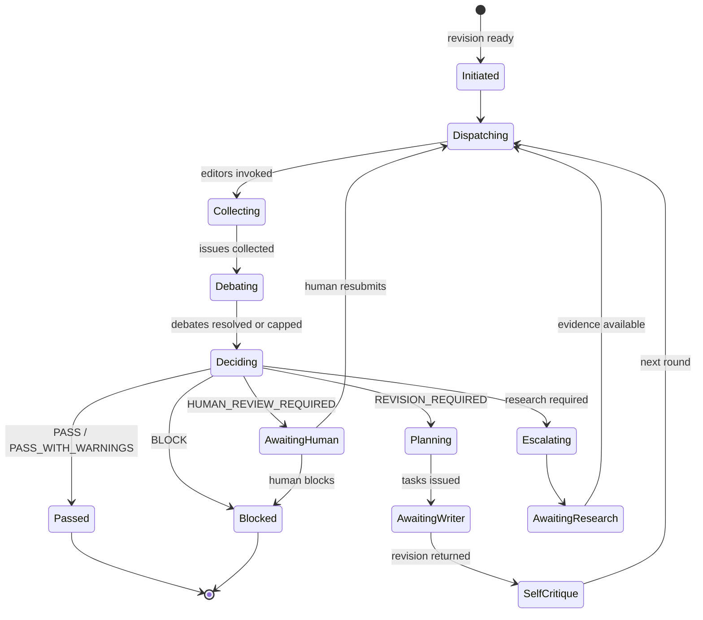
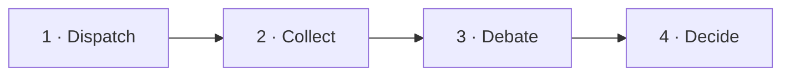
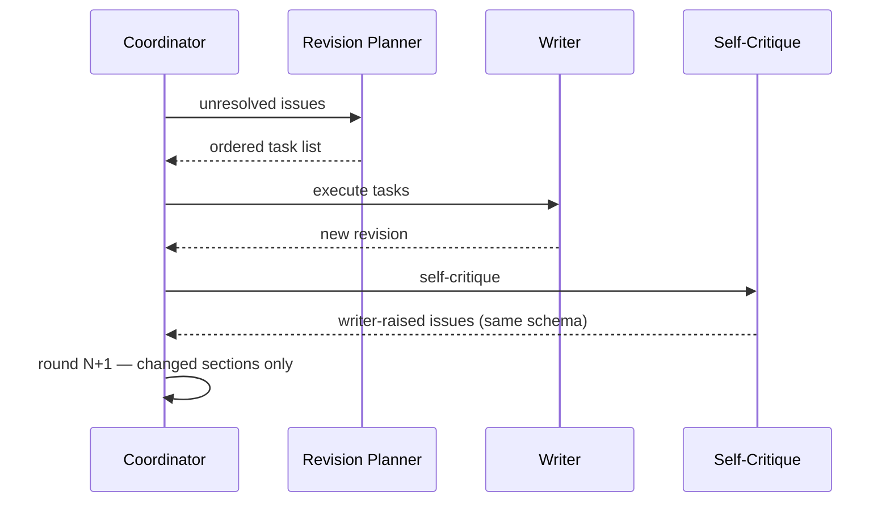
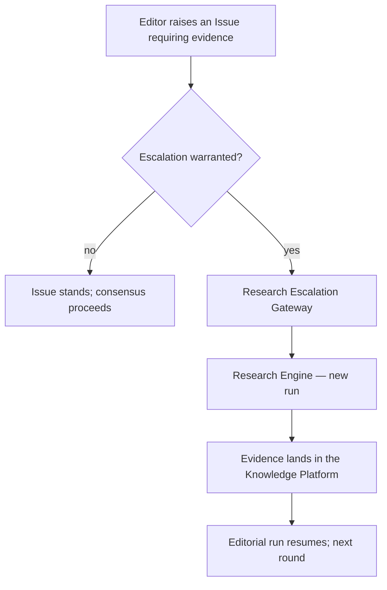

# Editorial Workflow

> **Status:** v1.0 — complete. Phase 17.
> **A round is: dispatch, collect, debate, decide.** Nothing in that sequence overlaps, because overlapping them would let an early Issue anchor the board and would make consensus a function of arrival order rather than of evidence.

## Overview

**Purpose.** Define the end-to-end editorial run: initiation, round structure, debate, consensus, revision, escalation, and termination.

**Scope.** Sequence and control flow. Editor concerns are `editor-roles.md`; the decision computation is `consensus-engine.md`.

## Run lifecycle

**Four states are waits, and all four are durable**: `AwaitingWriter`, `AwaitingResearch`, `AwaitingHuman`, and `Escalating`. Each may last minutes to days, which is why the run is a Temporal workflow rather than a loop (ADR-004).

## Initiation

| Property | Value |
|---|---|
| **Trigger** | The orchestrator reaches the `Review` stage with a revision |
| **Input** | `revisionId`, the article's brief, the approved outline |
| **Preconditions** | The revision exists; the outline is approved; credits are held |
| **Emits** | Run created; round 1 begins |

**A run is scoped to one revision.** A new revision starts a new round within the same run, never a new run — which is what makes the issue history continuous across the editorial process.

**Credits are held at initiation and released on failure.** A run that failed halfway does not charge for reviews never performed (`04-platform/credits.md`).

**The approved outline is part of every editor's context**, because several concerns — Structure, Logic, Metadata — are evaluated against intent, not only against text.

## Round structure

**Every round has four phases, executed in order. None overlaps.**

### Phase 1 — Dispatch

**Editors are invoked in parallel**, each with a context assembled by the Context Builder for its role.

| Editor receives | Never receives |
|---|---|
| The draft, or its changed sections | Another editor's Issues *in round 1* |
| Its concern's relevant context | The full evidence corpus |
| Evidence relevant to its concern | A regeneration instruction |
| **Issue history from prior rounds** | Provider or model information |
| The approved outline and brief | Consensus state |

**No editor sees peer Issues in round one.** Anchoring is the failure this prevents: an editor shown a peer's `CRITICAL` finding tends to agree with it, and a board that agrees by default is a board that adds nothing.

**Issue history from prior rounds is shared**, because round two is a re-review with knowledge of what was raised and resolved — not a fresh start.

**Dispatch is bounded by AI Gateway concurrency**, and each invocation is an idempotent activity keyed on `(runId, round, editorRole)`.

### Phase 2 — Collect

**Each editor returns Issues and four scores.** Nothing else is accepted.

| Returned | Rejected |
|---|---|
| Zero or more Issues, each schema-valid | Replacement text |
| Confidence, Evidence, Coverage, Risk | Prose commentary |
| A no-issues result with scores | An Issue outside the editor's category |

**An Issue in a category the editor does not own is discarded and recorded.** Exclusive ownership is the property that makes the board's coverage legible, and an editor drifting outside its concern is a routing or prompt defect worth surfacing (`editor-roles.md`).

**A schema-invalid Issue is discarded, not repaired.** Repairing it would mean EIE inventing content for an editor.

**Zero Issues is a valid, meaningful result** — recorded with its scores, so a clean editor is distinguishable from a failed one.

### Phase 3 — Debate

**Editors now see the full Issue set and may challenge.** Only here.

| May be challenged | May not be challenged |
|---|---|
| Evidence cited | **Another editor's category ownership** |
| Confidence claimed | The Issue schema |
| Severity assigned | Consensus rules |
| Reasoning | The editorial hierarchy |
| Suggested resolution | Another editor's existence |

**A challenge creates a Debate Thread referencing Issue IDs.** There is no free-form conversation; every message is a typed challenge or response against a specific Issue (`debate-engine.md`).

**Rounds within a debate are capped and configurable.** A thread reaching its cap terminates unresolved, and unresolved disagreement **escalates severity** rather than being averaged away.

**Debate is optional.** A round where no editor challenges anything proceeds directly to decision.

### Phase 4 — Decide

**The Consensus Engine computes the outcome** from the issue set, confidence scores, Review Engine scores, and the editorial hierarchy. It is pure computation and calls no model (`consensus-engine.md`).

**The same inputs always produce the same outcome.** That determinism is what allows a consensus decision to be an auditable artifact rather than a sampled opinion.

## Outcomes

| Outcome | Next state | Gate verdict |
|---|---|---|
| `PASS` | Run completes | `pass` |
| `PASS_WITH_WARNINGS` | Run completes | `soft-warn` |
| `REVISION_REQUIRED` | Planning | **`block`** |
| `BLOCK` | Run ends | **`block`** |
| `HUMAN_REVIEW_REQUIRED` | AwaitingHuman | **`block`** |

**The three blocking outcomes differ in what happens next, not in the verdict.** ADR-009 fixes the verdict set at three; the distinction lives in the EIE reason and the Editorial Report (`README.md`).

## Revision loop

**The Writer executes discrete tasks.** "Rewrite the article" is never a task; each task names a location, an action, and the Issue it resolves (`revision-planner.md`).

**A task the Writer cannot complete is reported, not silently skipped.** An unexecutable task leaves its Issue open and visible in the next round.

**Re-review is incremental.** Round N+1 reviews changed sections plus any section an open Issue references. Unchanged, unreferenced sections carry their prior Issues forward unmodified — which is what keeps a four-round run affordable.

**An Issue is resolved by the editor that raised it**, in the following round, or it stays open. The Writer cannot mark an Issue resolved; asserting one's own work satisfied a critic is the self-approval the architecture prohibits.

## Self-critique

**After every revision, before the next round, the Writer critiques its own work.**

| Property | Rule |
|---|---|
| Timing | After a revision, before dispatch |
| Output | **Issues in the standard schema** |
| Treatment | **Identical to any editor's** |
| Category | Must be a real category the Writer can evidence |
| Challengeable | **Yes** — by any editor, in debate |
| Consensus weight | **Identical** |

**Self-critique Issues receive no special treatment, in either direction.** They are not privileged because the Writer has the most context, and not discounted because the Writer is self-interested. They enter the same store and face the same debate.

**Self-critique is not self-approval.** The Writer may raise Issues; it may never resolve an editor's Issue, assign a severity to one, or influence consensus except by raising Issues of its own.

**A Writer that raises no self-critique Issues is recorded as such**, and a persistent zero rate across runs is a signal worth an operator's attention rather than evidence of quality.

## Research escalation

**An editor may determine that the draft cannot be evaluated with available evidence.**

| An editor may request | It may never |
|---|---|
| More evidence for a claim | Fetch a page |
| Additional sources | Query a vector index |
| A fresh SERP | Write to the Evidence Bank |
| Updated statistics | Choose a provider |
| Entity verification | Bypass the Research Engine |

**Escalation creates a Research Engine run and the editorial run waits.** The Writer waits too — issuing revision tasks against evidence that is about to change would produce work the next round invalidates.

**Escalation is bounded per run.** An unbounded escalation loop is a run that never terminates, and the cap is configurable with `HUMAN_REVIEW_REQUIRED` on exhaustion.

**Escalation charges credits**, because a research run charges credits. The cost appears in the Editorial Report attributed to the escalating editor (`04-platform/credits.md`).

**Evidence never arrives from an editor.** It arrives from the Research Engine into the Knowledge Platform, which remains the sole source of truth (ADR-026).

## Termination

**A run ends in exactly one of five ways.**

| Termination | Condition |
|---|---|
| **Passed** | Consensus `PASS` or `PASS_WITH_WARNINGS` |
| **Blocked** | Consensus `BLOCK` |
| **Round limit** | Max rounds reached → **`HUMAN_REVIEW_REQUIRED`** |
| **Escalation limit** | Max escalations reached → **`HUMAN_REVIEW_REQUIRED`** |
| **Cancelled** | Operator or user cancellation |

**The round limit is configurable and defaults to three.** A draft that has not converged in three rounds has a problem the board cannot resolve by iterating, and continuing spends credits on a loop.

**Reaching a limit is `HUMAN_REVIEW_REQUIRED`, never `PASS`.** A run that exhausted its rounds has unresolved Issues by definition, and treating exhaustion as success would make the limit a bypass.

**Cancellation is cooperative.** In-flight editor invocations complete; committed work is not rolled back; credits for completed reviews are retained (`06-api/research-api.md`).

**Every termination produces an Editorial Report**, including cancellation — a cancelled run's partial findings are the most useful thing about it.

## Concurrency

| Property | Rule |
|---|---|
| Editors within a round | **Parallel** |
| Rounds | **Serial** |
| Debate threads | Parallel across Issues; serial within a thread |
| Runs per article | **One** |
| Consensus | Single-threaded, pure |

**One editorial run per article at a time**, matching the platform's one-active-run-per-article rule (`06-api/content-api.md`).

**Debate threads are independent** because each concerns one Issue, and an Issue belongs to exactly one category owned by exactly one editor.

## Observability

| Signal | Meaning |
|---|---|
| `editorial_rounds_total{outcome}` | Convergence behaviour |
| `editorial_issues_total{category,severity}` | Where problems concentrate |
| `editorial_debates_total{outcome}` | How often the board genuinely disagrees |
| **`editorial_debate_unresolved_total`** | **Disagreement the board cannot settle** |
| `editorial_escalations_total{editor}` | Evidence gaps by concern |
| `editorial_editor_failures_total{role}` | Board reliability |
| `editorial_run_duration_seconds` | User-visible latency |
| `editorial_credits_consumed` | Cost per run |

**Zero debates across many runs is a warning, not a success.** A board that never disagrees is either uniform in composition — the ADR-019 failure — or is not genuinely reviewing. Model diversity is verified at dispatch, and a flat debate rate suggests the verification is not working (`provider-mapping.md`).

**A rising unresolved-debate rate means the hierarchy or the evidence is inadequate**, and it is the signal most worth acting on.

## Business rules

1. **A round is dispatch → collect → debate → decide**, with no overlap.
2. **No editor sees peer Issues in round one.**
3. **Issue history from prior rounds is shared.**
4. **Editors return only Issues and four scores**; anything else is discarded and recorded.
5. **An Issue outside the editor's category is discarded**, never reassigned.
6. **A schema-invalid Issue is discarded, never repaired.**
7. **Zero Issues is a valid result** and is distinguishable from failure.
8. **Debate may challenge evidence, confidence, severity, reasoning, and resolution** — never category ownership or the hierarchy.
9. **Unresolved debate escalates severity**, never averages it.
10. **The Writer executes discrete tasks**, never free-form rewrites.
11. **The Writer cannot resolve an Issue** it did not raise.
12. **Self-critique Issues are treated identically** — neither privileged nor discounted.
13. **Re-review is incremental**: changed sections plus Issue-referenced sections.
14. **Escalation suspends the run**; the Writer waits.
15. **Evidence arrives only from the Research Engine into the Knowledge Platform.**
16. **Round and escalation limits terminate as `HUMAN_REVIEW_REQUIRED`**, never `PASS`.
17. **One editorial run per article at a time.**
18. **Every termination produces an Editorial Report**, including cancellation.

## Cross references

- `architecture.md` — components executing this sequence
- `editor-roles.md` — the sixteen concerns
- `issue-model.md` — the schema editors return
- `debate-engine.md` — thread mechanics and round caps
- `consensus-engine.md` — the deterministic decision
- `revision-planner.md` — Issues to tasks
- `confidence-engine.md` — the four scores
- `orchestration.md` — Temporal workflow, waits, resumability
- `05-content-platform/orchestration.md` — the pipeline stage this occupies
- `05-content-platform/research-engine.md` — escalation target
- `08-ai-platform/context-builder.md` — per-role context assembly
- `04-platform/credits.md` — holds, charges, escalation cost
- `01-system-architecture/13-adr-log.md` — ADR-004, ADR-009, ADR-019, ADR-026
