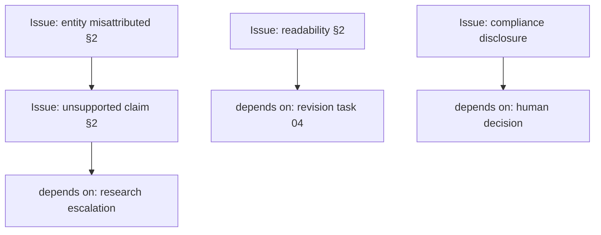
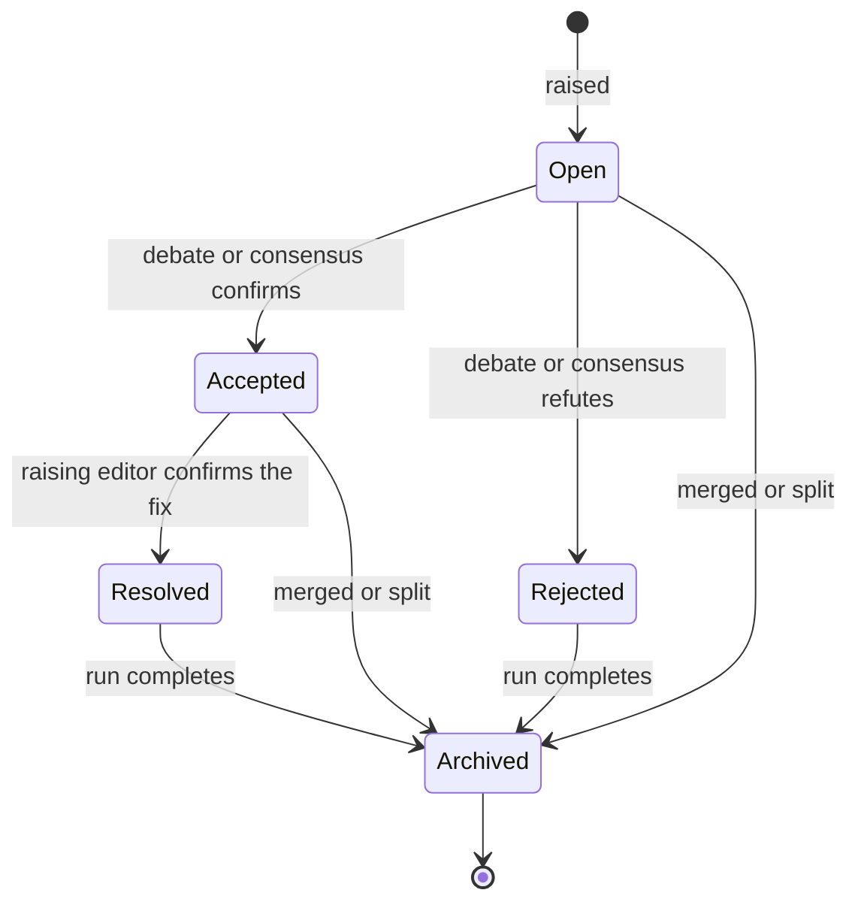

# Issue Model

> **Status:** v1.0 — complete. Phase 17. **Canonical Issue schema.**
> **An Issue is never mutated.** The finding is written once; every subsequent state, challenge, and resolution is an appended record. The current state is derived, never stored in place.

## Overview

**Purpose.** Define the Issue — the only artifact editors produce — its schema, lifecycle, dependency graph, and immutability guarantees.

**Scope.** The artifact. Who raises Issues is `editor-roles.md`; how they are challenged is `debate-engine.md`; how they decide the outcome is `consensus-engine.md`.

## The Issue

```ts
interface EditorialIssue {
  // — Identity —
  readonly issueId: string;              // UUIDv7
  readonly runId: string;
  readonly revisionId: string;
  readonly roundNumber: number;
  readonly tenantId: string;
  readonly organizationId: string;

  // — Ownership —
  readonly category: IssueCategory;      // exactly one of eighteen
  readonly raisedBy: EditorRole;         // a ROLE, never a provider
  readonly raisedAt: string;

  // — The finding —
  readonly severity: Severity;
  readonly location: IssueLocation;
  readonly problem: string;              // what is wrong
  readonly reason: string;               // why it is wrong
  readonly recommendation: string;       // INSTRUCTION, never replacement text
  readonly evidence: readonly EvidenceRef[];

  // — Certainty —
  readonly confidence: number;           // INTEGER 0–100

  // — Flags —
  readonly blocking: boolean;
  readonly evidenceRequired: boolean;
  readonly researchRequired: boolean;
  readonly autoFixPossible: boolean;
  readonly humanReviewRequired: boolean;

  // — Graph —
  readonly dependencies: readonly IssueDependency[];
  readonly parentIssueId: string | null;
  readonly childIssueIds: readonly string[];
}
```

**Every field is `readonly`, and the record is written once.** State lives in a separate append-only table (below), which is what makes "never mutate, only append" enforceable rather than aspirational.

## `recommendation` is an instruction, not a replacement

**This is the field most likely to be implemented wrongly, and doing so would collapse the architecture.**

| Valid recommendation | Invalid — this is rewriting |
|---|---|
| "Replace the unsupported claim with an evidenced statement or remove it." | "Change to: 'Studies show that…'" |
| "Add a citation resolving to Evidence Bank content." | "Cite [Smith 2024]." *(as literal text)* |
| "Reduce keyword density in §2; it exceeds natural usage." | Here is the rewritten §2. |
| "Split this H2 into two sections matching the approved outline." | The two new headings, written out. |

**Editors never produce replacement text.** An editor that could would become a second writer with none of the Writer's context, and its output would be unattributable in the revision history (`architecture.md`).

**Enforcement is structural where possible.** `recommendation` is length-bounded, and a recommendation containing a quoted block exceeding the bound is rejected at collection — the same discard-not-repair rule that applies to schema-invalid Issues (`editorial-workflow.md`).

## Location

```ts
type IssueLocation =
  | { kind: 'document' }
  | { kind: 'section'; sectionId: string }
  | { kind: 'span'; sectionId: string; start: number; end: number }
  | { kind: 'metadata'; field: string }
  | { kind: 'citation'; citationId: string }
  | { kind: 'link'; linkId: string };
```

**Location is typed, not prose.** A location the UI cannot resolve to a highlight is a finding a user cannot act on, and free-text locations drift as the draft changes.

**`span` offsets are relative to the revision they were raised against**, which is why `revisionId` is on the Issue. After a revision, spans are re-anchored or the Issue is carried forward at `section` granularity — never silently re-pointed to a different span.

**`document` is legitimate.** Reader Experience and Brand findings are frequently whole-piece properties.

## Severity

| Severity | Meaning | Blocks by default |
|---|---|---|
| `INFO` | Observation; no action expected | No |
| `LOW` | Minor improvement available | No |
| `MEDIUM` | Should be addressed | No |
| `HIGH` | Must be addressed before publication | **Contextual** |
| **`CRITICAL`** | **Cannot publish** | **Yes** |

**`CRITICAL` blocks publication.** It is the only severity that blocks unconditionally, and it does so regardless of category rank — though rank still orders task priority (`consensus-engine.md`).

**`blocking` is a separate flag from severity.** An editor may raise a `HIGH` issue and mark it blocking, or not. Severity describes the defect; `blocking` describes the editor's judgement about publication. `CRITICAL` forces `blocking: true`; the two cannot disagree.

**Severity is challengeable in debate.** An unevidenced severity claim is exactly what a challenge targets (`debate-engine.md`).

## Evidence references

```ts
interface EvidenceRef {
  readonly evidenceId: string;           // Knowledge Platform identifier
  readonly citationId: string | null;
  readonly relevance: 'supports' | 'contradicts' | 'insufficient' | 'absent';
}
```

**Evidence is referenced, never embedded.** The Issue carries identifiers; the content lives in the Knowledge Platform, which remains the sole source of truth (ADR-026).

**`relevance: 'absent'` is the Evidence Editor's most common finding** — a claim with no supporting evidence at all. It carries an empty `evidenceId` only when nothing was found; otherwise it names what was found and why it does not support the claim.

**An Issue with `evidenceRequired: true` and an empty `evidence` array is valid**, and it is precisely the shape that triggers research escalation.

## The four decision flags

**These drive routing, not severity.**

| Flag | Means | Consumed by |
|---|---|---|
| `evidenceRequired` | Resolution needs evidence not currently held | Research escalation |
| `researchRequired` | Resolution needs a **new research run** | Research escalation |
| `autoFixPossible` | A deterministic transformation could resolve it | Revision Planner |
| `humanReviewRequired` | Resolution needs a human decision | Consensus |

**`autoFixPossible` never means EIE applies the fix.** It means the Revision Planner can express the task without ambiguity — "add `alt` text to the image in §3" is auto-fixable; "improve the argument in §3" is not. **The Writer still executes it** (`revision-planner.md`).

**`humanReviewRequired: true` on any accepted Issue forces `HUMAN_REVIEW_REQUIRED`**, regardless of severity. Compliance and Safety editors use it for judgements the platform must not make (`editor-roles.md`).

**`researchRequired` implies `evidenceRequired`.** The reverse does not hold — evidence may already exist and simply not be cited.

## The dependency graph

**An Issue may depend on six things. The graph is acyclic.**

```ts
type IssueDependency =
  | { kind: 'evidence'; evidenceId: string }
  | { kind: 'research'; escalationId: string }
  | { kind: 'issue'; issueId: string }
  | { kind: 'policy'; policyRef: string }
  | { kind: 'human'; decisionRef: string }
  | { kind: 'revision'; taskId: string };
```



| Dependency | Meaning |
|---|---|
| `evidence` | Cannot be resolved until specific evidence exists |
| `research` | Blocked on a research escalation |
| `issue` | **Cannot be resolved until another Issue is resolved** |
| `policy` | Awaiting a workspace or brand policy decision |
| `human` | Awaiting a human judgement |
| `revision` | Blocked on a specific Writer task |

**Cross-category relationships are dependencies, never merges.** A Fact Issue and an Evidence Issue about the same sentence are two findings from two editors — the Evidence Issue may *depend on* the Fact Issue, but they are never combined. That is what preserves exclusive category ownership (`editor-roles.md`).

**The graph must be acyclic, and this is checked in the writing transaction.** A database constraint cannot express acyclicity, so insertion performs a reachability check and rejects a dependency that would close a cycle — the same transactional-check pattern used for the last-Owner rule (`06-api/organization-api.md`).

**A cycle is a defect, not a state.** Two Issues each waiting on the other never resolve, and the run would reach its round limit with no progress.

**Dependency depth is bounded** at a configured maximum. A ten-deep chain is unresolvable within a bounded round count and is a signal that the draft needs restructuring rather than iterating.

## Parent and child

**Merge and Split produce parent/child links. Neither mutates an existing Issue.**

| Operation | Produces |
|---|---|
| **Merge** | A **new parent** Issue; the originals become children, state `Archived` |
| **Split** | **New children**; the original becomes a parent, state `Archived` |

**Merge is permitted only within one category**, because a merged Issue must have exactly one category and one owner. Two editors' findings are never merged.

**Merge is never automatic.** It is an explicit debate operation, recorded with the editor that proposed it and the outcome that accepted it (`debate-engine.md`).

**The originals are archived, not deleted.** The editorial record is evidence that review happened, and a merged-away Issue is still a finding an editor made.

## Lifecycle



| State | Meaning | Set by |
|---|---|---|
| `Open` | Raised, not yet adjudicated | The raising editor |
| `Accepted` | Confirmed to stand | Debate outcome or consensus |
| `Rejected` | Determined not to stand | Debate outcome or consensus |
| **`Resolved`** | Accepted, and a revision addressed it | **The raising editor only** |
| `Archived` | Terminal | System, at merge, split, or run completion |

**Only the raising editor may resolve an Issue.** Not the Writer, not another editor, not consensus. Allowing the Writer to mark its own work satisfactory is the self-approval the architecture prohibits (`architecture.md`).

**A `Rejected` Issue is not deleted and still appears in the Editorial Report.** A rejected finding is information about the board's disagreement, and hiding it would make the report a summary rather than a record.

**`Archived` is reachable from every non-terminal state** and is set exactly once.

## Immutability

**Two tables. One immutable, one append-only.**

| Table | Contains | Mutability |
|---|---|---|
| `editorial_issues` | **The finding** — every field above | **Written once; never updated** |
| `editorial_issue_states` | **Every transition** | **Append-only** |

```ts
interface IssueStateRecord {
  readonly issueId: string;
  readonly sequence: number;             // monotonic per issue
  readonly state: IssueState;
  readonly at: string;
  readonly setBy: EditorRole | 'consensus' | 'system';
  readonly reason: string;
  readonly debateThreadId: string | null;
}
```

**Current state is the highest-sequence record, derived on read.** There is no `status` column on the Issue to drift out of sync with its history.

**The application holds no `UPDATE` or `DELETE` grant on either table**, and an immutability trigger rejects both — the same three-layer enforcement used for `audit_log` (`16-security/audit.md`).

**`UNIQUE (issue_id, sequence)`** makes a duplicate transition impossible at the database level.

## What an editor may not set

| Field | Set by |
|---|---|
| `issueId`, `runId`, `revisionId`, `roundNumber` | System |
| `tenantId`, `organizationId` | **`TenantContext`** — never from editor output |
| `raisedBy` | System, from the dispatched role |
| `parentIssueId`, `childIssueIds` | Merge and split operations only |
| State | The lifecycle, never the Issue record |

**`tenantId` never comes from model output.** It is applied from the run's `TenantContext`, which is the platform's universal rule (`16-security/tenant-isolation.md`).

**An editor cannot claim to be a different role.** `raisedBy` is stamped by the dispatcher, so a prompt-injected attempt to impersonate the Safety Editor produces an Issue attributed to whichever editor actually ran.

## Validation at collection

| Check | Failure |
|---|---|
| Schema valid | **Discarded and recorded** |
| Category owned by the raising editor | **Discarded and recorded** |
| Severity in the enum | Discarded |
| Confidence integer 0–100 | Discarded |
| `recommendation` within length bound | Discarded |
| `location` resolves in this revision | Discarded |
| Evidence references resolve and are in-tenant | Discarded |
| Dependencies do not close a cycle | **Rejected at write** |
| `CRITICAL` implies `blocking` | Normalised, recorded |

**Discarded, never repaired.** Repairing a malformed Issue would mean EIE inventing content on an editor's behalf, and the discard is recorded so a systematically malformed editor is visible rather than silently absorbed.

## Reserved extension points

**Three capabilities are anticipated and deliberately not implemented.** They are named here so future work has a defined seam rather than a retrofit.

| Extension | Seam | Not implemented |
|---|---|---|
| **Editorial Memory Engine** | Issues carry stable `category` + `location.kind` + `raisedBy`, sufficient to aggregate recurring findings per workspace | No memory is written, read, or consulted |
| **Learning Feedback** | The state history records accepted/rejected outcomes with reasons, sufficient to measure editor precision | No feedback loop adjusts any editor |
| **Issue Analytics** | Issues and states are append-only with monotonic sequences, sufficient for time-series aggregation | No analytics surface exists |

**No schema field is reserved for them.** A speculative column is a column nobody validates; when these are built, they are additive under the same evolution rules any table follows (`07-development-guide/migration-guide.md`).

**If an Editorial Memory Engine is built, it is AI Memory and is never a source of truth** (ADR-026). A recurring-issue pattern may inform an editor's context; it may never itself be cited or raised as a finding.

## Business rules

1. **The Issue record is written once and never updated.**
2. **State lives in an append-only table; current state is derived.**
3. **`recommendation` is an instruction, never replacement text**, and is length-bounded.
4. **Location is typed**, never prose.
5. **`span` offsets belong to the revision they were raised against.**
6. **`CRITICAL` blocks unconditionally and forces `blocking: true`.**
7. **Evidence is referenced, never embedded.**
8. **`researchRequired` implies `evidenceRequired`.**
9. **`autoFixPossible` never means EIE applies the fix.**
10. **`humanReviewRequired` on an accepted Issue forces `HUMAN_REVIEW_REQUIRED`.**
11. **The dependency graph is acyclic**, checked in the writing transaction.
12. **Cross-category relationships are dependencies, never merges.**
13. **Merge is within one category, explicit, and never automatic.**
14. **Merge and split archive the originals; nothing is deleted.**
15. **Only the raising editor may resolve an Issue** — never the Writer.
16. **Rejected Issues remain in the Editorial Report.**
17. **`tenantId` and `raisedBy` are stamped by the system**, never taken from model output.
18. **Invalid Issues are discarded and recorded, never repaired.**
19. **Three extension points are named and reserve no schema.**

## Cross references

- `editor-roles.md` — the eighteen categories and their owners
- `debate-engine.md` — challenge, merge, split operations
- `consensus-engine.md` — how Issues become an outcome
- `revision-planner.md` — Issues to tasks
- `confidence-engine.md` — the confidence field's meaning
- `implementation-guide.md` — table definitions and constraints
- `11-knowledge-platform/` — evidence identifiers and the source of truth
- `16-security/audit.md` — the three-layer immutability pattern
- `16-security/tenant-isolation.md` — `tenantId` never from model output
- `01-system-architecture/13-adr-log.md` — ADR-009, ADR-021, ADR-026
