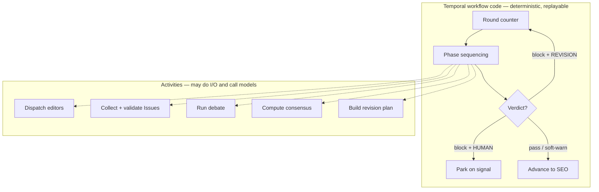
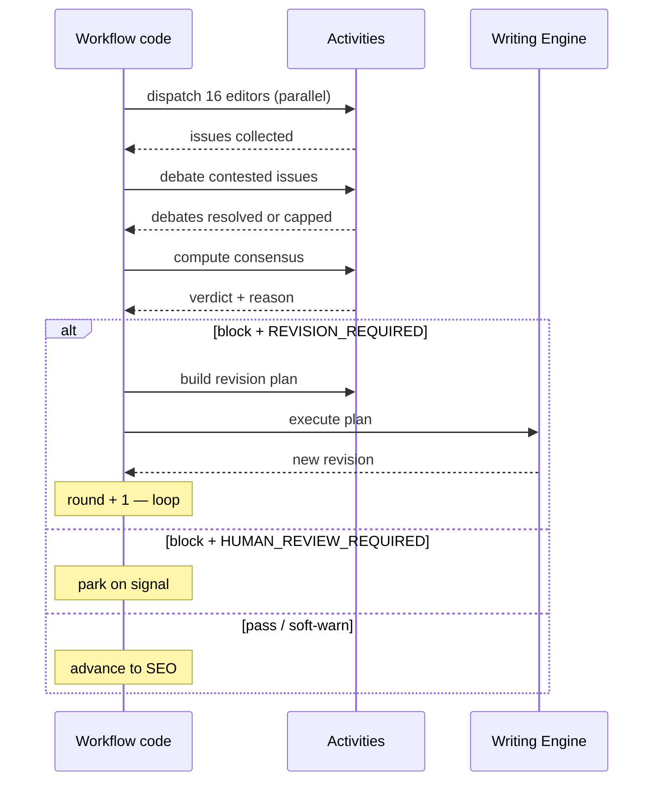

# Orchestration

> **Status:** v1.0 — complete. Phase 17.
> **There is one orchestrator, and EIE is not it.** The Editorial Coordinator is a set of idempotent activities inside the approved Temporal Run workflow. It sequences the editorial process and reasons about none of it.

## Overview

**Purpose.** Define the Editorial Coordinator: what it does, what it must never do, and exactly where its control flow lives relative to the approved pipeline orchestrator.

**Scope.** Coordination mechanics. The process being coordinated is `editorial-workflow.md`; the pipeline that contains it is `05-content-platform/orchestration.md`.

## EIE is not a second orchestrator

**The approved pipeline is a durable Temporal workflow that invokes each engine as an idempotent activity (ADR-004).** EIE occupies the Review stage and inherits that structure rather than introducing a parallel one.

**Two facts in the approved orchestration make this fit exactly:**

| Approved | EIE use |
|---|---|
| **"The revise loop is capped by policy; beyond the cap the run routes to a human decision rather than looping"** | **This *is* the editorial round loop** |
| **"Orchestration never advances a pipeline from an event. Events notify; signals advance"** | Rounds advance by signal, never by `ConsensusReached` |

**No child workflow is introduced and no new coordination primitive is proposed.** The round loop the editorial process needs already exists, capped, with the same human-decision fallback that consensus R4 produces. Building a second loop beside it would put two caps on one process (`consensus-engine.md`).

**This is why Phase 17 requires no ADR for orchestration.** The Coordinator adds activities to an approved workflow; it adds no control-plane component.

## The workflow / activity split

**Everything that touches the database, a model, or another service is an activity. Workflow code holds control flow only.**

| Concern | Location | Why |
|---|---|---|
| Round counter, phase order | **Workflow code** | Must replay identically |
| Loop-or-exit decision | **Workflow code** | Routes on the verdict alone |
| Cap enforcement | **Workflow code** | Policy, snapshotted at run start |
| Parking for human review | **Workflow code** | Durable timer, not polling |
| Editor dispatch | **Activity** | Calls the AI Gateway |
| Issue collection and validation | **Activity** | Writes to the Issue store |
| Debate execution | **Activity** | Calls models |
| Consensus computation | **Activity** | Reads Issues; **calls no model** |
| Revision plan construction | **Activity** | Reads Issues, writes the plan |
| Event publication | **Activity** | Transactional outbox |

**Consensus is deterministic and is still an activity**, because it reads the Issue store. Determinism makes it *testable*; it is I/O that makes it an activity. Putting a database read in workflow code would break replay regardless of how pure the computation around it is.

**Only the verdict crosses back into workflow code.** The approved rule is that orchestration never inspects an artifact's contents and routes on verdicts and typed results only — so the workflow sees `pass`, `soft-warn`, or `block` plus a reason code, and never an Issue (`05-content-platform/orchestration.md`).

## Responsibilities

**Thirteen responsibilities, each mapped to where it executes.**

| # | Responsibility | Location | Notes |
|---|---|---|---|
| 1 | **Create editorial run** | Activity | One run per revision chain; idempotent |
| 2 | **Assign editor roles** | Activity | Static table lookup — no selection logic |
| 3 | **Dispatch review** | Activity ×16 | Parallel, keyed `(runId, round, role)` |
| 4 | **Collect issues** | Activity | Validate; **discard malformed, never repair** |
| 5 | **Create debate threads** | Activity | One thread per contested Issue |
| 6 | **Trigger consensus** | Activity | Computation, not judgement |
| 7 | **Generate revision plan** | Activity | Pure construction from Issues |
| 8 | **Assign writer** | Workflow code | Hands the plan to the Writing Engine activity |
| 9 | **Repeat review** | **Workflow code** | The approved revise loop |
| 10 | **Complete editorial run** | Activity | Writes the terminal outcome and report |
| 11 | **Escalate research** | Activity | Suspends the round; resumes on completion |
| 12 | **Persist history** | Activity | Append-only, in the same transaction as events |
| 13 | **Emit events** | Activity | Outbox, same transaction as the state change |

**"Assign editor roles" is a table lookup, and calling it an assignment overstates it.** All sixteen roles run every round; there is no selection, no scheduling heuristic, and no dynamic board composition. A Coordinator that chose which editors to run would be making an editorial decision (`editor-roles.md`).

**"Assign writer" is the only responsibility that leaves EIE.** The Coordinator hands a revision plan to the Writing Engine and receives a new revision; it never inspects, edits, or supplements the text that comes back (`revision-planner.md`).

## The round loop

**One round is dispatch → collect → debate → decide, with no overlap. The loop decision is the verdict.**

**A new revision starts a new round in the same run, never a new run.** Issue history stays continuous across the editorial process, which is what lets round two be a re-review rather than a fresh start (`editorial-workflow.md`).

**The cap is policy, snapshotted at run start.** A mid-run policy change never alters a running workflow's behaviour (ADR-024), so a run's round budget is fixed the moment it begins.

**Exceeding the cap routes to a human decision, never to a pass.** This is the approved revise-loop behaviour and consensus R4 independently produces the same outcome — the two agree by construction rather than by coordination.

## Signals and parking

**Rounds advance by signal. Events notify; they never advance the pipeline.**

| Wait | Mechanism |
|---|---|
| Human review decision | **Durable timer + signal** |
| Research escalation completion | Signal |
| Writing Engine completion | Activity result |

**`ConsensusReached` does not advance anything.** It is a notification for read models, the UI, and observability. If an event advanced a round, run position would live in two places and a replayed event would produce a second round (`13-event-platform/README.md`).

**A week-long human review costs zero compute.** Durable timers are the approved mechanism, and polling for a human decision would burn a worker slot for the duration.

**Research escalation suspends the round rather than failing it.** The run resumes at the same round with a replaced evidence set, and all three confidences for affected Issues are recomputed (`confidence-engine.md`).

## Idempotency

**Every activity is idempotent on a key that includes the round.**

| Activity | Key |
|---|---|
| Create run | `(articleId, revisionChainId)` |
| Dispatch editor | `(runId, round, editorRole)` |
| Collect issues | `(runId, round, editorRole)` |
| Debate thread | `(runId, round, issueId)` |
| Consensus | `(runId, round)` |
| Revision plan | `(runId, round)` |
| Complete run | `(runId)` |

**Temporal retries, so a retry must produce exactly one effect.** A dispatch retried after a timeout returns the original Issue set rather than producing a second, differently-worded one — which the `AIRequest` idempotency key makes true at the Gateway as well (`provider-mapping.md`).

**Round number is in every key.** Without it, round two's dispatch would collide with round one's and return stale Issues about a revision that no longer exists.

## Events

**Ten event types, published through the transactional outbox in the same transaction as the state change they describe (ADR-020).**

`IssueCreated` · `IssueResolved` · `DebateStarted` · `DebateResolved` · `ConsensusReached` · `RevisionRequested` · `RevisionCompleted` · `EditorialPassed` · `EditorialBlocked` · `ResearchEscalated`

**Payloads carry identifiers only** — never draft text, Issue prose, or evidence content. An event stream that carried Issue text would become a second copy of the editorial record, subject to different retention and different access control (`13-event-platform/event-registry.md`).

**"PostgreSQL is truth; Redis is transport."** An event is never published outside the transaction that produced the fact, so a crash between writing an Issue and announcing it is impossible by construction (ADR-020).

## Failure and compensation

| Failure | Behaviour |
|---|---|
| One editor fails | **Round continues**; role recorded as not run |
| A rank 1–2 editor fails | Round completes → consensus **R1** → human review |
| Debate activity fails | Thread terminates `UNRESOLVED`; severity escalates one step |
| Consensus activity fails | **Transient retry**; never a default verdict |
| Plan construction fails | **Round aborts** with a defect signal |
| Writing Engine fails | Retry per policy; then human decision |
| Workflow crash | **Replay from history** — no editorial state lost |

**There is no default verdict, in any failure path.** A consensus that could not be computed is retried, and if it cannot be computed the run does not advance. Defaulting to `pass` on infrastructure failure would make an outage indistinguishable from editorial approval.

**A failed editor never blocks the round**, except through R1. Sixteen roles with a hard dependency on all sixteen succeeding would make the board's availability the product of sixteen model calls.

**Nothing is compensated by deletion.** Issues, debates, consensus records, and plans are append-only; a failed round leaves its records in place, and the audit trail includes the failure (`issue-model.md`).

## What the Coordinator never does

| Never | Why |
|---|---|
| **Judge an Issue** | Editorial reasoning belongs to editors |
| **Raise, merge, resolve, or reject an Issue** | Only editors and debate may |
| **Compute a verdict itself** | Consensus is a separate, testable component |
| **Read draft text** | Orchestration never inspects artifact contents |
| **Hold a prompt or name a model** | `AIRequest` carries a `templateRef` |
| **Choose which editors run** | All sixteen, every round |
| **Rewrite, or edit a revision plan** | Plans are constructed, then executed |
| **Advance from an event** | Events notify; signals advance |
| **Skip a gate on failure** | No default verdict |

**"The orchestrator never performs editorial reasoning" is the same boundary the approved pipeline already draws**, and the approved justification is the stronger one: Temporal workflow code must be deterministic to replay correctly, so a model call inside it would break resumption outright. The editorial argument and the durability argument point the same way (`05-content-platform/orchestration.md`).

## Tenancy and security

**`TenantContext` is the first parameter on every Coordinator operation**, and every EIE table has RLS enabled and forced (`16-security/tenant-isolation.md`).

**The run is scoped to a workspace**, which is the `tenant_id` and the RLS key (ADR-017). Nothing in the editorial process crosses a workspace boundary — not Issue history, not the report, not the event stream.

**Credit holds are the pipeline's, not EIE's.** The approved workflow authorizes a hold before the run and settles it at every terminal state; EIE consumes budget through the Gateway and accounts for none of it (`05-content-platform/orchestration.md`).

## Observability

| Signal | Meaning |
|---|---|
| `editorial_runs_total{outcome}` | Terminal outcome distribution |
| `editorial_rounds_per_run` | Convergence |
| `editorial_round_duration_ms{phase}` | Where time goes |
| `editorial_activity_retries_total{activity}` | Instability |
| `editorial_consensus_failures_total` | **Never a default verdict — must be zero** |
| `editorial_runs_parked_total{reason}` | Human review load |
| `editorial_replay_recoveries_total` | Crash recovery working |

**`correlationId` links the originating request to the workflow, to every activity, to every AI call, to every event, and to every artifact.** EIE propagates it unchanged; it is what answers "what happened to this editorial run?" in one query (`14-operations/incident-response.md`).

**`editorial_consensus_failures_total` targets zero and pages at count one.** A verdict that could not be computed halts a customer's run, and there is no fallback that would be safe.

**Alerts:** any consensus computation failure (**page**); `editorial_runs_parked_total` rising (human review is becoming the common path); `editorial_rounds_per_run` trending toward the cap.

## Business rules

1. **There is one orchestrator.** EIE adds activities, not a control plane.
2. **The editorial round loop is the approved revise loop**, capped by policy.
3. **The cap is snapshotted at run start**; mid-run policy changes never apply.
4. **Exceeding the cap routes to a human decision, never a pass.**
5. **Workflow code holds control flow only**; everything with I/O is an activity.
6. **Only the verdict crosses back into workflow code** — never an Issue, never text.
7. **Consensus is an activity because it reads**, not because it is impure.
8. **All sixteen roles run every round.** There is no board selection.
9. **Every activity is idempotent, and the key includes the round.**
10. **Rounds advance by signal. Events never advance the pipeline.**
11. **Human waits are durable timers**, never polling.
12. **Research escalation suspends the round**; it does not fail it.
13. **A new revision is a new round in the same run**, never a new run.
14. **Events are published through the outbox, in the state change's transaction.**
15. **Event payloads carry identifiers only.**
16. **There is no default verdict on any failure path.**
17. **A failed editor never blocks the round, except through R1.**
18. **Nothing is compensated by deletion.** All editorial records are append-only.
19. **The Coordinator performs no editorial reasoning**, holds no prompt, and names no model.
20. **`TenantContext` is the first parameter on every operation.**

## Cross references

- `editorial-workflow.md` — the process being coordinated, round phases
- `architecture.md` — the Coordinator component, tables, the ten events
- `consensus-engine.md` — verdicts, **R1** and **R4**
- `revision-planner.md` — plan construction and execution
- `confidence-engine.md` — recomputation after research
- `provider-mapping.md` — dispatch, Gateway idempotency
- `issue-model.md` — append-only records
- `05-content-platform/orchestration.md` — **the Temporal workflow, revise loop, hard AI boundary**
- `05-content-platform/writing-engine.md` — plan execution
- `13-event-platform/README.md` — events notify, signals advance
- `13-event-platform/event-registry.md` — payload rules
- `16-security/tenant-isolation.md` — `TenantContext`, forced RLS
- `14-operations/incident-response.md` — `correlationId` traceability
- `01-system-architecture/13-adr-log.md` — **ADR-004** Temporal, **ADR-017** tenancy, **ADR-020** outbox, **ADR-024** snapshotted settings
