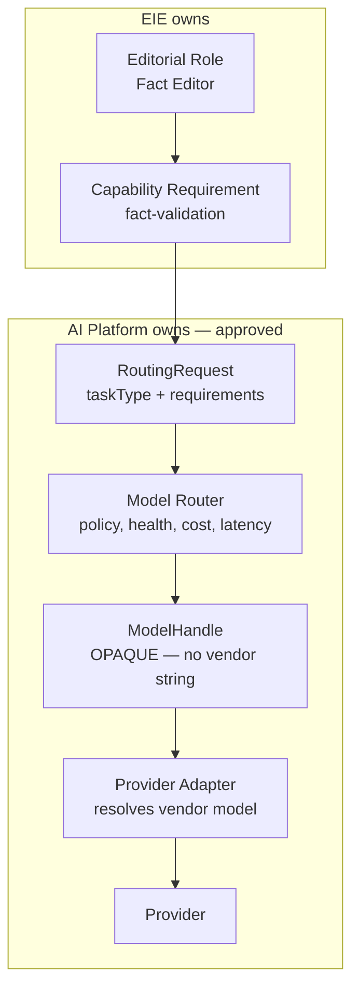

# Provider Mapping

> **Status:** v1.0 — complete. Phase 17.
> **No editorial role binds to a provider.** A role declares a capability requirement; the AI Platform decides what serves it. Models may change; capabilities remain.

## Overview

**Purpose.** Define how the sixteen editorial roles reach models without any part of EIE knowing which model, family, or vendor answers.

**Scope.** The capability layer EIE owns. Routing, adapters, and provider selection are approved AI Platform components that this document consumes and does not restate.

## The chain



**EIE owns exactly two links in this chain.** Everything from `RoutingRequest` rightward is approved AI Platform architecture, and EIE adds nothing to it.

## The Provider Registry already exists

**The registry the chain requires is the approved Model Router plus Provider Adapters. EIE does not build a second one.**

| Chain element | Owner | Document |
|---|---|---|
| Editorial Role | **EIE** | `editor-roles.md` |
| **Capability Requirement** | **EIE** | **This document** |
| Provider Registry | AI Platform | `08-ai-platform/model-router.md` |
| Provider | AI Platform | `08-ai-platform/provider-adapters.md` |
| Model | AI Platform | `08-ai-platform/model-selection.md` |

**A second registry would be a second policy surface**, and the two would disagree within a release. The approved Router already resolves capabilities, health, cost, latency, rate limits, and fallback order from a versioned policy — duplicating any part of that in EIE would put editorial routing on a different upgrade cadence from every other AI call in the product.

**This is why no ADR is required.** EIE introduces a mapping table, not a component.

## Provider independence is already enforced

**Three approved guarantees make provider lock-in structurally impossible, and EIE inherits all three without adding anything.**

| Guarantee | Where |
|---|---|
| **`ModelHandle` carries no provider name and no vendor model string** | `08-ai-platform/model-router.md` |
| **The vendor model string is resolved inside the adapter, never upstream** | `08-ai-platform/provider-adapters.md` |
| **Workspace overrides are tier-only — a tenant cannot pin a vendor** | `08-ai-platform/model-router.md` |

**`providerId` is visible only within the adapter layer.** Nothing in `packages/content/src/editorial/` can obtain it, which is what turns "no provider lock-in" from a rule people follow into a property of the type system (`architecture.md`).

**The third guarantee is the one that matters commercially.** If workspaces could pin a vendor, provider migration would require per-tenant negotiation — the lock-in would move from the code into the customer base, where it is far harder to remove.

## Capability requirements

**A capability requirement is what a role needs, expressed without reference to who provides it.**

```ts
interface CapabilityRequirement {
  readonly capability: EditorialCapability;
  readonly taskType: string;               // dot.case routing key — OPAQUE to EIE
  readonly templateRef: { id: string };    // Prompt Engine owns the prompt
  readonly tierHint: 'fast' | 'mid' | 'premium' | 'alternative';
  readonly maxCostUsd: number;
  readonly latencySlaMs: number;
}
```

**`tierHint` is a preference, never a command**, and this document does not pretend otherwise. The approved Router treats it as a caller preference and computes `minimumTierFloor` itself; a caller cannot impose a floor. **The tier floor for safety-critical capabilities is therefore routing policy keyed on `taskType`, owned by the Router** — which is the correct home for it, because it must hold for every caller and not only for EIE (`08-ai-platform/model-router.md`).

**EIE holds no prompts.** `templateRef` resolves through the Prompt Engine, which owns template content and versioning. An editor's instructions are a versioned template, not a string literal in `packages/content` — so prompt changes ship on the Prompt Engine's cadence and are covered by its evaluation suite (`08-ai-platform/prompt-engine.md`).

**Structured output is mandatory for every editorial capability.** Editors return typed Issues, never prose, so `outputSchema` is always supplied at dispatch and the Gateway rejects the request at admission if the template does not declare structured output (`issue-model.md`).

**Eight capabilities cover the sixteen roles.**

| Capability | Roles served | `tierHint` |
|---|---|---|
| **`safety-review`** | Safety, Compliance | `premium` |
| **`fact-validation`** | Fact, Evidence, Freshness | `premium` |
| **`academic-review`** | Research | `premium` |
| **`logical-reasoning`** | Logic, Bias | `premium` |
| **`seo-analysis`** | SEO, Metadata, Internal Linking | `mid` |
| **`structural-analysis`** ᵈ | Structure, Accessibility, Readability | `mid` |
| **`brand-consistency`** | Brand, Reader Experience | `mid` |
| **`long-form-writing`** | **None — the Writing Engine** | `premium` |

ᵈ **`structural-analysis` is derived**, not named in the original capability list. Structure, Accessibility, and Readability are analytical roles that fit none of the seven named capabilities, and forcing them into `brand-consistency` would have mapped unrelated work onto one routing key.

**`long-form-writing` is listed and serves no editor.** It is the Writing Engine's capability, included here so the mapping is complete and so the boundary is visible: **editors never write**, so no editorial role may ever claim it (`README.md`).

**Determinism is required for every editorial capability**, and it is a routing-policy property rather than a per-request flag. `RoutingRequest.determinismRequired` forces temperature-zero-capable models, and it is set by the Router from policy keyed on `taskType` — the Gateway's `AIRequest` exposes no such field to callers (`08-ai-platform/model-router.md`).

**Editors are not deterministic in the way the rest of EIE is.** Temperature-zero reduces variance; it does not make a model a pure function. This is why every downstream stage — debate, consensus, planning, confidence — is deterministic **given the Issues**, and why reproducibility is asserted over recorded Issue sets rather than over model calls (`consensus-engine.md`).

## Selection inputs

**Seven of the eight selection inputs are already owned and enforced by the approved Router.**

| Input | Owner | Mechanism |
|---|---|---|
| Capabilities | Router | Filters candidates on declared `ModelCapability` |
| Availability | Router | Per-model circuit state |
| Health | Router | Live provider health from `ModelProvider.health()` |
| Latency | Router | `latencySla` against `typicalLatencyMs` |
| Cost | Router | `budget.maxCostUsd`, `estimatedCostUsd` |
| Rate limits | AI Platform | `08-ai-platform/rate-limiting.md` |
| Fallback order | Router | `fallbackChain` with `minimumTierFloor` |
| **Regional policy** | — | **Not offered in v1 — see below** |

**EIE supplies two of these inputs and evaluates none of them.** The capability requirement populates `budget.maxCostUsd` and `latencySla`; everything else — context sizing, determinism, tier floors, candidate filtering — is resolved from policy and live state inside the AI Platform.

**`minContextTokens` is computed by the Context Builder, not by EIE.** EIE passes `contextRefs`; sizing the resulting context is owned upstream of the Router (`08-ai-platform/context-builder.md`).

**Fallback never descends below `minimumTierFloor`.** A provider outage degrades latency or cost, never the tier serving a safety review. The floor is computed by the Router from policy — EIE neither sets it nor could.

### Regional policy

**Data residency beyond a single region is not offered in v1.** `16-security/compliance.md` states this explicitly, and EIE does not introduce a regional routing capability that the platform does not have.

**The approved control that does exist is stronger than it looks:** because routing overrides are tier-only, a tenant cannot influence which vendor sees their data. That is described in the Router as a deliberate data-residency and confidentiality measure.

**`CapabilityRequirement` reserves no region field.** Adding an unimplemented field would suggest a guarantee the platform does not make; when multi-region routing is offered, it belongs in the Router's policy, not in EIE's mapping table.

## Model diversity across the board

**An editorial board where every seat is the same model is one model wearing sixteen masks.** The approved README states diversity is a requirement, not an accident, and ADR-019 exists because of exactly this failure.

**Diversity is achieved by policy, through distinct routing keys.**

```
Each capability has a distinct taskType.
The versioned routing policy maps taskTypes to tiers and candidate sets.
Distinct taskTypes therefore admit distinct model families.
```

**EIE never reads a model family and never asserts distinctness at dispatch.** It cannot: `ModelHandle` as declared carries capabilities, cost, and latency — not family. EIE requesting family information would be reaching for provider-adjacent detail it has no business holding.

**This is a policy invariant, enforced by policy tests, not a runtime assertion — and that distinction is stated rather than blurred.** A routing policy that collapsed all eight editorial `taskType` keys onto one candidate set would produce a monoculture board that EIE could not detect at runtime. The guard is a routing-policy test asserting that the eight editorial keys resolve to at least three distinct candidate sets (`10-testing/ai-evaluation.md`).

**Where verified diversity is genuinely required, EIE escalates to the Council.** ADR-019's Council verifies distinctness at dispatch, aborts below two families, and degrades visibly — guarantees EIE consumes rather than reproduces (`debate-engine.md`).

| | Editorial board | AI Council |
|---|---|---|
| Diversity | **By policy** | **Verified at dispatch** |
| Enforcement | Routing-policy test | Runtime assertion, aborts |
| Used for | Every round | Unresolved debate |

**Two mechanisms with different strengths, applied where each is affordable.** Verifying distinctness across sixteen dispatches every round would serialise the board against the Router; the Council pays that cost for the small number of judgements that warrant it.

## Dispatch

**Editors are invoked through the AI Gateway. EIE never calls a provider.**

```ts
// packages/content/src/editorial/board/dispatch.ts
async function dispatchEditor(
  role: EditorRole,
  ctx: EditorialContext,
): Promise<readonly EditorialIssue[]> {
  const cap = CAPABILITY_MAP[role];              // static table, no I/O
  const response = await gateway.send({
    taskType: cap.taskType,                      // dot.case, opaque
    tenantId: ctx.tenantId,
    organizationId: ctx.organizationId,
    correlationId: ctx.correlationId,
    idempotencyKey: `${ctx.runId}:${ctx.roundNumber}:${role}`,
    templateRef: cap.templateRef,                // Prompt Engine owns the prompt
    variables: { revisionId: ctx.revisionId, brief: ctx.briefRef },
    contextRefs: ctx.contextRefs,                // evidence + continuity refs
    outputSchema: ISSUE_ARRAY_SCHEMA,            // structured output, always
    tierHint: cap.tierHint,                      // preference, not a command
    latencySla: cap.latencySlaMs,
    budget: { maxCostUsd: cap.maxCostUsd },
    attribution: { runId: ctx.runId, stage: 'review' },
  } satisfies AIRequest);
  return validateIssues(response.content, role); // discards, never repairs
}
```

**`CAPABILITY_MAP` is a static table with no I/O.** Role-to-capability is compile-time; capability-to-model is runtime policy. The seam between them is where provider independence lives.

**The `idempotencyKey` is `runId:round:role`**, which makes a retried dispatch return the original result rather than producing a second, differently-worded Issue set for the same round. Every `AIRequest` requires one (`08-ai-platform/ai-gateway.md`).

**`attribution.stage` is `'review'`**, matching the canonical Run phase EIE occupies. It is what makes editorial cost attributable to a run without exposing any routing detail (`README.md`).

**The Gateway result is validated before becoming Issues.** An editor that emits a malformed Issue has its output discarded, never repaired — a repaired Issue is one the platform invented (`issue-model.md`).

**Guardrails, context assembly, retries, and cost accounting are the Gateway's.** EIE passes a request and receives typed output; every cross-cutting concern between those two points is owned elsewhere (`08-ai-platform/ai-gateway.md`).

## Failure behaviour

| Failure | Behaviour |
|---|---|
| No model satisfies the capability | **Editor does not run.** Recorded as a failed role |
| Router returns `ContextTooLarge` | Editor does not run; context reduction is the Context Builder's |
| Budget exhausted | Editor does not run; recorded |
| Provider outage, fallback available | Router advances the chain; **EIE is unaware** |
| Provider outage, chain exhausted | Editor does not run; recorded |
| **A rank 1–2 editor did not run** | **`HUMAN_REVIEW_REQUIRED`** via consensus R1 |

**A failed editor is never a silent pass.** Consensus R1 exists precisely for this: a Safety or Compliance editor that did not run means the board has no safety judgement, and no routing failure may be allowed to look like clearance (`consensus-engine.md`).

**EIE never substitutes one capability for another on failure.** Serving a fact-validation request from a `brand-consistency` candidate set would produce an Issue attributed to the Fact Editor that the Fact Editor's capability never produced.

## Provider migration

**Changing a provider requires no change in this folder.**

| Change | EIE impact |
|---|---|
| New provider added | **None** — new adapter, policy update |
| Provider removed | **None** — policy update, fallback covers |
| Model upgraded within a family | **None** |
| Vendor renames a model | **None** — adapter-internal |
| Pricing change | **None** — Router re-evaluates budget |
| A capability becomes unavailable everywhere | Editor stops running; R1 or a failed role |

**Only the last row touches EIE, and it is a capability change, not a provider change.** That is the property the architecture is built for: the editorial process is defined over capabilities, and capabilities outlive the models that provide them.

**No document in this folder names a model, a family, or a provider**, which is a grep-checkable invariant rather than an aspiration (`README.md`).

## Observability

| Signal | Meaning |
|---|---|
| `editorial_dispatch_total{capability}` | Board activity by capability |
| `editorial_dispatch_failures_total{capability,reason}` | **Routing failures by cause** |
| `editorial_role_did_not_run_total{role}` | **Feeds consensus R1** |
| `editorial_capability_cost_usd{capability}` | Cost attribution |
| `editorial_dispatch_latency_ms{capability}` | Round latency contribution |

**No metric carries a provider, model, or family label.** Metrics are an exfiltration path for provider identity as real as an API response, and the approved AI API rules apply to telemetry too (`06-api/ai-api.md`).

**`editorial_role_did_not_run_total{role}` for a rank 1–2 role is an availability alert, not a quality one.** Every occurrence costs a human review.

**Alerts:** rank 1–2 role failures above zero (**page**); `editorial_dispatch_failures_total` rising with `reason=no_candidate` (a capability is losing coverage).

## Business rules

1. **No editorial role binds to a provider, a model, or a family.**
2. **EIE owns two links only:** role → capability, capability → routing request.
3. **The Provider Registry is the approved Model Router.** EIE builds no second registry.
4. **`ModelHandle` carries no vendor identity**, and EIE cannot obtain one.
5. **`outputSchema` is always supplied** — editors emit typed Issues, never prose.
6. **EIE holds no prompts.** Editor instructions are versioned Prompt Engine templates.
7. **`tierHint` is a preference, not a command.** Tier floors are routing policy, not caller input.
8. **Determinism is a routing-policy property**; editors are low-variance, not pure functions.
9. **Fallback never descends below `minimumTierFloor`**, which the Router computes.
10. **Eight capabilities cover sixteen roles**; `structural-analysis` is derived.
11. **`long-form-writing` serves no editor.** Editors never write.
12. **EIE supplies selection inputs; the Router evaluates them.**
13. **Regional policy is not offered in v1** and no field is reserved for it.
14. **Board diversity is a policy invariant** enforced by routing-policy tests, not a runtime assertion.
15. **Verified diversity comes from the Council**, where it is required.
16. **A failed editor is never a silent pass** — rank 1–2 failures force human review.
17. **EIE never substitutes one capability for another.**
18. **Editor output is validated and discarded on failure, never repaired.**
19. **No metric, log, event, or API response carries provider identity.**
20. **Provider migration requires no change in this folder.**

## Cross references

- `editor-roles.md` — the sixteen roles and their categories
- `architecture.md` — the `board/` module, no provider names
- `orchestration.md` — when dispatch happens
- `consensus-engine.md` — **R1**, failed rank 1–2 editors
- `issue-model.md` — validation discards, never repairs
- `debate-engine.md` — Council escalation
- `08-ai-platform/model-router.md` — **routing, tier floors, tier-only overrides**
- `08-ai-platform/provider-adapters.md` — the port, vendor resolution
- `08-ai-platform/ai-gateway.md` — the invocation surface EIE uses
- `08-ai-platform/rate-limiting.md` — rate-limit handling
- `08-ai-platform/ai-council.md` — verified diversity, visible degradation
- `16-security/compliance.md` — **single-region v1, no residency guarantee**
- `10-testing/ai-evaluation.md` — routing-policy and capability tests
- `06-api/ai-api.md` — provider-hiding rules
- `01-system-architecture/13-adr-log.md` — **ADR-019** Council, **ADR-024** resolved settings
