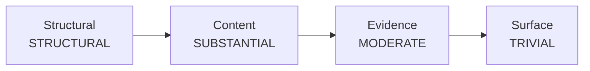
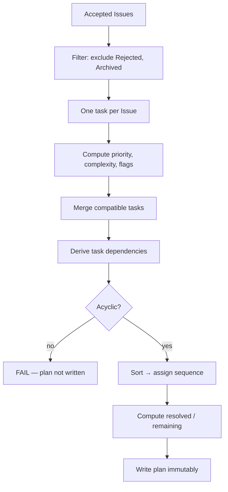

# Revision Planner

> **Status:** v1.0 — complete. Phase 17.
> **The Planner turns Issues into instructions. It never turns them into prose.** A revision plan tells the Writing Engine what to change and why; producing the replacement text remains the Writer's job, exactly as it is for editors.

## Overview

**Purpose.** Define the revision plan: how accepted Issues become ordered, traceable tasks that the Writing Engine can execute.

**Scope.** Plan construction and task semantics. The decision to revise is `consensus-engine.md`; execution is `05-content-platform/writing-engine.md`.

## Why a planner exists

**Handing sixteen editors' raw Issues to the Writer produces a bad revision**, for reasons that have nothing to do with model quality:

| Raw Issue set | Effect on the Writer |
|---|---|
| Unordered | Fixes a citation in a paragraph later deleted |
| Overlapping | Three separate rewrites of one paragraph, each undoing the last |
| Unbounded | A 40-item list where 6 items are blocking |
| Unsequenced | Restructures before knowing which sections survive |

**The Planner exists to make one revision pass sufficient**, which is what keeps round counts low and cost bounded (`editorial-workflow.md`).

## The task

```ts
interface RevisionTask {
  readonly taskId: string;
  readonly planId: string;
  readonly runId: string;
  readonly revisionId: string;              // the revision this plan targets
  readonly tenantId: string;

  readonly priority: TaskPriority;          // P0 | P1 | P2 | P3
  readonly target: IssueLocation;           // reuses the Issue location union
  readonly reason: string;                  // why — from the Issues
  readonly expectedChange: string;          // what should become true after
  readonly issueRefs: readonly string[];    // NON-EMPTY. Every source Issue
  readonly dependencies: readonly string[]; // taskIds, acyclic
  readonly complexity: Complexity;          // TRIVIAL | MODERATE | SUBSTANTIAL | STRUCTURAL
  readonly researchNeeded: boolean;
  readonly humanNeeded: boolean;
  readonly autoFixCandidate: boolean;
  readonly sequence: number;                // execution order within the plan
}

interface RevisionPlan {
  readonly planId: string;
  readonly runId: string;
  readonly revisionId: string;
  readonly roundNumber: number;
  readonly tasks: readonly RevisionTask[];
  readonly resolvedIssueIds: readonly string[];   // closed since the last plan
  readonly remainingIssueIds: readonly string[];  // open, not in this plan
  readonly createdAt: string;
}
```

**`issueRefs` is non-empty by constraint.** A task with no source Issue is an instruction nobody asked for — the Planner inventing editorial opinion, which is precisely what the whole engine is built to prevent (`issue-model.md`).

**`expectedChange` states an outcome, never a replacement.** `"Every statistic in §3 carries a citation"` is a task. `"Replace paragraph 2 with: ..."` is a rewrite, and the Planner does not produce it.

**`resolvedIssueIds` and `remainingIssueIds` make the plan self-describing.** A reader sees what closed, what is being worked, and what was deliberately deferred — without diffing Issue sets across rounds.

## Priority

**Priority derives from severity and blocking status. It is computed, never chosen.**

| Priority | Source | Writer obligation |
|---|---|---|
| **P0** | `CRITICAL`, or `blocking: true` | **Must complete** |
| **P1** | `HIGH` | **Must complete** |
| **P2** | `MEDIUM` | Should complete |
| **P3** | `INFO` · `LOW` | Optional |

**P0 and P1 are what the next round re-checks.** A revision that skips a P0 cannot pass consensus, because the Issue remains accepted and R6 fires again (`consensus-engine.md`).

**P3 tasks are included but never gate.** Dropping them would lose the editorial observation entirely; including them lets a Writer with capacity address them at no cost to convergence.

## Sequencing

**Tasks execute in `sequence` order, and the order is deterministic.**



**Sort key, applied in order:**

1. **Dependency order** — a task never precedes one it depends on
2. **Complexity descending** — `STRUCTURAL` before `TRIVIAL`
3. **Priority ascending** — P0 first within a complexity band
4. **Document position** — earlier sections first
5. **`taskId`** — final tie-break, so the order is total

**Complexity outranks priority in the sort, which looks wrong and is not.** Fixing a P0 typo inside a section that a `STRUCTURAL` task will delete wastes the work. Structure settles first; surface fixes apply to text that will survive.

**Dependencies are `taskId` references and the graph is acyclic**, checked at plan construction. A cycle makes the plan unexecutable, and the correct response is to fail plan construction rather than emit an order that silently breaks one edge (`issue-model.md`).

**Task dependencies are derived from Issue dependencies**, plus one Planner-added rule: a task targeting a section depends on any `STRUCTURAL` task targeting the same section.

## Task merging

**The Planner may merge compatible tasks. It never merges Issues.**

| Merge condition | Required |
|---|---|
| Same `target` location | **Yes** |
| Same or adjacent complexity band | **Yes** |
| No conflicting `expectedChange` | **Yes** |
| Neither has `humanNeeded` | **Yes** |
| Same category | **No** — tasks may cross categories |

**A merged task carries the union of `issueRefs`**, which is what preserves traceability. Every Issue that motivated the task is still named, and the Editorial Report can still show which editor raised what.

**Task merging is not Issue merging.** Issue merging is an explicit `MERGE` debate operation, within one category, recorded and reversible in history (`debate-engine.md`). Task merging is a presentation decision about work, changes no Issue, and leaves each Issue independently resolvable.

**Merged priority is the highest of its sources; merged complexity is the highest of its sources.** Merging never softens an obligation.

**Conflicting tasks are never merged.** If one Issue asks for expansion and another for cuts in the same section, that is a genuine editorial conflict, and it belongs in debate — not silently averaged into one instruction (`debate-engine.md`).

## Flags

| Flag | Set when | Effect |
|---|---|---|
| `researchNeeded` | Any source Issue has `researchRequired` | Research runs **before** the task |
| `humanNeeded` | Any source Issue has `humanReviewRequired` | Task is **not** dispatched to the Writer |
| `autoFixCandidate` | **All** source Issues have `autoFixPossible` | Eligible for deterministic fix |

**`humanNeeded` and `researchNeeded` are unions; `autoFixCandidate` is an intersection.** One Issue needing a human makes the whole task need one; one Issue not auto-fixable makes the whole task not auto-fixable. Both directions fail safe.

**`autoFixCandidate` is a flag, not a mechanism.** Phase 17 defines no auto-fix executor; the flag identifies eligible tasks so a future deterministic fixer has a defined input. Until one exists, these tasks go to the Writer like any other.

**A plan containing `humanNeeded` tasks is not dispatched at all.** Consensus already returned `HUMAN_REVIEW_REQUIRED` in that case, so the plan is produced for the reviewer to read, not for the Writer to execute (`consensus-engine.md`).

## Plan construction



**Construction is pure computation.** No model is invoked, which is what makes plans reproducible from the Issue set and testable without providers (`architecture.md`).

**Every accepted Issue produces exactly one task before merging.** Issues excluded from a plan appear in `remainingIssueIds` with no exception — an Issue that is neither planned nor listed as remaining has been lost.

**Traceability is a checked invariant, not an intention:**

```
∀ accepted issue i:
  i.issueId ∈ ⋃ task.issueRefs  ∨  i.issueId ∈ plan.remainingIssueIds
```

**Plan construction fails rather than emitting a partial plan.** A cycle, an empty `issueRefs`, or a traceability violation aborts the round with a defect signal (`07-development-guide/error-handling.md`).

## Immutability

**Plans are written once and never updated.**

| Table | Rule |
|---|---|
| `editorial_revision_plans` | One row per round. **Insert only** |
| `editorial_revision_tasks` | Insert only. `UNIQUE (plan_id, sequence)` |

**Task completion is not recorded on the task.** The next round's Issue set is the record: an Issue that no longer appears was resolved. Storing a `completed` boolean would create a second, divergent source of truth about whether a problem still exists (`issue-model.md`).

**Every round produces a new plan.** Plan `n+1` supersedes plan `n` without modifying it, and the sequence of plans is the audit trail of how the article converged.

**Plans are tenant-scoped with RLS enabled and forced**, like every EIE table (`16-security/tenant-isolation.md`).

## What the Planner never does

| Never | Why |
|---|---|
| Write replacement text | **Rewriting is the Writer's job** |
| Invent a task without an Issue | No unsourced instruction |
| Drop an Issue silently | `remainingIssueIds` is mandatory |
| Merge Issues | Merge is a debate operation |
| Merge conflicting tasks | Conflict belongs in debate |
| Change severity or priority | Both are derived |
| Resolve an Issue | Only the raising editor may |
| Call a model | Determinism |
| Emit a partial plan | Fail loudly instead |

**The Planner is the second place the "editors do not rewrite" rule could leak**, the first being the editors themselves. A Planner that emitted suggested prose would make the Writer a transcriber and put editorial voice into the article through the back door (`README.md`).

## Worked example

**Issue set:** 1 `CRITICAL` structure (§2 unsupported claim requires restructure), 2 `HIGH` evidence (§2, §4 missing citations), 1 `MEDIUM` readability (§2 sentence length), 1 `LOW` tone (§5).

| Seq | Priority | Complexity | Target | `issueRefs` | Note |
|---|---|---|---|---|---|
| 1 | P0 | `STRUCTURAL` | §2 | 1 | Restructure first |
| 2 | P1 | `MODERATE` | §4 | 1 | Independent |
| 3 | P1 | `MODERATE` | §2 | 1 | **Depends on task 1** |
| 4 | P2 | `TRIVIAL` | §2 | 1 | Depends on task 1 |
| 5 | P3 | `TRIVIAL` | §5 | 1 | Optional |

**Tasks 3 and 4 could not be merged** despite sharing a target: `MODERATE` and `TRIVIAL` are not adjacent bands, and an evidence fix and a readability fix have unrelated `expectedChange` values.

**Task 4 is sequenced after task 1 even though it is P2**, because sentence-length edits to a section awaiting restructure are discarded work.

## Observability

| Signal | Meaning |
|---|---|
| `editorial_plan_tasks_total{priority}` | Plan size and shape |
| `editorial_tasks_merged_total` | Merge effectiveness |
| `editorial_plan_construction_failures_total{reason}` | **Cycles, traceability violations** |
| `editorial_issues_remaining_total` | Deferred work |
| `editorial_p0_tasks_unresolved_next_round` | **Writer non-compliance** |

**`editorial_plan_construction_failures_total` should be zero.** Every occurrence is a defect in dependency derivation or merging, not a content problem — it targets zero and pages at count one (`13-event-platform/observability.md`).

**`editorial_p0_tasks_unresolved_next_round` is the sharpest quality signal in EIE.** A rising value means the Writer receives instructions it cannot act on, which is a prompt or task-granularity problem rather than an editor problem.

**Alerts:** any plan construction failure (**page**); `editorial_p0_tasks_unresolved_next_round` above baseline; `editorial_issues_remaining_total` trending up across rounds (the plan is deferring more than it resolves).

## Business rules

1. **The Planner produces instructions, never replacement text.**
2. **`issueRefs` is non-empty on every task**, enforced by constraint.
3. **Priority is derived from severity and blocking status**, never chosen.
4. **P0 and P1 are obligations; P2 is expected; P3 is optional.**
5. **Sequence is deterministic**, with `taskId` as the final tie-break.
6. **Complexity outranks priority in sequencing**: structure settles before surface.
7. **Task dependencies are acyclic**, checked at construction.
8. **The Planner may merge tasks; it never merges Issues.**
9. **A merged task carries the union of `issueRefs`.**
10. **Merged priority and complexity are the maxima of the sources.**
11. **Conflicting tasks are never merged** — conflict belongs in debate.
12. **`humanNeeded` and `researchNeeded` are unions; `autoFixCandidate` is an intersection.**
13. **Every accepted Issue is planned or listed as remaining.** Never neither.
14. **Plan construction fails loudly rather than emitting a partial plan.**
15. **Plans and tasks are insert-only**; every round produces a new plan.
16. **Task completion is not stored** — the next round's Issue set is the record.
17. **The Planner never calls a model.**
18. **The Planner never resolves an Issue.**

## Cross references

- `issue-model.md` — Issue schema, locations, dependency graph
- `consensus-engine.md` — what triggers a plan
- `debate-engine.md` — Issue merging, where conflict is resolved
- `editorial-workflow.md` — where the plan sits in the round
- `orchestration.md` — dispatch to the Writing Engine
- `05-content-platform/writing-engine.md` — plan execution
- `07-development-guide/error-handling.md` — construction failure handling
- `16-security/tenant-isolation.md` — RLS on plan tables
- `13-event-platform/observability.md` — invariant alerting
